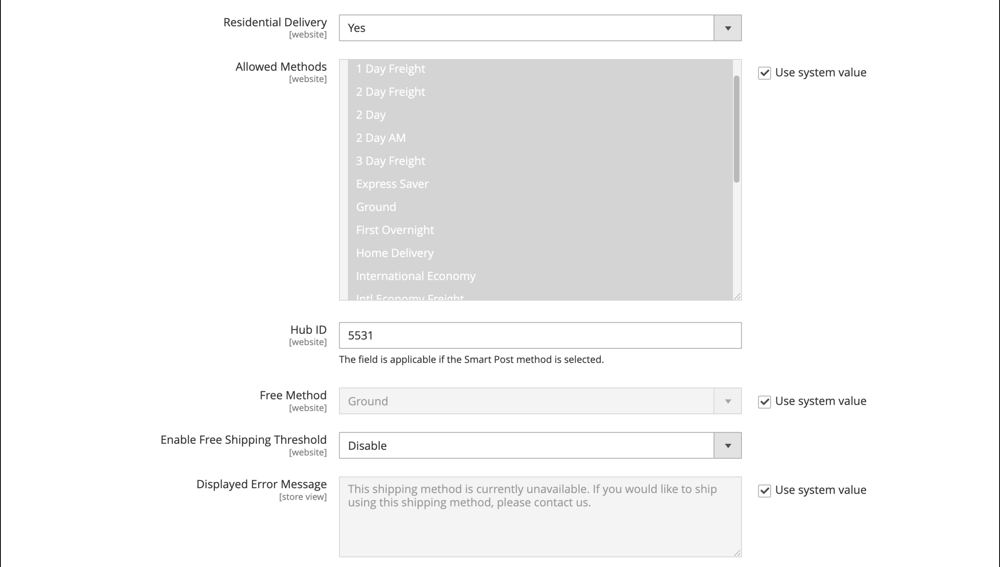

# FedEx

FedEx ist eines der größten Schifffahrtsunternehmen der Welt und bietet Luft-, Fracht- und Bodenfrachtdienste mit mehreren Prioritätsstufen an.

{width="700" zoomable="yes"}

>[!NOTE]
>
>FedEx kann [dimensionales Gewicht](carriers.md#dimensional-weight) verwenden, um einige Versandraten zu bestimmen. Adobe Commerce und Magento Open Source unterstützen jedoch nur die gewichtsbasierte Versandkostenberechnung.

## Schritt 1: Registrieren Sie sich für FedEx Web Services Production

Ein FedEx-Händlerkonto und eine Registrierung für den Zugriff auf FedEx Web Services Production sind erforderlich. Nachdem Sie ein FedEx-Konto erstellt haben, lesen Sie die Seite mit den Produktions-Account-Informationen und klicken Sie dann unten auf der Seite auf den _Produktionsschlüssel erhalten_, um sich zu registrieren und einen Schlüssel zu erhalten.

>[!NOTE]
>
>Stellen Sie sicher, dass Sie den Authentifizierungsschlüssel kopieren oder aufschreiben. Es ist erforderlich, FedEx in Ihren Commerce Versandeinstellungen einzurichten.

## Schritt 2: FedEx für Ihren Store aktivieren

1. Navigieren Sie in _Admin_-Seitenleiste zu **[!UICONTROL Stores]** > _[!UICONTROL Settings]_>**[!UICONTROL Configuration]**.

1. Erweitern Sie im linken Bereich **[!UICONTROL Sales]** und wählen Sie **[!UICONTROL Delivery Methods]**.

1. Erweitern Sie  den Abschnitt **[!UICONTROL FedEx]** .

1. Legen Sie **[!UICONTROL Enabled for Checkout]** auf `Yes` fest.

1. Geben Sie **[!UICONTROL Title]** einen Titel ein, der die FedEx-Versandmethode beim Checkout angibt.

1. Geben Sie folgende Informationen aus Ihrem FedEx-Konto ein:

   - **[!UICONTROL Account ID]**
   - **[!UICONTROL Api Key]**
   - **[!UICONTROL Secret Key]**

1. Wenn Sie eine FedEx-Sandbox eingerichtet haben und in der Testumgebung arbeiten möchten, setzen Sie **[!UICONTROL Sandbox Mode]** auf `Yes`.

   >[!NOTE]
   >
   >Denken Sie daran, den Sandbox-Modus auf `No` festzulegen, wenn Sie bereit sind, Ihren Kunden FedEx als Versandmethode anzubieten.

   {width="600" zoomable="yes"}

## Schritt 3: Paketbeschreibung und Bearbeitungsgebühren

1. Legen Sie **[!UICONTROL Pickup Type]** auf die für Sendungen verwendete Abholmethode fest.

   - `DropOff at Fedex Location` - (Standard) Zeigt an, dass Sie Sendungen an Ihrer lokalen FedEx-Station abgeben.
   - `Contact Fedex to Schedule` - Zeigt an, dass Sie FedEx kontaktieren, um eine Abholung anzufordern.
   - `Use Scheduled Pickup` - Gibt an, dass die Sendung im Rahmen einer regelmäßigen geplanten Abholung abgeholt wird.
   - `On Call` - Zeigt an, dass die Abholung durch einen Aufruf von FedEx geplant wird.
   - `Package Return Program` - Zeigt an, dass die Sendung vom FedEx Ground Package Retouren-Programm aufgenommen wird.
   - `Regular Stop` - Gibt an, dass die Sendung zum regulären Abholplan abgeholt wird.
   - `Tag` - Gibt an, dass die Sendungsabholung spezifisch für eine Anforderung einer Express-Tag- oder Ground-Tag-Abholung ist. Dies gilt nur für einen Rückversand-Aufkleber.

1. Wählen Sie **[!UICONTROL Packages Request Type]** den Anfragetyp aus, der Ihre Präferenz am besten beschreibt, wenn eine Bestellung in mehrere Lieferungen aufgeteilt wird:

   - `Divide to equal weight (one request)`
   - `Use origin weight (few requests)`

1. Wählen Sie **[!UICONTROL Packaging]** den Typ der FedEx-Verpackung aus, den Sie normalerweise zum Versand von Produkten aus Ihrem Geschäft verwenden.

1. Legen Sie **[!UICONTROL Weight Unit]** auf die Maßeinheit fest, die in Ihrem Gebietsschema verwendet wird.

   - `Pounds`
   - `Kilograms`

1. Geben Sie die zulässigen **[!UICONTROL Maximum Package Weight]** für FedEx-Sendungen ein.

   Das standardmäßige FedEx-Maximalgewicht beträgt 150 lbs. Weitere Informationen erhalten Sie von Ihrem Spediteur. Der Standardwert wird empfohlen, sofern Sie keine besonderen Vereinbarungen mit FedEx getroffen haben. Siehe [Dimensionsgewicht](carriers.md#dimensional-weight) für weitere Informationen.

   {width="600" zoomable="yes"}

1. Konfigurieren Sie die Bearbeitungsgebührenoptionen entsprechend Ihren Anforderungen.

   Die Bearbeitungsgebühr ist optional und wird beim Checkout nicht angezeigt. Wenn Sie eine Bearbeitungsgebühr einbeziehen möchten, gehen Sie wie folgt vor:

   - **[!UICONTROL Calculate Handling Fee]** festlegen:

      - `Fixed Fee`
      - `Percentage`

   - Wählen Sie **[!UICONTROL Handling Applied]** eine der folgenden Methoden für die Verwaltung der Bearbeitungsgebühren:

      - `Per Order`
      - `Per Package`

   - Geben Sie die **[!UICONTROL Handling Fee]** je nach Berechnungsmethode entweder als `fixed` oder `percentage` ein.

1. Legen Sie **[!UICONTROL Residential Delivery]** auf eine der folgenden Einstellungen fest, je nachdem, ob Sie Business-to-Consumer (B2C) oder Business-to-Business (B2B) verkaufen.

   - `Yes` - B2C-Sendungen in Privatkunden.
   - `No` - B2B-Sendungen in Privatkunden.

   {width="600" zoomable="yes"}

## Schritt 4: Zugelassene Methoden und anwendbare Länder

1. Legen Sie **[!UICONTROL Allowed Methods]** auf jede Versandart fest, die Sie anbieten möchten.

   Berücksichtigen Sie bei der Auswahl der Methoden Ihr FedEx-Konto, die Häufigkeit und Größe Ihrer Sendungen und ob Sie internationale Sendungen zulassen. Sie können beliebig viele oder so wenige Methoden anbieten, wie Sie möchten, z. B.:

   - Europa - erste Priorität
   - Liefertagsoptionen: 1 Tag Fracht, 2 Tag Fracht, 2 Tag, 2 Tag am, 3 Tag Fracht
   - Inländische Optionen - Express-Sparer, Boden, Erste, Übernachtung, Lieferung zu Hause, Standard Übernachtung
   - International options-International Economy, Intl Economy Freight, International First, International Ground, International, Priority Intl
   - Priority options-Freight, Priorität über Nacht
   - Smart-Post-If-Angebot der Smart-Post-Methode (geben Sie die **Hub-ID** ein)
   - Frachtoptionen-Fracht, Inlandsfracht

1. Wenn Sie über FedEx eine Option [Kostenloser Versand](shipping-free.md) bereitstellen möchten, legen Sie die Optionen für den kostenlosen Versand fest.

   - Legen Sie **[!UICONTROL Free Method]** auf die Methode fest, die Sie für den kostenlosen Versand verwenden möchten. Wenn Sie keinen kostenlosen Versand über FedEx anbieten möchten, wählen Sie `None`.

   - Um einen Mindestbestellbetrag zu verlangen, der eine Bestellung für den kostenlosen Versand mit FedEx qualifiziert, setzen Sie **[!UICONTROL Enable Free Shipping Threshold]** auf `Enable`. Geben Sie dann den Mindestwert in **[!UICONTROL Free Shipping Amount Threshold]** ein.

   Diese Einstellung ähnelt der Einstellung für die standardmäßige kostenlose Versandmethode, wird jedoch während des Checkouts im Abschnitt FedEx angezeigt, sodass die Kunden wissen, welche Methode für ihre Bestellung verwendet wird.

1. Ändern Sie bei Bedarf die **[!UICONTROL Displayed Error Message]**.

   Dieses Textfeld ist mit einer Standardmeldung vorbelegt. Sie können jedoch eine andere Nachricht eingeben, die angezeigt werden soll, wenn FedEx nicht mehr verfügbar ist.

   {width="600" zoomable="yes"}

1. **[!UICONTROL Ship to Applicable Countries]** festlegen:

   - `All Allowed Countries` - Kunden aus allen [Ländern](../getting-started/store-details.md#country-options) die in Ihrer Store-Konfiguration angegeben sind, können diese Versandmethode verwenden.

   - `Specific Countries` - Wenn Sie diese Option wählen, wird die Liste _Versand an bestimmte Länder_ angezeigt. Wählen Sie jedes Land in der Liste aus, in dem diese Versandmethode verwendet werden kann.

1. Wenn Sie ein Protokoll der gesamten Kommunikation zwischen Ihrem Geschäft und dem FedEx-System führen möchten, setzen Sie **[!UICONTROL Debug]** auf `Yes`.

1. **[!UICONTROL Show Method if Not Applicable]** festlegen:

   - `Yes` - Zeigt alle FedEx Versandmethoden für Kunden, unabhängig von ihrer Verfügbarkeit.
   - `No` - Zeigt nur die FedEx-Versandmethoden an, die für die Bestellung gelten.

1. Geben Sie **[!UICONTROL Sort Order]** eine Zahl ein, um die Reihenfolge zu bestimmen, in der FedEx angezeigt wird, wenn es während des Checkouts mit anderen Versandmethoden aufgelistet wird.

   `0` = First, `1` = Second, `2` = Third usw.

1. Klicken Sie auf **[!UICONTROL Save Config]**.

   {width="600" zoomable="yes"}

>[!NOTE]
>
>Commerce meldet FedEx bei der Berechnung der Versandkosten stets den vollen Bestellpreis. Dieses Verhalten kann nicht geändert werden.
