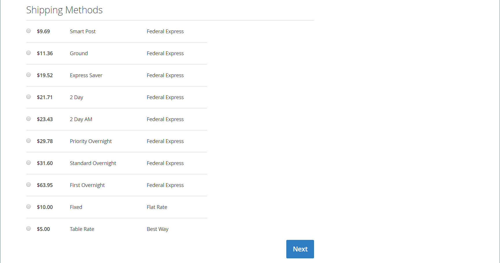

# FedEx

FedEx ist eines der größten Schifffahrtsunternehmen der Welt und bietet Luft-, Fracht- und Bodenfrachtdienste mit mehreren Prioritätsebenen an.

{width="700" zoomable="yes"}

>[!NOTE]
>
>FedEx kann verwenden [Flächengewicht](carriers.md#dimensional-weight) um einige Versandraten zu ermitteln. Adobe Commerce und Magento Open Source unterstützen jedoch nur die gewichtsbasierte Versandkostenberechnung.

## Schritt 1: Registrieren Sie sich für FedEx Web Services Production

A [FedEx-Händlerkonto][1] und die Registrierung für den Zugriff auf FedEx Web Services Production ist erforderlich. Nachdem Sie ein FedEx-Konto erstellt haben, lesen Sie die Informationsseite des Produktionskontos und klicken Sie dann auf _Produktionsschlüssel abrufen_ Link am Ende der Seite, um sich zu registrieren und einen Schlüssel zu erhalten.

>[!NOTE]
>
>Stellen Sie sicher, dass Sie den Authentifizierungsschlüssel kopieren oder aufschreiben. Es ist erforderlich, FedEx in Ihren Commerce-Versandeinstellungen einzurichten.

## Schritt 2: FedEx für Ihren Store aktivieren

1. Auf der _Admin_ Seitenleiste, zu gehen **[!UICONTROL Stores]** > _[!UICONTROL Settings]_>**[!UICONTROL Configuration]**.

1. Erweitern Sie im linken Bereich . **[!UICONTROL Sales]** und wählen **[!UICONTROL Delivery Methods]**.

1. Expand  Die **[!UICONTROL FedEx]** -Abschnitt.

1. set **[!UICONTROL Enabled for Checkout]** bis `Yes`.

1. für **[!UICONTROL Title]** Geben Sie einen Titel ein, der die FedEx-Versandmethode während des Checkouts identifiziert.

1. Geben Sie die folgenden Informationen aus Ihrem FedEx-Konto ein:

   - **[!UICONTROL Account ID]**
   - **[!UICONTROL Api Key]**
   - **[!UICONTROL Secret Key]**

1. Wenn Sie eine FedEx-Sandbox eingerichtet haben und in der Testumgebung arbeiten möchten, legen Sie Folgendes fest **[!UICONTROL Sandbox Mode]** bis `Yes`.

   >[!NOTE]
   >
   >Denken Sie daran, den Sandbox-Modus auf festzulegen. `No` wenn Sie bereit sind, Ihren Kunden FedEx als Versandmethode anzubieten.

   {width="600" zoomable="yes"}

## Schritt 3: Paketbeschreibung und Bearbeitungsgebühren

1. set **[!UICONTROL Pickup Type]** auf die für Sendungen verwendete Abholmethode.

   - `DropOff at Fedex Location` - (Standard) Zeigt an, dass Sie Sendungen an Ihrer lokalen FedEx-Station abgeben.
   - `Contact Fedex to Schedule` - Zeigt an, dass Sie FedEx kontaktieren, um eine Abholung anzufordern.
   - `Use Scheduled Pickup` - Zeigt an, dass die Sendung im Rahmen einer regelmäßigen geplanten Abholung abgeholt wird.
   - `On Call` - Zeigt an, dass die Abholung durch einen Aufruf von FedEx geplant wird.
   - `Package Return Program` - Zeigt an, dass die Sendung vom FedEx Ground Package Retouren-Programm aufgenommen wird.
   - `Regular Stop` - Zeigt an, dass die Sendung zum regulären Abholplan abgeholt wird.
   - `Tag` - Gibt an, dass die Sendungsabholung spezifisch für eine Anfrage zur Abholung von Express-Tags oder Bound-Tag-Aufrufen ist. Dies gilt nur für einen Rückversand-Aufkleber.

1. für **[!UICONTROL Packages Request Type]** Wählen Sie daher den Anfragetyp aus, der Ihre Präferenz am besten beschreibt, wenn eine Bestellung in mehrere Lieferungen aufgeteilt wird:

   - `Divide to equal weight (one request)`
   - `Use origin weight (few requests)`

1. für **[!UICONTROL Packaging]** Wählen Sie daher die Art der FedEx-Verpackung aus, die Sie normalerweise zum Versand von Produkten aus Ihrem Geschäft verwenden.

1. set **[!UICONTROL Weight Unit]** in die Maßeinheit, die in Ihrem Gebietsschema verwendet wird.

   - `Pounds`
   - `Kilograms`

1. Geben Sie die **[!UICONTROL Maximum Package Weight]** Zulässig für FedEx-Sendungen.

   Das standardmäßige FedEx-Maximalgewicht beträgt 150 lbs. Weitere Informationen erhalten Sie bei Ihrem Spediteur. Der Standardwert wird empfohlen, sofern Sie keine besonderen Vereinbarungen mit FedEx getroffen haben. Siehe [Dimensionsgewicht](carriers.md#dimensional-weight) für weitere Informationen.

   {width="600" zoomable="yes"}

1. Konfigurieren Sie die Bearbeitungsgebührenoptionen entsprechend Ihren Anforderungen.

   Die Bearbeitungsgebühr ist optional und wird beim Checkout nicht angezeigt. Wenn Sie eine Bearbeitungsgebühr einbeziehen möchten, gehen Sie wie folgt vor:

   - set **[!UICONTROL Calculate Handling Fee]**:

      - `Fixed Fee`
      - `Percentage`

   - für **[!UICONTROL Handling Applied]** Wählen Sie eine der folgenden Methoden zur Verwaltung von Bearbeitungsgebühren:

      - `Per Order`
      - `Per Package`

   - Geben Sie die **[!UICONTROL Handling Fee]** als entweder `fixed` Betrag oder `percentage`, abhängig von der Berechnungsmethode.

1. set **[!UICONTROL Residential Delivery]** auf eine der folgenden Optionen, je nachdem, ob Sie Business-to-Consumer (B2C) oder Business-to-Business (B2B) verkaufen.

   - `Yes` - B2C-Sendungen in Privatbesitz.
   - `No` - B2B-Sendungen in Privatkunden.

   {width="600" zoomable="yes"}

## Schritt 4: Zugelassene Methoden und anwendbare Länder

1. set **[!UICONTROL Allowed Methods]** für jede Versandart, die Sie anbieten möchten.

   Berücksichtigen Sie bei der Auswahl der Methoden Ihr FedEx-Konto, die Häufigkeit und Größe Ihrer Sendungen und ob Sie internationale Sendungen zulassen. Sie können beliebig viele oder wenige Methoden anbieten, z. B.:

   - Europa - erste Priorität
   - Liefertagsoptionen: 1 Tag Fracht, 2 Tag Fracht, 2 Tag, 2 Tag am Morgen, 3 Tag Fracht
   - Inländische Optionen - Express Saver, Ground, First, Overnight, Home Delivery, Standard über Nacht
   - International options-International Economy, Intl Economy Freight, International First, International Ground, International, Priority Intl
   - Priority options-Freight, Priorität über Nacht
   - Smart-Post-Wenn die Smart-Post-Methode anbietet (geben Sie die **Hub-ID**)
   - Frachtoptionen-Fracht, Inlandsfracht

1. Wenn Sie eine [kostenloser Versand](shipping-free.md) Option über FedEx, legen Sie die kostenlosen Versandoptionen fest.

   - set **[!UICONTROL Free Method]** auf die Methode, die Sie für den kostenlosen Versand verwenden möchten. Wenn Sie keinen kostenlosen Versand über FedEx anbieten möchten, wählen Sie `None`.

   - Um einen Mindestbestellbetrag zu verlangen, der eine Bestellung für den kostenlosen Versand mit FedEx qualifiziert, setzen Sie **[!UICONTROL Enable Free Shipping Threshold]** bis `Enable`. Geben Sie dann den Mindestwert in ein **[!UICONTROL Free Shipping Amount Threshold]**.

   Diese Einstellung ähnelt der Einstellung für die standardmäßige kostenlose Versandmethode, wird aber während des Checkouts im Abschnitt FedEx angezeigt, sodass die Kunden wissen, welche Methode für ihre Bestellung verwendet wird.

1. Ändern Sie bei Bedarf die **[!UICONTROL Displayed Error Message]**.

   Dieses Textfeld ist mit einer Standardmeldung vorbelegt. Sie können jedoch eine andere Meldung eingeben, die angezeigt werden soll, wenn FedEx nicht mehr verfügbar ist.

   {width="600" zoomable="yes"}

1. set **[!UICONTROL Ship to Applicable Countries]**:

   - `All Allowed Countries` - Kunden aus allen [Länder](../getting-started/store-details.md#country-options) Diese Versandmethode kann von der Store-Konfiguration verwendet werden.

   - `Specific Countries` - Wenn Sie diese Option wählen, wird die _Versand in bestimmte Länder_ Liste angezeigt. Wählen Sie jedes Land in der Liste aus, in dem diese Versandmethode verwendet werden kann.

1. Wenn Sie ein Protokoll der gesamten Kommunikation zwischen Ihrem Geschäft und dem FedEx-System führen möchten, stellen Sie Folgendes ein **[!UICONTROL Debug]** bis `Yes`.

1. set **[!UICONTROL Show Method if Not Applicable]**:

   - `Yes` - Zeigt alle FedEx Versandmethoden an Kunden, unabhängig von ihrer Verfügbarkeit.
   - `No` - Zeigt nur die FedEx-Versandmethoden an, die für die Bestellung gelten.

1. für **[!UICONTROL Sort Order]** Geben Sie eine Zahl ein, um die Reihenfolge zu bestimmen, in der FedEx beim Checkout mit anderen Versandmethoden aufgelistet wird.

   `0` = zuerst, `1` = Sekunde, `2` = Dritter usw.

1. Klick **[!UICONTROL Save Config]**.

   {width="600" zoomable="yes"}

>[!NOTE]
>
>Commerce meldet FedEx bei der Berechnung der Versandkosten immer den vollen Bestellpreis. Dieses Verhalten kann nicht geändert werden.

[1]: https://www.fedex.com/login/web/jsp/contactInfo1.jsp
