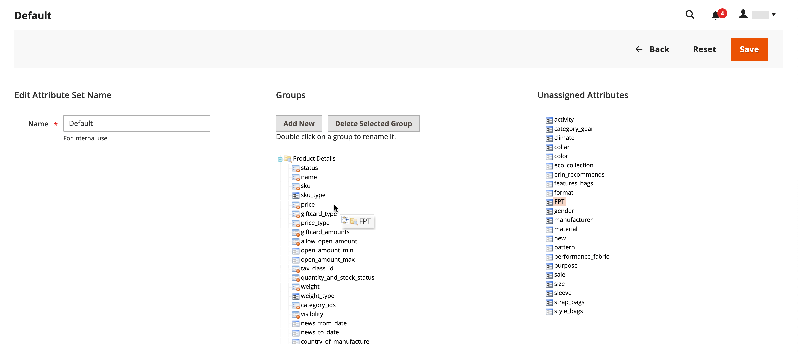

# Feste Produktsteuer (FPT)

Einige Steuergebiete haben eine feste Steuer, die bestimmten Arten von Produkten hinzugefügt werden muss. Sie können eine _feste Produktsteuer_ (FPT) nach Bedarf für die Steuerberechnungen Ihres Stores. In einigen Ländern kann das FPT zur Einführung einer Abfall-Elektro- und Elektronik-Altgerätesteuer verwendet werden. Diese Steuer wird auch als _Umweltsteuer_ oder _Ökosteuer_ und wird für bestimmte Arten von Elektronik erhoben, um die Kosten des Recyclings auszugleichen. Es handelt sich um einen festen Betrag und nicht um einen Prozentsatz des Produktpreises.

Feste Produktsteuern gelten auf Artikelebene, je nach Produkt. In einigen Rechtsgebieten wird diese Steuer mit einer zusätzlichen Steuerberechnung in % berechnet. Ihre Steuerhoheit kann auch Vorschriften darüber enthalten, wie der Produktpreis den Kunden angezeigt wird, entweder mit oder ohne Steuern. Vergewissern Sie sich, dass Sie die Regeln verstehen und Ihre FPT-Anzeigeoptionen entsprechend festlegen.

Seien Sie vorsichtig, wenn Sie FPT-Preise in E-Mails angeben, da der Preisunterschied das Vertrauen der Kunden in ihre Bestellungen beeinflussen kann. Wenn Sie z. B. die Bestellprüfungspreise anzeigen, ohne FPT anzuzeigen, sehen Kunden, die Artikel mit zugehörigen FPT kaufen, einen Gesamtwert, der den FPT-Steuerbetrag enthält, jedoch ohne Aufschlüsselung nach Auflistungen. Der Preisunterschied kann dazu führen, dass einige Kunden ihren Warenkorb verlassen, da sich die Summe vom erwarteten Betrag unterscheidet.

## FPT-Anzeigepreise

| FPT | Anzeigeeinstellung und -berechnung | |
|--- |--- |---|
| nicht besteuert | **[!UICONTROL Excluding FPT]** | FPT wird als separate Zeile im Warenkorb angezeigt und der Wert wird in entsprechenden Steuerberechnungen verwendet. |
| | **[!UICONTROL Including FPT]** | FPT wird zum Basispreis eines Artikels hinzugefügt, ist jedoch nicht in steuerregelbasierten Berechnungen enthalten. |
| | **[!UICONTROL Excluding FPT, FPT Description, Final Price]** | Die Preise werden ohne FPT-Betrag oder -Beschreibung angezeigt. FPT ist nicht in steuerregelbasierten Berechnungen enthalten. |
| Steuern | **[!UICONTROL Excluding FPT]** | FPT wird als separate Zeile im Warenkorb angezeigt und der Wert wird in entsprechenden Steuerberechnungen verwendet. |
| | **[!UICONTROL Including FPT]** | FPT ist im Preis eines Artikels enthalten, und es ist keine Änderung an den Steuerberechnungen erforderlich. |
| | **[!UICONTROL Excluding FPT, FPT Description, Final Price]** | Die Preise werden ohne den FPT-Betrag oder die Beschreibung angezeigt. FPT ist jedoch in steuerregelbasierten Berechnungen enthalten. |

{style="table-layout:auto"}

## FPT konfigurieren

Die feste Produktsteuer (FPT) [Eingabetyp](../catalog/attributes-input-types.md) erstellt für jede Region einen Abschnitt von Feldern zur Verwaltung der Steuern.

Die folgenden Anweisungen zeigen, wie Sie eine feste Produktsteuer für Ihren Store einrichten, indem Sie als Beispiel &quot;Öko-Steuer&quot;verwenden. Nach der Festlegung des Umfangs für die Steuer sowie der Länder und Staaten, in denen die Steuer gilt, und je nach den von Ihnen gewählten Optionen können sich die Eingabefelder entsprechend den lokalen Anforderungen ändern. Weitere Informationen finden Sie unter [Produktattribute erstellen](../catalog/attribute-product-create.md).

### Schritt 1: Ermöglichen der festen Produktsteuer

1. Im _Admin_ Seitenleiste, navigieren Sie zu **[!UICONTROL Stores]** > _[!UICONTROL Settings]_>**[!UICONTROL Configuration]**.

1. Erweitern Sie im linken Bereich **[!UICONTROL Sales]** und wählen **[!UICONTROL Tax]**.

1. Erweitern  die **[!UICONTROL Fixed Product Taxes]** Abschnitt.

1. Satz **[!UICONTROL Enable FPT]** nach `Yes`.

1. Um zu bestimmen, wie feste Produktsteuern in den Verkaufspreisen verwendet werden, wählen Sie die FPT-Einstellung für jeden der folgenden Preisanzeigeorte:

   - **[!UICONTROL Display Prices in Product Lists]**
   - **[!UICONTROL Display Prices on Product View Page]**
   - **[!UICONTROL Display Prices in Sales Modules]**
   - **[!UICONTROL Display Prices in Emails]**

   Optionen (jeweils identisch):

   - `Including FPT Only`
   - `Including FPT and FPT description`
   - `Excluding FPT. Including FPT description and final price`
   - `Excluding FPT`

1. Satz **[!UICONTROL Apply Tax to FPT]** nach Bedarf.

1. Satz **[!UICONTROL Include FPT in Subtotal]** nach Bedarf.

   {width="600" zoomable="yes"}

   Eine ausführliche Beschreibung der einzelnen Konfigurationseinstellungen finden Sie unter [Feste Produktsteuern](../configuration-reference/sales/tax.md#fixed-product-taxes) im _Konfigurationshandbuch_.

1. Wenn Sie fertig sind, klicken Sie auf **[!UICONTROL Save Config]**.

### Schritt 2: Erstellen eines FPT-Attributs

1. Im _Admin_ Seitenleiste, navigieren Sie zu **[!UICONTROL Stores]** > _[!UICONTROL Attributes]_>**[!UICONTROL Product]**.

1. Klicken Sie oben rechts auf **[!UICONTROL Add New Attribute]** und gehen Sie wie folgt vor:

   - Für **[!UICONTROL Default Label]**, geben Sie einen Titel ein, der das Attribut angibt.

   - Satz **[!UICONTROL Catalog Input for Store Owner]** nach `Fixed Product Tax`.

   {width="600" zoomable="yes"}

1. Erweitern  die **[!UICONTROL Advanced Attribute Properties]** und legen Sie die Eigenschaftsoptionen fest:

   - **[!UICONTROL Attribute Code]** - Geben Sie eine eindeutige Kennung in Kleinbuchstaben ohne Leerzeichen oder Sonderzeichen ein. Die maximale Länge beträgt 30 Zeichen. Sie können das Feld im Feld Standardbezeichnung leer lassen.

   - **[!UICONTROL Add to Column Options]** - Wenn das FPT-Feld im [Liste der Produkte](../catalog/products-list.md), auf `Yes`.

   - **[!UICONTROL Use in Filter Options]** - Wenn Sie in der Lage sein möchten, [filter](../getting-started/admin-workspace.md) Produkte im Raster basierend auf dem Wert des FPT-Felds, festgelegt auf `Yes`.

   {width="600" zoomable="yes"}

1. (Optional) Wählen Sie im linken Bereich die Option **[!UICONTROL Manage Labels]** und geben Sie für jede Store-Ansicht einen Titel anstelle der Standardbeschriftung ein.

   {width="600" zoomable="yes"}

1. Wenn Sie fertig sind, klicken Sie auf **[!UICONTROL Save Attribute]**.

1. Wenn Sie dazu aufgefordert werden, aktualisieren Sie die [cache](../systems/cache-management.md).

### Schritt 3: Hinzufügen des FPT-Attributs zu einem Attributsatz

1. Im _Admin_ Seitenleiste, navigieren Sie zu **[!UICONTROL Stores]** > _[!UICONTROL Attributes]_>**[!UICONTROL Attribute Set]**.

1. Klicken Sie in der Liste auf den Attributsatz , um den Datensatz im Bearbeitungsmodus zu öffnen.

   {width="600" zoomable="yes"}

1. Ziehen Sie das FPT-Attribut aus der Liste der **[!UICONTROL Unassigned Attributes]** über das Recht auf **[!UICONTROL Groups]** in der mittleren Spalte.

   Jeder Gruppenordner entspricht einem Abschnitt mit Produktinformationen. Sie können das Attribut an der Stelle platzieren, an der es angezeigt werden soll, wenn das Produkt im Bearbeitungsmodus geöffnet ist.

   {width="600" zoomable="yes"}

1. Wenn Sie fertig sind, klicken Sie auf **[!UICONTROL Save]**.

1. Wiederholen Sie diesen Schritt für jeden Attributsatz, der eine feste Produktsteuer enthalten sollte.

### Schritt 4: Anwendung der FPT auf bestimmte Produkte

1. Im _Admin_ Seitenleiste, navigieren Sie zu **[!UICONTROL Catalog]** > **[!UICONTROL Products]**.

1. Öffnen Sie das Produkt, für das eine feste Produktsteuer erforderlich ist, im Bearbeitungsmodus.

1. Suchen Sie die **[!UICONTROL FPT]** Bereich der Felder, die Sie zum Attributsatz hinzugefügt haben, und klicken Sie auf **[!UICONTROL Add Tax]**.

1. Geben Sie die anwendbare Steuer für das Produkt an:

   {width="600" zoomable="yes"}

   - Wenn Ihre Commerce-Instanz über mehrere Websites verfügt, wählen Sie die entsprechende **[!UICONTROL Website]** und der Basiswährung. In diesem Beispiel wird das Feld standardmäßig auf `All Websites [USD]`.

   - Satz **[!UICONTROL Country/State]** für die Region, in der die feste Produktsteuer gilt.

   - Für **[!UICONTROL Tax]** die feste Produktsteuer als Dezimalbetrag angeben.

1. Um weitere feste Produktsteuern hinzuzufügen, klicken Sie auf **[!UICONTROL Add Tax]** und wiederholen Sie den Vorgang.

1. Wenn Sie fertig sind, klicken Sie auf **[!UICONTROL Save]**.
