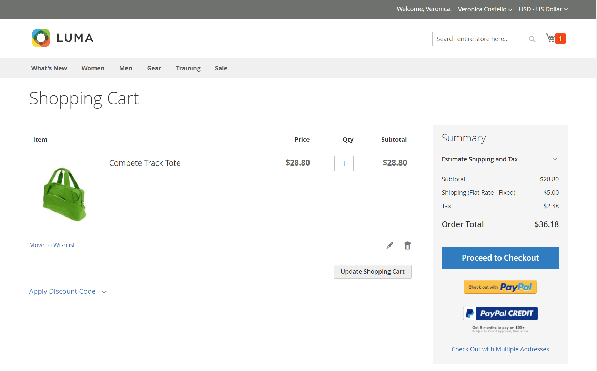

# Einführung in Geschäfte und Kauferlebnis

Adobe Commerce und Magento Open Source bieten eine umfassende Reihe von Funktionen zum Aufbau und Verwalten Ihrer Online-Stores und des Kauferlebnisses für Ihre Kunden. Innerhalb Ihrer Commerce-Instanz können Sie die Store-Hierarchie von Websites, Stores und Ansichten verwalten. Sie können auch die Steuern und Währungskurse konfigurieren, die zum Ausführen von Geschäften für mehrere Gebietsschemata erforderlich sind, einschließlich Steuerklassen für Produkte und Kundengruppen.

## Store-Struktur

Eine einzelne Instanz von Adobe Commerce oder Magento Open Source kann mehrere Sites, Stores oder Store-Ansichten unterstützen, die unterschiedliche Attribute und Inhalte verwenden. Ein typisches Szenario besteht darin, Stores mit unterschiedlichen Optionen in verschiedenen Domains einzurichten. Beispielsweise können Sie einen Satz von Kategorien und Produkten in einer Domain und einen anderen Satz von Kategorien und Produkten in einer anderen Domain in einer anderen Sprache verwenden. Händler können die Websites, Stores und Store-Ansichten im Admin-Bereich konfigurieren.

Wenn die [Hierarchie](stores.md) definiert ist, können Sie Konfigurationseinstellungen gemäß dem [Umfang](../getting-started/websites-stores-views.md#scope-settings) anwenden, sodass jede Site-, Store- und Store-Ansicht das gewünschte Produktkatalog- und Storefront-Erlebnis bietet.

## Point of Purchase

Adobe Commerce und Magento Open Source reduzieren Bestellfehler, indem sie die SKU und Verfügbarkeit aller Artikel automatisch überprüfen, bevor eine Bestellung gesendet wird. Sie können die Optionen [Warenkorb](cart.md) und [Checkout](checkout-process.md) konfigurieren, um ein optimales Kauferlebnis zu bieten, von der Transaktion bis zum Versand. Kunden, die bei ihren Konten angemeldet sind, können den Checkout schnell abschließen, da ein Großteil der Informationen bereits in ihren Konten vorhanden ist. Die _Checkout_-Seite führt den Kunden durch jeden Schritt des Prozesses zum Abschließen der Bestelltransaktion. Wenn Sie [Sofortkauf](checkout-instant-purchase.md) aktivieren, können Kunden den Checkout-Prozess mithilfe der in ihrem Konto gespeicherten Informationen beschleunigen.

>[!TIP]
>
> Mit der Installation und Aktivierung von Adobe Commerce B2B können Sie _Schnellbestellung_ für Kunden konfigurieren, die mit einem Unternehmenskonto verknüpft sind. Diese Funktion reduziert den Bestellvorgang auf mehrere Klicks, wenn sie den Namen oder die SKU der Produkte kennen, die sie bestellen möchten. Sie können auch die Unterstützung für verhandelbare Angebote für Ihre Unternehmenskonten konfigurieren. Weitere Informationen zu den B2B-Funktionen finden Sie im [Adobe Commerce B2B-Benutzerhandbuch](https://experienceleague.adobe.com/docs/commerce-admin/b2b/introduction.html).

## Einkaufshilfe

Kunden benötigen manchmal Hilfe, um einen Kauf abzuschließen. Einige Kunden kaufen gerne online ein, bestellen aber lieber telefonisch. Sie können sowohl Gästen als auch Kunden, die sich für ein Konto bei Ihrem Geschäft registriert haben, sofortige Hilfe anbieten.

- [Verwalten des Warenkorbs](shopping-assisted-cart-manage.md)
- [Bestellungen erstellen](customer-account-create-order.md) für registrierte Kunden
- [Bestellungen aktualisieren](order-update.md)

{width="700" zoomable="yes"}

Sehen Sie sich dieses Video an, um mehr über verkäuferunterstütztes Einkaufen zu erfahren:

>[!VIDEO](https://video.tv.adobe.com/v/343662/?quality=12&learn=on)

## Auftragsverwaltung und -operationen

In der Admin können Händler in jeder Phase des Auftrags-Workflows auf Informationen zugreifen und Bestellungen verarbeiten:

- Die [Bestellungen](orders.md) Seite bietet Händlern eine leicht zugängliche Liste aller aktuellen Bestellungen und enthält Tools zum Bearbeiten und Verarbeiten vorhandener Bestellungen sowie zum Erstellen von Bestellungen im Namen von Kunden.

- Auf [ Seite „Rechnungen](invoices.md) wird eine Rechnung aufgelistet, die auf einem temporären Kundenauftrag basiert und einen permanenten Datensatz des Auftrags liefert.

- Auf [ Seite ](shipments.md)Lieferungen“ wird der Lieferdatensatz jeder Rechnung aufgelistet, die versandbereit ist.

- Auf [ Seite ](credit-memos.md)Gutschriften“ können Händler eine Gutschrift verarbeiten und verwalten, bei der es sich um ein Dokument handelt, das den dem Kunden geschuldeten Betrag anzeigt. Der Betrag kann auf einen Kauf angerechnet oder dem Kunden zurückerstattet werden.

-  (nur Adobe Commerce) Auf der Seite [Rückgaben](returns.md) werden die aktuell zurückgegebenen Merchandising Requests (RMAs) aufgelistet und zur Eingabe neuer Return Requests verwendet.

- Die [Transaktionen](transactions.md) Seite listet alle Zahlungsaktivitäten auf, die zwischen Ihrem Geschäft und einem Zahlungssystem stattgefunden haben, und bietet Zugriff auf detailliertere Informationen.

## Versand und Lieferung

Studien zeigen, dass Läden, die Kunden die Wahl zwischen mehreren [Liefermethoden](delivery.md) bieten, höhere Konversionsraten haben als Läden, die eine einzige Methode verwenden. Der Administrator bietet verschiedene Tools, die Händler verwenden können, um mehrere Versandmethoden und [Spediteure](carriers.md) einzurichten und [Versandetiketten](shipping-labels.md) zu drucken.
