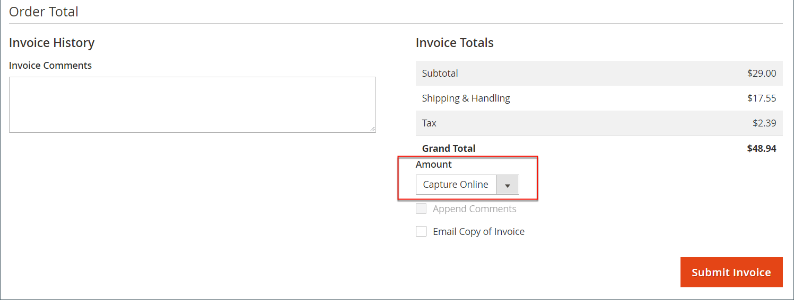

# Rechnungen

Eine Rechnung ist ein Datensatz über die Zahlung für eine Bestellung. Für [&#x200B; Bestellung können mehrere Rechnungen erstellt &#x200B;](#create-an-invoice). Jede Rechnung kann so viele oder so wenige der von Ihnen angegebenen gekauften Produkte enthalten. Sie können auch [druckfertige PDF-Rechnungen](#print-invoices) als Verkaufsdokumente für Ihre Kunden erstellen.

Navigieren Sie in _Admin_-Seitenleiste zu **[!UICONTROL Sales]** > _Vorgänge_ > **Rechnungen**, um das Raster _Rechnungen_ zu öffnen und auf Ihre erstellten Rechnungen zuzugreifen.

{width="700" zoomable="yes"}

## Spaltenbeschreibungen

| Spalte | Beschreibung |
|--- |--- |
| [!UICONTROL Select] | Aktivieren Sie die Kontrollkästchen der Anführungszeichen, die einer Aktion unterzogen werden sollen, oder verwenden Sie die Auswahlsteuerung in der Spaltenüberschrift. Optionen: `Select All` / `Deselect All` |
| [!UICONTROL Invoice] | Eine eindeutige numerische Kennung, die zugewiesen wird, wenn eine Rechnung vom Administrator eingereicht wird. Wenn Sie die Rechnungsdetails anzeigen, wird diese Nummer oben auf der Seite anstelle des Angebotsnamens angezeigt. |
| [!UICONTROL Invoice Date] | Datum und Uhrzeit, zu der der Administrator die Rechnung erstmals eingereicht hat. |
| [!UICONTROL Order#] | Eine eindeutige numerische Kennung, die zugewiesen wird, wenn eine Bestellung von einem Käufer aufgegeben wird. Wenn Sie die Rechnungsdetails anzeigen, wird diese Nummer als Link im Block „Bestellungen &amp; Kontoinformationen“ angezeigt. |
| [!UICONTROL Order Date] | Das Datum und die Uhrzeit, zu der der Kunde zum ersten Mal erfolgreich eine Bestellung aufgegeben hat. |
| [!UICONTROL Bill-to Name] | Der Name der für die Bestellung verantwortlichen Person. |
| [!UICONTROL Status] | Gibt den aktuellen Status einer Rechnung an. Der Status kann nur durch Handeln des Käufers oder Verkäufers geändert werden. |
| [!UICONTROL Grand Total (Base)] | Der Gesamtpreis der zu kaufenden Produkte. Der Gesamtbetrag wird in der Basiswährung der Website und in der Währung der Storefront angezeigt. |
| [!UICONTROL Grand Total (purchase)] | Die Gesamtsumme der in der Bestellung gekauften Produkte. Der Gesamtbetrag wird in der Basiswährung der Website und in der Währung der Storefront angezeigt. |
| [!UICONTROL Purchased From] | Die Website-/Store-/Store-Ansicht, aus der die Rechnung erstellt wurde. |
| [!UICONTROL Billing Address] | Die Rechnungsadresse des Kunden, der die Bestellung aufgegeben hat. |
| [!UICONTROL Shipping Address] | Die Adresse, an die die Bestellung versendet werden soll. |
| [!UICONTROL Customer Name] | Der Vor- und Nachname des Kunden, der die Rechnung erhält. |
| [!UICONTROL Email] | Die E-Mail-Adresse des Kunden, der die Rechnung erhält. |
| [!UICONTROL Customer Group] | Die Kundengruppe, die dem Debitor zugewiesen ist, der die Rechnung erhält. |
| [!UICONTROL Payment Method] | Die für die Zahlung zu verwendende Zahlungsmethode. |
| [!UICONTROL Shipping Information] | Die Methode, die für den Versand der Bestellung verwendet werden soll. |
| [!UICONTROL Subtotal] | Die Zwischensumme der Bestellung, ohne Versand und Bearbeitung, und Steuer. |
| [!UICONTROL Shipping and Handling] | Der für Versand und Bearbeitung berechnete Betrag. |
| [!UICONTROL Action] | **[!UICONTROL View]** - öffnet die Rechnung im Bearbeitungsmodus. |

{style="table-layout:auto"}

## Rechnung erstellen

Durch das Erstellen einer Rechnung für eine Bestellung wird diese in einen Status versetzt, in dem sie nicht storniert oder geändert werden kann. Eine neue Rechnungsseite ähnelt einer abgeschlossenen Bestellung und enthält einige zusätzliche Felder. Jede Aktivität, die mit einer Bestellung verbunden ist, wird im Kommentarbereich der Rechnung vermerkt.

Normalerweise werden Bestellungen fakturiert und erfasst, wenn der Versandprozess beginnt. Wenn es sich bei der Zahlungsmethode um eine Bestellung handelt oder die [Zahlungsaktion](../configuration-reference/sales/payment-methods.md#payment-actions) auf `Authorize and Capture` gesetzt ist, wird die Bestellung fakturiert und die Zahlung wird beim Checkout erfasst. Sie können eine Rechnung mit einem Lieferschein generieren und auch Versandaufkleber von Ihrem Spediteurkonto drucken. Eine einzelne Bestellung kann in Teilsendungen unterteilt werden, die bei Bedarf separat in Rechnung gestellt werden.

Wenn der Status neuer Bestellungen auf `Processing` gesetzt ist, wird die Option _Alle Artikel automatisch_. Einige Kreditkartenzahlungsmethoden schließen den Schritt zur Rechnungsstellung als Teil des Prozesses ab, wenn [Zahlungsaktion](../configuration-reference/sales/payment-methods.md#payment-actions) auf `Authorize and Capture` gesetzt ist. In diesem Fall wird die Schaltfläche Rechnung nicht angezeigt und die Bestellung ist versandbereit.

>[!NOTE]
>
>Rechnungen werden für Bestellungen, die über `Gift Card`, `Store Credit`, `Reward Points` oder andere Offline-Zahlungsmethoden aufgegeben werden, nicht automatisch erstellt.

Bevor die Bestellung gedruckt werden kann, muss eine Rechnung für die Bestellung generiert werden. Um die PDF anzuzeigen oder zu drucken, laden Sie zunächst einen PDF-Reader wie [Adobe Acrobat Reader herunter und installieren Sie ihn](https://www.adobe.com/acrobat/pdf-reader.html "Adobe Reader abrufen").

**_So fakturieren Sie eine Bestellung:_**

1. Navigieren Sie in _Admin_-Seitenleiste zu **[!UICONTROL Sales]** > _[!UICONTROL Operations]_>**[!UICONTROL Orders]**.

1. Ermitteln Sie den Kundenauftrag mit dem Status `Processing` im Raster. Gehen Sie dann wie folgt vor:

1. Klicken Sie in _Spalte_ Aktion **[!UICONTROL View]** auf.

1. Wählen Sie in der Kopfzeile des Kundenauftrags die Option &quot;**[!UICONTROL Invoice]**&quot;.

   >[!NOTE]
   >
   >Die Option _[!UICONTROL Invoice]_&#x200B;wird nicht angezeigt, wenn die [Zahlungsaktion](../configuration-reference/sales/payment-methods.md#payment-actions) für Ihre bestimmte [Zahlungsmethode](../configuration-reference/sales/payment-methods.md) auf `Authorize and Capture` festgelegt ist, wodurch automatisch eine Rechnung generiert wird. Dies ist auch der Fall, wenn die Bestellung aufgegeben und die Zahlungsaktion für Ihre Zahlungsmethode auf `Authorize` gesetzt und die Bestellung fakturiert wird.

   {width="700" zoomable="yes"}

   Die neue Rechnungsseite ähnelt einer abgeschlossenen Auftragsseite mit zusätzlichen Feldern, die bearbeitet werden können.

1. Wenn die Artikel versandbereit sind, erstellen Sie gleichzeitig mit der Erstellung der Rechnung einen Lieferschein für die Lieferung:

   - Aktivieren Sie _Abschnitt_ Versandinformationen“ das Kontrollkästchen **[!UICONTROL Create Shipment]**.

     Der Lieferdatensatz wird zum Zeitpunkt der Rechnungserstellung erstellt.

   - Tracking-Nummer einschließen:

      - Klicken Sie auf **[!UICONTROL Add Tracking Number]**.
      - Tracking-Informationen eingeben: _[!UICONTROL Carrier]_,_[!UICONTROL Title]_ und _[!UICONTROL Number]_

     {width="600" zoomable="yes"}

   - Optional können Sie eine Teilrechnung erstellen:

      - Aktualisieren Sie im _Artikel auf Rechnung_ die Spalte **[!UICONTROL Qty to Invoice]** so, dass nur bestimmte Artikel in die Rechnung aufgenommen werden.
      - Klicken Sie dann auf **[!UICONTROL Update Qty's]**.

        {width="600" zoomable="yes"}

1. Wenn für die Bestellung eine Online-Zahlungsmethode verwendet wurde, setzen Sie **[!UICONTROL Amount]** auf die entsprechende Option.

1. Gehen Sie wie folgt vor, um Kunden per E-Mail über die Erstellung der Rechnung zu informieren:

   - Aktivieren Sie das Kontrollkästchen **[!UICONTROL Email Copy of Invoice]** .

   - Geben Sie einen beliebigen **[!UICONTROL Invoice Comments]** ein. Um die Kommentare in die Benachrichtigungs-E-Mail einzuschließen, aktivieren Sie das Kontrollkästchen **[!UICONTROL Append Comments]** .

1. Klicken Sie nach Abschluss des Vorgangs unten auf der Seite auf **[!UICONTROL Submit Invoice]**.

   **_Online-Zahlungsmethode:_**

   {width="600" zoomable="yes"}

   **_Offline-Zahlungsmethode:_**

   {width="600" zoomable="yes"}

   Der Status der Bestellung ändert sich von `Pending` zu `Complete`.

   {width="600" zoomable="yes"}

## Rechnungen drucken

Rechnungen können einzeln oder als Stapel gedruckt werden. Bevor jedoch eine Rechnung gedruckt werden kann, muss sie zunächst für die Bestellung generiert werden. Sie können ein Logo mit hoher Auflösung für eine druckfertige PDF-Rechnung hochladen und die [Auftrags-ID](../stores-purchase/sales-documents.md#add-reference-ids) in die Kopfzeile einfügen. Informationen zum Anpassen der Rechnungsvorlage mit Ihrem Logo und Ihrer Adresse finden Sie unter [PDF-Logo-Anforderungen](../stores-purchase/sales-documents.md#image-formats).

>[!NOTE]
>
>Zum Anzeigen oder Drucken der PDF benötigen Sie ein PDF-Lesegerät. Sie können [Adobe Reader](https://www.adobe.com/acrobat/pdf-reader.html "Adobe Reader abrufen") kostenlos herunterladen.

### Eine einzelne Rechnung drucken

1. Navigieren Sie in _Admin_-Seitenleiste zu **[!UICONTROL Sales]** > _[!UICONTROL Operations]_>**[!UICONTROL Invoices]**.

1. Suchen Sie im _[!UICONTROL Invoices]_&#x200B;die Rechnung und klicken Sie in der Spalte **[!UICONTROL View]**&#x200B;Aktion_ auf _.

1. Klicken Sie oben auf der Rechnung auf **[!UICONTROL Print]** , um eine PDF der Rechnung zu generieren.

1. Speichern oder drucken Sie die generierte PDF in einer Datei.

### Mehrere Rechnungen drucken

1. Navigieren Sie in _Admin_-Seitenleiste zu **[!UICONTROL Sales]** > _[!UICONTROL Operations]_>**[!UICONTROL Invoices]**.

1. Aktivieren Sie im _[!UICONTROL Invoices]_&#x200B;das Kontrollkästchen für jede zu druckende Rechnung.

1. Setzen Sie das **[!UICONTROL Actions]** auf `PDF Invoices`.

   {width="600" zoomable="yes"}

Die Rechnungen werden in einer einzigen PDF-Datei gespeichert, die an einen Drucker gesendet oder gespeichert werden kann.

## Benutzerdefinierte Erfassungsbeträge

[!BADGE nur SaaS]{type=Positive url="https://experienceleague.adobe.com/en/docs/commerce/user-guides/product-solutions" tooltip="Gilt nur für Adobe Commerce as a Cloud Service-Projekte (von Adobe verwaltete SaaS-Infrastruktur)."}

Um Händlern größere Flexibilität bei Teilerfassungen und speziellen Zahlungsszenarien zu bieten, unterstützt die Rechnung-API benutzerdefinierte Erfassungsbeträge mithilfe von Erweiterungsattributen.

Sie können REST-Aufrufe ausführen, um beim Erstellen einer Rechnung einen benutzerdefinierten Betrag zu erfassen.  Verwenden Sie den [`POST V1/order/:orderId/invoice`](https://developer.adobe.com/commerce/webapi/reference/rest/saas/) REST-Endpunkt und geben Sie den benutzerdefinierten Betrag im Feld `extension_attributes.custom_capture_amount` der Payload an.

>[!NOTE]
>
>Wenden Sie sich an Ihren Support-Mitarbeiter, um diese Funktion zu aktivieren.
>
>Aufgrund rechtlicher Einschränkungen ist der benutzerdefinierte Erfassungsbetrag nur in der Region Nordamerika (NA) und anderen Regionen verfügbar, in denen eine Übererfassung von Zahlungen zulässig ist.
