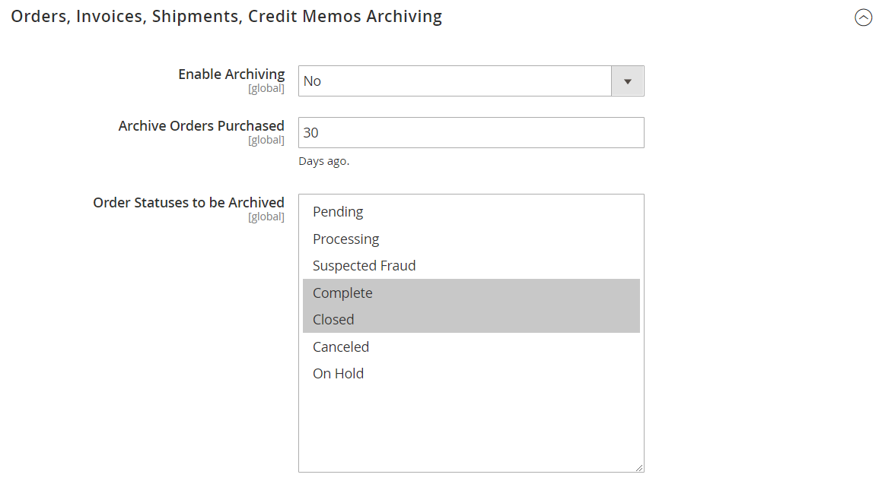

# Bestellungen archivieren

{{ee-feature}}

Die regelmäßige Archivierung von Aufträgen verbessert die Leistung und hält Ihren Arbeitsbereich frei von unnötigen Informationen, sodass Sie sich auf Ihr aktuelles Geschäft konzentrieren können. Rechnungen, Sendungen und Gutschriften können automatisch oder manuell archiviert und jederzeit eingesehen werden.

>[!NOTE]
>
>Die Option _[!UICONTROL Archive]_&#x200B;wird nur dann im Menü [[!UICONTROL Sales] angezeigt](sales-menu.md) wenn die Archivierung [aktiviert](../configuration-reference/sales/sales.md).

## Konfigurieren des Auftragsarchivs

Ihr Store kann so konfiguriert werden, dass Bestellungen, Rechnungen, Sendungen und Gutschriften nach einer bestimmten Anzahl von Tagen archiviert werden. Sie können Bestellungen und zugehörige Dokumente in das Archiv verschieben oder in den vorherigen Status zurückversetzen. Archivierte Bestellungen werden nicht gelöscht und bleiben vom Administrator verfügbar. Archivierte Daten können in eine CSV-Datei exportiert und in einer Tabelle geöffnet werden. Nach der Aktivierung _die_ Archivieren“ oben im Arbeitsbereich angezeigt.

1. Navigieren Sie in _Admin_-Seitenleiste zu **[!UICONTROL Stores]** > _[!UICONTROL Settings]_>**[!UICONTROL Configuration]**.

1. Erweitern Sie im linken Bereich den Abschnitt **[!UICONTROL Sales]** und wählen Sie darunter **[!UICONTROL Sales]**.

1. Erweitern Sie  den Abschnitt **[!UICONTROL Orders, Invoices, Shipments, Credit Memos Archiving]** .

   {width="600" zoomable="yes"}

1. Legen Sie **[!UICONTROL Enable Archiving]** auf `Yes` fest.

   >[!NOTE]
   >
   >Wenn Sie die Archivierung später deaktivieren, werden alle archivierten Bestellungen im vorherigen Status wiederhergestellt.

1. Legen Sie **[!UICONTROL Archive Orders Purchased]** auf die Anzahl der Tage fest, die gewartet werden soll, bevor abgeschlossene Bestellungen archiviert werden.

   Standardmäßig werden Bestellungen 30 Tage nach dem Kauf archiviert.

1. Wählen Sie in der **[!UICONTROL Order Statuses to be Archived]** jeden Bestellstatus aus, der zur Identifizierung der zu archivierenden Bestellungen verwendet werden soll.

   Um mehrere Elemente auszuwählen, halten Sie die Strg- (Windows) oder Befehlstaste (Mac) gedrückt, während Sie auf die einzelnen Elemente klicken.

1. Klicken Sie auf **[!UICONTROL Save Config]**.

1. Aktualisieren Sie bei Aufforderung jeden ungültigen Cache.

## Anzeigen archivierter Dokumente

1. Wählen Sie im _[!UICONTROL Sales]_&#x200B;Menü unter&#x200B;_[!UICONTROL Archive]_ eine der folgenden Optionen:

   - **[!UICONTROL Orders]**
   - **[!UICONTROL Invoices]**
   - **[!UICONTROL Shipments]**
   - **[!UICONTROL Credit Memos]**

1. Um Details anzuzeigen, klicken Sie auf ein archiviertes Dokument in der Liste.

## Anwenden einer Aktion auf ein archiviertes Dokument

Wählen Sie jedes Dokument als Ziel der Aktion aus und wählen Sie eine der folgenden **[!UICONTROL Actions]**:

- `Cancel`
- `Hold`
- `Unhold`
- `Print`
- `Move to Orders Management`

## Dokumente manuell archivieren

1. Wählen Sie den Typ des zu archivierenden Dokuments aus:

   - **[!UICONTROL Orders]**
   - **[!UICONTROL Invoices]**
   - **[!UICONTROL Shipments]**
   - **[!UICONTROL Credit Memos]**

1. Aktivieren Sie das Kontrollkästchen jedes Elements, das Sie archivieren möchten.

1. Setzen Sie in der oberen rechten Ecke **[!UICONTROL Actions]** auf `Move to Archive`.

1. Klicken Sie auf **[!UICONTROL Submit]** , um die ausgewählten Dokumente zu archivieren.

## Archivierte Dokumente wiederherstellen

1. Wählen Sie den Typ des Dokuments aus, das Sie wiederherstellen möchten.

1. Dokumente mit einer der folgenden Optionen auswählen:

   - Um alle sichtbaren Dokumente auszuwählen, klicken Sie in der oberen linken Ecke auf **[!UICONTROL Select Visible]**.

   - Aktivieren Sie manuell das Kontrollkästchen jedes Dokuments, das Sie wiederherstellen möchten.

1. Legen Sie oben rechts **[!UICONTROL Action]** auf `Move to Orders Management` fest.

1. Klicken Sie auf **[!UICONTROL Submit]** , um die Dokumente wiederherzustellen.

## Archivierte Dokumente exportieren

1. Wählen Sie den Typ des Dokuments aus, das Sie exportieren möchten.

1. Legen Sie im Menü oben rechts **[!UICONTROL Export to:]** auf einen der folgenden Werte fest:

   - `CSV`
   - `Excel`

1. Klicken Sie auf **[!UICONTROL Export]**.

Ihr Store kann so konfiguriert werden, dass Bestellungen, Rechnungen, Sendungen und Gutschriften nach einer bestimmten Anzahl von Tagen archiviert werden. Sie können Bestellungen und zugehörige Dokumente in das Archiv verschieben oder in den vorherigen Status zurückversetzen. Archivierte Bestellungen werden nicht gelöscht und bleiben vom Administrator verfügbar. Archivierte Daten können in eine CSV-Datei exportiert und in einer Tabelle geöffnet werden. Nach der Aktivierung wird der Befehl _[!UICONTROL Archive]_&#x200B;oben im Arbeitsbereich angezeigt.

## Bestellungen manuell archivieren

1. Navigieren Sie in _Admin_-Seitenleiste zu **[!UICONTROL Sales]** > _[!UICONTROL Operations]_>**[!UICONTROL Orders]**.

1. Um die Reihenfolge im Raster festzulegen, aktivieren Sie das Kontrollkästchen in der ersten Spalte.

1. Legen Sie das **[!UICONTROL Actions]** auf `Move to Archive` fest und suchen Sie nach der Meldung, dass die Bestellung archiviert wurde.

   {width="700" zoomable="yes"}

>[!TIP]
>
>Eine Liste der Bestellstatus, die archiviert werden können, finden Sie unter [Konfigurieren des Bestellarchivs](#configure-the-order-archive).

## Anzeigen einer archivierten Bestellung

1. Öffnen Sie die Archivansicht mit einer der folgenden Methoden:

   - Klicken Sie in der Schaltflächenleiste über dem _[!UICONTROL Orders]_&#x200B;auf **[!UICONTROL Go to Archive]**.

   - Navigieren Sie in _Admin_-Seitenleiste zu **[!UICONTROL Sales]** > _[!UICONTROL Archive]_>**[!UICONTROL Orders]**.

   >[!NOTE]
   >
   >Wie bei Bestellungen wird der Titel der archivierten Bestellungsseite _[!UICONTROL Orders]_. Der einzige bemerkbare Unterschied ist die Option in der Schaltflächenleiste, um zu&#x200B;_[!UICONTROL Return to Orders Management]_. Die URL der Seite gibt auch an, dass Sie sich im Auftragsarchiv befinden.

1. Klicken Sie in _Spalte_ Aktion **[!UICONTROL View]** auf.

   {width="600" zoomable="yes"}

## Wiederherstellen einer archivierten Bestellung

>[!NOTE]
>
>Eine aus einer archivierten Bestellung wiederhergestellte Bestellung wird entsprechend der in der [!UICONTROL Archive Orders Purchased]-Einstellung konfigurierten Anzahl von Tagen erneut archiviert (siehe [Bestellarchiv konfigurieren](#configure-the-order-archive)). Die Anzahl der Tage wird anhand des [!UICONTROL Updated At] für die Bestellung berechnet, das geändert wird, wenn die Bestellung aus dem Archiv verschoben wird.

1. Navigieren Sie in _Admin_-Seitenleiste zu **[!UICONTROL Sales]** > _[!UICONTROL Operations]_>**[!UICONTROL Orders]**.

1. Klicken Sie in der Schaltflächenleiste auf **[!UICONTROL Go to Archive]**.

1. Suchen Sie den wiederherzustellenden Datensatz und klicken Sie auf das Kontrollkästchen, um ihn auszuwählen.

   {width="600" zoomable="yes"}

1. Setzen Sie den Wert der **[!UICONTROL Actions]** auf `Move to Order Management`.

Suchen Sie nach der Meldung, dass die archivierte Bestellung aus dem Archiv entfernt wurde.

## Archivierte Reihenfolge exportieren

1. Navigieren Sie in _Admin_-Seitenleiste zu **[!UICONTROL Sales]** > _[!UICONTROL Operations]_>**[!UICONTROL Orders]**.

1. Klicken Sie im Menü Aktion auf **[!UICONTROL Export]** und wählen Sie das gewünschte Format aus.
