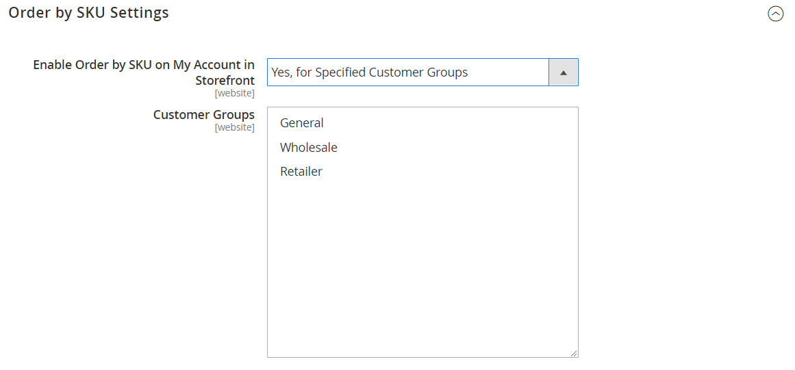

# Bestellung nach SKU

{{ee-feature}}

Eine &quot;SKU&quot;ist eine &quot;Bestandseinheit&quot;. SKUs helfen Online-Anbietern im Allgemeinen dabei, die wichtigsten Produktmerkmale wie Größe, Farbe, Preis und Material zu identifizieren. Produkt-IDs unterscheiden sich von SKUs:

- Die `Product ID` ist eine sequenzielle Zahlenreihe, die intern zur Identifizierung von Produkten verwendet wird und für Kunden nicht verfügbar ist.
- Die `SKU` wird vom Verkäufer generiert, normalerweise basierend auf dem Produktnamen und den Attributen für das Marketing oder interne Tracking. Beispiel: Ein blaues T-Shirt aus Baumwolle, ein Medium der Größe: T-COT-MED-BL. Die SKU kann vom Verkäufer bei Bedarf geändert werden.

Normalerweise enthält eine SKU eine Reihe von Abkürzungen, die die Unterscheidungsmerkmale des Produkts angeben. Die maximale SKU-Länge beträgt 64 Zeichen. SKUs sind wichtig, um Lagerbestände effektiv zu verfolgen und zu verwalten. Daher ist die korrekte Einrichtung für den elektronischen Geschäftsverkehr von entscheidender Bedeutung.

_Bestellung nach SKU_ ist [Widget](../content-design/widgets.md) , die im Geschäft als bequem für alle Käufer angezeigt oder nur den Käufern in bestimmten Kundengruppen zur Verfügung gestellt werden können. Käufer können entweder die SKU und die Mengeninformationen direkt in den SKU-Block &quot;Bestellung nach SKU&quot;eingeben oder eine CSV-Datei aus ihrem Kundenkonto hochladen. Unabhängig von der Konfiguration ist die Bestellung nach SKU immer für Store-Administratoren verfügbar.

{width="700" zoomable="yes"}

## Bestellung nach SKU konfigurieren

1. Im _Admin_ Seitenleiste, navigieren Sie zu **[!UICONTROL Stores]** > _[!UICONTROL Settings]_>**[!UICONTROL Configuration]**.

1. Erweitern Sie im linken Bereich den **[!UICONTROL Sales]** auswählen **[!UICONTROL Sales]** darunter.

1. Erweitern  die **[!UICONTROL Order by SKU Settings]** Abschnitt.

1. Satz **[!UICONTROL Enable Order by SKU on my Account in Storefront]** auf einen der folgenden Werte zu:

   - `Yes, for Everyone` - Der Block Bestellung nach SKU ist im Laden für jeden Käufer verfügbar.
   - `Yes, for Specified Customer Groups` - Die Bestellung nach SKU ist nur für Mitglieder einer bestimmten Kundengruppe verfügbar, z. B. `Wholesale`.
   - `No` - Der Block Bestellung nach SKU wird nicht in der Storefront angezeigt und die Seite Bestellung nach SKU ist nicht im Kundenkonto verfügbar.

   {width="600" zoomable="yes"}

1. Klicken **[!UICONTROL Save Config]**.

 (Nur B2B für Adobe Commerce) _**Um die Funktion &quot;Bestellung nach SKU&quot;zu aktivieren, deaktivieren Sie die Funktion &quot;Quick Order&quot;:**_

1. Navigieren Sie zu **[!UICONTROL Stores]** > _[!UICONTROL Settings]_>**[!UICONTROL Configuration]**.

1. Im linken Bereich unter _[!UICONTROL General]_auswählen **[!UICONTROL B2B Features]**

1. Erweitern  die **[!UICONTROL B2B Features]** Abschnitt.

1. Satz **[!UICONTROL Enable Quick Order]** nach `No`.

   Die [Schnellbestellfunktion](../b2b/quick-order.md) ermöglicht es Kunden und Gästen, schnell Bestellungen basierend auf der SKU oder dem Produktnamen zu tätigen.

## Storefront-Erlebnis

Wenn die Funktion für den Store konfiguriert ist, können Kunden von jeder Seite, die die _Bestellung nach SKU_ -Widget oder über das Konto-Dashboard.

### Bestellung nach SKU aus dem Seitenblock

1. Im _Bestellung nach SKU_ -Block, wird der Kunde in die **[!UICONTROL SKU]** und **[!UICONTROL Qty]** des zu bestellenden Artikels.

1. Um ein weiteres Element hinzuzufügen, klicken Sie auf **[!UICONTROL Add Row]** und wiederholen Sie den Vorgang.

1. Klicks **[!UICONTROL Add to Cart]**.

### Bestellung durch SKU über ein Kundenkonto

1. Über die Storefront meldet sich der Kunde bei seinem Konto an.

1. Wählen Sie im Bedienfeld auf der linken Seite **[!UICONTROL Order by SKU]**.

1. Fügt einzelne Elemente nach Präferenz hinzu:

   _**Fügt jedes Element nach SKU hinzu:**_

   - Fügt die **[!UICONTROL SKU]** und **[!UICONTROL Qty]** des zu bestellenden Artikels.

   - Klicken Sie auf , um nach Bedarf weitere Elemente hinzuzufügen. _Zeile hinzufügen_  und wiederholt sich für so viele Elemente wie nötig.

   - Klicks **[!UICONTROL Add to Cart]**.

   _**Lädt eine CSV-Datei mit mehreren Elementen hoch:**_

   - Bereitet eine [Daten-CSV importieren](../systems/data-csv.md) Datei (kommagetrennter Wert) mit Spalten für `SKU` und `Qty`.

   {width="500" zoomable="yes"}

   - Zum Hochladen der CSV-Datei klicken Sie auf **[!UICONTROL Choose File]** und wählen Sie die hochzuladende Datei aus.

   - Klicks **[!UICONTROL Add to Cart]**.

   Wenn eines der Produkte zusätzliche Optionen aufweist, wird der Kunde vom Warenkorb aufgefordert, darauf zu achten, dass das Produkt beachtet werden muss.

   {width="600" zoomable="yes"}

   >[!NOTE]
   >
   >Bei doppelten SKUs werden die Mengen zu einem Zeileneintrag im Warenkorb zusammengefasst. Der Kunde kann die Menge jedes Artikels ändern und auf **[!UICONTROL Update Shopping Cart]** um die Summen neu zu berechnen.

