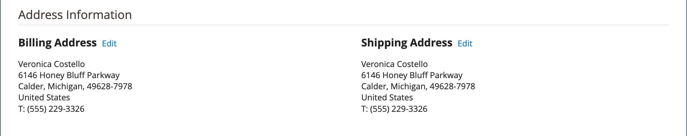

# Bestellworkflow und -verarbeitung

Wenn ein Kunde eine Bestellung aufgibt, wird eine Bestellung als temporärer Datensatz der Transaktion erstellt. Im Raster Bestellungen haben die Bestellungen zunächst den Status &quot;Ausstehend&quot; und können jederzeit storniert werden, bis die Zahlung verarbeitet wird. Nach Zahlungsbestätigung kann die Bestellung fakturiert und versandt werden.

**Schritt 1: Bestellung aufgeben** - Der Checkout-Prozess beginnt, wenn der Käufer auf **[!UICONTROL Go to Checkout]** auf der Warenkorbseite oder [reorders](reorders-allow.md) direkt von ihrem Kundenkonto aus.

**Schritt 2: Reihenfolge ausstehend** - Der Status der Erstverkaufsaufträge lautet `Pending`. In diesem Status wurde die Zahlung nicht verarbeitet und die Bestellung kann noch bearbeitet oder storniert werden. Dieser Status tritt auf, wenn die Zahlungsmethode für den Autorisierungsmodus konfiguriert ist.

**Schritt 3: Zahlungseingang** - Der Bestellstatus ändert sich in `Processing` bei Eingang oder Genehmigung der Zahlung. Je nach Zahlungsmethode erhalten Sie möglicherweise eine Benachrichtigung, wenn die Transaktion genehmigt oder verarbeitet wird. Dieser Status tritt automatisch auf, wenn die Zahlungsmethode für die Erfassung oder den Intent-Sale-Modus konfiguriert ist.

**Schritt 4: Rechnungsstellung** - Eine Bestellung wird in der Regel nach Zahlungseingang in Rechnung gestellt. Die Zahlungsmethode bestimmt, welche Rechnungsoptionen für die Bestellung benötigt werden. Nachdem die Rechnung erstellt und übermittelt wurde, wird eine Kopie an den Kunden gesendet. Wenn die Zahlungsmethode mit der `capture` oder `intent sale` Zahlungsaktion, wird automatisch eine Rechnung erstellt, wenn die Zahlung genehmigt und erfasst wird.

>[!NOTE]
>
>Rechnungen werden nicht automatisch für Bestellungen erstellt, die mithilfe von `Gift Card`, `Store Credit`, `Reward Points`oder anderen Offline-Zahlungsmethoden.

**Schritt 5: Ein einziges Versand buchen** - Der Bestellstatus ändert sich in `Complete` wenn die Lieferdetails abgeschlossen sind, wird der Versand gebucht und der Versand eingestellt. Die Versandanforderung wird mit einem gedruckten Verpackungs- und Versandtitel oder _Bereit für Abruf benachrichtigen_ ausgewählt ist (Bereitstellungsmethode im Store). Der Kunde erhält eine Benachrichtigung und das Paket wird versandt. Bei Verwendung von Trackingnummern kann der Versand vom Kundenkonto aus nachverfolgt werden.

>[!NOTE]
>
>Weitere Informationen zu den Konfigurationsoptionen für Bestellstatus und Zahlungsmethode finden Sie unter [Bestellstatus](order-status.md) und [Zahlungen](payments.md).

## Bestellung anzeigen

1. Im _Admin_ Seitenleiste, navigieren Sie zu **[!UICONTROL Sales]** > _[!UICONTROL Operations]_>**[!UICONTROL Orders]**.

1. Suchen Sie die Reihenfolge im Raster.

1. Im _[!UICONTROL Action]_Spalte, klicken **[!UICONTROL View]**.

1. Überprüfen Sie den Bestellstatus:

   - A `Pending` Bestellung kann geändert, ausgesetzt, storniert, fakturiert und versandt werden.

   - A `Processing` Die Bestellung kann nicht mehr wesentlich bearbeitet oder abgebrochen werden, aber die Abrechnungs- und Lieferadresse kann bearbeitet werden.

   - A `Completed` Bestellung kann neu angeordnet werden.

Die E-Mail des Kunden kann jederzeit im Bestell-Workflow bearbeitet werden, indem der Kunde bearbeitet wird. Die E-Mail kann nicht bearbeitet werden, wenn die Bestellung von einem Gast aufgegeben wurde.

Das linke Bedienfeld für eine geöffnete Bestellung bietet Zugriff auf verschiedene Arten von Informationen, die mit der Bestellung verbunden sind.

{width="700" zoomable="yes"}

## Auftrag verarbeiten

Wenn ein Kunde eine Bestellung aufgibt, wird eine Bestellung als temporärer Datensatz der Transaktion erstellt. Der Verkaufsauftrag hat den Status `Pending` bis die Zahlung eingegangen ist. while in `Pending` -Status, können Bestellungen bearbeitet oder storniert werden, bis die Zahlung eingegangen ist und eine Rechnung erstellt wird. Eine einfache Art, darüber nachzudenken, ist, dass Bestellungen Rechnungen werden, und Rechnungen zu Sendungen werden. Im Raster Bestellungen werden alle Bestellungen aufgelistet, unabhängig davon, wo sie sich im Workflow befinden. Informationen dazu, wie Sie Kunden bei einer Bestellung unterstützen, finden Sie unter [Auftrag aktualisieren](order-update.md).

{width="700" zoomable="yes"}

So öffnen Sie eine `Pending` Bestellung, klicken Sie **[!UICONTROL Edit]** in der oberen rechten Ecke.

>[!NOTE]
>
>Bestellungen können nur während der `Pending` -Status. Die Schaltfläche Bearbeiten ist nicht für Bestellungen mit einem anderen Status oder für Bestellungen sichtbar, die auf einer [ausgehandeltes Angebot](../b2b/quotes.md).

{width="600" zoomable="yes"}

Überprüfen Sie die folgenden Abschnitte in der Bestellung, indem Sie die Feldbeschreibungen als Referenz verwenden.

### Beschreibungen der Bestellansicht

| Registerkarte | Beschreibung |
|--- |--- |
| [!UICONTROL Information] | Zeigen Sie detaillierte Informationen zur Bestellung und zum Konto an, einschließlich Abrechnungs- und Lieferadressen, Zahlungs- und Versandmethoden, Artikelbestellungen, Gesamtsummen und Hinweise. |
| [!UICONTROL Invoices] | Listet jede Rechnung auf, die mit der Bestellung verbunden ist. |
| [!UICONTROL Credit Memos] | Listet jedes Kreditmemo auf, das mit der Bestellung verknüpft ist. |
| [!UICONTROL Shipments] | Listet jeden Versanddatensatz auf, der mit der Bestellung verbunden ist. |
| [!UICONTROL Comments History] | Listet alle Notizen auf, die mit der Bestellung in Verbindung stehen. |

{style="table-layout:auto"}

>[!NOTE]
>
>Ein Admin-Benutzer muss **[!UICONTROL Sales / Archive]** [Berechtigungen](../systems/permissions-user-roles.md) für ihren Aufgabenbereich, um die _Rechnungen_, _Credit Memos_, und _Sendungen_ Bestellregisterkarten.

### Schaltflächenleiste

| Schaltfläche | Beschreibung |
|--- |--- |
| **[!UICONTROL Back]** | Kehrt zur Seite Bestellungen zurück, ohne Änderungen zu speichern. |
| **[!UICONTROL Cancel]** | Macht die Bestellung rückgängig. |
| **[!UICONTROL Send Email]** | Sendet eine E-Mail über die Bestellung an den Kunden. |
| **[!UICONTROL Hold]** / **[!UICONTROL Unhold]** | Ändert den Status des Verkaufsauftrags in `On Hold`. Wählen Sie die Option, um den Kaufauftrag freizugeben. **[!UICONTROL Unhold]**. |
| **[!UICONTROL Invoice]** | Erstellt eine Rechnung aus dem Verkaufsauftrag, indem die Bestellung in eine Rechnung umgewandelt wird. |
| **[!UICONTROL Ship]** | Erstellt einen Versanddatensatz für die Bestellung. |
| **[!UICONTROL Notify Order is Ready for Pickup]** | Wird nur angezeigt, wenn eine Bestellung als In-Store-Versand platziert wird. Benachrichtigt den Kunden darüber, dass die Bestellung abgeholt werden kann. |
| **[!UICONTROL Reorder]** | Erstellt eine auf der aktuellen Bestellung basierende Verkaufsbestellung. |
| **[!UICONTROL Edit]** | Öffnet eine ausstehende Bestellung im Bearbeitungsmodus. Die Schaltfläche Bearbeiten ist nicht für Bestellungen mit dem Status `Processing`oder auf Angeboten basieren, die auf ausgehandelten Anführungszeichen basieren. |

{style="table-layout:auto"}

### Abbrechen einer Bestellung

Sie können [cancel](order-update.md) Bestellungen, die noch nicht in Rechnung gestellt wurden. A [Credit Memo](credit-memos.md) müssen ausgegeben werden, wenn ein Kunde eine Bestellung nach Rechnungsstellung stornieren möchte (Zahlung wird erfasst).

Wenn eine Bestellung `Pending` oder `Processing` und die Zahlung nicht erfasst oder nicht vollständig erfasst wird, können Sie [Die Bestellung löschen](#void-an-order) anstatt sie abzubrechen.

Um eine stornierte Bestellung wiederherzustellen, klicken Sie auf die Schaltfläche **[!UICONTROL Reorder]** und eine neue Bestellung mit dem Status erstellt `Pending`.

>[!NOTE]
>
>Das Abbrechen einer Bestellung führt ebenfalls zu einer Nichtigkeit, aber die Nichtigerklärung einer Bestellung Trigger keine Stornierung.

### Eine Bestellung stornieren

Nur Verkaufsaufträge, die nicht in Rechnung gestellt werden, haben den Status `Processing`und ein [Festlegung der Zahlungsintegration `Authorize`](../configuration-reference/sales/payment-methods.md#payment-actions), kann [voided](order-update.md#void-a-processing-order). Wenn Sie eine Bestellung storniert haben, können Sie sie stornieren.

### [!UICONTROL Order and Account Information]

{width="600" zoomable="yes"}

#### Bestellinformationen

| Feld | Beschreibung |
|--- |--- |
| [!UICONTROL Order Number] | Die Bestellnummer wird oben in der Bestellung angezeigt, gefolgt von einem Hinweis, der angibt, ob die Bestätigungs-E-Mail gesendet wurde. |
| [!UICONTROL Order Date] | Datum und Uhrzeit der Bestellung. |
| [!UICONTROL Purchased From] | Gibt die Website-, Store- und Store-Ansicht an, in der die Bestellung aufgegeben wurde. |
| [!UICONTROL Placed from IP] | Gibt die IP-Adresse des Computers an, von dem aus die Bestellung aufgegeben wurde. |
| [!UICONTROL Order Placed from Quote] |  (Verfügbar mit Adobe Commerce B2B) Gibt die [Anführungszeichen](../b2b/quotes.md) gegebenenfalls von dem aus die Bestellung generiert wurde. Der Anführungszeichenname ist mit dem Anführungszeichen verknüpft. |

{style="table-layout:auto"}

#### Kontoinformationen

| Feld | Beschreibung |
|--- |--- |
| [!UICONTROL Customer Name] | Der Name des Kunden oder Käufers, der die Bestellung aufgegeben hat. Der Kundenname ist mit dem Kundenprofil verknüpft. |
| [!UICONTROL Email] | Die E-Mail-Adresse des Kunden oder Käufers. Die E-Mail-Adresse ist mit dem Öffnen einer neuen E-Mail verknüpft. |
| [!UICONTROL Customer Group] | Der Name der Kundengruppe oder des freigegebenen Katalogs, der der Kunde zugewiesen ist. |
| [!UICONTROL Company Name] |  (Verfügbar mit Adobe Commerce B2B) Der Name des Unternehmens, mit dem der Käufer verbunden ist und in dessen Auftrag die Bestellung aufgegeben wird. Der Name des Unternehmens ist mit dem [Firmenprofil](../b2b/account-companies.md). |

{style="table-layout:auto"}

### [!UICONTROL Address Information]

{width="600" zoomable="yes"}

| Feld | Beschreibung |
|--- |--- |
| [!UICONTROL Billing Address] | Name des Kunden oder Käufers, der die Bestellung aufgegeben hat, gefolgt von Rechnungsadresse, Telefonnummer und [Mehrwertsteuer](vat.md), falls zutreffend. Die Telefonnummer ist mit dem automatischen Anruf auf einem Mobilgerät verbunden. |
| [!UICONTROL Shipping Address] | Der Name der Person, der die Bestellung zugestellt werden soll, gefolgt von der Lieferadresse und der Telefonnummer. Die Telefonnummer ist mit dem automatischen Anruf auf einem Mobilgerät verbunden. |

{style="table-layout:auto"}

### [!UICONTROL Payment & Shipping Method]

{width="600" zoomable="yes"}

| Feld | Beschreibung |
|--- |--- |
| [!UICONTROL Payment Information] | Die Zahlungsmethode, die für die Bestellung verwendet wird, und die Bestellnummer, sofern zutreffend, gefolgt von der Währung, die für die Bestellung verwendet wurde. Wenn die Bestellung dem Unternehmen mittels [Kontozahlung](../b2b/enable-basic-features.md#configure-payment-on-account)angegeben ist, ist der Betrag, der dem Konto in Rechnung gestellt wird, angegeben. |
| [!UICONTROL Shipping & Handling Information] | Die zu verwendende Versandmethode und die anwendbare Bearbeitungsgebühr. |

{style="table-layout:auto"}

### Bestellte Elemente überprüfen

{width="600" zoomable="yes"}

Im **[!UICONTROL Order Total]** führen Sie folgende Schritte aus:

1. Geben Sie einen **[!UICONTROL Comment]** , um sie in die Bestellung aufzunehmen.

1. Wenn Sie den Kommentar per E-Mail an den Kunden senden möchten, wählen Sie die **[!UICONTROL Notify Customer by Email]** aktivieren.

1. Wenn der Kommentar im Kundenkonto sichtbar sein soll, wählen Sie die **[!UICONTROL Visible on Storefront]** aktivieren.

   {width="600" zoomable="yes"}

1. Wenn Sie bereit sind, die Bestellung zu berechnen, klicken Sie auf **[!UICONTROL Invoice]** und befolgen Sie die Anweisungen unter [eine Rechnung erstellen](invoices.md#create-an-invoice).

#### [!UICONTROL Items Ordered]

| Feld | Beschreibung |
|--- |--- |
| [!UICONTROL Product] | Produktname, SKU und ggf. Optionen. |
| [!UICONTROL Item Status] | Gibt den Status des Elements an. Wert: `Ordered` |
| [!UICONTROL Original Price] | Der ursprüngliche Katalogpreis des Artikels vor Rabatten. |
| [!UICONTROL Price] | Der Kaufpreis des Artikels. Dieser Wert spiegelt ggf. jeden Rabatt wider, der auf den Artikel aus dem freigegebenen Katalog angewendet wird. |
| [!UICONTROL Qty] | Die bestellte Menge. |
| [!UICONTROL Subtotal] | Die Zwischensumme ist der Kaufpreis multipliziert mit der Menge. |
| [!UICONTROL Tax Amount] | Der Steuerbetrag, der auf das Element als Dezimalwert angewendet wird. |
| [!UICONTROL Tax Percent] | Der auf diesen Posten angewandte Steuersatz in Prozent. |
| [!UICONTROL Discount Amount] | Der Rabatt, der für dieses Element gilt. Der Rabattwert ist null, wenn die Bestellung auf einem Anführungszeichen basiert. |
| [!UICONTROL Row Total] | Der Zeileneintrag insgesamt, einschließlich der anwendbaren Steuern, die auf Produktebene fällig sind, abzüglich Rabatte. |

{style="table-layout:auto"}

#### [!UICONTROL Notes for this Order]

| Feld | Beschreibung |
|--- |--- |
| [!UICONTROL Status] | Zeigt den Status des Verkaufsauftrags an. |
| [!UICONTROL Comment] | Ein Textfeld zur Eingabe eines Kommentars für den Kunden, der die Bestellung begleitet.  **[!UICONTROL Notify Customer by Email]**- Aktivieren Sie das Kontrollkästchen, wenn Sie den Kommentar als separate E-Mail an den Kunden senden möchten. **[!UICONTROL Visible on Storefront]** - Aktivieren Sie das Kontrollkästchen, wenn der Kommentar im Kundenkonto sichtbar sein soll.  **[!UICONTROL Submit Comment]**- Sendet den Kommentar und sendet ihn gegebenenfalls per E-Mail. |

{style="table-layout:auto"}

#### [!UICONTROL Order Totals]

| Feld | Beschreibung |
|--- |--- |
| [!UICONTROL Shipping & Handling] | Der für Versand- und Bearbeitungsgebühren berechnete Betrag. |
| [!UICONTROL Tax] | Der auf die Bestellung angewendete Steuerbetrag, falls zutreffend. |
| [!UICONTROL Grand Total] | Die Bestellsumme. |
| [!UICONTROL Total Paid] | Der Gesamtbetrag, der für die Bestellung gezahlt wurde, falls zutreffend. |
| [!UICONTROL Total Refunded] | Der Gesamtbetrag, der ggf. aus der Bestellung zurückerstattet wurde. |
| [!UICONTROL Total Due] | Der Gesamtbetrag, der fällig ist. |
| [!UICONTROL Store Credit] |  (Nur Adobe Commerce) Der Betrag des verfügbaren Store-Guthabens, der auf die Bestellung angewendet wird, sofern zutreffend. |
| [!UICONTROL Catalog Total Price] |  (Verfügbar mit Adobe Commerce B2B) Der Gesamtpreis der Artikel im Angebot ohne Steuern gemäß der Preisgestaltung im freigegebenen Katalog oder Standardkatalog, der als Grundlage für das Angebot verwendet wird. Wenn sich die Anzeigewährung der Storefront von der Basiswährung unterscheidet, wird der Wert in beiden Währungen angezeigt, wobei die Storefront in eckigen Klammern angezeigt wird. |
| [!UICONTROL Negotiated Discount] |  (Verfügbar bei Adobe Commerce B2B) Der Rabatt, der aus einem zwischen Käufer und Verkäufer ausgehandelten Angebot resultiert. Wenn sich die Anzeigewährung der Storefront von der Basiswährung unterscheidet, wird der Wert in beiden Währungen angezeigt, wobei die Storefront in eckigen Klammern angezeigt wird. |
| [!UICONTROL Subtotal] |  (Verfügbar mit Adobe Commerce B2B) Der Gesamtpreis des Katalogs abzüglich des verhandelten Rabatts. |

{style="table-layout:auto"}

## Demo zur Bestellverarbeitung

Sehen Sie sich dieses Video an und erfahren Sie mehr über die Auftragsverarbeitung und den Status:

>[!VIDEO](https://video.tv.adobe.com/v/343935/?quality=12)
