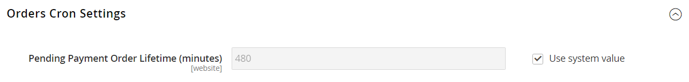
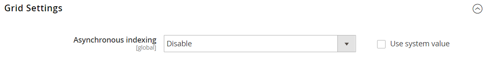

# Geplante Bestellvorgänge

Verwenden Sie [Cron](../systems/cron.md)-Aufträge, um die folgenden Auftragsverarbeitungsaufgaben zu planen:

{width="700" zoomable="yes"}

## Ausstehende Lebensdauer von Zahlungsaufträgen festlegen

Die Lebensdauer von Bestellungen mit ausstehenden Zahlungen wird durch die Konfiguration _Bestellungen Cron-Einstellungen_ bestimmt. Der Standardwert ist 480 Minuten, d. h. acht Stunden.

1. Navigieren Sie in _Admin_-Seitenleiste zu **[!UICONTROL Stores]** > _[!UICONTROL Settings]_>**[!UICONTROL Configuration]**.

1. Erweitern Sie im linken Bereich den Abschnitt **[!UICONTROL Sales]** und wählen Sie darunter **[!UICONTROL Sales]**.

1. Erweitern Sie  den Abschnitt **[!UICONTROL Orders Cron Settings]** .

   {width="600" zoomable="yes"}

1. Geben Sie **[!UICONTROL Pending Payment Order Lifetime (minutes)]** die Anzahl der Minuten ein, nach denen eine ausstehende Zahlung abläuft.

1. Klicken Sie auf **[!UICONTROL Save Config]**.

## Geplante Rasteraktualisierungen und Neuindizierungen aktivieren

Die Konfiguration der Rastereinstellungen plant Aktualisierungen an den folgenden Auftragsverwaltungsrastern und indiziert die Daten wie von [Cron](../systems/cron.md) geplant neu:

- [Bestellungen](orders.md#orders-workspace)
- [Rechnungen](invoices.md)
- [Sendungen](shipments.md)
- [Gutschriften](credit-memos.md)

Durch die Planung dieser Aufgaben können Sie die Sperren vermeiden, die beim Speichern von Daten auftreten, und die Verarbeitungszeit verkürzen. Wenn diese Option aktiviert ist, finden Aktualisierungen nur während des geplanten Cron-Auftrags statt. Für optimale Ergebnisse sollte Cron so konfiguriert werden, dass es einmal pro Minute ausgeführt wird.

**_So aktivieren Sie die Aktualisierungen und Neuindizierungen:_**

[!BADGE Nur PaaS]{type=Informative url="https://experienceleague.adobe.com/de/docs/commerce/user-guides/product-solutions" tooltip="Gilt nur für Adobe Commerce in Cloud-Projekten (von Adobe verwaltete PaaS-Infrastruktur) und lokale Projekte."} Wenn [Produktionsmodus](https://experienceleague.adobe.com/docs/commerce-operations/configuration-guide/setup/application-modes.html?lang=de#production-mode) (der in Adobe Commerce in der Cloud-Infrastruktur verwendete Standardmodus) aktiviert ist, führen Sie den folgenden Befehl aus:

`bin/magento config:set dev/grid/async_indexing 1`

Wenn [Standardmodus](https://experienceleague.adobe.com/docs/commerce-operations/configuration-guide/setup/application-modes.html?lang=de#default-mode) aktiviert ist, führen Sie die folgenden Schritte aus:

1. Navigieren Sie in _Admin_-Seitenleiste zu **[!UICONTROL Stores]** > _[!UICONTROL Settings]_>**[!UICONTROL Configuration]**.

1. Erweitern Sie im linken Bereich den Abschnitt **[!UICONTROL Advanced]** und wählen Sie **[!UICONTROL Developer]**.

1. Erweitern Sie  den Abschnitt **[!UICONTROL Grid Settings]** .

1. Legen Sie **[!UICONTROL Asynchronous Indexing]** auf `Enable` fest.

   {width="600" zoomable="yes"}

1. Klicken Sie auf **[!UICONTROL Save Config]**.
