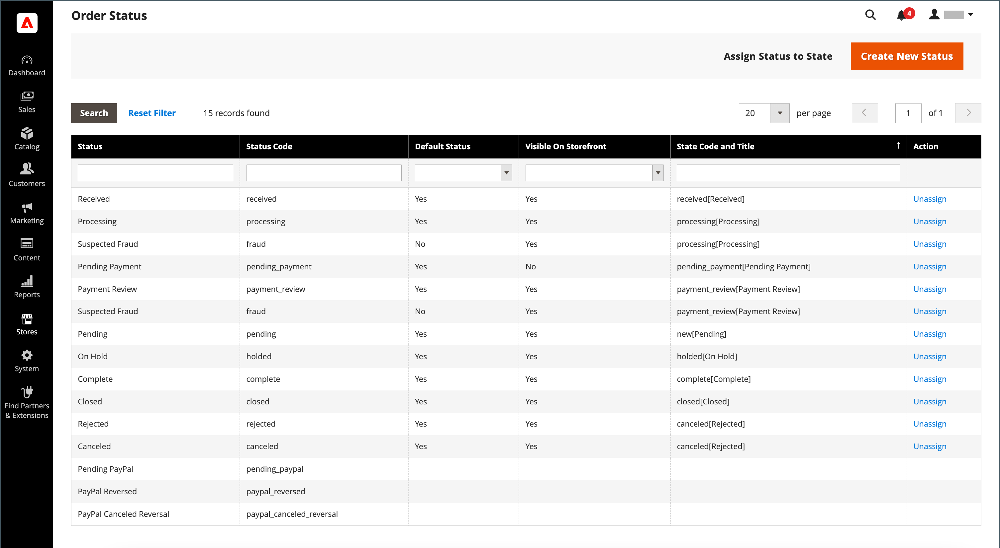

# Bestellstatus

Alle Bestellungen haben einen Bestellstatus, der einer Phase in der Auftragsverarbeitung zugeordnet ist [Workflow](order-processing.md).\
Der Unterschied zwischen Bestellstatus und Bestellstatus besteht darin, dass **[!UICONTROL order states]** werden programmgesteuert verwendet. Sie sind für Kunden oder Admin-Benutzer nicht sichtbar. Sie bestimmen den Ablauf einer Bestellung und welche Vorgänge für eine Bestellung in einem bestimmten Status möglich sind.\
**[!UICONTROL Order statuses]** werden verwendet, um Kunden und Administratoren den Status einer Bestellung mitzuteilen.
Sie können zusätzliche Bestellstatus erstellen, die Ihren betrieblichen Anforderungen entsprechen. Der Bestellstatus eignet sich hervorragend, um den Fortschritt außerhalb von Adobe Commerce anzuzeigen, z. B. die Bestellauswahl und den Versandfortschritt. Sie haben keine Auswirkungen auf den Auftragsverarbeitungs-Workflow.\
Jeder Bestellstatus ist mit einem Bestellstatus verknüpft. Ihr Store verfügt über eine Reihe vordefinierter Einstellungen für den Bestellstatus und den Bestellstatus.

{width="700" zoomable="yes"}

Der Status jeder Bestellung wird im Abschnitt _Status_ Spalte _Bestellungen_ Gitter.

{width="700" zoomable="yes"}

>[!TIP]
>
>Der teilweise rückerstattete Auftrag verbleibt in `Processing` Status bis **_all_** bestellte Artikel (einschließlich erstatteter Artikel) werden versandt. Der Bestellstatus ändert sich nicht in `Complete` bis jeder Artikel in der Bestellung versandt wurde.

## Workflow &quot;Auftragsstatus&quot;

## Vordefinierter Status

| Bestellstatus | Status-Code |                                                                                                                                                                                                                                                                                        |
|--------------------------|----------------------------|----------------------------------------------------------------------------------------------------------------------------------------------------------------------------------------------------------------------------------------------------------------------------------------|
| Erhalten | `received` | Dieser Status ist der Anfangsstatus für Bestellungen, die platziert werden, wenn die asynchrone Bestellplatzierung aktiviert ist. |
| Verdächtiger Betrug | `fraud` | Manchmal werden Bestellungen, die über PayPal oder ein anderes Zahlungsportal bezahlt werden, als _Verdächtiger Betrug_. Dieser Status bedeutet, dass für die Bestellung keine Rechnung ausgestellt wurde und die Bestätigungs-E-Mail auch nicht gesendet wird. |
| Verarbeitung läuft | `processing` | Wenn der Status neuer Bestellungen auf &quot;Verarbeitung&quot;festgelegt ist, wird die _Automatisch alle Elemente einrechnen_ in der Konfiguration verfügbar. Rechnungen werden nicht automatisch für Bestellungen erstellt, die mit der Gift Card, Store Credit, Rewards Points oder anderen Offline-Zahlungsmethoden bestellt werden. |
| Ausstehende Zahlung | `pending_payment` | Dieser Status wird verwendet, wenn die Bestellung erstellt wird und PayPal oder eine ähnliche Zahlungsmethode verwendet wird. Das bedeutet, dass der Kunde zur Payment Gateway-Website geleitet wurde, aber noch keine Rückkehrinformationen eingegangen sind. Dieser Status ändert sich, wenn der Kunde zahlt. |
| Zahlungsüberprüfung | `payment_review` | Dieser Status wird angezeigt, wenn die Überprüfung der PayPal-Zahlung aktiviert ist. |
| Ausstehend | `pending` | Dieser Status weist darauf hin, dass keine Rechnung und keine Sendungen vorgelegt wurden. |
| Halten | `holded` | Dieser Status kann nur manuell zugewiesen werden. Du kannst jede Ordnung auf Eis legen. |
| Fertig | `complete` | Dieser Status bedeutet, dass die Bestellung erstellt, bezahlt und an den Kunden versandt wird. |
| Geschlossen | `closed` | Dieser Status zeigt an, dass einer Bestellung ein Kreditmemo zugewiesen wurde und der Kunde eine Rückerstattung erhalten hat. |
| Abgebrochen | `canceled` | Dieser Status wird manuell im Admin zugewiesen oder bei einigen Zahlungstüren, wenn der Kunde nicht innerhalb der festgelegten Zeit zahlt. |
| Abgelehnt | `rejected` | Dieser Status bedeutet, dass eine Bestellung während der asynchronen Bestellverarbeitung abgelehnt wurde. Dies geschieht, wenn während der asynchronen Bestellplatzierung ein Fehler auftritt. |
| PayPal Cancelled Reversal | `paypay_canceled_reversal` | Dieser Status bedeutet, dass PayPal die Umkehrung abgebrochen hat. |
| Ausstehende PayPal | `pending_paypal` | Dieser Status bedeutet, dass die Bestellung bei PayPal eingegangen ist, die Zahlung jedoch noch nicht verarbeitet wurde. |
| PayPal umkehrt | `paypal_reversed` | Dieser Status bedeutet, dass PayPal die Transaktion rückgängig gemacht hat. |

{style="table-layout:auto"}

## Benutzerdefinierter Bestellstatus

Zusätzlich zu den voreingestellten Einstellungen für den Bestellstatus können Sie eigene benutzerdefinierte Bestellstatuseinstellungen erstellen, sie Bestellstatus zuweisen und Standardsortierungsstatus für Bestellstatus festlegen. Der Bestellstatus gibt die Position der Bestellung im Workflow zur Auftragsbearbeitung an und der Bestellstatus weist der Position der Bestellung eine aussagekräftig übersetzbare Bezeichnung zu. Möglicherweise benötigen Sie einen benutzerdefinierten Bestellstatus, z. B. `packaging"`, `backordered`oder einem Status, der Ihren Anforderungen entspricht. Sie können einen beschreibenden Namen für den benutzerdefinierten Status erstellen und ihn dem zugehörigen Bestellstatus im Workflow zuweisen.

>[!NOTE]
>
>Im Bestell-Workflow werden nur die standardmäßigen benutzerdefinierten Bestellstatuswerte verwendet. Benutzerdefinierte Statuswerte, die nicht als Standard festgelegt sind, können nur im Kommentarbereich der Bestellung verwendet werden.

{width="700" zoomable="yes"}

### Benutzerdefinierten Bestellstatus erstellen

1. Im _Admin_ Seitenleiste, navigieren Sie zu **[!UICONTROL Stores]** > _[!UICONTROL Settings]_>**[!UICONTROL Order Status]**.

1. Klicken Sie oben rechts auf **[!UICONTROL Create New Status]**.

   {width="600" zoomable="yes"}

1. Aktualisieren Sie die _[!UICONTROL Order Status Information]_Abschnitt:

   - Geben Sie einen **[!UICONTROL Status Code]** für interne Referenzzwecke. Das erste Zeichen muss ein Buchstabe (a-z) sein, der Rest kann eine beliebige Kombination aus Buchstaben und Zahlen (0-9) sein. Verwenden Sie den Unterstrich anstelle eines Leerzeichens.

   - Für **[!UICONTROL Status Label]** Geben Sie einen Titel ein, der die Statuseinstellung sowohl in der Admin- als auch in der Storefront identifiziert.

1. Im _[!UICONTROL Store View Specific Labels]_eingeben, geben Sie alle Bezeichnungen ein, die für verschiedene Store-Ansichten erforderlich sind.

1. Klicks **[!UICONTROL Save Status]**.

### Zuweisen eines Bestellstatus zu einem Status

1. Im _Bestellstatus_ Seite, klicken **[!UICONTROL Assign Status to State]**.

   {width="600" zoomable="yes"}

1. Aktualisieren Sie die **[!UICONTROL Assignment Information]** führen Sie folgende Schritte aus:

   - Wählen Sie die **[!UICONTROL Order Status]** die Sie zuweisen möchten. Sie werden nach Statusbezeichnung aufgelistet.

   - Satz **[!UICONTROL Order State]** an die Stelle im Workflow, an die der Auftragsstatus gehört.

     >[!NOTE]
     >
     >**_[!UICONTROL Order State]_** enthält die standardmäßig zugewiesenen Bestellstatus. Beispiel: die `Pending` Der standardmäßige Bestellstatus wird anstelle der `New` Bestellstatuswert

   - Um diesen Status als Standard für den Bestellstatus festzulegen, wählen Sie die **[!UICONTROL Use Order Status as Default]** aktivieren.

     >[!NOTE]
     >
     >Im Bestell-Workflow werden nur die standardmäßigen Bestellstatus verwendet. Nicht standardmäßige Status können nur im **[!UICONTROL Order Comments]** im Admin-Bereich.

   - Um diesen Status in der Storefront sichtbar zu machen, wählen Sie die **[!UICONTROL Visible On Storefront]** aktivieren.

   {width="600" zoomable="yes"}

1. Klicks **[!UICONTROL Save Status Assignment]**.

### Vorhandenen Bestellstatus bearbeiten

1. Im _[!UICONTROL Order Status]_-Raster den Statusdatensatz im Bearbeitungsmodus öffnen.

1. Aktualisieren Sie die Statuseinstellungen nach Bedarf.

1. Klicks **[!UICONTROL Save Status]**.

### Entfernen des Bestellstatus aus einem zugewiesenen Status

>[!NOTE]
>
>Die Zuweisung einer Statuseinstellung kann von einem Status nicht aufgehoben werden, wenn der Status verwendet wird.

1. Im _[!UICONTROL Order Status]_Suchen Sie nach dem Bestellstatusdatensatz, der nicht zugewiesen werden soll.

1. Im _[!UICONTROL Action]_Klicken Sie rechts neben der Zeile auf die **[!UICONTROL Unassign]**-Link.

   Oben im Arbeitsbereich wird eine Meldung angezeigt, dass die Zuweisung des Bestellstatus aufgehoben wurde. Obwohl die Bezeichnung des Bestellstatus weiterhin in der Liste angezeigt wird, wird sie keinem Status mehr zugewiesen. Die Bestellstatuseinstellungen können nicht gelöscht werden.

>[!NOTE]
>
>Wenn der standardmäßige Bestellstatus aus dem Bestellstatus entfernt wird, _**another**_ Bestellstatus: _**automatisch**_ als Standard für diesen Bestellstatus.

## Benachrichtigung

Kunden können den Status ihrer Bestellungen nach [RSS-Feed](../merchandising-promotions/social-rss.md) wenn der RSS-Feed &quot;Bestellung&quot;in der Konfiguration aktiviert ist. Wenn diese Option aktiviert ist, wird bei jeder Bestellung ein Link zum RSS-Feed angezeigt.

### Bestellstatusbenachrichtigung aktivieren

1. Im _Admin_ Seitenleiste, navigieren Sie zu **[!UICONTROL Stores]** > _[!UICONTROL Settings]_>**[!UICONTROL Configuration]**.

1. Erweitern Sie im linken Bereich **[!UICONTROL Catalog]** und wählen **[!UICONTROL RSS Feeds]** darunter.

1. Erweitern  die **[!UICONTROL Order]** Abschnitt.

1. Satz **[!UICONTROL Customer Order Status Notification]** nach `Enable`.

   {width="600" zoomable="yes"}

1. Wenn Sie fertig sind, klicken Sie auf **[!UICONTROL Save Config]**.

### E-Mail-Benachrichtigungen für neue Bestellungen konfigurieren

1. Im _Admin_ Seitenleiste, navigieren Sie zu **[!UICONTROL Stores]** > _[!UICONTROL Settings]_>**[!UICONTROL Configuration]**.

1. Erweitern Sie im linken Bereich **[!UICONTROL Sales]** und wählen **[!UICONTROL Sales Emails]** darunter.

1. Erweitern  die **[!UICONTROL Order]** Abschnitt.

   {width="600" zoomable="yes"}

1. Satz **[!UICONTROL New Order Confirmation Email Sender]** auf einen der folgenden Werte zu:

   - `General Contact`
   - `Sales Representative`
   - `Customer Support`
   - `Custom Email 1`
   - `Custom Email 2`

1. Wählen Sie die Vorlagen aus, die Sie für jeden Kundentyp verwenden möchten:

   - **[!UICONTROL New Order Confirmation Template]** - Wählen Sie eine Vorlage für Kunden mit einem registrierten Store-Konto aus.
   - **[!UICONTROL New Order Confirmation Template for Guest]** - Wählen Sie eine Vorlage für Gastkunden ohne registriertes Store-Konto aus.

1. Um eine andere Person (z. B. einen Business Manager) über die neue Bestellung zu informieren, geben Sie die E-Mail-Adresse ein unter **[!UICONTROL Send Order Email Copy To]**.

   Sie können mehrere E-Mail-Adressen hinzufügen, wenn mehr als ein Empfänger erforderlich ist.

1. Legen Sie die **[!UICONTROL Send Order Email Copy Method]** auf einen der folgenden Werte zu:

   - `Bcc` - Sowohl der Kunde als auch der zusätzliche Empfänger erhalten nur eine E-Mail zur neuen Bestellung. Der Kunde sieht jedoch nicht, dass die erhaltene E-Mail auch an den zusätzlichen Empfänger gesendet wurde.
   - `Separate Email` - Es werden zwei separate E-Mails gesendet: eine an den Empfänger und eine an den Kunden.

1. Wenn Sie fertig sind, klicken Sie auf **[!UICONTROL Save Config]**.
