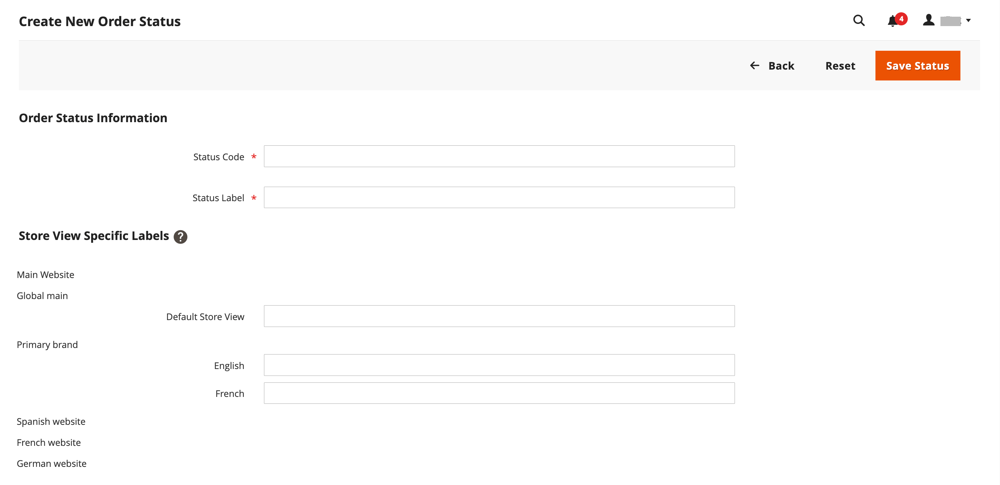

# Bestellstatus

Alle Bestellungen haben einen Bestellstatus, der einer Bühne in der Auftragsverarbeitung zugeordnet ist [workflow](order-processing.md).\
Der Unterschied zwischen Bestellstatus und Bestellstatus besteht darin, dass **[!UICONTROL order states]** programmgesteuert verwendet wird. Sie sind
für Kunden oder Admin-Benutzer sichtbar. Sie bestimmen den Ablauf einer Bestellung und welche Vorgänge für eine
in einem bestimmten Status.\
**[!UICONTROL Order statuses]** wird verwendet, um Kunden und Administratoren den Status einer Bestellung mitzuteilen.
Sie können zusätzliche Bestellstatus erstellen, die Ihren betrieblichen Anforderungen entsprechen. Bestellstatus sind für die Anzeige praktisch
Fortschritt außerhalb von Adobe Commerce, z. B. Bestellabruf und Versandfortschritt. Sie wirken sich nicht auf die Bestellung aus
Verarbeitungs-Workflow.\
Jeder Bestellstatus ist mit einem Bestellstatus verknüpft. Ihr Store verfügt über einen Satz vordefinierter Bestellstatus und
Bestellstatuseinstellungen.

{width="700" zoomable="yes"}

Der Status jeder Bestellung wird in der Spalte _Status_ des Rasters _Bestellungen_ angezeigt.

{width="700" zoomable="yes"}

>[!TIP]
>
>Eine teilweise erstattete Bestellung bleibt im Status `Processing`, bis **_alle bestellten Artikel (einschließlich erstatteter Artikel) versendet werden._** Der Bestellstatus ändert sich erst dann in `Complete`, wenn jedes Element in der Bestellung versandt wurde.

## Workflow &quot;Auftragsstatus&quot;

## Vordefinierter Status

| Bestellstatus | Status-Code |                                                                                                                                                                                                                                                                                        |
|--------------------------|----------------------------|----------------------------------------------------------------------------------------------------------------------------------------------------------------------------------------------------------------------------------------------------------------------------------------|
| Erhalten | `received` | Dieser Status ist der Anfangsstatus für Bestellungen, die platziert werden, wenn die asynchrone Bestellplatzierung aktiviert ist. |
| Verdächtiger Betrug | `fraud` | Manchmal werden Bestellungen, die über PayPal oder ein anderes Zahlungsportal bezahlt werden, als _verdächtiger Betrug_ gekennzeichnet. Dieser Status bedeutet, dass für die Bestellung keine Rechnung ausgestellt wurde und die Bestätigungs-E-Mail auch nicht gesendet wird. |
| Verarbeitung läuft | `processing` | Wenn der Status neuer Bestellungen auf &quot;Verarbeitung&quot;festgelegt ist, wird die Option _Alle Elemente automatisch aufrechnen_ in der Konfiguration verfügbar. Rechnungen werden nicht automatisch für Bestellungen erstellt, die mit der Gift Card, Store Credit, Rewards Points oder anderen Offline-Zahlungsmethoden bestellt werden. |
| Ausstehende Zahlung | `pending_payment` | Dieser Status wird verwendet, wenn die Bestellung erstellt wird und PayPal oder eine ähnliche Zahlungsmethode verwendet wird. Das bedeutet, dass der Kunde zur Payment Gateway-Website geleitet wurde, aber noch keine Rückkehrinformationen eingegangen sind. Dieser Status ändert sich, wenn der Kunde zahlt. |
| Zahlungsüberprüfung | `payment_review` | Dieser Status wird angezeigt, wenn die Überprüfung der PayPal-Zahlung aktiviert ist. |
| Ausstehend | `pending` | Dieser Status weist darauf hin, dass keine Rechnung und keine Sendungen vorgelegt wurden. |
| Halten | `holded` | Dieser Status kann nur manuell zugewiesen werden. Du kannst jede Ordnung auf Eis legen. |
| Fertig | `complete` | Dieser Status bedeutet, dass die Bestellung erstellt, bezahlt und an den Kunden versandt wird. |
| Geschlossen | `closed` | Dieser Status zeigt an, dass einer Bestellung ein Kreditmemo zugewiesen wurde und der Kunde eine Rückerstattung erhalten hat. |
| Abgebrochen | `canceled` | Dieser Status wird manuell im Admin zugewiesen oder bei einigen Zahlungstüren, wenn der Kunde nicht innerhalb der festgelegten Zeit zahlt. |
| Abgelehnt | `rejected` | Dieser Status bedeutet, dass eine Bestellung während der asynchronen Bestellverarbeitung abgelehnt wurde. Dies geschieht, wenn während der asynchronen Bestellplatzierung ein Fehler auftritt. |
| PayPal Cancelled Reversal | `paypay_canceled_reversal` | Dieser Status bedeutet, dass PayPal die Umkehrung abgebrochen hat. |
| Ausstehende PayPal | `pending_paypal` | Dieser Status bedeutet, dass die Bestellung bei PayPal eingegangen ist, die Zahlung jedoch noch nicht verarbeitet wurde. |
| PayPal umkehrt | `paypal_reversed` | Dieser Status bedeutet, dass PayPal die Transaktion rückgängig gemacht hat. |

{style="table-layout:auto"}

## Benutzerdefinierter Bestellstatus

Zusätzlich zu den voreingestellten Einstellungen für den Bestellstatus können Sie eigene benutzerdefinierte Bestellstatuseinstellungen erstellen, sie Bestellstatus zuweisen und Standardsortierungsstatus für Bestellstatus festlegen. Der Bestellstatus gibt die Position der Bestellung im Workflow zur Auftragsbearbeitung an und der Bestellstatus weist der Position der Bestellung eine aussagekräftig übersetzbare Bezeichnung zu. Beispielsweise benötigen Sie möglicherweise einen benutzerdefinierten Bestellstatus wie `packaging"`, `backordered` oder einen Status, der Ihren Anforderungen entspricht. Sie können einen beschreibenden Namen für den benutzerdefinierten Status erstellen und ihn dem zugehörigen Bestellstatus im Workflow zuweisen.

>[!NOTE]
>
>Im Bestell-Workflow werden nur die standardmäßigen benutzerdefinierten Bestellstatuswerte verwendet. Benutzerdefinierte Statuswerte, die nicht als Standard festgelegt sind, können nur im Kommentarbereich der Bestellung verwendet werden.

{width="700" zoomable="yes"}

### Benutzerdefinierten Bestellstatus erstellen

1. Wechseln Sie in der Seitenleiste _Admin_ zu **[!UICONTROL Stores]** > _[!UICONTROL Settings]_>**[!UICONTROL Order Status]**.

1. Klicken Sie in der oberen rechten Ecke auf **[!UICONTROL Create New Status]**.

   {width="600" zoomable="yes"}

1. Aktualisieren Sie den Abschnitt _[!UICONTROL Order Status Information]_:

   - Geben Sie einen &quot;**[!UICONTROL Status Code]**&quot;-Wert für die interne Referenz ein. Das erste Zeichen muss ein Buchstabe (a-z) sein, der Rest kann eine beliebige Kombination aus Buchstaben und Zahlen (0-9) sein. Verwenden Sie den Unterstrich anstelle eines Leerzeichens.

   - Geben Sie für &quot;**[!UICONTROL Status Label]**&quot;eine Beschriftung ein, mit der die Statuseinstellung sowohl in der Admin- als auch in der Storefront identifiziert wird.

1. Geben Sie im Abschnitt _[!UICONTROL Store View Specific Labels]_alle Beschriftungen ein, die für verschiedene Store-Ansichten benötigt werden.

1. Klicken Sie auf **[!UICONTROL Save Status]**.

### Zuweisen eines Bestellstatus zu einem Status

1. Klicken Sie auf der Seite _Bestellstatus_ auf **[!UICONTROL Assign Status to State]**.

   {width="600" zoomable="yes"}

1. Aktualisieren Sie den Abschnitt &quot;**[!UICONTROL Assignment Information]**&quot;, führen Sie die folgenden Schritte aus:

   - Wählen Sie die **[!UICONTROL Order Status]** aus, die Sie zuweisen möchten. Sie werden nach Statusbezeichnung aufgelistet.

   - Setzen Sie **[!UICONTROL Order State]** an die Stelle im Workflow, an die der Auftragsstatus gehört.

     >[!NOTE]
     >
     >Die Liste **_[!UICONTROL Order State]_** enthält die standardmäßig zugewiesenen Bestellstatus. Beispielsweise wird der standardmäßige Bestellstatus `Pending` anstelle des Bestellstatuswerts `New` angezeigt.

   - Um diesen Status als Standard für den Bestellstatus festzulegen, aktivieren Sie das Kontrollkästchen **[!UICONTROL Use Order Status as Default]** .

     >[!NOTE]
     >
     >Im Bestell-Workflow werden nur die standardmäßigen Bestellstatus verwendet. Nicht standardmäßige Status können nur im Abschnitt &quot;**[!UICONTROL Order Comments]**&quot;des Administrators festgelegt werden.

   - Um diesen Status in der Storefront sichtbar zu machen, aktivieren Sie das Kontrollkästchen **[!UICONTROL Visible On Storefront]** .

   {width="600" zoomable="yes"}

1. Klicken Sie auf **[!UICONTROL Save Status Assignment]**.

### Vorhandenen Bestellstatus bearbeiten

1. Öffnen Sie im Raster _[!UICONTROL Order Status]_den Statusdatensatz im Bearbeitungsmodus.

1. Aktualisieren Sie die Statuseinstellungen nach Bedarf.

1. Klicken Sie auf **[!UICONTROL Save Status]**.

### Entfernen des Bestellstatus aus einem zugewiesenen Status

>[!NOTE]
>
>Die Zuweisung einer Statuseinstellung kann von einem Status nicht aufgehoben werden, wenn der Status verwendet wird.

1. Suchen Sie im Raster _[!UICONTROL Order Status]_nach dem Datensatz mit dem Bestellstatus, der nicht zugewiesen werden soll.

1. Klicken Sie in der Spalte _[!UICONTROL Action]_ganz rechts in der Zeile auf den Link **[!UICONTROL Unassign]**.

   Oben im Arbeitsbereich wird eine Meldung angezeigt, dass die Zuweisung des Bestellstatus aufgehoben wurde. Obwohl die Bezeichnung des Bestellstatus weiterhin in der Liste angezeigt wird, wird sie keinem Status mehr zugewiesen. Die Bestellstatuseinstellungen können nicht gelöscht werden.

>[!NOTE]
>
>Wenn die Zuweisung des standardmäßigen Bestellstatus aus dem Bestellstatus aufgehoben wird, ist _**ein weiterer**_ Bestellstatus _**automatisch festgelegt**_ als Standard für diesen Bestellstatus.

## Benachrichtigung

Kunden können den Status ihrer Bestellungen über [RSS-Feed](../merchandising-promotions/social-rss.md) verfolgen, wenn der RSS-Feed &quot;Bestellung&quot;in der Konfiguration aktiviert ist. Wenn diese Option aktiviert ist, wird bei jeder Bestellung ein Link zum RSS-Feed angezeigt.

### Bestellstatusbenachrichtigung aktivieren

1. Wechseln Sie in der Seitenleiste _Admin_ zu **[!UICONTROL Stores]** > _[!UICONTROL Settings]_>**[!UICONTROL Configuration]**.

1. Erweitern Sie im linken Bedienfeld den Wert **[!UICONTROL Catalog]** und wählen Sie unter &quot;**[!UICONTROL RSS Feeds]**&quot;.

1. Erweitern Sie  im Abschnitt **[!UICONTROL Order]** .

1. Setzen Sie **[!UICONTROL Customer Order Status Notification]** auf `Enable`.

   {width="600" zoomable="yes"}

1. Klicken Sie nach Abschluss des Vorgangs auf **[!UICONTROL Save Config]**.

### E-Mail-Benachrichtigungen für neue Bestellungen konfigurieren

1. Wechseln Sie in der Seitenleiste _Admin_ zu **[!UICONTROL Stores]** > _[!UICONTROL Settings]_>**[!UICONTROL Configuration]**.

1. Erweitern Sie im linken Bedienfeld den Wert **[!UICONTROL Sales]** und wählen Sie unter &quot;**[!UICONTROL Sales Emails]**&quot;.

1. Erweitern Sie  im Abschnitt **[!UICONTROL Order]** .

   {width="600" zoomable="yes"}

1. Setzen Sie **[!UICONTROL New Order Confirmation Email Sender]** auf einen der folgenden Werte:

   - `General Contact`
   - `Sales Representative`
   - `Customer Support`
   - `Custom Email 1`
   - `Custom Email 2`

1. Wählen Sie die Vorlagen aus, die Sie für jeden Kundentyp verwenden möchten:

   - **[!UICONTROL New Order Confirmation Template]** - Wählen Sie eine Vorlage für Kunden mit einem registrierten Store-Konto.
   - **[!UICONTROL New Order Confirmation Template for Guest]** - Wählen Sie eine Vorlage für Gastkunden ohne registriertes Store-Konto.

1. Um eine andere Person (z. B. einen Business Manager) über die neue Bestellung zu informieren, geben Sie die E-Mail-Adresse in **[!UICONTROL Send Order Email Copy To]** ein.

   Sie können mehrere E-Mail-Adressen hinzufügen, wenn mehr als ein Empfänger erforderlich ist.

1. Setzen Sie den **[!UICONTROL Send Order Email Copy Method]** auf einen der folgenden Werte:

   - `Bcc` - Sowohl der Kunde als auch der zusätzliche Empfänger erhalten nur eine E-Mail zur neuen Bestellung. Der Kunde sieht jedoch nicht, dass die erhaltene E-Mail auch an den zusätzlichen Empfänger gesendet wurde.
   - `Separate Email` - Es werden zwei separate E-Mails gesendet: eine an den Empfänger und eine an den Kunden.

1. Klicken Sie nach Abschluss des Vorgangs auf **[!UICONTROL Save Config]**.
