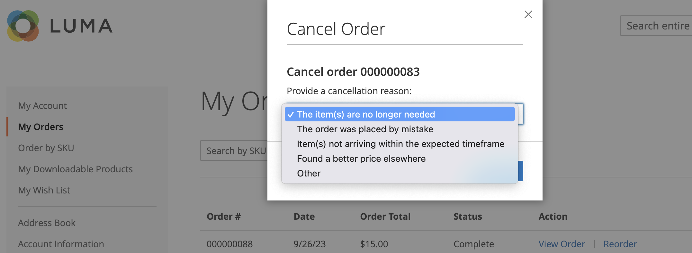

# Lagerbestellverwaltung

Kunden haben von ihrem Konto aus Zugriff auf alle ihre Bestellungen. Bestellungen können als neue Bestellungen angezeigt, gefiltert, nachverfolgt und erneut gesendet werden. Je nach Status der Bestellung können Kunden ihre Bestellungen, Rechnungen, Sendungen und Erstattungsaufzeichnungen drucken.

## Filtern von Bestellungen

{{b2b-feature}}

Ihre anfänglichen _[!UICONTROL My Orders]_-Ergebnisse enthalten auch übereinstimmende Bestellungen von untergeordneten Benutzern von allen Websites innerhalb der Commerce-Instanz. Ein Kunde, der mit einem Unternehmenskonto verknüpft ist, kann die Liste der Bestellungen filtern, um schnell Datensätze in den Ergebnissen zu finden. Um die Filteroptionen anzuzeigen, klickt der Kunde auf **[!UICONTROL Filter]**und klickt auf **[!UICONTROL Close]**, um die Filter auszublenden.

{width="700" zoomable="yes"}

| Filter | Beschreibung |
| ------ | ----------- |
| [!UICONTROL SKU or Product Name] | Fügt entweder eine SKU oder einen Produktnamen ein. |
| [!UICONTROL Order Number] | Kann entweder eine vollständige oder eine Teilbestellnummer sein. |
| [!UICONTROL Order Status] | Wählt einen Wert aus der Dropdown-Liste aus, um nach Status zu filtern. |
| [!UICONTROL Invoice Number] | Fügt entweder eine vollständige oder eine Teilrechnung ein. |
| [!UICONTROL Order Date] | Legt ein oder beide Datumsfelder fest, die nach Bestelldatum gefiltert werden sollen. |
| [!UICONTROL Created by] | Filtert Firmenbestellungen durch den Bestellersteller. |
| [!UICONTROL Order Total] | Legt die Werte min, max oder beides fest, um nach Bestellsumme zu filtern. |

## Bestellung anzeigen

Ein Kunde findet die Bestellung in der Liste und klickt auf **[!UICONTROL View Order]**. In der geöffneten Reihenfolge können sie einen der folgenden Schritte ausführen:

{width="700" zoomable="yes"}

### Kürzlich bestellte Produkte anzeigen

Der Block **[!UICONTROL Recent Orders]** wird in der Seitenleiste und auf der Seite **[!UICONTROL My Account]** für Kunden angezeigt, die nach der Bestellung angemeldet sind. Es werden fünf Produkte seit dem letzten Kauf angezeigt.

Der Kunde kann Produkte in den Warenkorb lesen, indem er die Produkte auswählt und auf **[!UICONTROL Add to Cart]** klickt. Sie können auch die letzte Bestellung anzeigen, indem sie auf **[!UICONTROL View all]** klicken, wodurch sie zur Seite _[!UICONTROL My Account]_und zum Block **[!UICONTROL Recent Orders]**weitergeleitet werden.

### Druckauftrag

1. Der Kunde klickt auf **[!UICONTROL Print Order]**.

1. Befolgt die Anweisungen im Dialogfeld Drucken , um den Druck abzuschließen.

### Druckrechnungen

1. Auf der Registerkarte **[!UICONTROL Invoices]** klickt der Kunde auf einen der folgenden Punkte:

   - **[!UICONTROL Print All Invoices]**

   - **[!UICONTROL Print Invoice]**

   {width="700" zoomable="yes"}

1. Verwendet das Dialogfeld Drucken , um den Druck abzuschließen.

### Drucksendungen

1. Auf der Registerkarte **[!UICONTROL Order Shipments]** klickt der Kunde auf einen der folgenden Punkte:

   - **[!UICONTROL Print All Shipments]**

   - **[!UICONTROL Print Shipment]**

   {width="700" zoomable="yes"}

1. Verwendet das Dialogfeld Drucken , um den Druck abzuschließen.

### Verfolgen von Sendungen

1. Klicken Sie auf der Registerkarte **[!UICONTROL Order Shipments]** auf **[!UICONTROL Track this Shipment]**.

   Alle verfügbaren Tracking-Informationen werden in einem Popup-Fenster angezeigt.

1. Wenn der Kunde bereit ist, klickt er auf **[!UICONTROL Close Window]**.

### Druckrückerstattungen

1. Auf der Registerkarte **Rückerstattungen** klickt der Kunde auf einen der folgenden Punkte:

   - **Alle Rückerstattungen drucken**

   - **Druckrückerstattungen drucken**

   {width="700" zoomable="yes"}

1. Verwendet das Dialogfeld Drucken , um den Druck abzuschließen.

Neuanordnung ist für Kunden verfügbar, wenn die Konfigurationsoption [_Neuanordnung zulassen_](reorders-allow.md) aktiviert ist.

Ein Kunde kann die Neuanordnungsfunktion für eine bestimmte Bestellung von zwei Seiten aus initiieren:

- Seite &quot;Meine Bestellungen&quot;
- Seite &quot;Auftragsansicht&quot;

## Nachbestellungen

Der Link _[!UICONTROL Reorder]_wird in der Liste mit Bestellungen in der Nähe des Links_[!UICONTROL View]_ angezeigt.

{width="700" zoomable="yes"}

**1. Fall.** Alle Produkte aus der Bestellung sind zur Neubestellung verfügbar

Der Kunde wird zum Warenkorb umgeleitet und alle Produkte werden zum Warenkorb hinzugefügt.

**2. Fall.** Einige/alle Produkte aus der Bestellung sind nicht zur Neubestellung verfügbar

>[!NOTE]
>
>Es ist möglich, `Not Visible Individually` -Produkte neu anzuordnen.

Der Link _[!UICONTROL Reorder]_wird nicht auf den Seiten_[!UICONTROL My Orders]_ und _[!UICONTROL View Order]_angezeigt.

{width="700" zoomable="yes"}

>[!TIP]
>
>Wenn der Warenkorb nicht leer ist und der Kunde auf &quot;**[!UICONTROL Reorder]**&quot;(auf der Seite &quot;[!UICONTROL My Orders]&quot;oder &quot;[!UICONTROL Order View]&quot;) klickt, bleiben die vorhandenen Produkte mit den hinzugefügten Produkten zur Neuanordnung im Warenkorb.

## Bestellungen abbrechen

Abbrechen ist für Kunden verfügbar, wenn die Konfigurationsoption [_Abbrechen zulassen_](cancel-allow.md) aktiviert ist.

Ein Kunde kann die Funktion zum Abbrechen für eine bestimmte Bestellung von drei Seiten aus initiieren:

- Seite &quot;Meine Bestellungen&quot;
- Seite &quot;Auftragsansicht&quot;
- Seite &quot;Mein Konto&quot;

Der Link _[!UICONTROL Cancel Order]_wird neben dem Link_[!UICONTROL Reorder]_ angezeigt. Wenn die Bestellung nicht storniert werden kann, wird der Link nicht angezeigt.

{width="700" zoomable="yes"}

Um den Abbruch durchzuführen, muss der Kunde:

1. Klicks **[!UICONTROL Cancel Order]**

1. Gibt einen Abbruchsgrund an

   {width="700" zoomable="yes"}

   Sie können die Löschgründe auf der Seite [_Abbrechen zulassen_](cancel-allow.md) anpassen.

1. Klicks **[!UICONTROL Confirm]**

   {width="700" zoomable="yes"}

   Nach dem Abbruch werden die Bestellungen, die den Status _[!UICONTROL Pending]_hatten, in den Status_[!UICONTROL Canceled]_ geändert, die Bestellungen, die den Status _[!UICONTROL Processing]_hatten, in den Status_[!UICONTROL Closed]_ geändert und eine Rückerstattung verarbeitet.

   Wenn die Stornierung abgeschlossen ist, wird eine E-Mail an den Kunden gesendet.

   {width="700" zoomable="yes"}

   Die Stornierungsinformationen werden dem Auftragsverlauf des Kunden hinzugefügt. Sie wird in den Notizen der Reihenfolge und im Tab Kommentar-Verlauf angezeigt.

   {width="700" zoomable="yes"}

   {width="700" zoomable="yes"}

   Wenn die Bestellung aus irgendeinem Grund in einen Status geändert wurde, der nicht storniert werden kann und der Kunde die Seite nicht aktualisiert hat, wird der Link zum Abbrechen der Bestellung weiterhin angezeigt. Wenn sie jedoch versuchen, abzubrechen, wird eine Fehlermeldung angezeigt.

   {width="700" zoomable="yes"}

   Nach dem Aktualisieren der Seite können Sie sehen, dass die Bestellung bereits abgeschlossen war. Aus diesem Grund hat die Stornierung nicht funktioniert.

   {width="700" zoomable="yes"}
