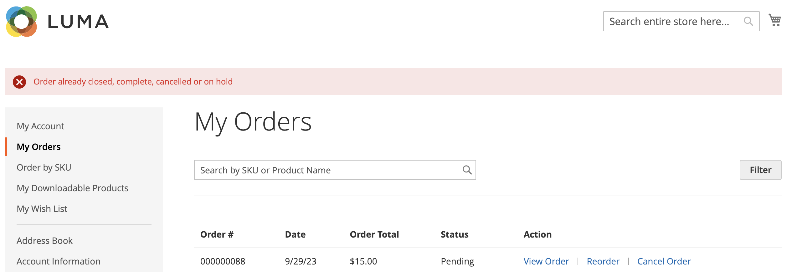

# Storefront-Bestellverwaltung

Kunden haben von ihrem Konto aus Zugriff auf alle Bestellungen. Bestellungen können als neue Bestellungen angezeigt, gefiltert, verfolgt und erneut übermittelt werden. Abhängig vom Status der Bestellung können Kunden ihre Bestellungen, Rechnungen, Lieferungen und Rückerstattungsaufzeichnungen drucken.

## Bestellungen filtern

{{b2b-feature}}

Ihre ersten _[!UICONTROL My Orders]_enthalten auch übereinstimmende Bestellungen von untergeordneten Benutzern aller Websites innerhalb der Commerce-Instanz. Ein Kunde, der einem Unternehmenskonto zugeordnet ist, kann die Auftragsliste filtern, um Datensätze in den Ergebnissen schnell zu finden. Um die Filteroptionen anzuzeigen, klickt der Kunde auf &quot;**[!UICONTROL Filter]**&quot; und auf &quot;**[!UICONTROL Close]**&quot;, um die Filter auszublenden.

{width="700" zoomable="yes"}

| Filter | Beschreibung |
| ------ | ----------- |
| [!UICONTROL SKU or Product Name] | Gibt entweder eine SKU oder einen Produktnamen ein. |
| [!UICONTROL Order Number] | Kann entweder eine vollständige oder eine Teilbestellnummer sein. |
| [!UICONTROL Order Status] | Wählt einen Wert aus dem Dropdown-Menü aus, um nach Status zu filtern. |
| [!UICONTROL Invoice Number] | Geben Sie entweder eine vollständige oder eine teilweise Rechnungsnummer ein. |
| [!UICONTROL Order Date] | Legt ein oder beide Datumsfelder fest, die nach Bestelldatum gefiltert werden sollen. |
| [!UICONTROL Created by] | Filtert Firmenbestellungen nach dem Ersteller des Auftrags. |
| [!UICONTROL Order Total] | Legt die Werte „Min.“, „Max.“ oder „Beide“ fest, die nach der Bestellsumme gefiltert werden sollen. |

## Bestellung anzeigen

Ein Kunde findet die Bestellung in der Liste und klickt auf **[!UICONTROL View Order]**. Aus der offenen Reihenfolge können sie einen der folgenden Schritte ausführen:

{width="700" zoomable="yes"}

### Kürzlich bestellte Produkte anzeigen

Der **[!UICONTROL Recent Orders]** wird in der Seitenleiste und auf der **[!UICONTROL My Account]** für Kunden angezeigt, die nach einer Bestellung angemeldet sind. Es zeigt fünf Produkte aus dem letzten Kauf an.

Der Kunde kann Produkte aus dem Warenkorb lesen, indem er die Produkte auswählt und auf **[!UICONTROL Add to Cart]** klickt. Sie können die letzte Reihenfolge auch anzeigen, indem sie auf **[!UICONTROL View all]** klicken, das zur _[!UICONTROL My Account]_Seite und zum **[!UICONTROL Recent Orders]**weiterleitet.

### Druckreihenfolge

1. Der Kunde klickt auf **[!UICONTROL Print Order]**.

1. Befolgt die Anweisungen im Dialogfeld „Drucken“, um den Druck abzuschließen.

### Rechnungen drucken

1. Auf der Registerkarte **[!UICONTROL Invoices]** klickt der Kunde auf eine der folgenden Optionen:

   - **[!UICONTROL Print All Invoices]**

   - **[!UICONTROL Print Invoice]**

   {width="700" zoomable="yes"}

1. Verwendet das Druckdialogfeld, um den Druck abzuschließen.

### Sendungen drucken

1. Auf der Registerkarte **[!UICONTROL Order Shipments]** klickt der Kunde auf eine der folgenden Optionen:

   - **[!UICONTROL Print All Shipments]**

   - **[!UICONTROL Print Shipment]**

   {width="700" zoomable="yes"}

1. Verwendet das Druckdialogfeld, um den Druck abzuschließen.

### Verfolgen einer Sendung

1. Klicken Sie auf der Registerkarte **[!UICONTROL Order Shipments]** auf **[!UICONTROL Track this Shipment]**.

   Alle verfügbaren Tracking-Informationen werden in einem Popup-Fenster angezeigt.

1. Wenn er bereit ist, klickt der Kunde auf **[!UICONTROL Close Window]**.

### Rückerstattungen drucken

1. Auf der **Rückerstattungen** klickt der Kunde auf eine der folgenden Optionen:

   - **Drucken Sie alle Rückerstattungen**

   - **Rückerstattung drucken**

   {width="700" zoomable="yes"}

1. Verwendet das Druckdialogfeld, um den Druck abzuschließen.

Neuanordnungen sind für Kunden verfügbar, wenn die Konfigurationsoption [_Neu anordnen zulassen_](reorders-allow.md) aktiviert ist.

Ein Kunde kann die Funktion zur Neuanordnung für eine bestimmte Bestellung von zwei Seiten aus starten:

- Seite Meine Bestellungen
- Seite „Bestellansicht“

## Neu anordnen

Der _[!UICONTROL Reorder]_Link wird in der Liste mit Bestellungen nahe dem_[!UICONTROL View]_ Link angezeigt.

{width="700" zoomable="yes"}

**Fall 1.** Alle Produkte aus der Bestellung können nachbestellt werden

Der Kunde wird zum Warenkorb weitergeleitet, und alle Produkte werden zum Warenkorb hinzugefügt.

**Fall 2.** Einige/alle Produkte aus der Bestellung können nicht nachbestellt werden

>[!NOTE]
>
>Es ist möglich, `Not Visible Individually` Produkte neu zu bestellen.

Der _[!UICONTROL Reorder]_Link wird nicht auf den Seiten_[!UICONTROL My Orders]_ und _[!UICONTROL View Order]_angezeigt.

{width="700" zoomable="yes"}

>[!TIP]
>
>Wenn der Warenkorb nicht leer ist und der Kunde auf **[!UICONTROL Reorder]** klickt (auf der Seite [!UICONTROL My Orders] oder [!UICONTROL Order View]), bleiben die vorhandenen Produkte im Warenkorb, wobei die hinzugefügten Produkte neu angeordnet werden.

## Bestellungen stornieren

Abbrechen ist für Kunden verfügbar, wenn die Konfigurationsoption [_Abbrechen zulassen_](cancel-allow.md) aktiviert ist.

Ein Kunde kann die Abbruchfunktion für eine bestimmte Bestellung von drei Seiten aus starten:

- Seite Meine Bestellungen
- Seite „Bestellansicht“
- Seite Mein Konto

Der _[!UICONTROL Cancel Order]_Link wird neben dem_[!UICONTROL Reorder]_ Link angezeigt. Wenn die Bestellung nicht storniert werden kann, wird der Link nicht angezeigt.

{width="700" zoomable="yes"}

Um den Abbruch durchzuführen, muss der Kunde:

1. Klicks **[!UICONTROL Cancel Order]**

1. Gibt einen Abbruchgrund an

   {width="700" zoomable="yes"}

   Sie können die Abbruchsgründe auf der Seite [_Abbrechen zulassen_](cancel-allow.md) anpassen.

1. Klicks **[!UICONTROL Confirm]**

   {width="700" zoomable="yes"}

   Nach der Stornierung werden die Bestellungen, die sich im Status _[!UICONTROL Pending]_befanden, in den Status_[!UICONTROL Canceled]_ geändert, die Bestellungen, die sich im Status _[!UICONTROL Processing]_befanden, in den Status_[!UICONTROL Closed]_ und eine Rückerstattung verarbeitet.

   Nach Abschluss der Stornierung wird eine E-Mail an den Kunden gesendet.

   {width="700" zoomable="yes"}

   Die Stornierungsinformationen werden dem Bestellverlauf des Kunden hinzugefügt. Er wird in den Notizen der Bestellung und auf der Registerkarte „Kommentar-Verlauf“ angezeigt.

   {width="700" zoomable="yes"}

   {width="700" zoomable="yes"}

   Wenn die Bestellung aus irgendeinem Grund in einen Status geändert wurde, der nicht storniert werden kann, und der Kunde die Seite nicht aktualisiert hat, wird der Link zum Stornieren der Bestellung weiterhin angezeigt. Wenn er/sie jedoch versucht, abzubrechen, wird eine Fehlermeldung angezeigt.

   {width="700" zoomable="yes"}

   Nach dem Aktualisieren der Seite können Sie sehen, dass die Bestellung bereits abgeschlossen war. Aus diesem Grund hat die Stornierung nicht funktioniert.

   {width="700" zoomable="yes"}
