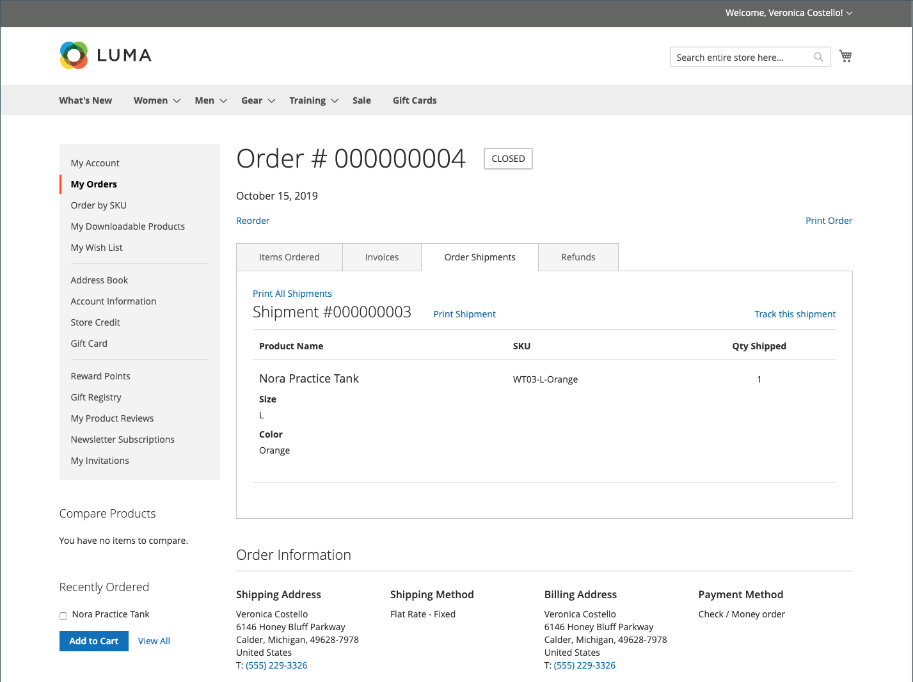
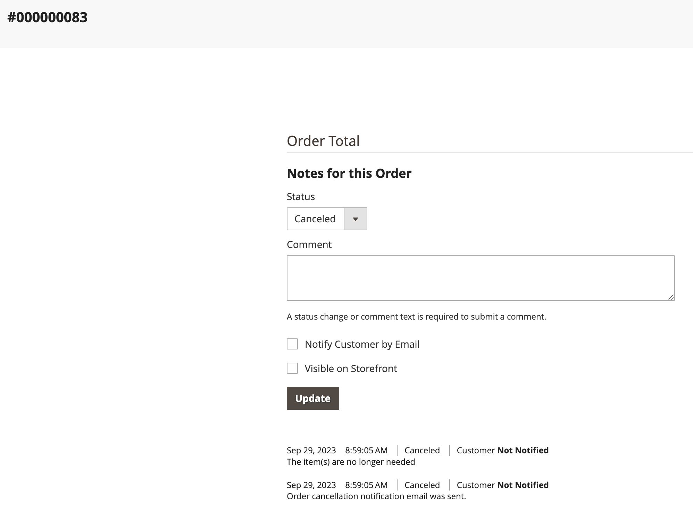

# Storefront-Bestellverwaltung

Kunden haben von ihrem Konto aus Zugriff auf alle ihre Bestellungen. Bestellungen können als neue Bestellungen angezeigt, gefiltert, verfolgt und erneut gesendet werden. Abhängig vom Status der Bestellung können Kunden ihre Bestellungen, Rechnungen, Lieferungen und Rückerstattungsaufzeichnungen drucken.

## Bestellungen filtern

{{b2b-feature}}

Ihr anfängliches _[!UICONTROL My Orders]_Die Ergebnisse enthalten auch übereinstimmende Bestellungen von untergeordneten Benutzern von allen Websites innerhalb der Commerce-Instanz. Ein Kunde, der einem Unternehmenskonto zugeordnet ist, kann die Auftragsliste filtern, um Datensätze in den Ergebnissen schnell zu finden. Um die Filteroptionen anzuzeigen, klickt der Kunde **[!UICONTROL Filter]**und Klicks **[!UICONTROL Close]**, um die Filter auszublenden.

{width="700" zoomable="yes"}

| Filter | Beschreibung |
| ------ | ----------- |
| [!UICONTROL SKU or Product Name] | Gibt entweder eine SKU oder einen Produktnamen ein. |
| [!UICONTROL Order Number] | Kann entweder eine vollständige oder eine Teilbestellnummer sein. |
| [!UICONTROL Order Status] | Wählt einen Wert aus dem Dropdown-Menü aus, um nach Status zu filtern. |
| [!UICONTROL Invoice Number] | Geben Sie entweder eine vollständige oder eine Teilrechnungsnummer ein. |
| [!UICONTROL Order Date] | Legt ein oder beide Datumsfelder fest, die nach Bestelldatum gefiltert werden sollen. |
| [!UICONTROL Created by] | Filtert Firmenbestellungen nach dem Ersteller der Bestellung. |
| [!UICONTROL Order Total] | Legt die Werte „Min.„, „Max.“ oder „Beide“ fest, die nach Bestellsumme gefiltert werden sollen. |

## Bestellung anzeigen

Ein Kunde findet die Bestellung in der Liste und klickt **[!UICONTROL View Order]**. Aus der offenen Reihenfolge können sie einen der folgenden Schritte ausführen:

{width="700" zoomable="yes"}

### Kürzlich bestellte Produkte anzeigen

Die **[!UICONTROL Recent Orders]** -Block in der Seitenleiste und auf der **[!UICONTROL My Account]** -Seite für Kunden, die nach einer Bestellung angemeldet sind. Es zeigt fünf Produkte aus dem letzten Kauf.

Der Kunde kann Produkte aus dem Warenkorb lesen, indem er die Produkte auswählt und auf Folgendes klickt **[!UICONTROL Add to Cart]**. Sie können auch die letzte Bestellung anzeigen, indem sie klicken **[!UICONTROL View all]**, der zu umleitet _[!UICONTROL My Account]_und die **[!UICONTROL Recent Orders]**Block.

### Druckreihenfolge

1. Der Kunde klickt **[!UICONTROL Print Order]**.

1. Befolgt die Anweisungen im Dialogfeld „Drucken„, um den Druck abzuschließen.

### Rechnungen drucken

1. Auf der **[!UICONTROL Invoices]** Klicken Sie auf eine der folgenden Optionen:

   - **[!UICONTROL Print All Invoices]**

   - **[!UICONTROL Print Invoice]**

   {width="700" zoomable="yes"}

1. Verwendet das Druckdialogfeld, um den Druck abzuschließen.

### Sendungen drucken

1. Auf der **[!UICONTROL Order Shipments]** Klicken Sie auf eine der folgenden Optionen:

   - **[!UICONTROL Print All Shipments]**

   - **[!UICONTROL Print Shipment]**

   {width="700" zoomable="yes"}

1. Verwendet das Druckdialogfeld, um den Druck abzuschließen.

### Verfolgen einer Sendung

1. Auf der **[!UICONTROL Order Shipments]** klicken Sie auf die Registerkarte **[!UICONTROL Track this Shipment]**.

   Alle verfügbaren Tracking-Informationen werden in einem Popup-Fenster angezeigt.

1. Wenn der Kunde bereit ist, klickt er auf **[!UICONTROL Close Window]**.

### Rückerstattungen drucken

1. Auf der **Erstattungen** Klicken Sie auf eine der folgenden Optionen:

   - **Alle Erstattungen drucken**

   - **Rückerstattung drucken**

   {width="700" zoomable="yes"}

1. Verwendet das Druckdialogfeld, um den Druck abzuschließen.

Neubestellungen sind für Kunden verfügbar, wenn die [_Neuanordnung zulassen_](reorders-allow.md) Die Konfigurationsoption ist aktiviert.

Ein Kunde kann die Neuanordnung einer bestimmten Bestellung von zwei Seiten aus starten:

- Seite Meine Bestellungen
- Seite „Bestellansicht“

## Neu anordnen

Die _[!UICONTROL Reorder]_Der Link wird in der Liste mit Bestellungen in der Nähe der_[!UICONTROL View]_ -Link.

{width="700" zoomable="yes"}

**Fall 1.** Alle Produkte aus der Bestellung können nachbestellt werden

Der Kunde wird zum Warenkorb weitergeleitet, und alle Produkte werden zum Warenkorb hinzugefügt.

**Fall 2.** Einige/alle Produkte aus der Bestellung können nicht nachbestellt werden

>[!NOTE]
>
>Es ist möglich, neu anzuordnen `Not Visible Individually` Produkte.

Die _[!UICONTROL Reorder]_Link wird nicht auf der Seite angezeigt_[!UICONTROL My Orders]_ und _[!UICONTROL View Order]_Seiten.

{width="700" zoomable="yes"}

>[!TIP]
>
>Wenn der Warenkorb nicht leer ist und der Kunde klickt **[!UICONTROL Reorder]** (vom [!UICONTROL My Orders] oder [!UICONTROL Order View] ), bleiben die vorhandenen Produkte im Warenkorb und können neu bestellt werden.

## Bestellungen stornieren

Abbrechen ist für Kunden verfügbar, wenn [_Abbrechen zulassen_](cancel-allow.md) Die Konfigurationsoption ist aktiviert.

Ein Kunde kann die Abbruchfunktion für eine bestimmte Bestellung von drei Seiten aus starten:

- Seite Meine Bestellungen
- Seite „Bestellansicht“
- Seite Mein Konto

Die _[!UICONTROL Cancel Order]_Der Link wird in der Nähe der_[!UICONTROL Reorder]_ -Link. Wenn die Bestellung nicht storniert werden kann, wird der Link nicht angezeigt.

{width="700" zoomable="yes"}

Um den Abbruch durchzuführen, muss der Kunde:

1. Klicks **[!UICONTROL Cancel Order]**

1. Gibt einen Abbruchgrund an

   {width="700" zoomable="yes"}

   Sie können die Abbruchgründe für das [_Abbrechen zulassen_](cancel-allow.md) Seite.

1. Klicks **[!UICONTROL Confirm]**

   {width="700" zoomable="yes"}

   Nach der Stornierung waren die Bestellungen in _[!UICONTROL Pending]_Status, ändern in_[!UICONTROL Canceled]_ Status, die Bestellungen, in denen _[!UICONTROL Processing]_Status, ändern in_[!UICONTROL Closed]_ Status und eine Rückerstattung werden bearbeitet.

   Nach Abschluss der Stornierung wird eine E-Mail an den Kunden gesendet.

   {width="700" zoomable="yes"}

   Die Stornierungsinformationen werden dem Auftragsverlauf des Kunden hinzugefügt. Er wird in den Anmerkungen der Bestellung und auf der Registerkarte „Kommentarverlauf“ angezeigt.

   {width="700" zoomable="yes"}

   {width="700" zoomable="yes"}

   Wenn die Bestellung aus irgendeinem Grund in einen Status geändert wurde, der nicht storniert werden kann, und der Kunde die Seite nicht aktualisiert hat, wird der Link zum Stornieren der Bestellung weiterhin angezeigt. Wenn der/die Benutzende jedoch versucht, den Vorgang abzubrechen, wird eine Fehlermeldung angezeigt.

   {width="700" zoomable="yes"}

   Nach dem Aktualisieren der Seite können Sie sehen, dass die Bestellung bereits abgeschlossen war. Aus diesem Grund hat die Stornierung nicht funktioniert.

   {width="700" zoomable="yes"}
