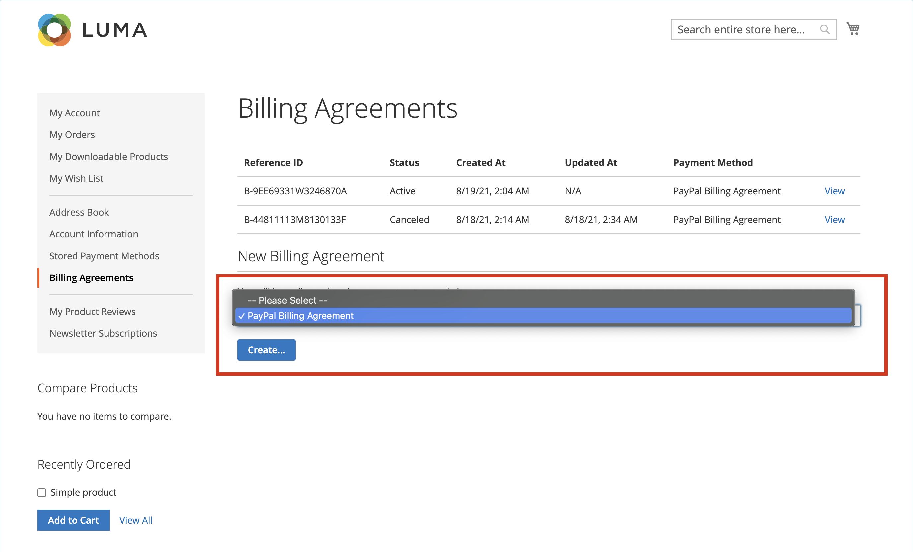

# PayPal-Abrechnungsvereinbarungen

Um den Checkout-Prozess zu vereinfachen, können Kunden einen Abrechnungsvertrag mit PayPal als Zahlungsdienstleister abschließen. Beim Checkout wählt der Kunde als Zahlungsmethode die Abrechnungsvereinbarung aus. Das Zahlungssystem überprüft die Abrechnungsvereinbarung anhand ihrer eindeutigen Nummer und belastet das Kundenkonto. Mit einer bestehenden Abrechnungsvereinbarung ist es nicht mehr erforderlich, dass der Kunde Zahlungsinformationen für jeden Kauf eingibt. Kunden können ihre Abrechnungsvereinbarungen über das Dashboard ihres Kundenkontos verwalten, wobei der Status jeder als _Aktiv_ oder _Abgebrochen_ angezeigt wird. Wenn ein Abrechnungsvertrag gekündigt wird, kann er nicht erneut aktiviert werden.

## Workflow für Abrechnungsvereinbarung

1. **Der Kunde meldet sich für eine Abrechnungsvereinbarung**. Nach Abschluss eines Abrechnungsvertrags können zusätzliche Abrechnungsvereinbarungen nur über das Kundenkonto hinzugefügt werden. Die Anzahl der Abrechnungsvereinbarungen, die ein Kunde erstellen kann, ist unbegrenzt. Kunden können eine der folgenden Methoden verwenden, um sich für Abrechnungsvereinbarungen zu registrieren:

   - **Im Kundenkonto anmelden** - Kunden können sich über ihre Kundenkonten für eine Abrechnungsvereinbarung anmelden.
   - **An der Kasse anmelden** - Kunden, die für einen Kauf mit PayPal Express Checkout bezahlen, können ein Kontrollkästchen markieren, um einen Abrechnungsvertrag zu erstellen. Obwohl die Abrechnungsvereinbarung für die aktuelle Bestellung nicht verwendet wird, wird sie bei der nächsten Bestellung durch den Kunden als Zahlungsmethode verfügbar.
   - **Vom Store-Administrator registrieren** - Auf Kundenwunsch kann der Store-Administrator einen Kundenauftrag mithilfe der Kunden-Abrechnungsvereinbarung erstellen.

1. **PayPal überprüft und zeichnet Vereinbarung auf**. Wenn der Kunde die Bestellung mit Zahlung per Abrechnungsvertrag aufgibt, werden die Abrechnungsvertrags-Referenz-ID und die Zahlungsdetails des Kundenauftrags an PayPal übertragen und zusammen mit Referenzinformationen auf dem Kundenkonto erfasst. Wenn die Zahlung autorisiert ist, wird eine Bestellung in Commerce erstellt. Die Referenzkennung des Abrechnungsvertrags wird an den Kunden und das Geschäft gesendet.

## Abrechnungsvereinbarungen verwalten

Auf der Seite _[!UICONTROL Billing Agreements]_werden alle Abrechnungsvereinbarungen zwischen Ihrem Geschäft und seinen Kunden aufgelistet. Händler können die Datensätze nach dem Kunden oder den Rechnungsvereinbarungsinformationen filtern, einschließlich Rechnungsvereinbarungs-Referenz-ID, Status und Erstellungsdatum. Jeder Datensatz enthält allgemeine Informationen zum Abrechnungsvertrag und zu allen Aufträgen, die ihn als Zahlungsmethode verwendet haben. Sie können Kunden-Abrechnungsvereinbarungen anzeigen, stornieren oder löschen. Eine stornierte Abrechnungsvereinbarung kann nur vom Store-Administrator gelöscht werden.

### Rechnungsvereinbarung anzeigen

1. Navigieren Sie in _Admin_-Seitenleiste zu **[!UICONTROL Sales]** > _[!UICONTROL Operations]_>**[!UICONTROL Billing Agreements]**.

1. Suchen Sie die Abrechnungsvereinbarung in der Liste und klicken Sie darauf, um sie zu öffnen.

Jede Seite eines Abrechnungsvertrags besteht aus zwei Registerkarten: _[!UICONTROL General Information]_und_[!UICONTROL Related Orders]_.

#### Allgemeine Informationen

Diese Registerkarte enthält allgemeine Informationen zum Abrechnungsvertrag:

- [!UICONTROL Reference ID]: Eine eindeutige numerische Kennung, die der aktuellen Abrechnungsvereinbarung zugewiesen ist.
- [!UICONTROL Customer]: Konto des Kunden, das dem aktuellen Abrechnungsvertrag zugewiesen ist.
- [!UICONTROL Status]: Status der Zahlungsvereinbarung.
- [!UICONTROL Created At]: Erstellungsdatum.
- [!UICONTROL Updated At]: Aktualisierungsdatum.

{width="600" zoomable="yes"}

#### Verwandte Bestellungen

Auf dieser Registerkarte wird die Liste der Bestellungen angezeigt, die unter Verwendung der aktuellen Abrechnungsvereinbarung aufgegeben wurden.

{width="600" zoomable="yes"}

### Abrechnungsvereinbarung stornieren

1. Navigieren Sie in _Admin_-Seitenleiste zu **[!UICONTROL Sales]** > _[!UICONTROL Operations]_>**[!UICONTROL Billing Agreements]**.

1. Suchen Sie die Abrechnungsvereinbarung in der Liste und klicken Sie darauf, um sie zu öffnen.

1. Klicken Sie oben rechts auf **[!UICONTROL Cancel]**.

1. Um die Aktion zu bestätigen, klicken Sie auf **[!UICONTROL OK]**.

### Löschen einer Abrechnungsvereinbarung

1. Navigieren Sie in _Admin_-Seitenleiste zu **[!UICONTROL Sales]** > _[!UICONTROL Operations]_>**[!UICONTROL Billing Agreements]**.

1. Suchen Sie die Abrechnungsvereinbarung in der Liste und klicken Sie darauf, um sie zu öffnen.

1. Klicken Sie oben rechts auf **[!UICONTROL Delete]**.

1. Um die Aktion zu bestätigen, klicken Sie auf **[!UICONTROL OK]**.

### Spaltenbeschreibungen

| Spalte | Beschreibung |
|--- |--- |
| [!UICONTROL ID] | Eine eindeutige numerische Kennung, die jeder Abrechnungsvereinbarung zugewiesen ist |
| [!UICONTROL Email] | Kontakt-E-Mail eines Kunden |
| [!UICONTROL First Name] | Vorname eines Kunden |
| [!UICONTROL Last Name] | Nachname eines Kunden |
| [!UICONTROL Reference ID] | Eine eindeutige numerische Referenzkennung, die jedem Abrechnungsvertrag zugewiesen wird |
| [!UICONTROL Status] | Status der Zahlungsvereinbarung. Optionen: `Active` oder `Canceled` |
| [!UICONTROL Created] | Erstellungsdatum |
| [!UICONTROL Updated] | Aktualisierungsdatum |

{style="table-layout:auto"}

## Storefront-Erlebnis

Kunden, die mit einem Zahlungsdienstleister einen Abrechnungsvertrag abschließen, können jetzt Einkäufe tätigen und später entsprechend dem Vertrag bezahlen. Die

{width="700" zoomable="yes"}

| Spalte | Beschreibung |
|--- |--- |
| [!UICONTROL Reference ID] | Eine eindeutige numerische Referenzkennung, die jedem Abrechnungsvertrag zugewiesen wird |
| [!UICONTROL Status] | Status der Zahlungsvereinbarung. Optionen: `Active` oder `Canceled` |
| [!UICONTROL Created At] | Erstellungsdatum |
| [!UICONTROL Updated At] | Aktualisierungsdatum |
| [!UICONTROL Payment Method] | Ein Zahlungsdienstleister einer Abrechnungsvereinbarung |
| [!UICONTROL View] | Schaltfläche zum Anzeigen von Abrechnungsvereinbarungen |

{style="table-layout:auto"}

### Erstellen einer Abrechnungsvereinbarung

1. Der Kunde wählt im Konto-Dashboard **[!UICONTROL Billing Agreements]** aus.

1. Wählen Sie unter **[!UICONTROL New Billing Agreement]** einen Zahlungsanbieter aus.

1. Klicken Sie auf **[!UICONTROL Create]**.

Diese Aktion leitet den Kunden zur Zahlungssystem-Website weiter.

{width="700" zoomable="yes"}

### Rechnungsvereinbarung anzeigen

1. Der Kunde wählt im Konto-Dashboard **[!UICONTROL Billing Agreements]** aus.

1. Wählt die Abrechnungsvereinbarung aus und klickt auf **[!UICONTROL View]**.

{width="700" zoomable="yes"}

### Abrechnungsvereinbarung stornieren

1. Der Kunde wählt im Konto-Dashboard **[!UICONTROL Billing Agreements]** aus.

1. Wählt die Abrechnungsvereinbarung aus und klickt auf **[!UICONTROL View]**.

1. Klicken Sie oben rechts auf **[!UICONTROL Cancel]** und dann auf **[!UICONTROL OK]** zur Bestätigung.

>[!NOTE]
>
>Wenn ein Administrator (Händler) die Abrechnungsvereinbarung kündigt, kann diese nicht in der Storefront gekündigt werden. Der _Abgebrochen_ wird für diese Vereinbarung angezeigt.
