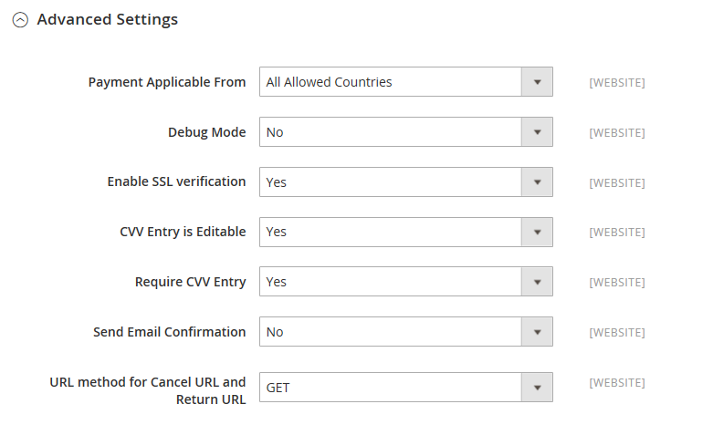

# PayPal-Payflow-Link

PayPal Payflow Link ist nur für Händler in den USA und Kanada verfügbar. Kunden müssen kein persönliches PayPal-Konto haben und ihre Kreditkarteninformationen in einem Formular eingeben, das von PayPal gehostet wird. Die Informationen werden niemals auf Ihrem Adobe Commerce- oder Magento Open Source-Server gespeichert. Der Payflow-Link kann nicht für Bestellungen verwendet werden, die vom Administrator erstellt wurden.

Gutschriften werden sowohl für Online- als auch für Offline-Rückerstattungen unterstützt. Mehrere Online-Erstattungen werden jedoch nicht unterstützt.

>[!IMPORTANT]
>
>**PSD2-Anforderungen:**  
>Ab dem 14. September 2019 können europäische Banken Zahlungen ablehnen, die [PSD2&rbrace;-](../getting-started/compliance-payment-services-directive.md) nicht erfüllen. Um PSD2 zu erfüllen, muss PayPal Payflow Link mit Cardinal Commerce integriert sein. Weitere Informationen finden Sie unter [3-D Secure for Payflow](https://developer.paypal.com/api/nvp-soap/payflow/3d-secure-overview/).

## Anforderungen

- [PayPal Business Account][1] Das PayPal Payflow Pro Gateway verbindet das Händlerkonto bei PayPal mit der Händlerwebsite und fungiert sowohl als Gateway als auch als Händlerkonto.

- Wenn Sie mehrere Commerce-Websites verwalten, müssen Sie für jede Website über ein separates PayPal-Händlerkonto verfügen.

## Kunden-Workflow

1. **Der Kunde geht zur Kasse** - Während der Kasse bezahlt der Kunde über den PayPal Payflow Link und gibt die Kreditkarteninformationen ein. Der Kunde muss kein persönliches PayPal-Konto haben.
1. **Kunde wählt Jetzt bezahlen** - Der Kunde klickt auf die Schaltfläche „Jetzt bezahlen“, um die Bestellung abzusenden.
1. **Kunde gibt Kreditkarteninformationen ein** - Der Kunde gibt die Kreditkarteninformationen in ein Formular ein, das von PayPal gehostet wird. Wenn der Kunde auf den Link _Zahlung abbrechen_ klickt, kehrt der Kunde zum Schritt „Zahlungsinformationen“ des Checkouts zurück und der Bestellstatus ändert sich in _Abgebrochen_.
1. **Der Kunde sendet die Bestellung** - Die Kreditkarteninformationen werden direkt an PayPal übermittelt und nirgends auf der Commerce-Website gespeichert.

## Auftrags-Workflow

1. **PayPal erhält Anfrage** - PayPal erhält die Anfrage vom Kunden, jetzt zu bezahlen.
1. **PayPal überprüft die Zahlungsinformationen** - PayPal überprüft die Kreditkarteninformationen und weist den entsprechenden Status zu:
   - **Zahlung verifiziert:** Wenn verifiziert, wird der Status _Ausstehende Zahlung_ dem Auftrag zunächst zugewiesen, bis die Transaktion abgewickelt ist.
   - **Verarbeitung** - Die Transaktion war erfolgreich.
   - **Zahlung ausstehend** - Das System hat keine Antwort von PayPal erhalten.
   - **Abgebrochen** - Die Transaktion war aus irgendeinem Grund nicht erfolgreich.
   - **Betrugsverdacht** - Bei der Transaktion wurden einige der „PayPal[Betrugsfilter“ &#x200B;](paypal.md#paypal-fraud-management-filters). Das System erhält die Antwort von PayPal, dass die Transaktion von Fraud Service überprüft wird.
   - **Zahlung abbrechen:** Wenn der Kunde auf den Link _Zahlung abbrechen_ klickt, kehrt der Kunde zum Schritt „Zahlungsinformationen“ des Checkouts zurück und der Bestellstatus ändert sich in _Abgebrochen_.
1. **Kunde wird zur Bestätigungsseite weitergeleitet** - Wenn die Transaktion erfolgreich abgeschlossen wurde, wird der Kunde zur Bestellbestätigungsseite in Ihrem Geschäft weitergeleitet. Wenn die Transaktion aus irgendeinem Grund fehlschlägt, wird auf der Kaufbestätigungsseite eine Fehlermeldung angezeigt und der Kunde wird aufgefordert, den Kaufvorgang zu wiederholen. Diese Situationen werden von PayPal verwaltet.
1. **Händler erfüllt Bestellung** - Der Händler stellt Rechnungen aus und versendet die Bestellung wie gewohnt.

## Konfigurieren Ihres PayPal-Kontos

1. Melden Sie sich bei Ihrem [PayPal-Geschäftskonto][2] an.

1. Konfigurieren Sie die [gehosteten Checkout][4]Seiten mithilfe von PayPal Manager mit den folgenden Einstellungen:

   - Füllen Sie unter **[!UICONTROL Security Options]** die folgenden Einstellungen aus:

     **[!UICONTROL AVS]**: `No`

     **[!UICONTROL CSC]**: `No`

     **[!UICONTROL Enable Secure Token]**: `Yes`

   - Wählen Sie **[!UICONTROL Customize]** und dann **[!UICONTROL Layout C]** aus.

     Layout C zeigt nur Kredit- und Debitkartenfelder an und kann entweder auf der Site umrahmt oder als eigenständiges Popup verwendet werden. Die Größe ist auf 490 x 565 Pixel festgelegt, mit zusätzlichem Platz für Fehlermeldungen. Auf einigen Systemen wird durch diese Einstellung ein Problem mit transparenter Umleitung behoben.

1. Wenn die Konfigurationseinstellungen abgeschlossen sind, klicken Sie auf **[!UICONTROL Save and Publish]**.

1. Einrichten eines zusätzlichen Benutzers (empfohlen von PayPal):

   - Klicken Sie in der zweiten Zeile des Hauptmenüs auf **[!UICONTROL Manage Users]**.

   - Um einen weiteren Benutzer zum Konto hinzuzufügen, klicken Sie auf **[!UICONTROL Add User]**.

   - Füllen Sie die erforderlichen Felder in den folgenden Abschnitten des Formulars _Benutzer hinzufügen_ aus:

      - [!UICONTROL Admin Confirmation]
      - [!UICONTROL User Information]
      - [!UICONTROL User Login Information]
      - [!UICONTROL Assign Privilege to User]

   - Klicken Sie auf **[!UICONTROL Update]**.

## PayPal-Payflow-Link einrichten

>[!TIP]
>
>Klicken Sie jederzeit auf **[!UICONTROL Save Config]** , um Ihren Fortschritt zu speichern.

### Schritt 1: Starten der Konfiguration

Bei dieser Einrichtungsmethode wird davon ausgegangen, dass Sie über ein vorhandenes PayPal-Konto verfügen.

1. Navigieren Sie in _Admin_-Seitenleiste zu **[!UICONTROL Stores]** > _[!UICONTROL Settings]_>**[!UICONTROL Configuration]**.

1. Erweitern Sie im linken Bereich **[!UICONTROL Sales]** und wählen Sie **[!UICONTROL Payment Methods]**.

1. Wenn Ihre Commerce-Installation über mehrere Websites, Stores oder Ansichten verfügt, legen Sie **[!UICONTROL Store View]** auf die Store-Ansicht fest, in der Sie diese Konfiguration anwenden möchten.

1. Wählen Sie im Abschnitt _[!UICONTROL Merchant Location]_&#x200B;die **[!UICONTROL Merchant Country]**&#x200B;aus, in der sich Ihr Unternehmen befindet.

   Diese Einstellung bestimmt die Auswahl der PayPal-Lösungen, die in der Konfiguration angezeigt werden.

   {width="600" zoomable="yes"}

1. Erweitern Sie **[!UICONTROL PayPal Payment Gateways]** (falls erforderlich) und klicken Sie zum **[!UICONTROL Payflow Link]** auf **[!UICONTROL Configure]** .

   {width="600" zoomable="yes"}

### Schritt 2: Die erforderlichen PayPal-Einstellungen vornehmen

{width="600" zoomable="yes"}

1. (Optional) Geben Sie die **[!UICONTROL Email Associated with your PayPal Merchant Account]** ein.

   >[!IMPORTANT]
   >
   >Bei E-Mail-Adressen wird zwischen Groß- und Kleinschreibung unterschieden. Um die Zahlung zu erhalten, muss die E-Mail-Adresse mit der E-Mail-Adresse übereinstimmen, die in Ihrem PayPal-Händlerkonto angegeben ist.

1. Geben Sie eine der folgenden Anmeldedaten ein, mit denen Sie sich bei Ihrem PayPal-Händlerkonto anmelden:

   - **[!UICONTROL Partner]** - Ihre PayPal Partner ID.
   - **[!UICONTROL User]** - Die ID eines anderen Benutzers, der auf Ihrem PayPal-Konto eingerichtet ist.
   - **[!UICONTROL Vendor]** - Ihr PayPal-Benutzername.

1. Geben Sie die **[!UICONTROL Password]** ein, die Ihrem PayPal-Konto zugeordnet ist.

1. Um Testtransaktionen auszuführen, setzen Sie **[!UICONTROL Test Mode]** auf `Yes`.

   Verwenden Sie beim Testen der Konfiguration in einer Sandbox nur [Kreditkartennummern][3] die von PayPal empfohlen werden. Wenn Sie bereit sind, zur Produktion zu wechseln, kehren Sie zur Konfiguration zurück und setzen Sie den Testmodus auf `No`.

1. Wenn Ihr System einen Proxy-Server verwendet, um die Verbindung zum PayPal-System herzustellen, setzen Sie **[!UICONTROL Test Mode]** auf `Yes` und gehen Sie folgendermaßen vor:

   - Geben Sie die IP-Adresse der **[!UICONTROL Proxy Host]** ein.

   - Geben Sie die Port-Nummer des **[!UICONTROL Proxy Port]** ein.

     Ein Proxy wird verwendet, wenn die Server-Firewall den direkten Zugriff auf den PayPal-Server verhindert. In einem solchen Fall wird ein Drittanbieterserver verwendet, um Traffic weiterzuleiten.

1. Legen Sie **[!UICONTROL Enable Payflow Link]** auf `Yes` fest.

1. Wenn Sie Optionen für den [PayPal Express-Checkout](paypal-express-checkout.md) für Kunden aktivieren möchten, setzen Sie **[!UICONTROL Enable Express Checkout]** auf `Yes`.

1. Wenn Sie Ihren Kunden [PayPal-Guthaben](paypal.md#paypal-credit-and-pay-later) anbieten möchten, setzen Sie **[!UICONTROL Enable PayPal Credit]** auf `Yes`.

### Schritt 3: Einrichten von Advertise PayPal Credit / Advertise PayPal PayLater (optional)

Ab Version 2.4.3 wird PayPal Later in Bereitstellungen unterstützt, die PayPal enthalten. Mit dieser Funktion können Käufer eine Bestellung in zweiwöchentlichen Raten bezahlen, anstatt den vollen Betrag zum Zeitpunkt des Kaufs zu bezahlen. Das PayPal-Krediterlebnis ist veraltet.

Legen Sie **[!UICONTROL Enable PayPal PayLater Experience]** auf eine der folgenden Einstellungen fest:

- `Yes` - Einrichten von Advertise PayPal PayLater
- `No` - Einrichten von Advertise PayPal-Guthaben

#### PayPal-Guthaben ankündigen

1. Erweitern Sie  den Abschnitt **[!UICONTROL Advertise PayPal Credit]** .

   {width="600" zoomable="yes"}

1. Um Ihre Kontoinformationen zu erhalten, klicken Sie auf **[!UICONTROL Get Publisher ID from PayPal]** und folgen Sie den Anweisungen.

1. Geben Sie Ihre **[!UICONTROL Publisher ID]** ein.

1. Erweitern Sie  den Abschnitt **[!UICONTROL Home Page]** .

   {width="600" zoomable="yes"}

1. Um ein Banner auf der Seite zu platzieren, setzen Sie **[!UICONTROL Display]** auf `Yes`.

1. Legen Sie **[!UICONTROL Position]** auf eine der folgenden Einstellungen fest:

   - `Header (center)`
   - `Sidebar (right)`

1. Legen Sie **[!UICONTROL Size]** auf eine der folgenden Einstellungen fest:

   - `190 x 100`
   - `234 x 60`
   - `300 x 50`
   - `468 x 60`
   - `728 x 90`
   - `800 x 66`

1. Erweitern Sie  die verbleibenden Abschnitte und wiederholen Sie die vorherigen Schritte für die Konfiguration der Startseite:

   - **[!UICONTROL Catalog Category Page]**
   - **[!UICONTROL Catalog Product Page]**
   - **[!UICONTROL Checkout Cart Page]**

#### Werbung für PayPal PayLater

1. Erweitern Sie  den Abschnitt **[!UICONTROL Advertise PayPal PayLater]** .

1. Legen Sie **[!UICONTROL Enable PayPal PayLater]** auf `Yes` fest.

1. Erweitern Sie  den Abschnitt **[!UICONTROL Home Page]** .

   {width="600" zoomable="yes"}

1. Um ein Banner auf der Seite zu platzieren, setzen Sie **[!UICONTROL Display]** auf `Yes`.

1. Legen Sie **[!UICONTROL Position]** auf eine der folgenden Einstellungen fest:

   - `Header (center)`
   - `Sidebar`

1. Legen Sie **[!UICONTROL Style Layout]** auf eine der folgenden Einstellungen fest:

   - `Text`
   - `Flex`

1. Legen Sie **[!UICONTROL Logo Type]** nur für [!UICONTROL Style Layout] **[!UICONTROL Text]** auf eine der folgenden Einstellungen fest:

   - `Primary`
   - `Alternative`
   - `Inline`
   - `None`

1. Legen Sie **[!UICONTROL Logo Position]** nur für [!UICONTROL Style Layout] **[!UICONTROL Text]** auf eine der folgenden Einstellungen fest:

   - `Left`
   - `Right`
   - `Top`

1. Legen Sie **[!UICONTROL Text Color]** nur für [!UICONTROL Style Layout] **[!UICONTROL Text]** auf eine der folgenden Einstellungen fest:

   - `Black`
   - `White`
   - `Monochrome`
   - `Grayscale`

1. Legen Sie **[!UICONTROL Text Size]** nur für [!UICONTROL Style Layout] **[!UICONTROL Text]** auf eine der folgenden Einstellungen fest:

   - `10px`
   - `11px`
   - `12px`
   - `13px`
   - `14px`
   - `15px`
   - `16px`

1. Legen Sie **[!UICONTROL Ratio]** nur für [!UICONTROL Style Layout] **[!UICONTROL Flex]** auf eine der folgenden Einstellungen fest:

   - `1x1`
   - `1x4`
   - `8x1`
   - `20x1`

1. Legen Sie **[!UICONTROL Color]** nur für [!UICONTROL Style Layout] **[!UICONTROL Flex]** auf eine der folgenden Einstellungen fest:

   - `Blue`
   - `Black`
   - `White`
   - `White No Border`
   - `Gray`
   - `Monochrome`
   - `Grayscale`

1. Erweitern Sie  die restlichen Abschnitte und wiederholen Sie die vorherigen Schritte:

   - **[!UICONTROL Catalog Product Page]**
   - **[!UICONTROL Checkout Cart Page]**
   - **[!UICONTROL Checkout Payment Step]**
   - **[!UICONTROL Catalog Category Page]**

### Schritt 4: Vervollständigen Sie die Grundeinstellungen

1. Erweitern Sie  den Abschnitt **[!UICONTROL Basic Settings - PayPal Payflow Link]** .

   {width="600" zoomable="yes"}

1. Geben Sie **[!UICONTROL Title]** einen Titel ein, der den PayPal-Payflow-Link während des Checkouts identifiziert.

   Es wird empfohlen, den Titel _Debit- oder Kreditkarte_ zu verwenden.

1. Wenn Sie mehrere Zahlungsmethoden anbieten, geben Sie eine Zahl für **[!UICONTROL Sort Order]** ein, um die Reihenfolge zu bestimmen, in der der Payflow-Link angezeigt wird, wenn er mit den anderen Zahlungsmethoden aufgelistet wird.

   Diese Zahl steht im Verhältnis zu den anderen Zahlungsmethoden. (`0` = First, `1` = Second, `2` = Third usw.)

1. Legen Sie **[!UICONTROL Payment Action]** auf eine der folgenden Einstellungen fest:

   - `Authorization` - Genehmigt den Kauf und legt die Mittel fest. Der Betrag wird erst abgehoben, wenn er vom Händler eingezogen wurde.
   - `Sale` - Der Betrag des Kaufs wird autorisiert und sofort vom Konto des Kunden zurückgezogen.

### Schritt 5: Erweiterte Einstellungen abschließen

1. Erweitern Sie  den Abschnitt **[!UICONTROL Advanced Settings]** .

   {width="600" zoomable="yes"}

1. Legen Sie **[!UICONTROL Payment Applicable From]** auf eine der folgenden Einstellungen fest:

   - `All Allowed Countries` - Kunden aus allen [Ländern](../getting-started/store-details.md#country-options) die in Ihrer Store-Konfiguration angegeben sind, können diese Zahlungsmethode verwenden.
   - `Specific Countries` - Nach Auswahl dieser Option wird die _[!UICONTROL Payment from Specific Countries]_&#x200B;angezeigt. Halten Sie die Strg-Taste gedrückt und wählen Sie jedes Land in der Liste aus, in dem Kunden in Ihrem Geschäft Einkäufe tätigen können.

1. Um die Kommunikation mit dem Zahlungssystem in die Protokolldatei zu schreiben, setzen Sie **[!UICONTROL Debug Mode]** auf `Yes`.

   >[!NOTE]
   >
   >In Übereinstimmung mit den PCI Data Security Standards werden Kreditkarteninformationen nicht in der Protokolldatei aufgezeichnet.

1. Um die Host-Authentizitätsüberprüfung zu aktivieren, setzen Sie **[!UICONTROL Enable SSL Verification]** auf `Yes`.

1. Wenn der Kunde die Möglichkeit haben soll, seine Eingabe des dreistelligen CVV-Sicherheitscodes von der Rückseite einer Kreditkarte aus zu korrigieren, setzen Sie **[!UICONTROL CVV Entry is Editable]** auf `Yes`.

1. Um Kunden zur Eingabe eines CVV-Codes aufzufordern, setzen Sie **[!UICONTROL Require CVV Entry]** auf `Yes`.

1. Um eine Zahlungsbestätigung an den Kunden zu senden, setzen Sie **[!UICONTROL Send Email Confirmation]** auf `Yes`.

1. Um die Methode zu ermitteln, die zum Austausch von Informationen mit dem PayPal-Server während einer Transaktion verwendet wird, setzen Sie die **[!UICONTROL URL method for Cancel URL and Return URL]** auf eine der folgenden Optionen:

   - `GET` - Ruft Informationen ab, die das Ergebnis eines Prozesses sind (Standardmethode).
   - `POST` - Stellt einen Datenblock bereit, z. B. in ein Formular eingegebene Daten, für einen Datenverarbeitungsprozess.

   Die _Abbruch_ URL und _Rückgabe-URL_ beziehen sich auf die Seite, auf der der Kunde nach Abschluss oder Stornierung des Zahlungsteils des Checkout-Prozesses auf dem PayPal-Server zurückkehrt

1. Füllen Sie die folgenden Abschnitte nach Bedarf für Ihren Store aus:

   - [Einstellungen für Abrechnungsberichte](#settlement-report-settings)
   - [Frontend-Erlebniseinstellungen](#frontend-experience-settings)

#### Einstellungen für Abrechnungsberichte

1. Erweitern Sie  den Abschnitt **[!UICONTROL Settlement Report Settings]** .

   {width="600" zoomable="yes"}

1. Gehen Sie **[!UICONTROL SFTP Credentials]** wie folgt vor:

   - Wenn Sie sich für den sicheren PayPal-FTP-Server angemeldet haben, geben Sie die folgenden SFTP-Anmeldedaten ein:

      - Login
      - Kennwort

   - Um Testberichte vor der Live-Schaltung mit dem Express-Checkout auf Ihrer Site auszuführen, setzen Sie **[!UICONTROL Sandbox Mode]** auf `Yes`.

   - Geben Sie die **[!UICONTROL Custom Endpoint Hostname or IP Address]** ein.

     Standardmäßig ist der Wert `reports.paypal.com`.

   - Geben Sie die **[!UICONTROL Custom Path]** ein, in der Berichte gespeichert werden.

     Standardmäßig ist der Wert `/ppreports/outgoing`.

1. Um Berichte nach einem Zeitplan zu generieren, führen Sie die **[!UICONTROL Scheduled Fetching]** aus:

   - Legen Sie **[!UICONTROL Enable Automatic Fetching]** auf `Yes` fest.

   - Legen Sie **[!UICONTROL Schedule]** auf eine der folgenden Einstellungen fest:

      - `Daily`
      - `Every 3 Days`
      - `Every 7 Days`
      - `Every 10 Days`
      - `Every 14 Days`
      - `Every 30 Days`
      - `Every 40 Days`

     PayPal bewahrt jeden Bericht 45 Tage lang auf.

   - Legen Sie **[!UICONTROL Time of Day]** auf die Stunde, Minute und Sekunde fest, zu der die Berichte generiert werden sollen.

#### Frontend-Erlebniseinstellungen

Verwenden Sie die _[!UICONTROL Frontend Experience Settings]_, um festzulegen, welche PayPal-Logos auf Ihrer Site erscheinen sollen, und um das Erscheinungsbild Ihrer PayPal-Händlerseiten anzupassen.

1. Erweitern Sie  den Abschnitt **[!UICONTROL Frontend Experience Settings]** .

   {width="600" zoomable="yes"}

1. Wählen Sie die **[!UICONTROL PayPal Product Logo]** aus, die im PayPal-Block in Ihrem Geschäft angezeigt werden soll.

   Die PayPal-Logos sind in vier Stilen und zwei Größen erhältlich:

   - `No Logo`
   - `We Prefer PayPal (150 x 60 or 150 x 40)`
   - `Now Accepting PayPal (150 x 60 or 150 x 40)`
   - `Payments by PayPal (150 x 60 or 150 x 40)`
   - `Shop Now Using PayPal (150 x 60 or 150 x 40)`

1. So passen Sie das Erscheinungsbild Ihrer PayPal-Händlerseiten an:

   - Geben Sie den Namen der **[!UICONTROL Page Style]** ein, die Sie auf Ihre PayPal-Händlerseiten anwenden möchten:

      - `paypal` - Verwendet den PayPal-Seitenstil.
      - `primary` - Verwendet den Seitenstil, den Sie im Kontoprofil als _primären_ Stil identifiziert haben.
      - `your_custom_value` - Verwendet einen benutzerdefinierten Zahlungsseitenstil, der in Ihrem Kontoprofil angegeben ist.

   - Geben Sie **[!UICONTROL Header Image URL]** die URL des Bildes ein, das in der linken oberen Ecke der Zahlungsseite angezeigt werden soll. Die maximale Dateigröße beträgt 750 Pixel breit und 90 Pixel hoch.

     >[!NOTE]
     >
     >PayPal empfiehlt, dass sich das Bild auf einem sicheren (HTTPS-)Server befindet. Andernfalls kann ein Browser warnen, dass _die Seite sowohl sichere als auch nicht sichere Elemente enthält_.

   - Um die Farbe für Ihre Seiten festzulegen, geben Sie für jede der folgenden Aktionen den sechsstelligen Hexadezimalcode ohne `#` ein:

      - **[!UICONTROL Header Background Color]** - Hintergrundfarbe für die Kopfzeile der Kaufbestätigungsseite.
      - **[!UICONTROL Header Border Color]** - Farbe für Zwei-Pixel-Rahmen um die Kopfzeile.
      - **[!UICONTROL Page Background Color]** - Hintergrundfarbe für die Checkout-Seite und um die Kopfzeile und das Zahlungsformular.

### Schritt 6: Vervollständigen Sie die Grundeinstellungen für PayPal Express Checkout

1. Erweitern Sie  den Abschnitt **[!UICONTROL Basic Settings - PayPal Express Checkout]** .

   {width="600" zoomable="yes"}

1. Geben Sie **[!UICONTROL Title]** einen Titel ein, der diese Zahlungsmethode beim Checkout identifiziert.

   Es wird empfohlen, für _Store-Ansicht den_ „PayPal“ festzulegen.

1. Wenn Sie mehrere Zahlungsmethoden anbieten, geben Sie eine Nummer für **[!UICONTROL Sort Order]** ein, um die Reihenfolge zu bestimmen, in der PayPal Express Checkout angezeigt wird, wenn es mit den anderen Zahlungsmethoden aufgelistet wird.

   Diese Zahl steht im Verhältnis zu den anderen Zahlungsmethoden. (`0` = First, `1` = Second, `2` = Third usw.)

1. Legen Sie **[!UICONTROL Payment Action]** auf eine der folgenden Einstellungen fest:

   - `Authorization` - Genehmigt den Kauf und legt die Mittel fest. Der Betrag wird erst abgehoben, wenn er _Händler_ wird.
   - `Sale` - Der Betrag des Kaufs wird autorisiert und sofort vom Konto des Kunden zurückgezogen.

1. Um die Schaltfläche _[!UICONTROL Check out with PayPal]_&#x200B;auf der Produktseite anzuzeigen, setzen Sie **[!UICONTROL Display on Product Details Page]**&#x200B;auf `Yes`.

### Schritt 7: Vervollständigen Sie die erweiterten Einstellungen für PayPal Express Checkout

1. Erweitern Sie  den Abschnitt **[!UICONTROL Advanced Settings]** .

   {width="600" zoomable="yes"}

1. Legen Sie **[!UICONTROL Display on Shopping Cart]** auf `Yes` fest.

1. Legen Sie **[!UICONTROL Payment Applicable From]** auf eine der folgenden Einstellungen fest:

   - `All Allowed Countries` - Kunden aus allen Ländern, die in Ihrer Store-Konfiguration angegeben sind, können diese Zahlungsmethode verwenden.
   - `Specific Countries` - Nach Auswahl dieser Option wird die _[!UICONTROL Payment from Specific Countries]_&#x200B;angezeigt. Zur Auswahl mehrerer Länder halten Sie die Strg-Taste (PC) bzw. die Befehlstaste (Mac) gedrückt und klicken auf die einzelnen Elemente.

1. Um die Kommunikation mit dem Zahlungssystem in die Protokolldatei zu schreiben, setzen Sie **[!UICONTROL Debug Mode]** auf `Yes`.

   >[!NOTE]
   >
   >In Übereinstimmung mit den PCI Data Security Standards werden Kreditkarteninformationen nicht in der Protokolldatei aufgezeichnet.

1. Um die Host-Authentizitätsüberprüfung zu aktivieren, setzen Sie **[!UICONTROL Enable SSL Verification]** auf `Yes`.

1. Um eine vollständige Zusammenfassung der Kundenbestellung nach Zeileneintrag auf der PayPal-Website anzuzeigen, setzen Sie **[!UICONTROL Transfer Cart Line Items]** auf `Yes`.

1. Damit der Kunde die Transaktion von der PayPal-Website abschließen kann, ohne zur Bestellüberprüfung an Ihren Store zurückzukehren, setzen Sie **[!UICONTROL Skip Order Review Step]** auf `Yes`.

1. Klicken Sie abschließend auf **[!UICONTROL Save Config]**.

[1]: https://www.paypal.com/webapps/mpp/how-to-sell-online
[2]: https://manager.paypal.com/
[3]: https://www.paypalobjects.com/en_AU/vhelp/paypalmanager_help/credit_card_numbers.htm
[4]: https://developer.paypal.com/docs/payflow/integration-guide/configure-hosted-checkout/#configuring-hosted-pages-using-paypal-manager
