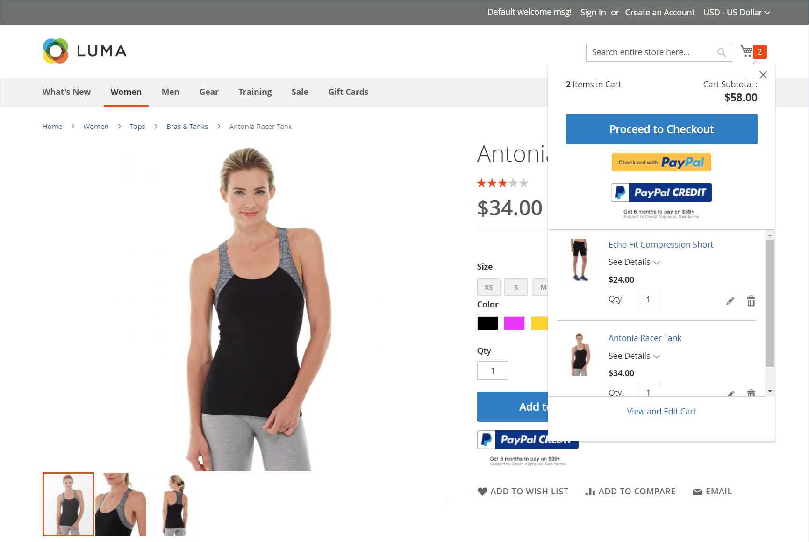
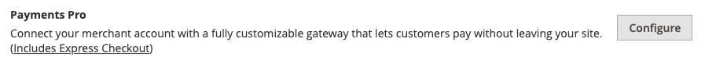
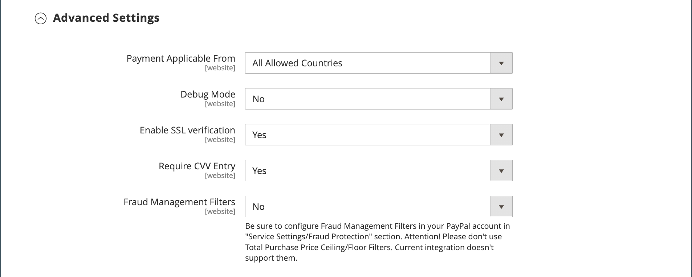

# PayPal Payments Pro

[PayPal Payments Pro][3] bietet Ihnen alle Vorteile eines Händlerkontos und eines Zahlungs-Gateways in einem Paket sowie die Möglichkeit, Ihr eigenes, vollständig angepasstes Checkout-Erlebnis zu erstellen. PayPal Express Checkout wird automatisch mit PayPal Payments Pro aktiviert, sodass Sie mehr als 110 Millionen aktive PayPal-Benutzer nutzen können.

{width="700" zoomable="yes"}

>[!IMPORTANT]
>
>**PSD2-Anforderungen:**  
>Ab dem 14. September 2019 können europäische Banken Zahlungen ablehnen, die [PSD2&rbrace;-](../getting-started/compliance-payment-services-directive.md) nicht erfüllen. Um PSD2 zu erfüllen, muss PayPal Payments Pro mit einem Plug-in eines Drittanbieters integriert sein.

>[!NOTE]
>
>Derzeit ist PayPal Payments Pro in den USA, Großbritannien und Kanada verfügbar.

## Anforderungen

- [PayPal-Händlerkonto][1] (mit aktivierten Direktzahlungen)

## Checkout-Workflow

1. **Der Kunde geht zur Kasse** - Der Kunde fügt Produkte zum Warenkorb hinzu und klickt/tippt auf _Zur Kasse gehen_.|
1. **Kunde wählt Zahlungsmethode aus** - Während des Checkouts wählt der Kunde die Option _PayPal-Direktzahlung_ und gibt die Kreditkarteninformationen ein.
   - Wenn Sie mit PayPal Payments Pro bezahlen, bleibt der Kunde während des Checkout-Prozesses auf Ihrer Website.
   - Wenn Sie mit PayPal Express Checkout bezahlen, wird der Kunde zur PayPal-Website weitergeleitet, um die Transaktion abzuschließen.

Auf Wunsch des Kunden kann der Store-Administrator auch eine Bestellung vom Administrator erstellen und die Transaktion mit PayPal Payments Pro bearbeiten.

## Workflow für die Bestellabwicklung

1. **Bestellung aufgegeben** - Die Bestellung kann entweder vom Administrator Ihres Geschäfts oder von Ihrem PayPal-Händlerkonto bearbeitet werden.

1. **[!UICONTROL Payment Action]** - Die in der Konfiguration angegebene Zahlungsaktion wird auf die Bestellung angewendet. Zu den Optionen gehören:

   - **Autorisieren** - Commerce erstellt einen Kundenauftrag mit dem Status _Verarbeitung_. In diesem Fall steht die Genehmigung des zu genehmigenden Geldbetrags noch aus.
   - **Verkauf** - Commerce erstellt sowohl einen Kundenauftrag als auch eine Rechnung.
   - **Capture** - PayPal überträgt den Bestellbetrag vom Kundensaldo, Bankkonto oder Kreditkarte auf das Händlerkonto.

1. **Rechnungsstellung** - In Commerce wird eine Rechnung erstellt, nachdem PayPal eine sofortige Zahlungsbenachrichtigung an Commerce gesendet hat.

   Stellen Sie sicher, dass sofortige Zahlungsbenachrichtigungen in Ihrem PayPal-Händlerkonto aktiviert sind.

   >[!NOTE]
   >
   >Bei Bedarf kann eine Bestellung für eine bestimmte Menge von Produkten teilweise fakturiert werden. Für jede gesendete Teilrechnung wird eine separate Erfassungstransaktion mit einer eindeutigen ID verfügbar, und es wird eine separate Rechnung generiert.

   Nur mit Autorisierung ausgeführte Zahlungsvorgänge werden erst abgeschlossen, nachdem der gesamte Bestellbetrag erfasst wurde.

   Eine Bestellung kann jederzeit online storniert werden, bis der Bestellbetrag vollständig in Rechnung gestellt ist.

1. **Rücksendungen** - Wenn der Kunde die gekauften Produkte zurückgibt und eine Rückerstattung beantragt, wie bei der Erfassung des Bestellbetrags und der Rechnungserstellung, können Sie eine Online-Rückerstattung entweder über den Administrator oder Ihr PayPal-Händlerkonto erstellen.

## Konfigurieren Ihres PayPal-Kontos

Bevor Sie PayPal Payments Pro in Commerce einrichten, müssen Sie Ihr Händlerkonto auf der PayPal-Website konfigurieren.

1. Melden Sie sich bei Ihrem [PayPal-Geschäftskonto](https://manager.paypal.com/) an.

1. Wählen Sie im Menü PayPal Manager die Option **[!UICONTROL Service Settings]**.

1. Klicken Sie unter **[!UICONTROL Hosted Checkout Pages]** auf **[!UICONTROL Set Up]**.

1. Legen Sie unter **[!UICONTROL Choose your settings]** **[!UICONTROL Transaction Process Mode]** auf `Live` fest.

1. Legen Sie unter **[!UICONTROL Display options on payment page]** **[!UICONTROL Cancel URL Method]** auf `POST` fest.

1. Aktivieren Sie unter **[!UICONTROL Billing Information]** die Kontrollkästchen Kartensicherheitscode **[!UICONTROL CSC]** sowohl für erforderliche als auch für bearbeitbare Felder.

1. Legen Sie unter **[!UICONTROL Payment Confirmation]** **[!UICONTROL Return URL Method]** auf `POST` fest.

1. Konfigurieren Sie unter **[!UICONTROL Security Options]** Folgendes:

   - **[!UICONTROL AVS]**: `No`
   - **[!UICONTROL CSC]**: `No`
   - **[!UICONTROL Enable Secure Token]**: `Yes`

1. Klicken Sie auf **[!UICONTROL Save Changes]**.

1. Wählen Sie im _PayPal Manager_-Menü **[!UICONTROL Service Settings]** und unter _Hosted Checkout Pages_ **[!UICONTROL Customize]**.

1. Wählen Sie **[!UICONTROL Layout C]**.

   Layout C zeigt nur Kredit- und Debitkartenfelder an und kann entweder auf der Site umrahmt oder als eigenständiges Popup verwendet werden. Die Größe ist auf 490 x 565 Pixel festgelegt, mit zusätzlichem Platz für Fehlermeldungen. Auf einigen Systemen wird durch diese Einstellung ein Problem mit transparenter Umleitung behoben.

1. Klicken Sie auf **[!UICONTROL Save and Publish]**.

1. Wählen Sie im Menü PayPal Manager die Option **[!UICONTROL Account Administration]**. Klicken Sie unter **[!UICONTROL Manage Security]** auf **[!UICONTROL Transaction Settings]**.

1. Legen Sie **[!UICONTROL Allow reference transactions]** auf `Yes` fest.

1. Klicken Sie auf **[!UICONTROL Confirm]**.

   >[!NOTE]
   >
   >Wenn Sie mehrere Commerce-Websites haben, müssen Sie für jede ein separates PayPal Payments Pro-Konto erstellen.

1. Einrichten eines anderen Benutzers (empfohlen von PayPal):

   - Klicken Sie in der zweiten Zeile des Hauptmenüs auf **[!UICONTROL Manage Users]**.

   - Um einen weiteren Benutzer zum Konto hinzuzufügen, klicken Sie auf **[!UICONTROL Add User]**. Der Link befindet sich direkt über dem Titel Benutzer verwalten .

   - Füllen Sie die erforderlichen Felder in den folgenden Abschnitten des _[!UICONTROL Add User]_&#x200B;Formulars aus:

      - [!UICONTROL Admin Confirmation]
      - [!UICONTROL User Information]
      - [!UICONTROL User Login Information]
      - [!UICONTROL Assign Privilege to User]

   - Klicken Sie auf **[!UICONTROL Update]**.

1. Melden Sie sich unbedingt von Ihrem PayPal-Konto ab.

## Einrichten von PayPal Payments Pro in Commerce

>[!NOTE]
>
>Sie können zwei PayPal-Lösungen gleichzeitig aktivieren: [PayPal Express Checkout](paypal-express-checkout.md) und eine der [All-in-One-Lösungen](paypal.md#paypal-all-in-one-payment-solutions). Wenn Sie Zahlungslösungen ändern, wird die zuvor verwendete automatisch deaktiviert.

>[!TIP]
>
>Klicken Sie jederzeit auf **[!UICONTROL Save Config]** , um Ihren Fortschritt zu speichern.

### Schritt 1: Starten der Konfiguration

1. Navigieren Sie in _Admin_-Seitenleiste zu **[!UICONTROL Stores]** > _[!UICONTROL Settings]_>**[!UICONTROL Configuration]**.

1. Erweitern Sie im linken Bereich **[!UICONTROL Sales]** und wählen Sie **[!UICONTROL Payment Methods]**.

1. Wenn Ihre Commerce-Installation über mehrere Websites, Stores oder Ansichten verfügt, legen Sie **[!UICONTROL Store View]** auf die Store-Ansicht fest, in der Sie diese Konfiguration anwenden möchten.

1. Wählen Sie im Abschnitt _[!UICONTROL Merchant Location]_&#x200B;die **[!UICONTROL Merchant Country]**&#x200B;aus, in der sich Ihr Unternehmen befindet.

   Diese Einstellung bestimmt die Auswahl der PayPal-Lösungen, die in der Konfiguration angezeigt werden.

   {width="600" zoomable="yes"}

1. Erweitern Sie **[!UICONTROL PayPal All-in-One Payment Solution]** und klicken Sie auf **[!UICONTROL Configure]** für **[!UICONTROL Payments Pro]**.

   {width="600" zoomable="yes"}

### Schritt 2: Die erforderlichen PayPal-Einstellungen vornehmen

1. Erweitern Sie  den Abschnitt **[!UICONTROL Payments Pro and Express Checkout]** .

   {width="600" zoomable="yes"}

1. (Optional) Geben Sie die **[!UICONTROL Email Associated with your PayPal Merchant Account]** ein.

   >[!IMPORTANT]
   >
   >Bei E-Mail-Adressen wird zwischen Groß- und Kleinschreibung unterschieden. Um die Zahlung zu erhalten, muss die E-Mail-Adresse mit der E-Mail-Adresse übereinstimmen, die in Ihrem PayPal-Händlerkonto angegeben ist.

   Wenn Sie kein PayPal-Konto haben, klicken Sie auf **[!UICONTROL Start accepting payments via PayPal]**.

1. Geben Sie eine der folgenden Anmeldedaten ein, mit denen Sie sich bei Ihrem PayPal-Händlerkonto anmelden:

   - **[!UICONTROL Partner]** - Ihre PayPal Partner ID.
   - **[!UICONTROL Vendor]** - Ihr PayPal-Benutzername.
   - **[!UICONTROL User]** - Die ID eines anderen Benutzers, der auf Ihrem PayPal-Konto eingerichtet ist.

1. Geben Sie die **[!UICONTROL Password]** ein, die Ihrem PayPal-Konto zugeordnet ist.

1. Um Testtransaktionen auszuführen, setzen Sie **[!UICONTROL Test Mode]** auf `Yes`.

   Verwenden Sie beim Testen der Konfiguration in einer Sandbox nur [Kreditkartennummern][2] die von PayPal empfohlen werden. Wenn Sie bereit sind, zur Produktion zu wechseln, kehren Sie zur Konfiguration zurück und setzen Sie den Testmodus auf `No`.

1. Wenn Ihr System einen Proxy-Server verwendet, um die Verbindung zum PayPal-System herzustellen, setzen Sie **[!UICONTROL Use Proxy]** auf `Yes` und gehen Sie folgendermaßen vor:

   - Geben Sie die IP-Adresse der **[!UICONTROL Proxy Host]** ein.

   - Geben Sie die Port-Nummer des **[!UICONTROL Proxy Port]** ein.

   Ein Proxy wird verwendet, wenn die Server-Firewall den direkten Zugriff auf den PayPal-Server verhindert. In einem solchen Fall wird ein Drittanbieterserver verwendet, um Traffic weiterzuleiten.

1. Legen Sie **[!UICONTROL Enable this Solution]** auf `Yes` fest.

1. Wenn Sie Ihren Kunden [PayPal-Guthaben](paypal.md#paypal-credit-and-pay-later) anbieten möchten, setzen Sie **[!UICONTROL Enable PayPal Credit]** auf `Yes`.

1. Wenn Sie die Zahlungs-/Kreditkartendetails eines Kunden sicher speichern möchten, sodass Kunden nicht jedes Mal erneut Zahlungsinformationen eingeben müssen, setzen Sie **[!UICONTROL Vault Enabled]** auf `Yes`.

### Schritt 3: Einrichten von Advertise PayPal Credit / Advertise PayPal PayLater (optional)

Ab Version 2.4.3 wird PayPal Later in Bereitstellungen unterstützt, die PayPal enthalten. Mit dieser Funktion können Käufer eine Bestellung in zweiwöchentlichen Raten bezahlen, anstatt den vollen Betrag zum Zeitpunkt des Kaufs zu bezahlen. Das PayPal-Krediterlebnis ist veraltet.

Legen Sie **[!UICONTROL Enable PayPal PayLater Experience]** auf eine der folgenden Einstellungen fest:

- `Yes` - Einrichten von Advertise PayPal PayLater
- `No` - Einrichten von Advertise PayPal-Guthaben

#### PayPal-Guthaben ankündigen

1. Erweitern Sie  den Abschnitt **[!UICONTROL Advertise PayPal Credit]** .

   {width="600" zoomable="yes"}

1. Um Ihre Kontoinformationen zu erhalten, klicken Sie auf **[!UICONTROL Get Publisher ID from PayPal]** und folgen Sie den Anweisungen.

1. Geben Sie Ihre **[!UICONTROL Publisher ID]** ein.

1. Erweitern Sie  den Abschnitt **[!UICONTROL Home Page]** .

   {width="600" zoomable="yes"}

1. Um ein Banner auf der Seite zu platzieren, setzen Sie **[!UICONTROL Display]** auf `Yes`.

1. Legen Sie **[!UICONTROL Position]** auf eine der folgenden Einstellungen fest:

   - `Header (center)`
   - `Sidebar (right)`

1. Legen Sie **[!UICONTROL Size]** auf eine der folgenden Einstellungen fest:

   - `190 x 100`
   - `234 x 60`
   - `300 x 50`
   - `468 x 60`
   - `728 x 90`
   - `800 x 66`

1. Erweitern Sie  die restlichen Abschnitte und wiederholen Sie die vorherigen Schritte:

   - **[!UICONTROL Catalog Category Page]**
   - **[!UICONTROL Catalog Product Page]**
   - **[!UICONTROL Checkout Cart Page]**

#### Werbung für PayPal PayLater

1. Erweitern Sie  den Abschnitt **[!UICONTROL Advertise PayPal PayLater]** .

1. Legen Sie **[!UICONTROL Enable PayPal PayLater]** auf `Yes` fest.

1. Erweitern Sie  den Abschnitt **[!UICONTROL Home Page]** .

   {width="600" zoomable="yes"}

1. Um ein Banner auf der Seite zu platzieren, setzen Sie **[!UICONTROL Display]** auf `Yes`.

1. Legen Sie **[!UICONTROL Position]** auf eine der folgenden Einstellungen fest:

   - `Header (center)`
   - `Sidebar`

1. Legen Sie **[!UICONTROL Style Layout]** auf eine der folgenden Einstellungen fest:

   - `Text`
   - `Flex`

1. Legen Sie **[!UICONTROL Logo Type]** nur für [!UICONTROL Style Layout] **[!UICONTROL Text]** auf eine der folgenden Einstellungen fest:

   - `Primary`
   - `Alternative`
   - `Inline`
   - `None`

1. Legen Sie **[!UICONTROL Logo Position]** nur für [!UICONTROL Style Layout] **[!UICONTROL Text]** auf eine der folgenden Einstellungen fest:

   - `Left`
   - `Right`
   - `Top`

1. Legen Sie **[!UICONTROL Text Color]** nur für [!UICONTROL Style Layout] **[!UICONTROL Text]** auf eine der folgenden Einstellungen fest:

   - `Black`
   - `White`
   - `Monochrome`
   - `Grayscale`

1. Legen Sie **[!UICONTROL Text Size]** nur für [!UICONTROL Style Layout] **[!UICONTROL Text]** auf eine der folgenden Einstellungen fest:

   - `10px`
   - `11px`
   - `12px`
   - `13px`
   - `14px`
   - `15px`
   - `16px`

1. Legen Sie **[!UICONTROL Ratio]** nur für [!UICONTROL Style Layout] **[!UICONTROL Flex]** auf eine der folgenden Einstellungen fest:

   - `1x1`
   - `1x4`
   - `8x1`
   - `20x1`

1. Legen Sie **[!UICONTROL Color]** nur für [!UICONTROL Style Layout] **[!UICONTROL Flex]** auf eine der folgenden Einstellungen fest:

   - `Blue`
   - `Black`
   - `White`
   - `White No Border`
   - `Gray`
   - `Monochrome`
   - `Grayscale`

1. Erweitern Sie  die restlichen Abschnitte und wiederholen Sie die vorherigen Schritte:

   - **[!UICONTROL Catalog Product Page]**
   - **[!UICONTROL Checkout Cart Page]**
   - **[!UICONTROL Checkout Payment Step]**
   - **[!UICONTROL Catalog Category Page]**

### Schritt 4: Vervollständigen Sie die Grundeinstellungen

1. Erweitern Sie  den Abschnitt **[!UICONTROL Basic Settings - PayPal Payments Pro]** .

   {width="600" zoomable="yes"}

1. Geben Sie **[!UICONTROL Title]** einen Titel ein, der PayPal Payments Pro während des Checkouts identifiziert.

   Es wird empfohlen, den Titel _Debit- oder Kreditkarte_ zu verwenden.

1. Wenn Sie mehrere Zahlungsmethoden anbieten, geben Sie eine Zahl für **[!UICONTROL Sort Order]** ein, um die Reihenfolge zu bestimmen, in der PayPal Payments Pro angezeigt wird, wenn es während des Checkouts mit anderen Zahlungsmethoden aufgelistet wird.

   Diese Zahl steht im Verhältnis zu den anderen Zahlungsmethoden. (`0` = First, `1` = Second, `2` = Third usw.)

1. Legen Sie **[!UICONTROL Payment Action]** auf eine der folgenden Einstellungen fest:

   - `Authorization` - Genehmigt den Kauf, setzt jedoch die Mittel zurück. Der Betrag wird erst abgehoben, wenn er _Händler_ wird.
   - `Sale` - Der Betrag des Kaufs wird autorisiert und sofort vom Kundenkonto zurückgezogen.

1. Wählen Sie **[!UICONTROL Credit Card Settings]** die Kreditkarten aus, die Sie für die Zahlung in Ihrem Geschäft akzeptieren.

   Zur Auswahl mehrerer Karten halten Sie die Strg-Taste (PC) bzw. die Befehlstaste (Mac) gedrückt und klicken auf jede Karte.

   >[!NOTE]
   >
   >American Express erfordert eine zusätzliche Vereinbarung.

### Schritt 5: Erweiterte Einstellungen abschließen

1. Erweitern Sie  den Abschnitt **[!UICONTROL Advanced Settings]** .

   {width="600" zoomable="yes"}

1. Legen Sie **[!UICONTROL Payment Applicable From]** auf eine der folgenden Einstellungen fest:

   - `All Allowed Countries` - Kunden aus allen [Ländern](../getting-started/store-details.md#country-options) die in Ihrer Store-Konfiguration angegeben sind, können diese Zahlungsmethode verwenden.
   - `Specific Countries` - Nach Auswahl dieser Option wird die _[!UICONTROL Payment from Specific Countries]_&#x200B;angezeigt. Halten Sie die Strg-Taste (PC) oder die Befehlstaste (Mac) gedrückt und wählen Sie jedes Land in der Liste aus, in dem Kunden in Ihrem Geschäft Einkäufe tätigen können.

1. Um die Kommunikation mit dem Zahlungssystem in die Protokolldatei zu schreiben, setzen Sie **[!UICONTROL Debug Mode]** auf `Yes`.

   >[!NOTE]
   >
   >In Übereinstimmung mit den PCI Data Security Standards werden Kreditkarteninformationen nicht in der Protokolldatei aufgezeichnet.

1. Um die Host-Authentizitätsüberprüfung zu aktivieren, setzen Sie **[!UICONTROL Enable SSL Verification]** auf `Yes`.

1. Um Kunden zur Eingabe eines CVV-Codes aufzufordern, setzen Sie **[!UICONTROL Require CVV Entry]** auf `Yes`.

1. Erweitern Sie  den Abschnitt **[!UICONTROL CVV and AVS Settings]** .

1. Um zu bestimmen, wann eine Transaktion abgelehnt werden soll, wenn das Adressenüberprüfungssystem eine Nichtübereinstimmung erkennt, geben Sie an, wie jedes der folgenden Szenarien gehandhabt werden soll:

   - Um eine Transaktion aufgrund einer nicht übereinstimmenden Straße abzulehnen, setzen Sie **[!UICONTROL AVS Street Does Not Match]** auf `Yes`.

   - Um eine Transaktion aufgrund einer nicht übereinstimmenden Postleitzahl abzulehnen, setzen Sie **[!UICONTROL AVS Zip Does Not Match]** auf `Yes`.

   - Um eine Transaktion aufgrund einer nicht übereinstimmenden Länderkennung abzulehnen, setzen Sie **[!UICONTROL International AVS Indicator Does Not Match]** auf `Yes`.

   - Um eine Transaktion aufgrund eines nicht übereinstimmenden CVV-Codes abzulehnen, setzen Sie **[!UICONTROL International Card Security Code Does Not Match]** auf `Yes`.

   {width="600" zoomable="yes"}

1. Füllen Sie die folgenden Abschnitte nach Bedarf für Ihren Store aus:

   - [Einstellungen für Abrechnungsberichte](#settlement-report-settings)
   - [Frontend-Erlebniseinstellungen](#frontend-experience-settings)

#### Einstellungen für Abrechnungsberichte

1. Erweitern Sie  den Abschnitt **[!UICONTROL Settlement Report Settings]** .

   {width="600" zoomable="yes"}

1. Gehen Sie **[!UICONTROL SFTP Credentials]** wie folgt vor:

   - Wenn Sie sich für den sicheren FTP-Server von PayPal angemeldet haben, geben Sie die folgenden SFTP-Anmeldedaten ein:

      - Login
      - Kennwort

   - Um Testberichte auszuführen, bevor Sie mit Payments Pro auf Ihrer Site live gehen, setzen Sie **[!UICONTROL Sandbox Mode]** auf `Yes`.

   - Geben Sie die **[!UICONTROL Custom Endpoint Hostname or IP Address]** ein.

     Standardmäßig ist der Wert `reports.paypal.com`.

   - Geben Sie die **[!UICONTROL Custom Path]** ein, in der Berichte gespeichert werden.

     Standardmäßig ist der Wert `/ppreports/outgoing`.

1. Um Berichte nach einem Zeitplan zu generieren, führen Sie die **[!UICONTROL Scheduled Fetching]** aus:

   - Legen Sie **[!UICONTROL Enable Automatic Fetching]** auf `Yes` fest.

   - Legen Sie **[!UICONTROL Schedule]** auf eine der folgenden Einstellungen fest:

      - `Daily`
      - `Every 3 Days`
      - `Every 7 Days`
      - `Every 10 Days`
      - `Every 14 Days`
      - `Every 30 Days`
      - `Every 40 Days`

     PayPal bewahrt jeden Bericht 45 Tage lang auf.

   - Legen Sie **[!UICONTROL Time of Day]** auf die Stunde, Minute und Sekunde fest, zu der die Berichte generiert werden sollen.

#### Frontend-Erlebniseinstellungen

Verwenden Sie die _[!UICONTROL Frontend Experience Settings]_, um festzulegen, welche PayPal-Logos auf Ihrer Site erscheinen sollen, und um das Erscheinungsbild Ihrer PayPal-Händlerseiten anzupassen.

1. Erweitern Sie  den Abschnitt **[!UICONTROL Frontend Experience Settings]** .

   {width="600" zoomable="yes"}

1. Wählen Sie die **[!UICONTROL PayPal Product Logo]** aus, die im PayPal-Block in Ihrem Geschäft angezeigt werden soll.

   Die PayPal-Logos sind in vier Stilen und zwei Größen erhältlich:

   - `No Logo`
   - `We Prefer PayPal (150 x 60 or 150 x 40)`
   - `Now Accepting PayPal (150 x 60 or 150 x 40)`
   - `Payments by PayPal (150 x 60 or 150 x 40)`
   - `Shop Now Using PayPal (150 x 60 or 150 x 40)`

1. Gehen Sie wie folgt vor, um das Erscheinungsbild Ihrer PayPal-Händlerseiten anzupassen:

   - Geben Sie den Namen der **[!UICONTROL Page Style]** ein, die Sie auf Ihre PayPal-Händlerseiten anwenden möchten:

      - `paypal` - Verwendet den PayPal-Seitenstil.
      - `primary` - Verwendet den Seitenstil, den Sie im Kontoprofil als _primären_ Stil identifiziert haben.
      - `your_custom_value` - Verwendet einen benutzerdefinierten Zahlungsseitenstil, der in Ihrem Kontoprofil angegeben ist.

   - Geben Sie **[!UICONTROL Header Image URL]** die URL des Bildes ein, das in der linken oberen Ecke der Zahlungsseite angezeigt werden soll. Die maximale Dateigröße beträgt 750 Pixel breit und 90 Pixel hoch.

     >[!NOTE]
     >
     >PayPal empfiehlt, dass sich das Bild auf einem sicheren (HTTPS-)Server befindet. Andernfalls kann ein Browser warnen, dass _die Seite sowohl sichere als auch nicht sichere Elemente enthält_.

   - Um die Farbe für Ihre Seiten festzulegen, geben Sie für jede der folgenden Aktionen den sechsstelligen Hexadezimalcode ohne `#` ein:

      - **[!UICONTROL Header Background Color]** - Hintergrundfarbe für die Kopfzeile der Kaufbestätigungsseite.
      - **[!UICONTROL Header Border Color]** - Farbe für Zwei-Pixel-Rahmen um die Kopfzeile.
      - **[!UICONTROL Page Background Color]** - Hintergrundfarbe für die Checkout-Seite und um die Kopfzeile und das Zahlungsformular.

### Schritt 6: Vervollständigen Sie die Grundeinstellungen für PayPal Express Checkout

1. Erweitern Sie  den Abschnitt **[!UICONTROL Basic Settings - PayPal Express Checkout]** .

   {width="600" zoomable="yes"}

1. Geben Sie **[!UICONTROL Title]** einen Titel ein, der diese Zahlungsmethode beim Checkout identifiziert.

   Es wird empfohlen, für _Store-Ansicht den_ „PayPal“ festzulegen.

1. Wenn Sie mehrere Zahlungsmethoden anbieten, geben Sie eine Nummer für **[!UICONTROL Sort Order]** ein, um die Reihenfolge zu bestimmen, in der PayPal Express Checkout angezeigt wird, wenn es mit den anderen Zahlungsmethoden aufgelistet wird.

   Diese Zahl steht im Verhältnis zu den anderen Zahlungsmethoden. (`0` = First, `1` = Second, `2` = Third usw.)

1. Legen Sie **[!UICONTROL Payment Action]** auf eine der folgenden Einstellungen fest:

   - `Authorization` - Genehmigt den Kauf und legt die Mittel fest. Der Betrag wird erst abgehoben, wenn er _Händler_ wird.
   - `Sale` - Der Betrag des Kaufs wird autorisiert und sofort vom Konto des Kunden zurückgezogen.

1. Um die Schaltfläche _[!UICONTROL Check out with PayPal]_&#x200B;auf der Produktseite anzuzeigen, setzen Sie **[!UICONTROL Display on Product Details Page]**&#x200B;auf `Yes`.

### Schritt 7: Vervollständigen Sie die erweiterten Einstellungen für PayPal Express Checkout

1. Erweitern Sie  den Abschnitt **[!UICONTROL Advanced Settings]** .

   {width="600" zoomable="yes"}

1. Legen Sie **[!UICONTROL Display on Shopping Cart]** auf `Yes` fest.

1. Legen Sie **[!UICONTROL Payment Applicable From]** auf eine der folgenden Einstellungen fest:

   - `All Allowed Countries` - Kunden aus allen [Ländern](../getting-started/store-details.md#country-options) die in Ihrer Store-Konfiguration angegeben sind, können diese Zahlungsmethode verwenden.
   - `Specific Countries` - Nach Auswahl dieser Option wird die _[!UICONTROL Payment from Specific Countries]_&#x200B;angezeigt. Zur Auswahl mehrerer Länder halten Sie die Strg-Taste (PC) bzw. die Befehlstaste (Mac) gedrückt und klicken auf die einzelnen Elemente.

1. Um die Kommunikation mit dem Zahlungssystem in die Protokolldatei zu schreiben, setzen Sie **[!UICONTROL Debug Mode]** auf `Yes`.

   >[!NOTE]
   >
   >In Übereinstimmung mit den PCI Data Security Standards werden Kreditkarteninformationen nicht in der Protokolldatei aufgezeichnet.

1. Um die Host-Authentizitätsüberprüfung zu aktivieren, setzen Sie **[!UICONTROL Enable SSL Verification]** auf `Yes`.

1. Um eine vollständige Zusammenfassung der Kundenbestellung nach Zeileneintrag auf der PayPal-Website anzuzeigen, setzen Sie **[!UICONTROL Transfer Cart Line Items]** auf `Yes`.

1. Damit der Kunde die Transaktion von der PayPal-Website abschließen kann, ohne zur Bestellüberprüfung an Ihren Store zurückzukehren, setzen Sie **[!UICONTROL Skip Order Review Step]** auf `Yes`.

1. Klicken Sie abschließend auf **[!UICONTROL Save Config]**.

[1]: https://www.paypal.com/webapps/mpp/how-to-sell-online
[2]: https://www.paypalobjects.com/en_AU/vhelp/paypalmanager_help/credit_card_numbers.htm
[3]: https://developer.paypal.com/docs/paypal-payments-pro/
