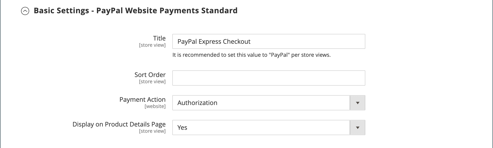

# PayPal-Zahlungsstandard

[PayPal Payments Standard][4] ist die einfachste Möglichkeit, Zahlungen online zu akzeptieren. Sie können Ihren Kunden die bequeme Zahlung sowohl per Kreditkarte als auch per PayPal anbieten, indem Sie einfach eine Checkout-Schaltfläche zu Ihrem Geschäft hinzufügen.

>[!NOTE]
>
>Für Händler außerhalb der USA wird es _PayPal Website Payments Standard_ genannt.

Mit PayPal Payments Standard können Sie Kreditkarten auf Mobilgeräten wischen. Es gibt keine monatliche Gebühr und Sie können über eBay bezahlt werden. Zu den unterstützten Kreditkarten gehören Visa, MasterCard, Discover und American Express. Darüber hinaus können Kunden direkt über ihre persönlichen PayPal-Konten bezahlen. PayPal Payments Standard ist in allen Ländern auf der weltweiten PayPal-Referenzliste verfügbar.

>[!IMPORTANT]
>
>**PSD2-Anforderungen:**  
>Ab dem 14. September 2019 können europäische Banken Zahlungen ablehnen, die [PSD2&rbrace;-](../getting-started/compliance-payment-services-directive.md) nicht erfüllen. PayPal Payments Standard muss keine Maßnahmen ergreifen, um PSD2 zu erfüllen, da alle Anforderungen von PayPal abgewickelt werden.

## Anforderungen an Händler

- [PayPal-Geschäftskonto][1]

## Checkout-Workflow

Für Kunden ist PayPal Payments Standard ein einstufiger Prozess, wenn die Kreditkarteninformationen auf ihren persönlichen PayPal-Konten aktuell sind.

1. **Kunde platziert Bestellung** - Der Kunde klickt/tippt auf die Schaltfläche _Jetzt bezahlen_, um den Kauf abzuschließen.

1. **PayPal verarbeitet die Transaktion** - Der Kunde wird zur PayPal-Website weitergeleitet, um die Transaktion abzuschließen.

## PayPal-Zahlungsstandard einrichten

>[!NOTE]
>
>PayPal Payments Standard kann nicht gleichzeitig mit einer anderen PayPal-Methode verwendet werden, einschließlich Express Checkout. Wenn Sie Zahlungslösungen ändern, ist die zuvor verwendete deaktiviert.

>[!TIP]
>
>Klicken Sie jederzeit auf **[!UICONTROL Save Config]** , um Ihren Fortschritt zu speichern.

### Schritt 1: Starten der Konfiguration

Bei dieser Einrichtungsmethode wird davon ausgegangen, dass Sie über ein vorhandenes PayPal-Konto verfügen.

1. Navigieren Sie in _Admin_-Seitenleiste zu **[!UICONTROL Stores]** > _[!UICONTROL Settings]_>**[!UICONTROL Configuration]**.

1. Erweitern Sie im linken Bereich **[!UICONTROL Sales]** und wählen Sie **[!UICONTROL Payment Methods]**.

1. Wenn Ihre Commerce-Installation über mehrere Websites, Stores oder Ansichten verfügt, legen Sie **[!UICONTROL Store View]** auf die Store-Ansicht fest, in der Sie diese Konfiguration anwenden möchten.

1. Wählen Sie im Abschnitt _[!UICONTROL Merchant Location]_&#x200B;die **[!UICONTROL Merchant Country]**&#x200B;aus, in der sich Ihr Unternehmen befindet.

   Diese Einstellung bestimmt die Auswahl der PayPal-Lösungen, die in der Konfiguration angezeigt werden.

   {width="600" zoomable="yes"}

1. Erweitern Sie **[!UICONTROL PayPal All-in-One Payment Solutions]** und klicken Sie auf **[!UICONTROL Configure]** für **[!UICONTROL Payments Standard]**.

   {width="700" zoomable="yes"}

### Schritt 2: Aktivieren und Verbinden Ihres PayPal-Kontos

{width="600" zoomable="yes"}

1. Verbinden Sie Ihr -Konto für Tests oder die Produktion:

   - Klicken Sie für den Test-(Entwicklungs-)Modus auf **[!UICONTROL Sandbox Credentials]** und geben Sie Ihre [PayPal-Sandbox][3]-Anmeldeinformationen ein.
   - Klicken Sie im Produktionsmodus auf **[!UICONTROL Connect with PayPal]** und geben Sie die Anmeldeinformationen für Ihr Produktionskonto ein.

   Wenn Ihre Verbindung validiert wurde, können Sie fortfahren.

1. Legen Sie **[!UICONTROL Enable this Solution]** auf `Yes` fest.

1. Wenn Sie Ihren Kunden [PayPal-Guthaben](paypal.md#paypal-credit-and-pay-later) anbieten möchten, setzen Sie **[!UICONTROL Enable PayPal Credit]** auf `Yes`.

### Schritt 3: Standardeinstellungen für Zahlungen vervollständigen

1. Erweitern Sie  den Abschnitt **[!UICONTROL Payments Standard]** .

   {width="600" zoomable="yes"}

1. Geben Sie die **[!UICONTROL Email Associated with your PayPal Merchant Account]** ein.

   >[!IMPORTANT]
   >
   >Bei E-Mail-Adressen wird zwischen Groß- und Kleinschreibung unterschieden. Um eine Zahlung zu erhalten, muss die von Ihnen eingegebene E-Mail-Adresse mit der in Ihrem PayPal-Händlerkonto angegebenen E-Mail-Adresse übereinstimmen.

   Wenn Sie kein PayPal-Konto haben, klicken Sie auf **[!UICONTROL Start accepting payments via PayPal]**.

1. Legen Sie **[!UICONTROL API Authentication Methods]** auf eine der folgenden Einstellungen fest:

   - `API Signature` - Diese PayPal-Authentifizierungsmethode ist am einfachsten zu implementieren und basiert auf Ihrem Benutzernamen, Kennwort und einer eindeutigen Zeichenfolge von Zeichen und Zahlen, die Ihr Konto identifiziert. API-Signatur-Anmeldeinformationen laufen nicht ab.
   - `API Certificate` - Diese PayPal-Authentifizierungsmethode ist sicherer, basiert auf Ihrem Benutzernamen, Passwort und einem herunterladbaren Zertifikat. API-Anmeldeinformationen laufen nach drei Jahren ab und müssen erneuert werden.

   Füllen Sie bei Bedarf Folgendes aus:

   - **[!UICONTROL API Username]**
   - **[!UICONTROL API Password]**
   - **[!UICONTROL API Signature]**

1. Wenn Sie Anmeldeinformationen aus Ihrem Sandbox-Konto verwenden, setzen Sie **[!UICONTROL Sandbox Mode]** auf `Yes`.

   Verwenden Sie beim Testen der Konfiguration in einer Sandbox nur [Kreditkartennummern][2] die von PayPal empfohlen werden. Wenn Sie bereit sind, zur Produktion zu wechseln, kehren Sie zur Konfiguration zurück und setzen Sie den Sandbox-Modus auf `No` und verbinden Sie sich mit Ihrem PayPal-Produktionskonto.

1. Wenn Ihr System einen Proxyserver verwendet, um die Verbindung zwischen Adobe Commerce oder Magento Open Source und dem PayPal-Zahlungssystem herzustellen, setzen Sie **[!UICONTROL API Uses Proxy]** auf `Yes` und führen Sie Folgendes aus:

   - **[!UICONTROL Proxy Host]**
   - **[!UICONTROL Proxy Port]**

### Schritt 4: Einrichten von Advertise PayPal Credit / Advertise PayPal PayLater (optional)

Ab Version 2.4.3 wird PayPal Later in Bereitstellungen unterstützt, die PayPal enthalten. Mit dieser Funktion können Käufer eine Bestellung in zweiwöchentlichen Raten bezahlen, anstatt den vollen Betrag zum Zeitpunkt des Kaufs zu bezahlen. Das PayPal-Krediterlebnis ist veraltet.

Legen Sie **[!UICONTROL Enable PayPal PayLater Experience]** auf eine der folgenden Einstellungen fest:

- `Yes` - Einrichten von Advertise PayPal PayLater
- `No` - Einrichten von Advertise PayPal-Guthaben

#### PayPal-Guthaben ankündigen

1. Erweitern Sie  den Abschnitt **[!UICONTROL Advertise PayPal Credit]** .

   {width="600" zoomable="yes"}

1. Um Ihre Kontoinformationen zu erhalten, klicken Sie auf **[!UICONTROL Get Publisher ID from PayPal]** und folgen Sie den Anweisungen.

1. Geben Sie Ihre **[!UICONTROL Publisher ID]** ein.

   {width="600" zoomable="yes"}

1. Erweitern Sie  den Abschnitt **[!UICONTROL Home Page]** .

1. Um ein Banner auf der Seite zu platzieren, setzen Sie **[!UICONTROL Display]** auf `Yes`.

1. Legen Sie **[!UICONTROL Position]** auf eine der folgenden Einstellungen fest:

   - `Header (center)`
   - `Sidebar (right)`

1. Legen Sie **[!UICONTROL Size]** auf eine der folgenden Einstellungen fest:

   - `190 x 100`
   - `234 x 60`
   - `300 x 50`
   - `468 x 60`
   - `728 x 90`
   - `800 x 66`

1. Erweitern Sie  die restlichen Abschnitte und wiederholen Sie die vorherigen Schritte:

   - **[!UICONTROL Catalog Category Page]**
   - **[!UICONTROL Catalog Product Page]**
   - **[!UICONTROL Checkout Cart Page]**

#### Werbung für PayPal PayLater

1. Erweitern Sie  den Abschnitt **[!UICONTROL Advertise PayPal PayLater]** .

1. Legen Sie **[!UICONTROL Enable PayPal PayLater]** auf `Yes` fest.

1. Erweitern Sie  den Abschnitt **[!UICONTROL Home Page]** .

   {width="600" zoomable="yes"}

1. Um ein Banner auf der Seite zu platzieren, setzen Sie **[!UICONTROL Display]** auf `Yes`.

1. Legen Sie **[!UICONTROL Position]** auf eine der folgenden Einstellungen fest:

   - `Header (center)`
   - `Sidebar`

1. Legen Sie **[!UICONTROL Style Layout]** auf eine der folgenden Einstellungen fest:

   - `Text`
   - `Flex`

1. Legen Sie **[!UICONTROL Logo Type]** nur für [!UICONTROL Style Layout] **[!UICONTROL Text]** auf eine der folgenden Einstellungen fest:

   - `Primary`
   - `Alternative`
   - `Inline`
   - `None`

1. Legen Sie **[!UICONTROL Logo Position]** nur für [!UICONTROL Style Layout] **[!UICONTROL Text]** auf eine der folgenden Einstellungen fest:

   - `Left`
   - `Right`
   - `Top`

1. Legen Sie **[!UICONTROL Text Color]** nur für [!UICONTROL Style Layout] **[!UICONTROL Text]** auf eine der folgenden Einstellungen fest:

   - `Black`
   - `White`
   - `Monochrome`
   - `Grayscale`

1. Legen Sie **[!UICONTROL Text Size]** nur für [!UICONTROL Style Layout] **[!UICONTROL Text]** auf eine der folgenden Einstellungen fest:

   - `10px`
   - `11px`
   - `12px`
   - `13px`
   - `14px`
   - `15px`
   - `16px`

1. Legen Sie **[!UICONTROL Ratio]** nur für [!UICONTROL Style Layout] **[!UICONTROL Flex]** auf eine der folgenden Einstellungen fest:

   - `1x1`
   - `1x4`
   - `8x1`
   - `20x1`

1. Legen Sie **[!UICONTROL Color]** nur für [!UICONTROL Style Layout] **[!UICONTROL Flex]** auf eine der folgenden Einstellungen fest:

   - `Blue`
   - `Black`
   - `White`
   - `White No Border`
   - `Gray`
   - `Monochrome`
   - `Grayscale`

1. Erweitern Sie  die restlichen Abschnitte und wiederholen Sie die vorherigen Schritte:

   - **[!UICONTROL Catalog Product Page]**
   - **[!UICONTROL Checkout Cart Page]**
   - **Checkout-Zahlungsschritt**
   - **[!UICONTROL Catalog Category Page]**

### Schritt 5: Abschließen der Grundeinstellungen

1. Erweitern Sie  den Abschnitt **[!UICONTROL Basic Settings - PayPal Website Payments Standard]** .

   {width="600" zoomable="yes"}

1. Geben Sie **[!UICONTROL Title]** einen Titel ein, der diese Zahlungsmethode beim Checkout identifiziert.

   Es wird empfohlen, für alle Store _Ansichten den Titel_ PayPal“ zu verwenden.

1. Wenn Sie mehrere Zahlungsmethoden anbieten, geben Sie eine Zahl für **[!UICONTROL Sort Order]** ein, um die Reihenfolge zu bestimmen, in der PayPal Payments Standard angezeigt wird, wenn sie mit den anderen Zahlungsmethoden aufgelistet wird.

   Diese Zahl steht im Verhältnis zu den anderen Zahlungsmethoden. (`0` = First, `1` = Second, `2` = Third usw.)

1. Legen Sie **[!UICONTROL Payment Action]** auf eine der folgenden Einstellungen fest:

   - `Authorization` - Genehmigt den Kauf und legt die Mittel fest. Der Betrag wird erst abgehoben, wenn er vom Händler eingezogen wurde.
   - `Sale` - Der Betrag des Kaufs wird autorisiert und sofort vom Konto des Kunden zurückgezogen.

1. Um die Schaltfläche _[!UICONTROL Check out with PayPal]_&#x200B;auf der Produktseite anzuzeigen, setzen Sie **[!UICONTROL Display on Product Details Page]**&#x200B;auf `Yes`.

### Schritt 6: Erweiterte Einstellungen abschließen

1. Erweitern Sie  den Abschnitt **[!UICONTROL Advanced Settings]** .

   {width="600" zoomable="yes"}

1. Um PayPal Payments Standard sowohl im Warenkorb als auch im Mini-Warenkorb verfügbar zu machen, setzen Sie **[!UICONTROL Display on Shopping Cart]** auf `Yes`.

1. Legen Sie **[!UICONTROL Payment from Applicable Countries]** auf eine der folgenden Einstellungen fest:

   - `All Allowed Countries` - Kunden aus allen [Ländern](../getting-started/store-details.md#country-options) die in Ihrer Store-Konfiguration angegeben sind, können diese Zahlungsmethode verwenden.
   - `Specific Countries` - Nachdem Sie diese Option ausgewählt haben, wird die _[!UICONTROL Payment from Specific Countries]_&#x200B;angezeigt. Zur Auswahl mehrerer Länder halten Sie die Strg-Taste (PC) bzw. die Befehlstaste (Mac) gedrückt und klicken auf die einzelnen Optionen.

1. Um die Kommunikation mit dem Zahlungssystem in der Protokolldatei aufzuzeichnen, setzen Sie **[!UICONTROL Debug Mode]** auf `Yes`.

   >[!NOTE]
   >
   >Die Protokolldatei wird auf dem Server gespeichert und steht nur Entwicklern zur Verfügung. In Übereinstimmung mit den PCI Data Security Standards werden Kreditkarteninformationen nicht in der Protokolldatei aufgezeichnet.

1. Um die SSL-Überprüfung zu aktivieren, setzen Sie **[!UICONTROL Enable SSL Verification]** auf `Yes`.

1. Um eine Zusammenfassung jedes Zeileneintrags in der Bestellung auf Ihrer PayPal-Zahlungsseite anzuzeigen, setzen Sie **[!UICONTROL Transfer Cart Line Items]** auf `Yes`.

   Um bis zu zehn Versandoptionen in die Zusammenfassung aufzunehmen, setzen Sie **[!UICONTROL Transfer Shipping Options]** auf `Yes`. (Diese Option wird nur angezeigt, wenn Zeileneinträge auf Übertragung eingestellt sind.)

1. Um den Bildtyp zu bestimmen, der für die PayPal-Akzeptanzschaltfläche verwendet wird, legen Sie **[!UICONTROL Shortcut Buttons Flavor]** auf einen der folgenden Werte fest:

   - `Dynamic` - (Empfohlen) Zeigt ein Bild an, das dynamisch vom PayPal-Server geändert werden kann.
   - `Static` - Zeigt ein bestimmtes Bild an, das nicht dynamisch geändert werden kann.

1. Damit Kunden, die kein PayPal-Konto haben, einen Kauf mit dieser Methode tätigen können, setzen Sie **[!UICONTROL Enable PayPal Guest Checkout]** auf `Yes`.

1. Legen Sie **[!UICONTROL Require Customer's Billing Address]** auf eine der folgenden Einstellungen fest:

   - `Yes` - Erfordert für alle Käufe die Rechnungsadresse des Kunden.
   - `No` - Erfordert für Käufe keine Rechnungsadresse des Kunden.
   - `For Virtual Quotes Only` - Erfordert die Rechnungsadresse des Kunden nur für virtuelle Angebote.

1. Damit ein Kunde mit Ihrem Geschäft einen [PayPal-](paypal-billing-agreements.md) abschließen kann, wenn im Kundenkonto keine aktiven Abrechnungsvereinbarungen verfügbar sind, legen Sie **[!UICONTROL Billing Agreement Signup]** auf einen der folgenden Werte fest:

   - `Auto` - Der Kunde kann entweder während des Express-Checkout-Flusses einen Abrechnungsvertrag abschließen oder eine andere Zahlungsmethode verwenden.
   - `Ask Customer` - Der Kunde kann entscheiden, ob er während des Express-Checkout-Workflows einen Abrechnungsvertrag abschließt.
   - `Never` - Der Kunde kann während des Express-Checkout-Workflows keinen Abrechnungsvertrag abschließen.

   >[!NOTE]
   >
   >Händler müssen den technischen Support von PayPal anfordern, um Abrechnungsvereinbarungen in ihren Konten zu aktivieren. Der Parameter _Billing Agreement Signup_ kann nur aktiviert werden, nachdem PayPal bestätigt hat, dass die Billing Agreements für Ihr Händlerkonto aktiviert sind.

1. Damit der Kunde die Transaktion von der PayPal-Website abschließen kann, ohne zur Bestellüberprüfung an Ihren Store zurückzukehren, setzen Sie **[!UICONTROL Skip Order Review Step]** auf `Yes`.

### Schritt 7: Konfigurationseinstellungen abschließen und speichern

1. Füllen Sie die folgenden Abschnitte nach Bedarf für Ihren Store aus:

   - [PayPal-Rechnungsvereinbarungseinstellungen](#paypal-billing-agreement-settings)
   - [Einstellungen für Abrechnungsberichte](#settlement-report-settings)
   - [Frontend-Erlebniseinstellungen](#frontend-experience-settings)

1. Klicken Sie abschließend auf **[!UICONTROL Save Config]**.

#### PayPal-Rechnungsvereinbarungseinstellungen

Ein [Abrechnungsvertrag](paypal-billing-agreements.md) ist ein Kaufvertrag zwischen dem Händler und dem Kunden, der von PayPal zur Verwendung bei mehreren Bestellungen autorisiert wurde. Während des Checkout-Prozesses wird die Zahlungsoption „Abrechnungsvertrag“ nur für Kunden angezeigt, die bereits einen Abrechnungsvertrag mit Ihrem Unternehmen abgeschlossen haben. Nachdem PayPal den Vertrag genehmigt hat, gibt das Zahlungssystem eine eindeutige Referenz-ID aus, um jede Bestellung zu identifizieren, die mit dem Vertrag verbunden ist. Ähnlich wie bei einer Bestellung gibt es keine Begrenzung für die Anzahl der Abrechnungsvereinbarungen, die ein Kunde mit Ihrem Unternehmen abschließen kann.

1. Erweitern Sie  den Abschnitt **[!UICONTROL PayPal Billing Agreement Settings]** .

   {width="600" zoomable="yes"}

1. Legen Sie **[!UICONTROL Enabled]** auf `Yes` fest.

1. Geben Sie **[!UICONTROL Title]** einen Titel ein, der die PayPal-Abrechnungsvereinbarungsmethode beim Checkout angibt.

1. Wenn Sie mehrere Zahlungsmethoden anbieten, geben Sie eine Zahl in das Feld &quot;**[!UICONTROL Sort Order]**&quot; ein, um die Reihenfolge zu bestimmen, in der der Abrechnungsvertrag angezeigt wird, wenn er beim Checkout mit anderen Zahlungsmethoden aufgelistet wird.

1. Legen Sie **[!UICONTROL Payment Action]** auf eine der folgenden Einstellungen fest:

   - `Authorization` - Genehmigt den Kauf und legt die Mittel fest. Der Betrag wird erst abgehoben, wenn er vom Händler „eingezogen“ wurde.
   - `Sale` - Der Betrag des Kaufs wird autorisiert und sofort vom Konto des Kunden zurückgezogen.

1. Legen Sie **[!UICONTROL Payment Applicable From]** auf eine der folgenden Einstellungen fest:

   - `All Allowed Countries` - Kunden aus allen Ländern, die in Ihrer Store-Konfiguration angegeben sind, können diese Zahlungsmethode verwenden.
   - `Specific Countries` - Nach Auswahl dieser Option wird die _[!UICONTROL Payment from Specific Countries]_&#x200B;angezeigt. Zur Auswahl mehrerer Länder halten Sie die Strg-Taste (PC) bzw. die Befehlstaste (Mac) gedrückt und klicken auf die einzelnen Länder.

1. Um die Kommunikation mit dem Zahlungssystem in der Protokolldatei aufzuzeichnen, setzen Sie **[!UICONTROL Debug Mode]** auf `Yes`.

   >[!NOTE]
   >
   >Die Protokolldatei wird auf dem Server gespeichert und steht nur Entwicklern zur Verfügung. In Übereinstimmung mit den PCI Data Security Standards werden Kreditkarteninformationen nicht in der Protokolldatei aufgezeichnet.

1. Um die SSL-Überprüfung zu aktivieren, setzen Sie **[!UICONTROL Enable SSL Verification]** auf `Yes`.

1. Um auf Ihrer PayPal-Zahlungsseite eine Zusammenfassung jedes Einzelpostens in der Bestellung des Kunden anzuzeigen, setzen Sie **[!UICONTROL Transfer Cart Line Items]** auf `Yes`.

1. Damit Kundinnen und Kunden über das Dashboard ihres Kundenkontos eine Abrechnungsvereinbarung initiieren können, setzen Sie **[!UICONTROL Allow in Billing Agreement Wizard]** auf `Yes`.

#### Einstellungen für Abrechnungsberichte

1. Erweitern Sie  den Abschnitt **[!UICONTROL Settlement Report Settings]** .

   {width="600" zoomable="yes"}

1. Gehen Sie **[!UICONTROL SFTP Credentials]** wie folgt vor:

   - Wenn Sie sich für den sicheren PayPal-FTP-Server angemeldet haben, geben Sie die folgenden SFTP-Anmeldedaten ein:

      - Login
      - Kennwort

   - Um Testberichte vor der Live-Schaltung mit dem Express-Checkout auf Ihrer Site auszuführen, setzen Sie **[!UICONTROL Sandbox Mode]** auf `Yes`.

   - Geben Sie die **[!UICONTROL Custom Endpoint Hostname or IP Address]** ein.

     Standardmäßig ist der Wert `reports.paypal.com`.

   - Geben Sie die **[!UICONTROL Custom Path]** ein, in der Berichte gespeichert werden.

     Standardmäßig ist der Wert `/ppreports/outgoing`.

1. Um Berichte nach einem Zeitplan zu generieren, führen Sie die **[!UICONTROL Scheduled Fetching]** aus:

   - Legen Sie **[!UICONTROL Enable Automatic Fetching]** auf `Yes` fest.

   - Legen Sie **[!UICONTROL Schedule]** auf eine der folgenden Einstellungen fest:

      - `Daily`
      - `Every 3 Days`
      - `Every 7 Days`
      - `Every 10 Days`
      - `Every 14 Days`
      - `Every 30 Days`
      - `Every 40 Days`

     PayPal bewahrt jeden Bericht 45 Tage lang auf.

   - Legen Sie **[!UICONTROL Time of Day]** auf die Stunde, Minute und Sekunde fest, zu der die Berichte generiert werden sollen.

#### Frontend-Erlebniseinstellungen

Verwenden Sie die _[!UICONTROL Frontend Experience Settings]_, um festzulegen, welche PayPal-Logos auf Ihrer Site erscheinen sollen, und um das Erscheinungsbild Ihrer PayPal-Händlerseiten anzupassen.

1. Erweitern Sie  den Abschnitt **[!UICONTROL Frontend Experience Settings]** .

   {width="600" zoomable="yes"}

1. Wählen Sie die **[!UICONTROL PayPal Product Logo]** aus, die im PayPal-Block in Ihrem Geschäft angezeigt werden soll.

   Die PayPal-Logos sind in vier Stilen und zwei Größen erhältlich:

   - `No Logo`
   - `We Prefer PayPal (150 x 60 or 150 x 40)`
   - `Now Accepting PayPal (150 x 60 or 150 x 40)`
   - `Payments by PayPal (150 x 60 or 150 x 40)`
   - `Shop Now Using PayPal (150 x 60 or 150 x 40)`

1. So passen Sie das Erscheinungsbild Ihrer PayPal-Händlerseiten an:

   - Geben Sie den Namen der **[!UICONTROL Page Style]** ein, die Sie auf Ihre PayPal-Händlerseiten anwenden möchten:

      - `paypal` - Verwendet den PayPal-Seitenstil.
      - `primary` - Verwendet den Seitenstil, den Sie im Kontoprofil als _primären_ Stil identifiziert haben.
      - `your_custom_value` - Verwendet einen benutzerdefinierten Zahlungsseitenstil, der in Ihrem Kontoprofil angegeben ist.

   - Geben Sie **[!UICONTROL Header Image URL]** die URL des Bildes ein, das in der linken oberen Ecke der Zahlungsseite angezeigt werden soll. Die maximale Dateigröße beträgt 750 Pixel breit und 90 Pixel hoch.

     >[!NOTE]
     >
     >PayPal empfiehlt, dass sich das Bild auf einem sicheren (HTTPS-)Server befindet. Andernfalls kann ein Browser warnen, dass _die Seite sowohl sichere als auch nicht sichere Elemente enthält_.

   - Um die Farbe für Ihre Seiten festzulegen, geben Sie für jede der folgenden Aktionen den sechsstelligen Hexadezimalcode ohne `#` ein:

      - **[!UICONTROL Header Background Color]** - Hintergrundfarbe für die Kopfzeile der Kaufbestätigungsseite.
      - **[!UICONTROL Header Border Color]** - Farbe für Zwei-Pixel-Rahmen um die Kopfzeile.
      - **[!UICONTROL Page Background Color]** - Hintergrundfarbe für die Checkout-Seite und um die Kopfzeile und das Zahlungsformular.

[1]: https://www.paypal.com/webapps/mpp/how-to-sell-online
[2]: https://www.paypalobjects.com/en_AU/vhelp/paypalmanager_help/credit_card_numbers.htm
[3]: https://developer.paypal.com/docs/api-basics/sandbox/
[4]: https://developer.paypal.com/docs/paypal-payments-standard/mobile-paypal-payments-standard/
