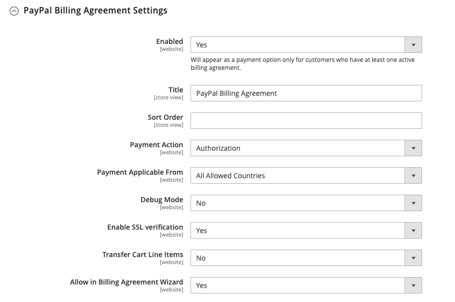

# PayPal Payments Standard

[PayPal Payments Standard][4] ist der einfachste Weg, Zahlungen online zu akzeptieren. Sie können Ihren Kunden die bequeme Bezahlung sowohl per Kreditkarte als auch per PayPal anbieten, indem Sie einfach eine Checkout-Schaltfläche zu Ihrem Geschäft hinzufügen.

>[!NOTE]
>
>Bei Händlern außerhalb der USA wird dies als _PayPal Website Payments Standard_ bezeichnet.

Mit PayPal Payments Standard können Sie Kreditkarten auf Mobilgeräten wischen. Es gibt keine monatliche Gebühr und Sie können per eBay bezahlt werden. Zu den unterstützten Kreditkarten gehören Visa, MasterCard, Discover und American Express. Darüber hinaus können Kunden direkt von ihren persönlichen PayPal-Konten bezahlen. PayPal Payments Standard ist in allen Ländern auf der weltweiten PayPal Referenzliste verfügbar.

>[!IMPORTANT]
>
>**Anforderungen an PSD2:**  
>Ab dem 14. September 2019 könnten europäische Banken Zahlungen ablehnen, die nicht den Anforderungen von [PSD2](../getting-started/compliance-payment-services-directive.md) entsprechen. Für die Einhaltung von PSD2 ist kein Eingreifen erforderlich, da alle Anforderungen von PayPal bearbeitet werden.

## Handelsanforderungen

- [PayPal-Geschäftskonto][1]

## Checkout-Workflow

Für Kunden ist PayPal Payments Standard ein einstufiger Prozess, wenn die Kreditkarteninformationen auf ihren persönlichen PayPal-Konten auf dem neuesten Stand sind.

1. **Customer Places Order** - Der Kunde klickt/tippt auf die Schaltfläche _Jetzt bezahlen_ , um den Kauf abzuschließen.

1. **PayPal verarbeitet die Transaktion** - Der Kunde wird zur PayPal-Site weitergeleitet, um die Transaktion abzuschließen.

## PayPal Payments Standard einrichten

>[!NOTE]
>
>PayPal Payments Standard kann nicht gleichzeitig mit anderen PayPal-Methoden verwendet werden, einschließlich Express Checkout. Wenn Sie Zahlungslösungen ändern, ist die zuvor verwendete Lösung deaktiviert.

>[!TIP]
>
>Klicken Sie jederzeit auf **[!UICONTROL Save Config]** , um Ihren Fortschritt zu speichern.

### Schritt 1: Konfiguration beginnen

Bei dieser Einrichtungsmethode wird davon ausgegangen, dass Sie über ein vorhandenes PayPal-Konto verfügen.

1. Wechseln Sie in der Seitenleiste _Admin_ zu **[!UICONTROL Stores]** > _[!UICONTROL Settings]_>**[!UICONTROL Configuration]**.

1. Erweitern Sie im linken Bereich den Wert **[!UICONTROL Sales]** und wählen Sie **[!UICONTROL Payment Methods]** aus.

1. Wenn Ihre Commerce-Installation über mehrere Websites, Stores oder Ansichten verfügt, setzen Sie **[!UICONTROL Store View]** auf die Store-Ansicht, auf die Sie diese Konfiguration anwenden möchten.

1. Wählen Sie im Abschnitt _[!UICONTROL Merchant Location]_die **[!UICONTROL Merchant Country]**aus, in der sich Ihr Unternehmen befindet.

   Diese Einstellung bestimmt die Auswahl der PayPal-Lösungen, die in der Konfiguration angezeigt werden.

   {width="600" zoomable="yes"}

1. Erweitern Sie **[!UICONTROL PayPal All-in-One Payment Solutions]** und klicken Sie auf **[!UICONTROL Configure]** für **[!UICONTROL Payments Standard]**.

   {width="700" zoomable="yes"}

### Schritt 2: Aktivieren und Verbinden Ihres PayPal-Kontos

{width="600" zoomable="yes"}

1. Verbinden Sie Ihr Konto für Test oder Produktion:

   - Klicken Sie zum Testen des (Entwicklungs-)Modus auf **[!UICONTROL Sandbox Credentials]** und geben Sie Ihre [PayPal-Sandbox][3]-Anmeldeinformationen ein.
   - Klicken Sie im Produktionsmodus auf **[!UICONTROL Connect with PayPal]** und geben Sie die Anmeldeinformationen Ihres Produktionskontos ein.

   Wenn Ihre Verbindung validiert wurde, können Sie fortfahren.

1. Setzen Sie **[!UICONTROL Enable this Solution]** auf `Yes`.

1. Wenn Sie Ihren Kunden [PayPal Credit](paypal.md#paypal-credit-and-pay-later) anbieten möchten, setzen Sie **[!UICONTROL Enable PayPal Credit]** auf `Yes`.

### Schritt 3: Ausführen der Einstellungen für den Payments-Standard

1. Erweitern Sie  im Abschnitt **[!UICONTROL Payments Standard]** .

   {width="600" zoomable="yes"}

1. Geben Sie den Wert **[!UICONTROL Email Associated with your PayPal Merchant Account]** ein.

   >[!IMPORTANT]
   >
   >Bei E-Mail-Adressen wird zwischen Groß- und Kleinschreibung unterschieden. Um eine Zahlung zu erhalten, muss die von Ihnen eingegebene E-Mail-Adresse mit der in Ihrem PayPal-Handelskonto angegebenen E-Mail-Adresse übereinstimmen.

   Wenn Sie kein PayPal-Konto haben, klicken Sie auf **[!UICONTROL Start accepting payments via PayPal]**.

1. Setzen Sie **[!UICONTROL API Authentication Methods]** auf einen der folgenden Werte:

   - `API Signature` - Diese PayPal-Authentifizierungsmethode ist am einfachsten zu implementieren und basiert auf Ihrem Benutzernamen, Kennwort und einer eindeutigen Zeichenfolge aus Zeichen und Zahlen, die Ihr Konto identifiziert. API-Signaturberechtigungen laufen nicht ab.
   - `API Certificate` - Diese PayPal-Authentifizierungsmethode ist sicherer und basiert auf Ihrem Benutzernamen, Kennwort und einem herunterladbaren Zertifikat. API-Anmeldeinformationen laufen nach drei Jahren ab und müssen verlängert werden.

   Führen Sie bei Bedarf Folgendes aus:

   - **[!UICONTROL API Username]**
   - **[!UICONTROL API Password]**
   - **[!UICONTROL API Signature]**

1. Wenn Sie Anmeldeinformationen aus Ihrem Sandbox-Konto verwenden, setzen Sie **[!UICONTROL Sandbox Mode]** auf `Yes`.

   Verwenden Sie beim Testen der Konfiguration in einer Sandbox nur die von PayPal empfohlenen [Kreditkartennummern][2]. Wenn Sie bereit sind, zur Produktion zu wechseln, kehren Sie zur Konfiguration zurück, setzen Sie den Sandbox-Modus auf &quot;`No`&quot;und stellen Sie eine Verbindung zu Ihrem PayPal-Produktionskonto her.

1. Wenn Ihr System einen Proxy-Server verwendet, um die Verbindung zwischen Adobe Commerce oder Magento Open Source und dem PayPal-Zahlungssystem herzustellen, setzen Sie **[!UICONTROL API Uses Proxy]** auf `Yes` und führen Sie Folgendes aus:

   - **[!UICONTROL Proxy Host]**
   - **[!UICONTROL Proxy Port]**

### Schritt 4: Einrichten von Advertise PayPal Credit / Advertise PayPal PayLater (optional)

Ab Version 2.4.3 wird PayPal PayLater in Implementierungen unterstützt, die PayPal enthalten. Diese Funktion ermöglicht es den Käufern, eine Bestellung in zweiwöchigen Tranchen zu bezahlen, anstatt den vollen Betrag zum Zeitpunkt des Kaufs zu zahlen. Das PayPal-Krediterlebnis wird nicht mehr unterstützt.

Setzen Sie **[!UICONTROL Enable PayPal PayLater Experience]** auf einen der folgenden Werte:

- `Yes` - So richten Sie Advertise PayPal PayLater ein
- `No` - So richten Sie Advertising PayPal-Guthaben ein

#### Advertise PayPal Credit

1. Erweitern Sie  im Abschnitt **[!UICONTROL Advertise PayPal Credit]** .

   {width="600" zoomable="yes"}

1. Um Ihre Kontoinformationen zu erhalten, klicken Sie auf **[!UICONTROL Get Publisher ID from PayPal]** und befolgen Sie die Anweisungen.

1. Geben Sie Ihren **[!UICONTROL Publisher ID]** ein.

   {width="600" zoomable="yes"}

1. Erweitern Sie  im Abschnitt **[!UICONTROL Home Page]** .

1. Um ein Banner auf der Seite zu platzieren, setzen Sie **[!UICONTROL Display]** auf `Yes`.

1. Setzen Sie **[!UICONTROL Position]** auf einen der folgenden Werte:

   - `Header (center)`
   - `Sidebar (right)`

1. Setzen Sie **[!UICONTROL Size]** auf einen der folgenden Werte:

   - `190 x 100`
   - `234 x 60`
   - `300 x 50`
   - `468 x 60`
   - `728 x 90`
   - `800 x 66`

1. Erweitern Sie  die verbleibenden Abschnitte und wiederholen Sie die vorherigen Schritte:

   - **[!UICONTROL Catalog Category Page]**
   - **[!UICONTROL Catalog Product Page]**
   - **[!UICONTROL Checkout Cart Page]**

#### Advertise PayPal PayLater

1. Erweitern Sie  im Abschnitt **[!UICONTROL Advertise PayPal PayLater]** .

1. Setzen Sie **[!UICONTROL Enable PayPal PayLater]** auf `Yes`.

1. Erweitern Sie  im Abschnitt **[!UICONTROL Home Page]** .

   {width="600" zoomable="yes"}

1. Um ein Banner auf der Seite zu platzieren, setzen Sie **[!UICONTROL Display]** auf `Yes`.

1. Setzen Sie **[!UICONTROL Position]** auf einen der folgenden Werte:

   - `Header (center)`
   - `Sidebar`

1. Setzen Sie **[!UICONTROL Style Layout]** auf einen der folgenden Werte:

   - `Text`
   - `Flex`

1. Setzen Sie **[!UICONTROL Logo Type]** nur für [!UICONTROL Style Layout] **[!UICONTROL Text]** auf einen der folgenden Werte:

   - `Primary`
   - `Alternative`
   - `Inline`
   - `None`

1. Setzen Sie **[!UICONTROL Logo Position]** nur für [!UICONTROL Style Layout] **[!UICONTROL Text]** auf einen der folgenden Werte:

   - `Left`
   - `Right`
   - `Top`

1. Setzen Sie **[!UICONTROL Text Color]** nur für [!UICONTROL Style Layout] **[!UICONTROL Text]** auf einen der folgenden Werte:

   - `Black`
   - `White`
   - `Monochrome`
   - `Grayscale`

1. Setzen Sie **[!UICONTROL Text Size]** nur für [!UICONTROL Style Layout] **[!UICONTROL Text]** auf einen der folgenden Werte:

   - `10px`
   - `11px`
   - `12px`
   - `13px`
   - `14px`
   - `15px`
   - `16px`

1. Setzen Sie **[!UICONTROL Ratio]** nur für [!UICONTROL Style Layout] **[!UICONTROL Flex]** auf einen der folgenden Werte:

   - `1x1`
   - `1x4`
   - `8x1`
   - `20x1`

1. Setzen Sie **[!UICONTROL Color]** nur für [!UICONTROL Style Layout] **[!UICONTROL Flex]** auf einen der folgenden Werte:

   - `Blue`
   - `Black`
   - `White`
   - `White No Border`
   - `Gray`
   - `Monochrome`
   - `Grayscale`

1. Erweitern Sie  die verbleibenden Abschnitte und wiederholen Sie die vorherigen Schritte:

   - **[!UICONTROL Catalog Product Page]**
   - **[!UICONTROL Checkout Cart Page]**
   - **Checkout-Zahlungsschritt**
   - **[!UICONTROL Catalog Category Page]**

### Schritt 5: Grundlegende Einstellungen durchführen

1. Erweitern Sie  im Abschnitt **[!UICONTROL Basic Settings - PayPal Website Payments Standard]** .

   {width="600" zoomable="yes"}

1. Geben Sie für **[!UICONTROL Title]** einen Titel ein, der diese Zahlungsmethode beim Checkout angibt.

   Es wird empfohlen, den Titel _PayPal_ für alle Store-Ansichten zu verwenden.

1. Wenn Sie mehrere Zahlungsmethoden anbieten, geben Sie eine Zahl für **[!UICONTROL Sort Order]** ein, um die Sequenz zu bestimmen, in der PayPal Payments Standard angezeigt wird, wenn es mit den anderen Zahlungsmethoden aufgeführt wird.

   Diese Zahl ist relativ zu den anderen Zahlungsmethoden. (`0` = first, `1` = second, `2` = third usw.)

1. Setzen Sie **[!UICONTROL Payment Action]** auf einen der folgenden Werte:

   - `Authorization` - Genehmigt den Kauf und legt einen Besitz an den Fonds fest. Der Betrag wird erst zurückgezogen, wenn er vom Händler eingezogen wurde.
   - `Sale` - Der Betrag des Kaufs wird genehmigt und sofort vom Konto des Kunden zurückgezogen.

1. Um die Schaltfläche _[!UICONTROL Check out with PayPal]_auf der Produktseite anzuzeigen, setzen Sie **[!UICONTROL Display on Product Details Page]**auf `Yes`.

### Schritt 6: Erweiterte Einstellungen durchführen

1. Erweitern Sie  im Abschnitt **[!UICONTROL Advanced Settings]** .

   {width="600" zoomable="yes"}

1. Um PayPal Payments Standard sowohl im Warenkorb als auch im Mini-Warenkorb verfügbar zu machen, setzen Sie **[!UICONTROL Display on Shopping Cart]** auf `Yes`.

1. Setzen Sie **[!UICONTROL Payment from Applicable Countries]** auf einen der folgenden Werte:

   - `All Allowed Countries` - Kunden aus allen in Ihrer Store-Konfiguration angegebenen [Ländern](../getting-started/store-details.md#country-options) können diese Zahlungsmethode verwenden.
   - `Specific Countries` - Nachdem Sie diese Option ausgewählt haben, wird die Liste _[!UICONTROL Payment from Specific Countries]_angezeigt. Um mehrere Länder auszuwählen, halten Sie die Strg-Taste (PC) oder die Befehlstaste (Mac) gedrückt und klicken Sie auf jede Option.

1. Um die Kommunikation mit dem Zahlungssystem in der Protokolldatei aufzuzeichnen, setzen Sie **[!UICONTROL Debug Mode]** auf `Yes`.

   >[!NOTE]
   >
   >Die Protokolldatei wird auf dem Server gespeichert und steht nur Entwicklern zur Verfügung. Gemäß PCI Data Security Standards werden Kreditkarteninformationen nicht in der Protokolldatei aufgezeichnet.

1. Um die SSL-Verifizierung zu aktivieren, setzen Sie **[!UICONTROL Enable SSL Verification]** auf `Yes`.

1. Um eine Zusammenfassung jedes Zeileneintrags in der Bestellung auf Ihrer PayPal-Zahlungsseite anzuzeigen, setzen Sie **[!UICONTROL Transfer Cart Line Items]** auf `Yes`.

   Um bis zu zehn Versandoptionen in die Zusammenfassung aufzunehmen, setzen Sie **[!UICONTROL Transfer Shipping Options]** auf `Yes`. (Diese Option wird nur angezeigt, wenn Zeileneinträge für die Übertragung festgelegt sind.)

1. Um den Bildtyp zu bestimmen, der für die PayPal-Akzeptanzschaltfläche verwendet wird, setzen Sie **[!UICONTROL Shortcut Buttons Flavor]** auf einen der folgenden Werte:

   - `Dynamic` - (Empfohlen) Zeigt ein Bild an, das dynamisch vom PayPal-Server aus geändert werden kann.
   - `Static` - Zeigt ein bestimmtes Bild an, das nicht dynamisch geändert werden kann.

1. Damit Kunden, die kein PayPal-Konto haben, mit dieser Methode einen Kauf tätigen können, setzen Sie **[!UICONTROL Enable PayPal Guest Checkout]** auf `Yes`.

1. Setzen Sie **[!UICONTROL Require Customer's Billing Address]** auf einen der folgenden Werte:

   - `Yes` - Erfordert die Rechnungsadresse des Kunden für alle Käufe.
   - `No` - Für Käufe ist die Abrechnungsadresse des Kunden nicht erforderlich.
   - `For Virtual Quotes Only` - Erfordert nur die Abrechnungsadresse des Kunden für virtuelle Anführungszeichen.

1. Damit ein Kunde mit Ihrem Store einen [PayPal-Abrechnungsvertrag](paypal-billing-agreements.md) abschließen kann, wenn im Kundenkonto keine aktiven Abrechnungsvereinbarungen verfügbar sind, setzen Sie **[!UICONTROL Billing Agreement Signup]** auf einen der folgenden Werte:

   - `Auto` - Der Kunde kann entweder während des Express-Checkout-Flusses einen Abrechnungsvertrag schließen oder eine andere Zahlungsmethode verwenden.
   - `Ask Customer` - Der Kunde kann während des Express Checkout-Workflows entscheiden, ob er einen Abrechnungsvertrag schließt.
   - `Never` - Der Kunde kann während des Express-Checkout-Workflows keinen Abrechnungsvertrag schließen.

   >[!NOTE]
   >
   >Händler müssen den technischen Support von PayPal Merchant anfordern, um Abrechnungsvereinbarungen in ihren Konten zu ermöglichen. Der Parameter _Abrechnungsvereinbarung unterschreiben_ kann erst aktiviert werden, nachdem PayPal bestätigt hat, dass Abrechnungsvereinbarungen für Ihr Händlerkonto aktiviert sind.

1. Damit der Kunde die Transaktion von der PayPal-Site ausführen kann, ohne zur Überprüfung der Bestellung zu Ihrem Store zurückzukehren, setzen Sie **[!UICONTROL Skip Order Review Step]** auf `Yes`.

### Schritt 7: Konfigurationseinstellungen abschließen und speichern

1. Füllen Sie nach Bedarf die folgenden Abschnitte für Ihren Store aus:

   - [Einstellungen der PayPal-Abrechnungsvereinbarung](#paypal-billing-agreement-settings)
   - [Berichtseinstellungen einrichten](#settlement-report-settings)
   - [Frontend-Erlebniseinstellungen](#frontend-experience-settings)

1. Klicken Sie nach Abschluss des Vorgangs auf **[!UICONTROL Save Config]**.

#### Einstellungen der PayPal-Abrechnungsvereinbarung

Ein [Abrechnungsvertrag](paypal-billing-agreements.md) ist ein Kaufvertrag zwischen dem Händler und dem Kunden, der von PayPal zur Verwendung mit mehreren Bestellungen genehmigt wurde. Während des Checkout-Prozesses wird die Zahlungsoption für die Abrechnungsvereinbarung nur für Kunden angezeigt, die bereits einen Abrechnungsvertrag mit Ihrem Unternehmen geschlossen haben. Nachdem PayPal die Vereinbarung genehmigt hat, gibt das Zahlungssystem eine eindeutige Referenz-ID aus, um jede Bestellung zu identifizieren, die der Vereinbarung zugeordnet ist. Ähnlich wie bei einer Bestellung gibt es keine Begrenzung für die Anzahl der Abrechnungsvereinbarungen, die ein Kunde mit Ihrem Unternehmen schließen kann.

1. Erweitern Sie  im Abschnitt **[!UICONTROL PayPal Billing Agreement Settings]** .

   {width="600" zoomable="yes"}

1. Setzen Sie **[!UICONTROL Enabled]** auf `Yes`.

1. Geben Sie für &quot;**[!UICONTROL Title]**&quot;einen Titel ein, der die Methode der PayPal-Abrechnungsvereinbarung während des Checkouts identifiziert.

1. Wenn Sie mehrere Zahlungsmethoden anbieten, geben Sie im Feld **[!UICONTROL Sort Order]** eine Zahl ein, um die Reihenfolge zu bestimmen, in der die Abrechnungsvereinbarung erscheint, wenn sie beim Checkout mit anderen Zahlungsmethoden aufgeführt wird.

1. Setzen Sie **[!UICONTROL Payment Action]** auf einen der folgenden Werte:

   - `Authorization` - Genehmigt den Kauf und legt einen Besitz an den Fonds fest. Der Betrag wird erst dann zurückgezogen, wenn er vom Händler &quot;erfasst&quot;wurde.
   - `Sale` - Der Betrag des Kaufs wird genehmigt und sofort vom Konto des Kunden zurückgezogen.

1. Setzen Sie **[!UICONTROL Payment Applicable From]** auf einen der folgenden Werte:

   - `All Allowed Countries` - Kunden aus allen in Ihrer Store-Konfiguration angegebenen Ländern können diese Zahlungsmethode verwenden.
   - `Specific Countries` - Nach Auswahl dieser Option wird die Liste _[!UICONTROL Payment from Specific Countries]_angezeigt. Um mehrere Länder auszuwählen, halten Sie die Strg-Taste (PC) oder die Befehlstaste (Mac) gedrückt und klicken Sie auf jedes Land.

1. Um die Kommunikation mit dem Zahlungssystem in der Protokolldatei aufzuzeichnen, setzen Sie **[!UICONTROL Debug Mode]** auf `Yes`.

   >[!NOTE]
   >
   >Die Protokolldatei wird auf dem Server gespeichert und steht nur Entwicklern zur Verfügung. Gemäß PCI Data Security Standards werden Kreditkarteninformationen nicht in der Protokolldatei aufgezeichnet.

1. Um die SSL-Verifizierung zu aktivieren, setzen Sie **[!UICONTROL Enable SSL Verification]** auf `Yes`.

1. Um eine Zusammenfassung jedes Zeileneintrags in der Bestellung des Kunden auf Ihrer PayPal-Zahlungsseite anzuzeigen, setzen Sie **[!UICONTROL Transfer Cart Line Items]** auf `Yes`.

1. Damit Kunden eine Abrechnungsvereinbarung über das Dashboard ihres Kundenkontos initiieren können, setzen Sie **[!UICONTROL Allow in Billing Agreement Wizard]** auf `Yes`.

#### Berichtseinstellungen einrichten

1. Erweitern Sie  im Abschnitt **[!UICONTROL Settlement Report Settings]** .

   {width="600" zoomable="yes"}

1. Gehen Sie für **[!UICONTROL SFTP Credentials]** wie folgt vor:

   - Wenn Sie sich für den PayPal Secure FTP Server angemeldet haben, geben Sie die folgenden SFTP-Anmeldedaten ein:

      - Anmelden
      - Kennwort

   - Um Testberichte auszuführen, bevor Sie mit Express Checkout auf Ihrer Site live gehen, setzen Sie **[!UICONTROL Sandbox Mode]** auf `Yes`.

   - Geben Sie den Wert **[!UICONTROL Custom Endpoint Hostname or IP Address]** ein.

     Der Standardwert ist `reports.paypal.com`.

   - Geben Sie den **[!UICONTROL Custom Path]** ein, in dem Berichte gespeichert werden.

     Der Standardwert ist `/ppreports/outgoing`.

1. Um Berichte planmäßig zu erstellen, führen Sie die Einstellungen für **[!UICONTROL Scheduled Fetching]** aus:

   - Setzen Sie **[!UICONTROL Enable Automatic Fetching]** auf `Yes`.

   - Setzen Sie **[!UICONTROL Schedule]** auf einen der folgenden Werte:

      - `Daily`
      - `Every 3 Days`
      - `Every 7 Days`
      - `Every 10 Days`
      - `Every 14 Days`
      - `Every 30 Days`
      - `Every 40 Days`

     PayPal behält jeden Bericht für 45 Tage bei.

   - Stellen Sie **[!UICONTROL Time of Day]** auf die Stunde, Minute und Sekunde ein, wenn die Berichte generiert werden sollen.

#### Frontend-Erlebniseinstellungen

Verwenden Sie den _[!UICONTROL Frontend Experience Settings]_, um festzulegen, welche PayPal-Logos auf Ihrer Site erscheinen, und um das Erscheinungsbild Ihrer PayPal-Händlerseiten anzupassen.

1. Erweitern Sie  im Abschnitt **[!UICONTROL Frontend Experience Settings]** .

   {width="600" zoomable="yes"}

1. Wählen Sie den **[!UICONTROL PayPal Product Logo]** aus, der im Block PayPal in Ihrem Geschäft angezeigt werden soll.

   Die PayPal Logos sind in vier Formaten und in zwei Größen erhältlich:

   - `No Logo`
   - `We Prefer PayPal (150 x 60 or 150 x 40)`
   - `Now Accepting PayPal (150 x 60 or 150 x 40)`
   - `Payments by PayPal (150 x 60 or 150 x 40)`
   - `Shop Now Using PayPal (150 x 60 or 150 x 40)`

1. So passen Sie das Erscheinungsbild Ihrer PayPal-Händlerseiten an:

   - Geben Sie den Namen des **[!UICONTROL Page Style]** ein, den Sie auf Ihre PayPal-Händlergeseiten anwenden möchten:

      - `paypal` - Verwendet den PayPal-Seitenstil.
      - `primary` - Verwendet den Seitenstil, den Sie in Ihrem Kontoprofil als _primär_ -Stil identifiziert haben.
      - `your_custom_value` - Verwendet einen benutzerdefinierten Zahlungsseitenstil, der in Ihrem Kontoprofil angegeben ist.

   - Geben Sie für &quot;**[!UICONTROL Header Image URL]**&quot;die URL des Bildes ein, das oben links auf der Zahlungsseite angezeigt werden soll. Die maximale Dateigröße ist 750 Pixel breit und 90 Pixel hoch.

     >[!NOTE]
     >
     >PayPal empfiehlt, dass sich das Bild auf einem sicheren (HTTPS-)Server befindet. Andernfalls kann ein Browser warnen, dass _die Seite sowohl sichere als auch nicht sichere Elemente enthält_.

   - Um die Farbe für Ihre Seiten festzulegen, geben Sie den sechsstelligen Hexadezimalcode ohne das `#` -Symbol für jeden der folgenden Elemente ein:

      - **[!UICONTROL Header Background Color]** - Hintergrundfarbe für die Kopfzeile der Checkout-Seite.
      - **[!UICONTROL Header Border Color]** - Farbe für einen Rahmen von zwei Pixeln um die Kopfzeile.
      - **[!UICONTROL Page Background Color]** - Hintergrundfarbe für die Checkout-Seite und um die Kopfzeile und das Zahlungsformular.

[1]: https://www.paypal.com/webapps/mpp/how-to-sell-online
[2]: https://www.paypalobjects.com/en_AU/vhelp/paypalmanager_help/credit_card_numbers.htm
[3]: https://developer.paypal.com/docs/api-basics/sandbox/
[4]: https://developer.paypal.com/docs/paypal-payments-standard/mobile-paypal-payments-standard/
