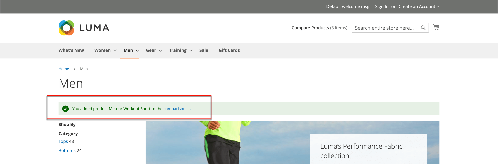

# Produkte vergleichen

„Produkte vergleichen“ generiert einen detaillierten, nebeneinander angezeigten Vergleich von zwei oder mehr Produkten. Je nach Design kann der Link Zu Vergleich hinzufügen durch ein Symbol oder einen Text dargestellt werden. Der _Produkte vergleichen_ wird normalerweise in der linken oder rechten Seitenleiste einer Katalogseite angezeigt.

{width="700" zoomable="yes"}

Im Gegensatz zum Block [Kürzlich angezeigte/](products-viewed-compared.md) Produkte“ enthält der Administrator keine zusätzlichen Konfigurationseinstellungen für „Produkte vergleichen“.

## Produkte in der Storefront vergleichen

Es gibt einige Möglichkeiten, die Vergleichsliste in der Storefront zu verwenden.

### Von Katalogseiten

1. Der Kunde findet die Produkte, die er vergleichen möchte, und klickt jeweils auf den **[!UICONTROL Add to Compare]** Link.

1. Navigiert zu einer zugehörigen Kategorieseite.

   Je nach Design und Seiten-Layout kann es einen Block _Produkte vergleichen_ in der Seitenleiste geben. Wenn ja, werden die Elemente in der Kategorie aufgelistet, die für einen Vergleich markiert sind.

   Der Kunde kann auf _Löschen_ ( ) klicken, um es aus dem Vergleichsbericht zu entfernen, oder auf **[!UICONTROL Clear All]** klicken, um alle Elemente zu entfernen und mit der Vergleichsauswahl von vorne zu beginnen.

1. Klicks **[!UICONTROL Compare]**.

1. Um die Vergleichsinformationen zu drucken, klicken Sie auf **[!UICONTROL Print This Page]**.

1. Um ein einzelnes Produkt aus der Vergleichsseite zu entfernen, klicken Sie auf _Löschen_ (  ).

### Von einer Benachrichtigung

1. Nachdem ein Kunde ein Produkt zu einer Vergleichsliste hinzugefügt hat, wird auf der Seite eine Benachrichtigung angezeigt.

1. Klicken Sie in der angezeigten Benachrichtigung oben auf den Link _Vergleichsliste_.

   {width="700" zoomable="yes"}

Diese Aktion leitet den Kunden zur Vergleichsliste weiter, wo er auf zusätzliche Aktionen zugreifen kann.

### Im Block _Produkte vergleichen_

1. Der Kunde findet die Produkte, die er vergleichen möchte, und klickt jeweils auf den **[!UICONTROL Add to Compare]** Link.

1. Klicken Sie in der Kopfzeile neben dem Suchfeld auf den Link _Produkte vergleichen_.

   {width="700" zoomable="yes"}

### Vom Dashboard Mein Konto aus

1. Der Kunde fügt benötigte Produkte zur Vergleichsliste hinzu.

1. Navigiert zu **[!UICONTROL My Account]**.

1. Klicken Sie im _Produkte vergleichen_ auf **[!UICONTROL Compare]**.

   {width="700" zoomable="yes"}

## Zusätzliche Aktionen der Vergleichsliste

| [!UICONTROL Action] | Beschreibung |
|------|-----------|
|  | Löscht ein einzelnes Element aus der Vergleichsliste. |
| **[!UICONTROL Add to Cart]** | Fügt Produkt in den Warenkorb. Wenn das Produkt über Konfigurationen verfügt, leitet die Seite den Kunden zur Produktseite um, wo er die konfigurierbaren Optionen auswählt, und klickt dann auf **[!UICONTROL Add to Cart]**. |
| _Wunschzettel-Symbol_ | Fügt Produkt in die Wunschliste ein (erfordert, dass die Wunschlistenfunktion in der Store-Konfiguration aktiviert ist). |
| _Diese Seite drucken_ | Druckt die Vergleichslistenseite. |

{style="table-layout:auto"}
