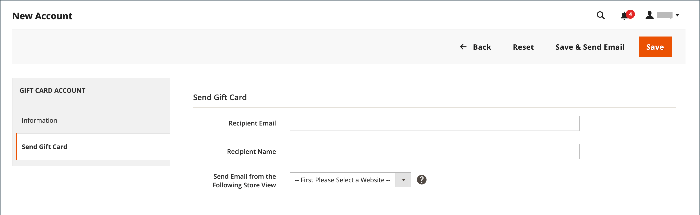

# Geschenkkartenkonten

Für jede gekaufte Geschenkkarte wird automatisch ein Geschenkkartenkonto erstellt. Der Wert der Geschenkkarte kann dann auf den Kauf eines Produkts in Ihrem Geschäft angewendet werden. Sie können Geschenkkartenkonten auch über den Administrator als Promotion oder Service für Kunden erstellen. Die Kontonummer des Geschenkgutscheins entspricht dem Geschenkgutschein-Code.

{width="700" zoomable="yes"}

## Konfigurieren von Geschenkkartenkonten

Die Geschenkgutscheinkonfiguration legt die Standardeinstellungen für alle Geschenkgutscheine für die Store-Ansicht fest und verwaltet den Code-Pool. Der Code-Pool ist ein Satz eindeutiger Geschenkkartencodes in einem bestimmten Format. Codes aus dem Pool werden jedes Mal verwendet, wenn ein Geschenkkartenkonto erstellt wird. Es liegt in der Verantwortung des Store-Administrators sicherzustellen, dass genügend Codes für den Verkauf von Geschenkkarten verfügbar sind. Stellen Sie sicher, dass Sie einen Code-Pool generieren, bevor Sie Geschenkkarten zum Verkauf anbieten. Standardmäßig generiert Adobe Commerce 1.000 Codes. Ein neuer Code-Pool wird erst dann generiert, wenn im aktuellen Pool keine Codes mehr verfügbar sind.

### Schritt 1: Konfigurieren von E-Mail-Benachrichtigungen

1. Navigieren Sie in _Admin_-Seitenleiste zu **[!UICONTROL Stores]** > _[!UICONTROL Settings]_>**[!UICONTROL Configuration]**.

1. Erweitern Sie im linken Bereich **[!UICONTROL Sales]** und wählen Sie **[!UICONTROL Gift Cards]**.

1. Erweitern Sie  den Abschnitt _[!UICONTROL Gift Card Email Settings]_und führen Sie folgende Schritte aus:

   - Legen Sie **[!UICONTROL Gift Card Notification Email Sender]** auf die Store-Identität fest, die als Absender von Geschenkgutschein-Benachrichtigungen angezeigt wird.

   - Legen Sie **[!UICONTROL Gift Card Notification Email Template]** auf die Vorlage fest, die für die Benachrichtigung verwendet wird.

   {width="600" zoomable="yes"}

1. Erweitern Sie  den Abschnitt _[!UICONTROL Email Sent from Gift Card Account Management]_und führen Sie folgende Schritte aus:

   - Legen Sie **[!UICONTROL Gift Card Email Sender]** auf die Store-Identität fest, damit sie als Absender der Geschenkkarten angezeigt wird.

   - Legen Sie **[!UICONTROL Gift Card Template]** auf die Vorlage fest, die Sie für die Geschenkkarte verwenden möchten.

Siehe [Speichern von E-Mail](../configuration-reference/general/store-email-addresses.md)Adressen für spezifische Konfigurationsfelder und Optionen.

### Schritt 2: Vervollständigen Sie die allgemeinen Einstellungen

1. Erweitern Sie  den Abschnitt _[!UICONTROL Gift Card General Settings]_.

1. Damit der Kunde den Wert auf der Karte gegen Bargeld einlösen kann, setzen Sie **[!UICONTROL Redeemable]** auf `Yes`.

1. Geben Sie **[!UICONTROL Lifetime (days)]** die Anzahl der Tage ein, nach denen die Karte abläuft.

   Wenn kein Ablaufdatum vorhanden ist, lassen Sie das Feld leer.

   >[!NOTE]
   >
   >Je nach Standort kann es illegal sein, dass Geschenkgutscheine ablaufen. Überprüfen Sie Ihre lokalen Gesetze, bevor Sie eine Lebensdauer für Ihre Geschenkgutscheine festlegen.

1. Um Kunden die Möglichkeit zu geben, eine Nachricht einzugeben, die der Geschenkkarte beigefügt werden soll, setzen Sie **[!UICONTROL Allow Gift Message]** auf `Yes` und geben Sie die Anzahl der für die Nachricht verfügbaren Zeichen für die **[!UICONTROL Gift Message Maximum Length]** ein.

1. Legen Sie **[!UICONTROL Generate Gift Card Account when Orders Item is]** auf eine der folgenden Einstellungen fest:

   - `Ordered` - Das Geschenkkartenkonto wird bei der Bestellung erstellt.
   - `Invoiced` - Das Geschenkkartenkonto wird erstellt, nachdem die Zahlung erfasst und die Bestellung in Rechnung gestellt wurde.

   {width="600" zoomable="yes"}

### Schritt 3: Erstellen des Geschenkkarten-Code-Pools

1. Erweitern Sie  den Abschnitt _[!UICONTROL Gift Card Account General Settings]_und führen Sie folgende Schritte aus:

   {width="600" zoomable="yes"}

   - Um den Code anzupassen, füllen Sie Folgendes entsprechend Ihren Anforderungen aus:

      - Codelänge
      - Codeformat
      - Code-Präfix
      - Code-Suffix
      - Strich alle X Zeichen

   - Geben Sie die **[!UICONTROL New Pool Size]** ein, um die Anzahl der zu generierenden Codes zu bestimmen.

   - Um anzugeben, wann Sie die Benachrichtigung erhalten, dass der Code-Pool wieder vorrätig sein soll, geben Sie den **[!UICONTROL Low Code Pool Threshold]** ein.

1. Bevor Sie den Code-Pool generieren, klicken Sie auf **[!UICONTROL Save Config]**.

1. Klicken Sie auf **[!UICONTROL Generate]**.

1. Klicken Sie abschließend auf **[!UICONTROL Save Config]**.

## Überprüfen eines vorhandenen Geschenkkartenkontos

1. Gehen Sie wie folgt vor, um die Nummer des Geschenkkartenkontos für eine aktuelle Bestellung zu ermitteln:

   - Navigieren Sie in _Admin_-Seitenleiste zu **[!UICONTROL Sales]** > _[!UICONTROL Operations]_>**[!UICONTROL Orders]**.

   - Suchen Sie die Reihenfolge in der Liste und klicken Sie in der Spalte _[!UICONTROL Action]_auf **[!UICONTROL View]**.

   - Scrollen Sie nach unten zum Abschnitt _[!UICONTROL Items Ordered]_.

   Die Zahl befindet sich in der Spalte _[!UICONTROL Product]_unter **[!UICONTROL Gift Card Accounts]**.

1. Navigieren Sie in _Admin_-Seitenleiste zu **[!UICONTROL Marketing]** > _[!UICONTROL Promotions]_>**[!UICONTROL Gift Card Accounts]**.

1. Suchen Sie das Geschenkkartenkonto im Raster und öffnen Sie es im Bearbeitungsmodus.

   Der Geschenkkartencode wird oben im Abschnitt _Informationen_ angezeigt.

   {width="600" zoomable="yes"}

## Erstellen eines Geschenkkartenkontos

1. Navigieren Sie in _Admin_-Seitenleiste zu **[!UICONTROL Marketing]** > _[!UICONTROL Promotions]_>**[!UICONTROL Gift Card Accounts]**.

1. Klicken Sie oben rechts auf **[!UICONTROL Add Gift Card Account]**.

1. Legen Sie im Abschnitt _[!UICONTROL Information]_den Wert **[!UICONTROL Active]**auf `Yes` fest und führen Sie folgende Schritte aus:

   - Damit der Kartensaldo an der Kasse eingelöst oder auf das Guthaben des Kunden übertragen werden kann, setzen Sie **[!UICONTROL Redeemable]** auf `Yes`.

   - Wählen Sie die **[!UICONTROL Website]** aus, in der das Geschenkkartenkonto verwendet werden kann.

   - Geben Sie den ersten **[!UICONTROL Balance]** auf der Geschenkkarte ein.

   - _(Optional)_ Um einen **[!UICONTROL Expiration Date]** für die Geschenkkarte festzulegen, wählen Sie das Datum aus dem Kalender .

     Wenn Sie das Feld leer lassen, läuft das Geschenkkartenkonto nicht ab.

     {width="600" zoomable="yes"}

1. Wählen Sie im linken Bedienfeld **[!UICONTROL Send Gift Card]** aus und führen Sie folgende Schritte aus:

   - Geben Sie die **[!UICONTROL Recipient Email]** ein.

   - Geben Sie die **[!UICONTROL Recipient Name]** ein.

   - Legen Sie **[!UICONTROL Send Email from the Following Store View]** auf die Store-Ansicht fest, die als Absender der Geschenkgutschein-Benachrichtigung angezeigt wird.

   {width="600" zoomable="yes"}

1. Führen Sie einen der folgenden Schritte aus, um das neue Konto zu speichern:

   - Wenn Sie noch nicht bereit sind, die Geschenkkarte zu senden, klicken Sie auf **[!UICONTROL Save]**.

   - Um die Änderungen zu speichern und die Geschenkkarte per E-Mail an den Empfänger zu senden, klicken Sie auf **Speichern und E-Mail**.

## Verlauf des Geschenkkartenkontos anzeigen

1. Navigieren Sie zu **[!UICONTROL Marketing]** > _[!UICONTROL Promotions]_>**[!UICONTROL Gift Card Accounts]**.

1. Öffnen Sie die Geschenkkarte im Bearbeitungsmodus.

1. Die **[!UICONTROL History]** der Geschenkkarte wird angezeigt.

   {width="600" zoomable="yes"}

| Spalte | Beschreibung |
|--- |--- |
| [!UICONTROL ID] | Eine eindeutige Nummer der Aktion mit Geschenkkarte. |
| [!UICONTROL Date] | Datum der Aktion. |
| [!UICONTROL Action] | Bestimmt alle möglichen Aktionen mit einer Geschenkkarte. Optionen: `Created` / `Updated` / `Sent` / `Used` / `Redeemed` / `Expired` |
| [!UICONTROL Balance Change] | Zeigt den Betrag an, um den sich der Saldo der Geschenkkarte geändert hat. |
| [!UICONTROL Balance] | Gibt den verfügbaren Saldo an. |
| [!UICONTROL More Information] | Zeigt Informationen darüber an, wer den Saldo der Geschenkkarte geändert hat. |

{style="table-layout:auto"}

## Löschen eines Geschenkkartenkontos

1. Navigieren Sie in _Admin_-Seitenleiste zu **[!UICONTROL Marketing]** > _[!UICONTROL Promotions]_>**[!UICONTROL Gift Card Accounts]**.

1. Wählen Sie das zu löschende Geschenkkartenkonto aus und öffnen Sie es im Bearbeitungsmodus.

1. Klicken Sie in der Menüleiste auf **[!UICONTROL Delete]**.

1. Um die Aktion zu bestätigen, klicken Sie auf **[!UICONTROL OK]**.

## Spaltenbeschreibungen

| Spalte | Beschreibung |
|--- |--- |
| [!UICONTROL ID] | Eine eindeutige numerische Kennung, die einem Geschenkkartenkonto zugewiesen ist. |
| [!UICONTROL Code] | Der Code, der zum Anwenden einer Geschenkkarte eingegeben werden muss. |
| [!UICONTROL Website] | Zeigt die Websites an, auf denen das Geschenkkartenkonto verfügbar ist. |
| [!UICONTROL Created] | Erstellungsdatum. |
| [!UICONTROL End] | Ablaufdatum der Geschenkkarte, falls geplant. |
| [!UICONTROL Active] | Bestimmt, ob die Geschenkkarte aktiv ist. |
| [!UICONTROL Status] | Bestimmt, ob die Geschenkkarte im Konto des Kunden eingelöst wird oder verfügbar ist. Optionen: `Used` / `Redeemed` / `Expired` |
| [!UICONTROL Balance] | Gibt den verfügbaren Saldo an. |

{style="table-layout:auto"}
