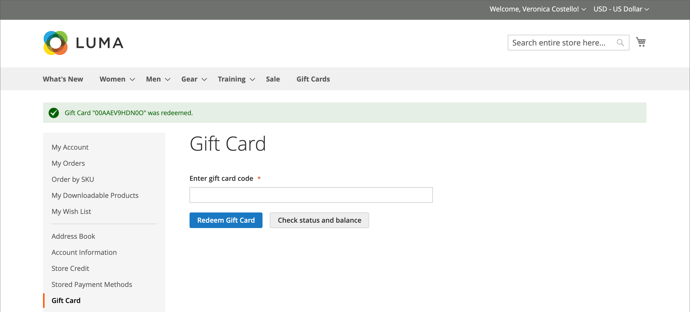

# Kauf und Einlösung von Geschenkkarten

{{ee-feature}}

Geschenkgutscheine werden im Warenkorb auf ähnliche Weise eingelöst, wie ein Coupon auf eine Bestellung angewendet wird. Während des Checkouts gibt der Käufer den Geschenkkartencode ein, um einen Betrag von der Geschenkkarte auf den Kauf anzuwenden. Geschenkkarteninhaber, die Kundenkonten haben, können den Status und den Restbetrag über ihr Konto-Dashboard überprüfen. Einzelne und mehrere Geschenkkarten können verwendet werden, um eine Bestellung ganz oder teilweise zu bezahlen.

Der angewendete Geschenkkartencode kann durch Öffnen der Bestellung im _Admin_ angezeigt werden. Dadurch können Sie den Code abrufen, um ihn bei Bedarf auf einer physischen Geschenkkarte zu platzieren. Wenn eine Geschenkkartenbestellung storniert oder rückerstattet wird, müssen Sie das zugehörige Geschenkkartenkonto manuell stornieren. Sie können das Konto entweder vollständig löschen oder deaktivieren.

{width="700" zoomable="yes"}

Beispielsweise kann ein Kunde, der im Demo-Luma-Store einkauft, entweder eine virtuelle oder eine physische Geschenkkarte erwerben.

**Virtuelle Geschenkkarte** - Eine virtuelle Geschenkkarte von Luma wird per E-Mail mit einer optionalen Nachricht an den Empfänger gesendet. Es kann auf jeder der Websites der Luma-Familie eingelöst werden und läuft nie ab.

**Physische Geschenkkarte** - Eine Luma-Geschenkkarte wird in einem benutzerdefinierten Kunst-Mailer verpackt und kostenlos an den Empfänger gesendet. Es kann im Voraus produziert werden, mit einzigartigen Codes gekennzeichnet und im Geschäft, per Telefon oder auf jeder der Luma-Familie von Websites eingelöst werden. Er läuft nie ab.

**Kombinierte Geschenkkarte** - Eine kombinierte Geschenkkarte hat die Eigenschaften einer virtuellen und physischen Geschenkkarte. Eine kombinierte Luma-Geschenkkarte wird versendet und per E-Mail an den Empfänger gesendet. Die E-Mail-Adresse und die Lieferadresse werden beim Kauf der Geschenkkarte benötigt. Er läuft nie ab.

## Lebenszyklus einer Geschenkkarte

1. **Der Kunde bestimmt den Wert der Geschenkkarte**.

   Der Kunde bestimmt den Wert der Geschenkkarte von der Produktseite aus. Je nach Konfiguration gibt es entweder ein Feld Festpreis, eine Liste von Preisoptionen oder beides. Alle Beträge werden in der Währung angezeigt, die im Geschäft verwendet wird.

1. **Der Kunde füllt die Geschenkkarteninformationen aus**.

   Bei einer physischen Geschenkkarte gibt der Kunde den **Absendernamen)** &quot;**&quot;**. Bei virtuellen oder kombinierten Geschenkkarten gibt der Kunde auch die Absender **E-Mail-Adresse** die Empfänger **E-Mail**. Wenn der Kunde angemeldet ist, wird der Absendername (und ggf. die Absender-E-Mail) automatisch aus seinem Konto eingegeben. Abhängig von der Konfiguration kann der Kunde auch eine Nachricht an den Empfänger eingeben.

1. **Kunde schließt Checkout ab**.

   Die Geschenkkarte wird als ein Zeileneintrag im Warenkorb mit Details angezeigt, der den Namen des Absenders, Empfängers und gegebenenfalls der Nachricht anzeigt. Der mit der Geschenkkarte verknüpfte Betrag wird in die Basiswährung des Geschäfts umgerechnet, wenn er zum Warenkorb hinzugefügt wird.

1. **Der Kunde erhält eine Bestätigung der Bestellung**.

   Der Geschenkkartenkäufer kann auf den Link in der Bestätigung klicken, um die Bestellung über sein Konto-Dashboard zu verfolgen.

1. **Der Empfänger erhält die Geschenkkarte**.

   Bei virtuellen oder kombinierten Geschenkkarten erhält der Empfänger eine E-Mail mit dem Geschenkkartencode, dem Namen des Absenders und gegebenenfalls der Nachricht. Wenn mehrere Geschenkgutscheine in einer Bestellung gekauft werden und der Typ entweder virtuell oder kombiniert ist, werden alle entsprechenden Geschenkgutscheincodes in einer einzigen E-Mail an den Empfänger gesendet. Physische Geschenkkarten können direkt an den Empfänger oder an den Kunden versendet werden, der dann die Geschenkkarte persönlich an den Empfänger liefern kann.

1. **Empfänger wendet Geschenkkarte auf den Kauf an**.

   Der Empfänger kauft einen Artikel in Ihrem Geschäft und wendet den Geschenkkartencode während des Checkouts an. Jedes Mal, wenn während des Checkouts eine Geschenkkarte angelegt wird, erscheint der Betrag im Block Bestellsummen und wird von der Gesamtsumme abgezogen. Der gesamte Saldo jeder Geschenkkarte wird von der Summe des Warenkorbs abgezogen. Wenn mehrere Geschenkkarten für einen Kauf verwendet werden, werden sie in aufsteigender Reihenfolge angewendet, beginnend mit der Karte mit dem kleinsten verbleibenden Restbetrag, bis alle angewendet werden oder die Gesamtsumme null ist. Wenn die Gesamtsumme null erreicht, wird das letzte auf den Warenkorb angewendete Geschenkkartenkonto teilweise abgezogen. Alle Karten, die nicht auf den Warenkorb gelegt wurden, erhalten keinen Saldoabzug. Die Beträge werden erst nach der Bestellung von den Geschenkgutscheinkonten abgezogen.

## Storefront-Erlebnis

So funktionieren Geschenkkarten in der Storefront:

- Der Geschenkkartencode kann im Warenkorb oder an der Kasse angewendet werden, um den Gesamtbetrag der Bestellung abzudecken.

- Im Katalog wird eine Geschenkkarte als separater Produkttyp präsentiert.

- Der Gutscheincode wird nach Rechnungsstellung der Bestellung aktiviert. Wenn die Bestellung nicht bezahlt wird, kann der empfangende Kunde die Geschenkkarte nicht verwenden.

- Konten für Geschenkcodes werden erstellt, um den Saldo eines bestimmten Gutscheins zu verfolgen. Ein Filialadministrator kann den Saldo manuell anpassen.

Der empfangende Kunde kann den _[!UICONTROL Gift Card]_Abschnitt seines Konto-Dashboards verwenden, um den Saldo seines [Geschenkkartenkontos](product-gift-card-accounts.md) zu überprüfen und Geschenkkarten für [Store-Guthaben](../customers/store-credit-using.md) einzulösen.

{width="700" zoomable="yes"}

### Überprüfen Sie den Status und den Saldo der Geschenkkarte

1. In der Storefront meldet sich der Kunde an und öffnet die Seite seines Kundenkontos.

1. Der Kunde öffnet die **[!UICONTROL Gift Card]** und gibt den Geschenkkartencode ein.

1. Der Kunde klickt auf **[!UICONTROL Check status and balance]**.

{width="700" zoomable="yes"}

Der Saldo der Geschenkkarte wird angezeigt.

### Aktivierung der Geschenkkarte

1. Auf der Seite _[!UICONTROL Gift Card]_gibt der Kunde den Geschenkkartencode ein.

1. Der Kunde klickt auf **[!UICONTROL Redeem Gift Card]**.

{width="700" zoomable="yes"}

Der Betrag der Geschenkkarte wird aktiviert und zum gesamten Kontostand des Geschäfts hinzugefügt.

{width="700" zoomable="yes"}

Alle Vorgänge für den Guthaben der Geschenkkarte sind auf der Seite _[!UICONTROL Store Credit]_verfügbar.

### Anwenden einer Geschenkkarte während des Checkouts

Wenn die Geschenkkarte nicht einlösbar ist, kann ein Kunde den Geschenkkartencode während des Checkouts anwenden.

1. Während des Schritts _Überprüfen und Zahlungen_ klickt der Kunde auf **[!UICONTROL Apply Gift Card]**.

1. Gibt den Geschenkkartencode ein und klickt dann auf **[!UICONTROL Apply]**.

   Der Rabatt sollte sich in der _[!UICONTROL Order Summary]_widerspiegeln.

1. Klicken Sie auf **[!UICONTROL Place Order]** , um die Bestellung abzuschließen.
