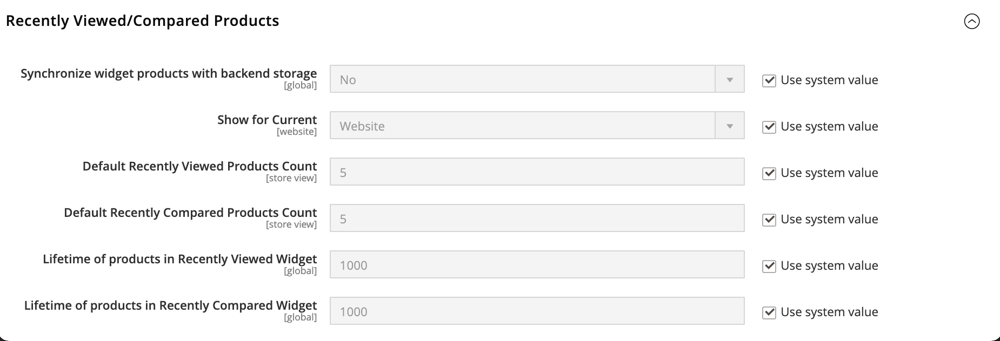

# Kürzlich angesehene oder verglichene Produkte

Die _Kürzlich angezeigt und Kürzlich verglichen_ Blöcke werden normalerweise in der rechten Seitenleiste einer Katalogseite angezeigt. Die Anzahl der in jedem aufgelisteten Produkte kann für jede Website-, Store- oder Store-Ansicht konfiguriert werden.

**_So konfigurieren Sie kürzlich angezeigte und verglichene Produkte:_**

1. Navigieren Sie in _Admin_-Seitenleiste zu **[!UICONTROL Stores]** > _[!UICONTROL Settings]_>**[!UICONTROL Configuration]**.

1. Erweitern Sie im linken Bereich **[!UICONTROL Catalog]** und wählen Sie darunter **[!UICONTROL Catalog]**.

1. Erweitern Sie  den Abschnitt **[!UICONTROL Recently Viewed/Compared Products]** .

   {width="600" zoomable="yes"}

   Eine ausführliche Beschreibung jeder dieser Konfigurationseinstellungen finden Sie unter [Kürzlich angezeigte/verglichene Produkte](../configuration-reference/catalog/catalog.md#recently-viewedcompared-products) im _Konfigurationsreferenzhandbuch_.

1. Legen Sie **[!UICONTROL Synchronize widget products with backend storage]** fest, um Produkt-Widget-Informationen wie Produkt-ID mit Ihrer aktuellen Produktspeicherverfügbarkeit in der Datenbank zu synchronisieren und diese Informationen auf verschiedenen Geräten wiederzuverwenden.

1. Legen Sie **[!UICONTROL Show for Current]** auf die Website-, Store- oder Store-Ansicht fest, für die die Konfiguration gilt.

1. Geben Sie **[!UICONTROL Default Recently Viewed Products Count]** die Anzahl der zuletzt angezeigten Produkte ein, die in der Liste angezeigt werden sollen.

1. Geben Sie **[!UICONTROL Default Recently Compared Products Count]** die Anzahl der zuletzt verglichenen Produkte ein, die in der Liste angezeigt werden sollen.

1. Geben Sie **[!UICONTROL Lifetime of products in Recently Viewed Widget]** einen beliebigen Zeitraum in Sekunden ein, der größer als null ist.

   Diese Einstellung legt fest, wie lange die angezeigten Produkte in der zuletzt angezeigten Liste angezeigt werden.

1. Geben Sie **[!UICONTROL Lifetime of products in Recently Compared Widget]** einen beliebigen Zeitraum in Sekunden ein, der größer als null ist.

   Diese Einstellung bestimmt, wie lange die verglichenen Produkte in der Liste der zuletzt verglichenen Produkte angezeigt werden.

1. Klicken Sie abschließend auf **[!UICONTROL Save Config]**.
