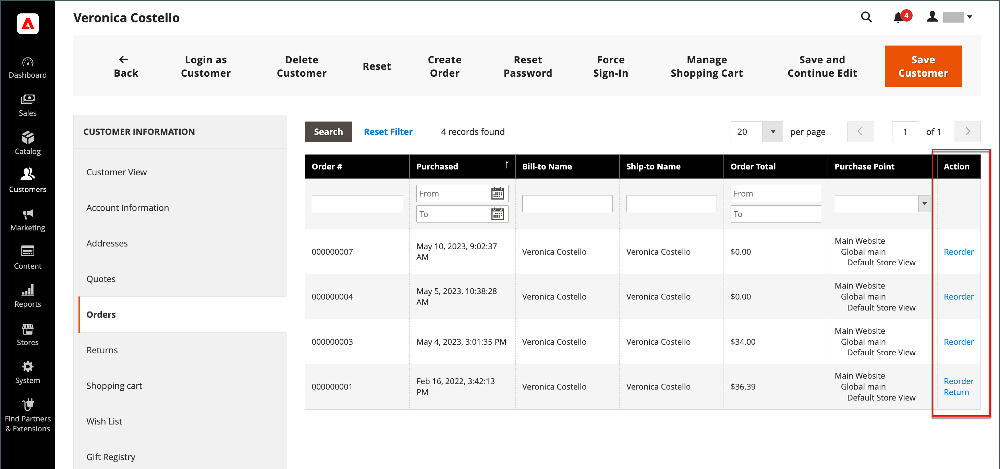
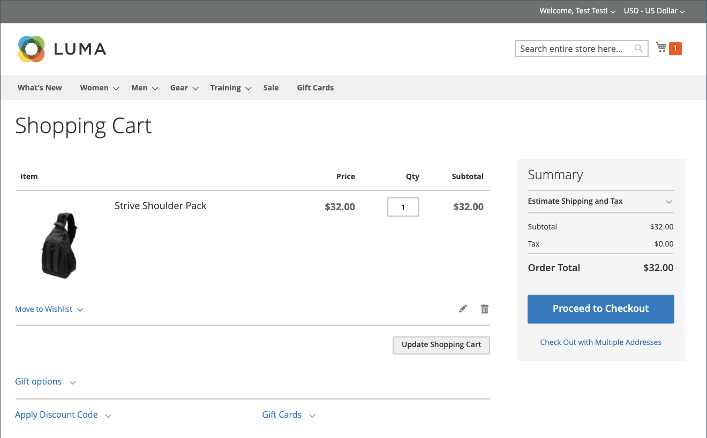

# Neuberechtigungen zulassen

Wenn diese Option aktiviert ist, können Neubestellungen direkt über das Kundenkonto oder über die ursprüngliche Bestellung in _Admin_ erfolgen. Die Neuanordnung ist standardmäßig aktiviert.

{width="700" zoomable="yes"}

## Kriterien für die Neuanordnung, die für eine Bestellung aktiviert werden sollen

- Die Konfigurationsoption _Neuanordnung zulassen_ muss aktiviert sein.

- Wenn die Reihenfolge den Status `Hold` oder `Payment Review` aufweist, ist die Option &quot;Neu anordnen&quot;deaktiviert.

- Wenn eines der Elemente in der Reihenfolge nicht verfügbar, nicht vorrätig oder deaktiviert ist, wird die Option &quot;Neu anordnen&quot;im Storefront deaktiviert.

- Ein _Admin_ kann die Reihenfolge selbst dann ändern, wenn eines der Elemente nicht vorrätig oder deaktiviert ist.

## Konfigurieren, um Neubestellungen von Kunden zuzulassen

1. Wechseln Sie in der Seitenleiste _Admin_ zu **[!UICONTROL Stores]** > _[!UICONTROL Settings]_>**[!UICONTROL Configuration]**.

1. Erweitern Sie im linken Bedienfeld den Wert **[!UICONTROL Sales]** und wählen Sie unter &quot;**[!UICONTROL Sales]**&quot;.

1. Erweitern Sie  im Abschnitt **[!UICONTROL Reorder]** .

   {width="600" zoomable="yes"}

1. Setzen Sie **[!UICONTROL Allow Reorder]** auf `Yes`.

   Diese Einstellung ermöglicht die Neuanordnungsfunktion über das Kundenkonto in der Storefront oder der Liste der Bestellungen in der Admin-Konsole.

1. Klicken Sie auf **[!UICONTROL Save Config]**.

## Von der Storefront neu anordnen

Ein Kunde kann die Neuanordnungsfunktion für eine bestimmte Bestellung von zwei Seiten aus initiieren:

- Seite _Meine Bestellungen_

- Seite _Bestellansicht_

### Meine Bestellungen

Die Schaltfläche _Neu anordnen_ wird immer in der Liste mit Bestellungen angezeigt (auch wenn nicht alle Produkte aus der Bestellung zur Neubestellung verfügbar sind).

{width="700" zoomable="yes"}

**1. Fall.** Alle Produkte aus der Bestellung sind **verfügbar** für Neuanordnung

Der Benutzer wird zum Warenkorb umgeleitet und alle Produkte werden zum Warenkorb hinzugefügt.

{width="700" zoomable="yes"}

**2. Fall.** Einige/alle Produkte aus der Bestellung sind **nicht verfügbar** für Neuanordnung

>[!NOTE]
>
>Es ist möglich, `Not Visible Individually` -Produkte neu anzuordnen.

Die Schaltfläche _Neu anordnen_ wird nicht auf den Seiten _Meine Bestellungen_ und _Bestellung anzeigen_ angezeigt.

{width="700" zoomable="yes"}

### Bestellseite

**1. Fall.** Alle Produkte aus der Bestellung sind zur Neubestellung verfügbar

Der Benutzer wird zum Warenkorb umgeleitet und alle Produkte werden zum Warenkorb hinzugefügt.

**2. Fall.** Einige/alle Produkte aus der Bestellung sind **nicht verfügbar** für Neuanordnung

>[!NOTE]
>
>Es ist möglich, `Not Visible Individually` -Produkte neu anzuordnen.

Die Schaltfläche _Neu anordnen_ wird nicht auf den Seiten _Meine Bestellungen_ und _Bestellung anzeigen_ angezeigt.

{width="700" zoomable="yes"}

### Der Warenkorb ist nicht leer

Wenn der Warenkorb nicht leer ist und der Benutzer auf &quot;**[!UICONTROL Reorder]**&quot;(auf der Seite &quot;_Meine Bestellungen_&quot;oder &quot;_Bestellansicht_&quot;) klickt, bleiben die vorhandenen Produkte mit den hinzugefügten Produkten zur Neuanordnung im Warenkorb.

{width="700" zoomable="yes"}

## Von Admin neu anordnen

1. Wechseln Sie in der Seitenleiste _Admin_ zu **[!UICONTROL Sales]** > **[!UICONTROL Orders]**.

1. Suchen Sie die Reihenfolge und öffnen Sie sie im Modus **[!UICONTROL View]** .

1. Klicken Sie auf **[!UICONTROL Reorder]** , der in der oberen Schaltflächenleiste angezeigt wird.

   {width="600" zoomable="yes"}

   Nachdem Sie auf **[!UICONTROL Reorder]** geklickt haben, wird die Seite _Neue Bestellung erstellen_ mit der Neuanordnung von Produkten geöffnet.

   {width="600" zoomable="yes"}

1. Füllen Sie nach Bedarf alle erforderlichen Felder aus.

1. Um die Bestellung abzuschicken, klicken Sie auf **[!UICONTROL Submit Order]**.
