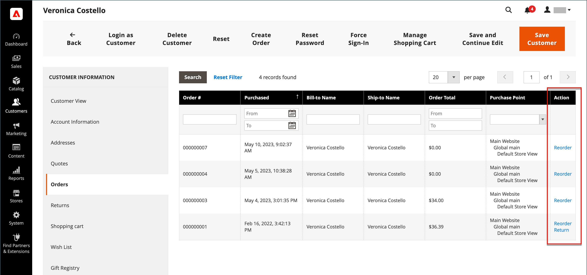
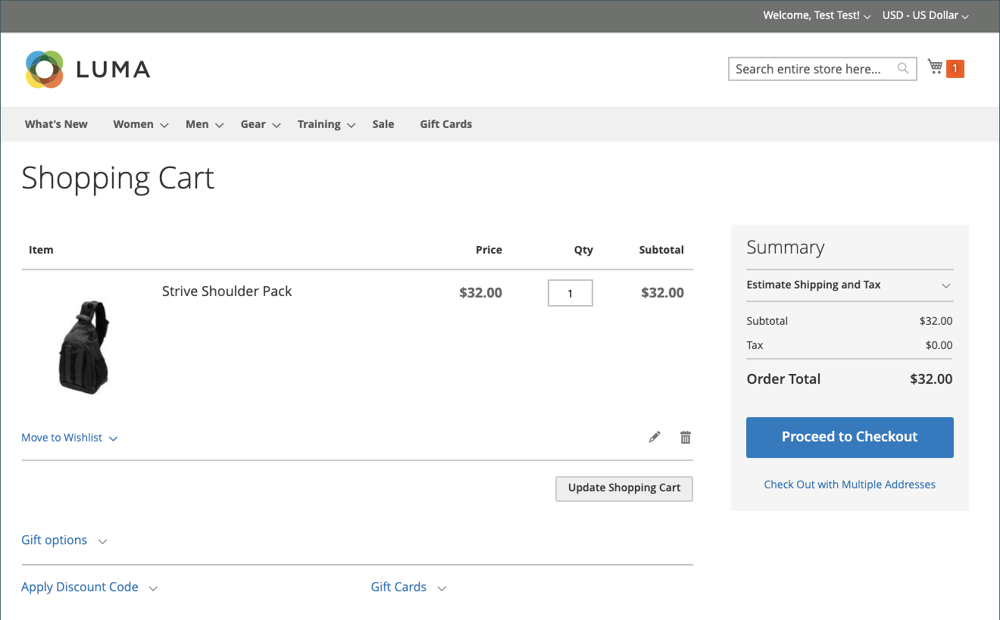

# Neuanordnung von Datensätzen zulassen

Wenn diese Option aktiviert ist, können Neubestellungen direkt über das Kundenkonto oder über die ursprüngliche Bestellung in der _Admin_ vorgenommen werden. Neuanordnungen sind standardmäßig aktiviert.

{width="700" zoomable="yes"}

## Kriterien für die Aktivierung der Neuanordnung für eine Bestellung

- Die _„Neu anordnen_ zulassen“ muss aktiviert sein.

- Wenn sich die Bestellung im Status `Hold` oder `Payment Review` befindet, ist die Option zur Neuanordnung deaktiviert.

- Wenn eines der Elemente in der Bestellung nicht verfügbar, nicht vorrätig oder deaktiviert ist, ist die Option zur Neuanordnung in der Storefront deaktiviert.

- Ein _Administrator_ kann Artikel auch dann neu anordnen, wenn diese nicht vorrätig oder deaktiviert sind.

## Konfigurieren, um Neubestellungen durch Kunden zuzulassen

1. Navigieren Sie in _Admin_-Seitenleiste zu **[!UICONTROL Stores]** > _[!UICONTROL Settings]_>**[!UICONTROL Configuration]**.

1. Erweitern Sie im linken Bereich **[!UICONTROL Sales]** und wählen Sie darunter **[!UICONTROL Sales]**.

1. Erweitern Sie  den Abschnitt **[!UICONTROL Reorder]** .

   {width="600" zoomable="yes"}

1. Legen Sie **[!UICONTROL Allow Reorder]** auf `Yes` fest.

   Diese Einstellung aktiviert die Funktion zum Neuanordnen über das Kundenkonto in der Storefront oder in der Bestellliste in Admin.

1. Klicken Sie auf **[!UICONTROL Save Config]**.

## Neu aus der Storefront bestellen

Ein Kunde kann die Funktion zur Neuanordnung für eine bestimmte Bestellung von zwei Seiten aus starten:

- _Meine Bestellungen_ Seite

- _Bestellansicht_ Seite

### Meine Bestellungen

Die Schaltfläche _Neu anordnen_ wird immer in der Liste mit Bestellungen angezeigt (auch wenn nicht alle Produkte aus der Bestellung zur Neubestellung verfügbar sind).

{width="700" zoomable="yes"}

**Fall 1.** Alle Produkte aus der Bestellung sind **verfügbar** zur Nachbestellung

Der Benutzer wird zum Warenkorb weitergeleitet, und alle Produkte werden zum Warenkorb hinzugefügt

{width="700" zoomable="yes"}

**Fall 2.** Einige/alle Produkte aus der Bestellung sind **nicht verfügbar** zur Nachbestellung

>[!NOTE]
>
>Es ist möglich, `Not Visible Individually` Produkte neu zu bestellen.

Die Schaltfläche _Neu anordnen_ wird nicht auf den Seiten _Meine_) und _Bestellung anzeigen_ angezeigt.

{width="700" zoomable="yes"}

### Seite „Bestellansicht“

**Fall 1.** Alle Produkte aus der Bestellung können nachbestellt werden

Der Benutzer wird zum Warenkorb weitergeleitet, und alle Produkte werden zum Warenkorb hinzugefügt

**Fall 2.** Einige/alle Produkte aus der Bestellung sind **nicht verfügbar** zur Nachbestellung

>[!NOTE]
>
>Es ist möglich, `Not Visible Individually` Produkte neu zu bestellen.

Die Schaltfläche _Neu anordnen_ wird nicht auf den Seiten _Meine_) und _Bestellung anzeigen_ angezeigt.

{width="700" zoomable="yes"}

### Warenkorb ist nicht leer

Wenn der Warenkorb nicht leer ist und der Benutzer auf **[!UICONTROL Reorder]** klickt (auf der Seite _Meine Bestellungen_ oder _Bestellansicht_), bleiben die vorhandenen Produkte mit den hinzugefügten Produkten im Warenkorb.

{width="700" zoomable="yes"}

## Über den Administrator neu anordnen

1. Navigieren Sie in der _Admin_-Seitenleiste zu **[!UICONTROL Sales]** > **[!UICONTROL Orders]**.

1. Suchen Sie die Bestellung und öffnen Sie sie im **[!UICONTROL View]**.

1. Klicken Sie auf **[!UICONTROL Reorder]** , das in der oberen Schaltflächenleiste angezeigt wird.

   {width="600" zoomable="yes"}

   Nachdem Sie auf **[!UICONTROL Reorder]** geklickt haben, wird die _Neue Bestellung erstellen_ Seite mit Produkten neu anordnen geöffnet.

   {width="600" zoomable="yes"}

1. Füllen Sie alle erforderlichen Felder nach Bedarf aus.

1. Um die Bestellung abzusenden, klicken Sie auf **[!UICONTROL Submit Order]**.
