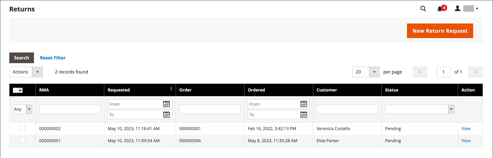

# Rückgabe

Kunden _die einen Artikel zum Austausch oder zur Rückerstattung_ möchten, kann eine „Rücksendung von Waren“ (RMA) erteilt werden. In der Regel kontaktiert der Kunde den Händler, um eine Rückerstattung zu beantragen. Bei Validierung wird eine eindeutige RMA-Nummer zur Identifizierung des zurückgegebenen Produkts zugewiesen. In der Konfiguration können Sie RMA entweder für alle Produkte aktivieren oder RMA nur für bestimmte Produkte zulassen. Das _[!UICONTROL Returns]_&#x200B;Raster listet die aktuell zurückgegebenen Merchandising Requests (RMAs) auf und wird zur Eingabe neuer Return Requests verwendet.

{width="600" zoomable="yes"}

RMAs können für einfache, gruppierte, konfigurierbare und gebündelte Produktarten ausgestellt werden. RMAs sind jedoch nicht für virtuelle Produkte, herunterladbare Produkte und Geschenkgutscheine verfügbar.

## Spaltenbeschreibungen

| Spalte | Beschreibung |
|--- |--- |
| [!UICONTROL Select] | Aktivieren Sie die Kontrollkästchen für die Rückgaben, die einer Aktion unterzogen werden sollen, oder verwenden Sie die Auswahlsteuerung in der Spaltenüberschrift. Optionen: `Select All` / `Deselect All` / `Select Visible` / `Unselect Visible` |
| [!UICONTROL RMA] | Eine eindeutige numerische Kennung, die jeder Rückgabe zugewiesen wird |
| [!UICONTROL Requested] | Datum und Uhrzeit der Rücksendung |
| [!UICONTROL Order] | Eine eindeutige Nummer der ursprünglichen Bestellung |
| [!UICONTROL Ordered] | Datum und Uhrzeit der Bestellung |
| [!UICONTROL Customer] | Der Name des Kunden oder Käufers, der die Bestellung aufgegeben hat |
| [!UICONTROL Status] | Rückgabestatus. Optionen: `Pending` / `Authorized` / `Partially Authorized` / `Approved` / `Rejected` / `Processed and Closed` / `Closed` |
| [!UICONTROL Action] | **[!UICONTROL View]** öffnet die Rückgabe im Bearbeitungsmodus. |

{style="table-layout:auto"}

## RMA- und Rückgabe-Workflow

1. **Anfrage empfangen** - Wenn [aktiviert](rma-configure.md#enable-rmas-for-your-store) können sowohl registrierte Kunden als auch Gäste eine RMA anfordern. Sie können auch [eine RMA-Anfrage im Admin senden](#create-a-return-request-in-the-admin).

2. **RMA ausgestellt** - Nachdem Sie die Anfrage geprüft haben, können Sie sie teilweise oder vollständig genehmigen oder die Anfrage abbrechen. Wenn Sie die Rücksendung genehmigen und damit einverstanden sind, die Rücksendung zu bezahlen, können Sie einen Versandauftrag vom Administrator bei einem unterstützten Spediteur erstellen.

3. **Wareneingang und Rücksendung des Produkts verarbeitet** - Das folgende Flussdiagramm beschreibt die betriebliche Reihenfolge für den Abschluss des Rückgabevorgangs:

   {width="500"}

## RMA-Status

Während seines Lebenszyklus kann eine zurückgegebene Warenautorisierung (RMA) viele zugewiesene Status aufweisen (z. B. „Ausstehend“ oder „Autorisiert„). Der RMA-Status gibt den Fortschritt einer RMA-Anfrage an, die vom Benutzer oder Händler ausgelöst wurde.

| Status | Beschreibung |
|--- |--- |
| [!UICONTROL Pending] | Der ursprüngliche Status, der einer RMA-Anfrage zugewiesen wurde, wenn sie von einem Benutzer in der Storefront oder vom Händler in der Admin ausgelöst wird. |
| [!UICONTROL Authorized] | Dieser Status wird der RMA zugewiesen, wenn alle angeforderten Artikel vom Händler in der Admin für die Rücksendung autorisiert wurden. |
| [!UICONTROL Partially Authorized] | Dieser Status wird der RMA zugewiesen, wenn einer der angeforderten Artikel abgelehnt wurde und andere Produkte autorisiert sind. |
| [!UICONTROL Denied] | Dieser Status wird der RMA zugewiesen, wenn alle angeforderten Artikel vom Händler in der Admin für die Rücksendung abgelehnt werden. |
| [!UICONTROL Return Received] | Dieser Status wird dem RMA vom Händler zugewiesen, wenn die angeforderten Artikel vom Benutzer empfangen werden. |
| [!UICONTROL Return Partially Received] | Dieser Status wird vom Händler der RMA zugewiesen, wenn die angeforderten Artikel teilweise zurückgegeben werden und einige der Artikel nicht verarbeitet werden können. |
| [!UICONTROL Approved] | Dieser Status wird vom Händler der RMA zugewiesen, wenn die angeforderten Artikel zur weiteren Bearbeitung genehmigt wurden. |
| [!UICONTROL Rejected] | Dieser Status wird vom Händler der RMA zugewiesen, wenn die angeforderten Artikel für die weitere Verarbeitung abgelehnt werden. |
| [!UICONTROL Processed and Closed] | Dieser Status wird vom Händler der RMA zugewiesen, wenn alle angeforderten Artikel für die weitere Verarbeitung genehmigt wurden. |
| [!UICONTROL Closed] | Dieser Status wird vom Händler der RMA zugewiesen, wenn die angeforderten Artikel nicht zur Rücksendung verarbeitet werden können. |

{style="table-layout:auto"}

## Erstellen einer Rückgabeanfrage in der Admin Console

Ein Händler kann vom Administrator eine Rücksendeanfrage im Namen des Kunden erstellen. Kunden können [eine Rückgabeanfrage erstellen](rma-customer-experience.md) in der Storefront für einen Adobe Commerce-Store erstellen.

1. Navigieren Sie in der _Admin_-Seitenleiste zu **[!UICONTROL Sales]** > **[!UICONTROL Returns]**.

1. Klicken Sie auf **[!UICONTROL New Return Request]**.

1. Um eine Rücksendeanfrage zu erstellen, klicken Sie auf eine Bestellung mit einem `Complete`.

1. Wählen Sie im Abschnitt _[!UICONTROL Return Information]_&#x200B;die Registerkarte **[!UICONTROL Return Items]**&#x200B;aus.

1. Um Elemente hinzuzufügen, die zurückgegeben werden sollen, klicken Sie auf **[!UICONTROL Add Items]**.

1. Aktivieren Sie das Kontrollkästchen für das gewünschte Produkt und klicken Sie auf **[!UICONTROL Add Selected Product to returns]**.

1. Geben Sie **[!UICONTROL Requested]** die Anzahl der zurückzugebenden Elemente ein.

1. Legen Sie **[!UICONTROL Return Reason]** auf eine der folgenden Einstellungen fest:

   - `Wrong Color`
   - `Wrong Size`
   - `Out of Service`
   - `Other`

   Wenn der Grund für die Rücksendung nicht mit den aufgelisteten Optionen übereinstimmt, können Sie Ihre eigenen eingeben, wenn Sie die Option `Other` auswählen.

1. Legen Sie **[!UICONTROL Item Condition]** auf eine der folgenden Einstellungen fest:

   - `Unopened`
   - `Opened`
   - `Damaged`

1. Legen Sie **[!UICONTROL Resolution]** auf eine der folgenden Einstellungen fest:

   - `Exchange`
   - `Refund`
   - `Store Credit`

1. Um einen Rückgabewert zu erstellen, klicken Sie auf **[!UICONTROL Submit Returns]**.

   {width="600" zoomable="yes"}

   Die neu gesendete RMA-Anfrage wird auf der Seite **[!UICONTROL Returns]** mit dem Status `Pending` angezeigt.
