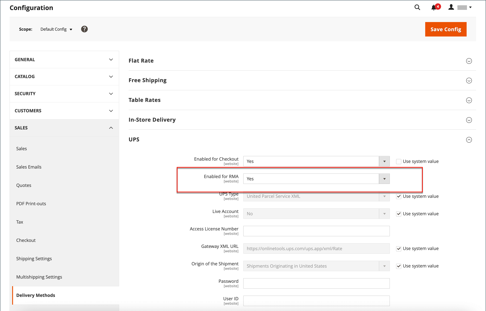
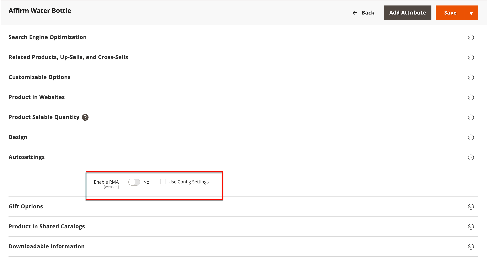

# Konfigurieren von Rücksendungen

{{ee-feature}}

Wenn diese Option aktiviert ist, können RMA-Anfragen von Kunden über die Storefront gesendet werden. Eine Rücksendung kann nur generiert werden, wenn ein Artikel in der Bestellung vorhanden ist, der zur Rücksendung zur Verfügung steht. Anfragen zur Rückgabe einzelner Elemente werden vom Attribut _RMA aktivieren_ in jedem Produktdatensatz verwaltet. Standardmäßig werden die Konfigurationseinstellungen auf das Produkt angewendet (_[!UICONTROL Use Config Settings]_ist ausgewählt). Wenn_[!UICONTROL Enable RMA]_ auf `No` gesetzt ist, wird das Produkt nicht in der Liste der Elemente angezeigt, die für die Rückgabe verfügbar sind. Wenn Sie die Einstellung _RMA aktivieren_ ändern, gilt sie sowohl für neue als auch für bestehende Bestellungen.

## RMAs für Ihren Store aktivieren

1. Navigieren Sie in _Admin_-Seitenleiste zu **[!UICONTROL Stores]** > _[!UICONTROL Settings]_>**[!UICONTROL Configuration]**.

1. Erweitern Sie im linken Bereich **[!UICONTROL Sales]** und wählen Sie darunter **[!UICONTROL Sales]**.

1. Erweitern Sie  den Abschnitt **[!UICONTROL RMA Settings]** .

   {width="600" zoomable="yes"}

1. Legen Sie **[!UICONTROL Enable RMA on Storefront]** auf `Yes` fest.

   Diese Einstellung bestimmt, ob Kundinnen und Kunden RMA-Anfragen in der Storefront erstellen und anzeigen können. RMAs können sowohl auf neue als auch auf bestehende Bestellungen angewendet werden.

1. Legen Sie **[!UICONTROL Enable RMA on Product Level]** auf `Yes` fest.

   Diese Einstellung bestimmt das Verhalten für das Attribut _RMA aktivieren_ für einzelne Produkte in der Storefront:

   - Wenn [!UICONTROL Enable RMA on Product Level] auf `Yes` gesetzt ist, können Kunden in der Storefront alle einzelnen Produkte zurückgeben. Sie enthält sowohl _[!UICONTROL Enable RMA]_= `Yes` als auch_[!UICONTROL Enable RMA]_ = `No` Produktattributwerte.
   - Wenn [!UICONTROL Enable RMA on Product Level] auf `No` gesetzt ist, können Kunden in der Storefront nur die Produkte mit einem _[!UICONTROL Enable RMA]_= `Yes` Produktattributwert zurückgeben.

1. Legen Sie **[!UICONTROL Use Store Address]** auf einen der folgenden Werte fest:

   - `Yes` - Senden Sie zurückgesendete Produkte an die Adresse des Geschäfts.
   - `No` - Geben Sie eine alternative Adresse für die Produktrücksendung ein.

   {width="600" zoomable="yes"}

1. Klicken Sie auf **[!UICONTROL Save Config]**.

## Konfigurieren der Versandmethoden für Rücksendungen

1. Navigieren Sie in _Admin_-Seitenleiste zu **[!UICONTROL Stores]** > _[!UICONTROL Settings]_>**[!UICONTROL Configuration]**.

1. Erweitern Sie im linken Bereich **[!UICONTROL Sales]** und wählen Sie **[!UICONTROL Delivery Methods]**.

1. Erweitern Sie den Abschnitt für den Provider, den Sie für den Rücksendedienst verwenden möchten, z. B. **[!UICONTROL UPS]**.

   {width="600" zoomable="yes"}

1. Legen Sie **[!UICONTROL Enabled for RMA]** auf `Yes` fest.

1. Klicken Sie auf **[!UICONTROL Save Config]**.

## Zulässige RMAs auf Produktebene ändern

Wenn Sie RMAs für Ihren Store aktivieren und Ihr Katalog einige Produkte enthält, für die keine Rückgabe zulässig sein sollte, können Sie die Einstellung auf Produktebene ändern.

1. Öffnen Sie das Produkt im Bearbeitungsmodus.

1. Scrollen Sie nach unten und erweitern Sie  den Abschnitt **[!UICONTROL Autosettings]** .

1. Deaktivieren Sie bei Bedarf das Kontrollkästchen **[!UICONTROL Use Config Setting]** .

1. Stellen Sie die **[!UICONTROL Enable RMA]** auf `No`.

   {width="600" zoomable="yes"}

1. Klicken Sie auf **[!UICONTROL Save]**.
