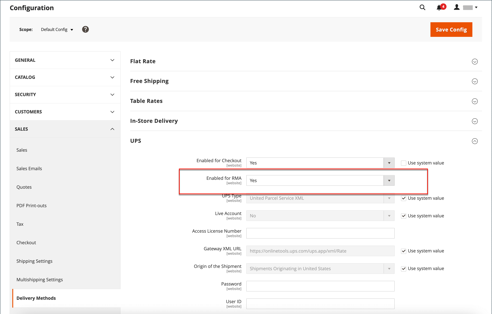

# Rückgaben konfigurieren

{{ee-feature}}

Wenn diese Option aktiviert ist, können RMA-Anfragen von Kunden aus der Storefront gesendet werden. Eine RMA kann nur generiert werden, wenn ein Element in der Reihenfolge vorhanden ist, das zur Rückgabe verfügbar ist. Anfragen zur Rückgabe einzelner Elemente werden vom Attribut _Enable RMA_ in jedem Produktdatensatz verwaltet. Standardmäßig werden die Konfigurationseinstellungen auf das Produkt angewendet (_[!UICONTROL Use Config Settings]_ist ausgewählt). Wenn_[!UICONTROL Enable RMA]_ auf `No` gesetzt ist, wird das Produkt nicht in der Liste der Elemente angezeigt, die für die Rückgabe verfügbar sind. Wenn Sie die Einstellung _RMA aktivieren_ ändern, gilt sie sowohl für neue als auch für bestehende Bestellungen.

## RMAs für Ihren Store aktivieren

1. Wechseln Sie in der Seitenleiste _Admin_ zu **[!UICONTROL Stores]** > _[!UICONTROL Settings]_>**[!UICONTROL Configuration]**.

1. Erweitern Sie im linken Bedienfeld den Wert **[!UICONTROL Sales]** und wählen Sie unter &quot;**[!UICONTROL Sales]**&quot;.

1. Erweitern Sie  im Abschnitt **[!UICONTROL RMA Settings]** .

   {width="600" zoomable="yes"}

1. Setzen Sie **[!UICONTROL Enable RMA on Storefront]** auf `Yes`.

   Diese Einstellung bestimmt, ob Kunden RMA-Anforderungen aus der Storefront erstellen und anzeigen können. RMAs können sowohl auf neue als auch auf bestehende Bestellungen angewendet werden.

1. Setzen Sie **[!UICONTROL Enable RMA on Product Level]** auf `Yes`.

   Diese Einstellung bestimmt das Verhalten für das Attribut _Enable RMA_ für einzelne Produkte auf der Storefront:

   - Wenn [!UICONTROL Enable RMA on Product Level] auf `Yes` gesetzt ist, können Kunden auf der Storefront alle einzelnen Produkte zurückgeben. Sie enthält sowohl die Produktattributwerte _[!UICONTROL Enable RMA]_= `Yes` als auch die Produktattributwerte_[!UICONTROL Enable RMA]_ = `No`.
   - Wenn [!UICONTROL Enable RMA on Product Level] auf `No` gesetzt ist, können Kunden in der Storefront nur Produkte mit einem Produktattributwert _[!UICONTROL Enable RMA]_= `Yes` zurückgeben.

1. Setzen Sie **[!UICONTROL Use Store Address]** auf einen der folgenden Werte:

   - `Yes` - Sendet zurückgegebene Produkte an die Store-Adresse.
   - `No` - Geben Sie eine alternative Adresse für die Rückgabe des Produkts ein.

   {width="600" zoomable="yes"}

1. Klicken Sie auf **[!UICONTROL Save Config]**.

## Versandmethoden für Rückgaben konfigurieren

1. Wechseln Sie in der Seitenleiste _Admin_ zu **[!UICONTROL Stores]** > _[!UICONTROL Settings]_>**[!UICONTROL Configuration]**.

1. Erweitern Sie im linken Bereich den Wert **[!UICONTROL Sales]** und wählen Sie **[!UICONTROL Delivery Methods]** aus.

1. Erweitern Sie den Abschnitt für den Netzbetreiber, den Sie für den Rückkehrdienst verwenden möchten, z. B. **[!UICONTROL UPS]**.

   {width="600" zoomable="yes"}

1. Setzen Sie **[!UICONTROL Enabled for RMA]** auf `Yes`.

1. Klicken Sie auf **[!UICONTROL Save Config]**.

## Zulässige RMAs auf Produktebene ändern

Wenn Sie RMAs für Ihren Store aktivieren und Ihr Katalog einige Produkte enthält, die nicht zurückgegeben werden dürfen, können Sie die Einstellung auf Produktebene ändern.

1. Öffnen Sie das Produkt im Bearbeitungsmodus.

1. Scrollen Sie nach unten und erweitern Sie den Abschnitt **[!UICONTROL Autosettings]** um den .

1. Deaktivieren Sie bei Bedarf das Kontrollkästchen **[!UICONTROL Use Config Setting]** .

1. Schalten Sie die Einstellung **[!UICONTROL Enable RMA]** auf `No` um.

   {width="600" zoomable="yes"}

1. Klicken Sie auf **[!UICONTROL Save]**.
