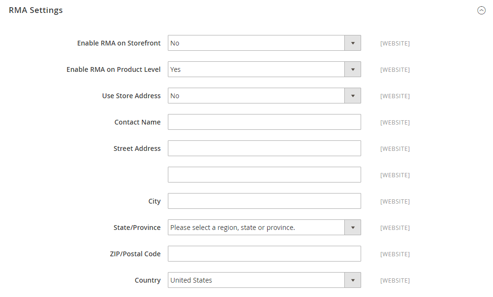

# Rückgaben konfigurieren

{{ee-feature}}

Wenn diese Option aktiviert ist, können RMA-Anfragen von Kunden aus der Storefront gesendet werden. Eine RMA kann nur generiert werden, wenn ein Element in der Reihenfolge vorhanden ist, das zur Rückgabe verfügbar ist. Anfragen zur Rückgabe einzelner Elemente werden von der _RMA aktivieren_ -Attribut in jedem Produktdatensatz. Standardmäßig werden die Konfigurationseinstellungen auf das Produkt (_[!UICONTROL Use Config Settings]_ausgewählt ist). Wenn_[!UICONTROL Enable RMA]_ auf `No`, wird das Produkt nicht in der Liste der Elemente angezeigt, die zur Rückgabe verfügbar sind. Wenn Sie die _RMA aktivieren_ festgelegt ist, gilt dies sowohl für neue als auch für bestehende Bestellungen.

## RMAs für Ihren Store aktivieren

1. Im _Admin_ Seitenleiste, navigieren Sie zu **[!UICONTROL Stores]** > _[!UICONTROL Settings]_>**[!UICONTROL Configuration]**.

1. Erweitern Sie im linken Bereich **[!UICONTROL Sales]** und wählen **[!UICONTROL Sales]** darunter.

1. Erweitern  die **[!UICONTROL RMA Settings]** Abschnitt.

   {width="600" zoomable="yes"}

1. Satz **[!UICONTROL Enable RMA on Storefront]** nach `Yes`.

   Diese Einstellung bestimmt, ob Kunden RMA-Anforderungen aus der Storefront erstellen und anzeigen können. RMAs können sowohl auf neue als auch auf bestehende Bestellungen angewendet werden.

1. Satz **[!UICONTROL Enable RMA on Product Level]** nach `Yes`.

   Diese Einstellung bestimmt das Verhalten für die _RMA aktivieren_ -Attribut für einzelne Produkte auf der Storefront:

   - Wann [!UICONTROL Enable RMA on Product Level] auf `Yes`, können Kunden, die sich auf der Storefront befinden, alle einzelnen Produkte zurückgeben. Sie umfasst beide _[!UICONTROL Enable RMA]_= `Yes` und_[!UICONTROL Enable RMA]_ = `No` Produktattributwerte.
   - Wann [!UICONTROL Enable RMA on Product Level] auf `No`, können Kunden, die sich in der Storefront befinden, nur die Produkte mit einer _[!UICONTROL Enable RMA]_= `Yes` Produktattributwert.

1. Satz **[!UICONTROL Use Store Address]** auf einen der folgenden Werte zu setzen:

   - `Yes` - Senden der zurückgegebenen Produkte an die Store-Adresse.
   - `No` - Geben Sie eine alternative Adresse für die Rückgabe des Produkts ein.

   {width="600" zoomable="yes"}

1. Klicken **[!UICONTROL Save Config]**.

## Versandmethoden für Rückgaben konfigurieren

1. Im _Admin_ Seitenleiste, navigieren Sie zu **[!UICONTROL Stores]** > _[!UICONTROL Settings]_>**[!UICONTROL Configuration]**.

1. Erweitern Sie im linken Bereich **[!UICONTROL Sales]** und wählen **[!UICONTROL Delivery Methods]**.

1. Erweitern Sie den Abschnitt für den Netzbetreiber, den Sie für den Rückkehrdienst verwenden möchten, z. B. **[!UICONTROL UPS]**.

   {width="600" zoomable="yes"}

1. Satz **[!UICONTROL Enabled for RMA]** nach `Yes`.

1. Klicken **[!UICONTROL Save Config]**.

## Zulässige RMAs auf Produktebene ändern

Wenn Sie RMAs für Ihren Store aktivieren und Ihr Katalog einige Produkte enthält, die nicht zurückgegeben werden dürfen, können Sie die Einstellung auf Produktebene ändern.

1. Öffnen Sie das Produkt im Bearbeitungsmodus.

1. Hinunter scrollen und erweitern  die **[!UICONTROL Autosettings]** Abschnitt.

1. Löschen Sie die **[!UICONTROL Use Config Setting]** bei Bedarf.

1. Umschalten zwischen **[!UICONTROL Enable RMA]** Einstellung auf `No`.

   {width="600" zoomable="yes"}

1. Klicken **[!UICONTROL Save]**.
