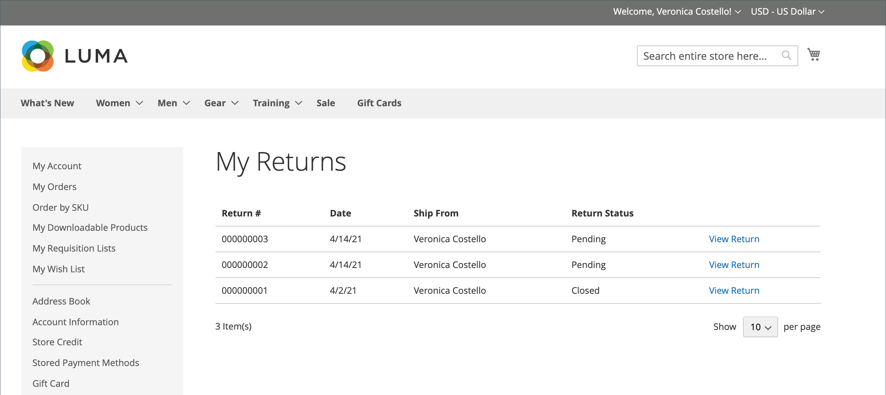

# Gibt das Storefront-Erlebnis zurück

{{ee-feature}}

Kunden können eine der folgenden Möglichkeiten verwenden, um eine RMA von der Storefront anzufordern:

- [Widget „Bestellungen und Rückgaben](../content-design/widget-orders-returns.md) in der Seitenleiste
- _Bestellungen und Rücksendungen_ in der Fußzeile

Geben Sie als Best Practice eine Beschreibung Ihrer RMA-Anforderungen und -Prozesse in die Kundendienstrichtlinie ein.

>[!NOTE]
>
>Wenn Sie zusätzliche Informationen zu Rückgaben erfassen möchten, können Sie Ihre eigenen benutzerdefinierten &quot;[&quot; &#x200B;](attributes-returns.md).

Alle RMA-Informationen des Kunden werden auf der Seite **[!UICONTROL My Returns]** im Dashboard des Kundenkontos angezeigt.

{width="700" zoomable="yes"}

## RMA anfordern

Der Kunde führt die folgenden Schritte in der Storefront aus, um eine RMA zu senden:

1. Klicken Sie in der Fußzeile auf **[!UICONTROL Orders and Returns]**.

1. Gibt die Bestellinformationen ein:

   - Auftrags-ID
   - Nachname der Fakturierung
   - E-Mail

1. Klicks **[!UICONTROL Continue]**.

   {width="700" zoomable="yes"}

1. Klicken Sie unter dem Bestelldatum auf **[!UICONTROL Return]**.

   {width="700" zoomable="yes"}

1. Wählt das zurückzugebende Element aus und gibt die **[!UICONTROL Quantity to Return]** ein.

1. Legt **[!UICONTROL Resolution]** auf eine der folgenden Optionen fest:

   - Umtausch
   - [Rückerstattung](../customers/refunds-customer-account.md)
   - [Warenkredit](../customers/store-credit-using.md)

1. Legt **[!UICONTROL Item Condition]** auf eine der folgenden Optionen fest:

   - `Unopened`
   - `Opened`
   - `Damaged`

1. Legt **[!UICONTROL Reason to Return]** auf eine der folgenden Optionen fest:

   - `Wrong Color`
   - `Wrong Size`
   - `Out of Service`
   - `Other`

   {width="700" zoomable="yes"}

1. Legt bei Bedarf **[!UICONTROL Contact Email Address]** und **[!UICONTROL Comments]** fest.

   >[!NOTE]
   >
   >Wenn die Bestellung mehrere Artikel enthält und der Kunde einen anderen Artikel zurückgeben möchte, kann er auf **[!UICONTROL Add Item To Return]** klicken, den Artikel auswählen und dann alle erwähnten Optionen festlegen.

1. Klicks **[!UICONTROL Submit]**.
