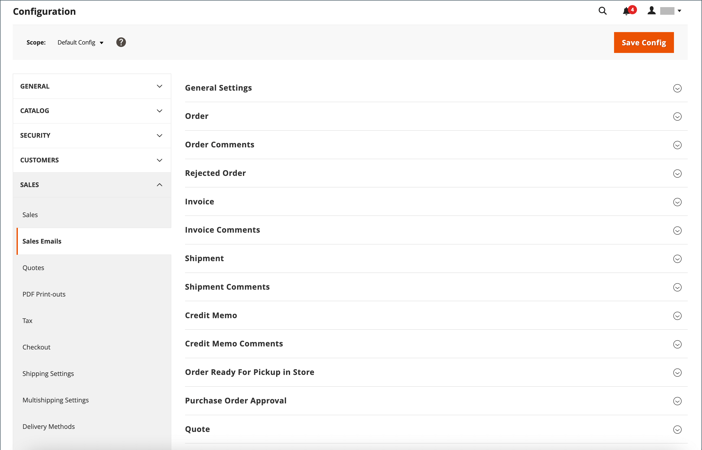
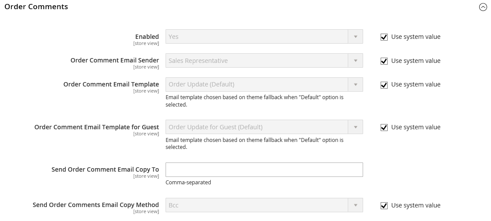

# Verkaufs-E-Mails

Mehrere E-Mail-Nachrichten werden durch die Ereignisse im Zusammenhang mit einer Bestellung ausgelöst und die Konfiguration ist ähnlich. Stellen Sie sicher, dass Sie den Store-Kontakt, der als Absender der Nachricht angezeigt wird, die zu verwendende E-Mail-Vorlage und alle anderen Personen, die eine Kopie der Nachricht erhalten sollen, identifizieren. Verkaufs-E-Mails können gesendet werden, wenn sie durch ein Ereignis ausgelöst werden, oder nach einem vorab festgelegten Intervall.

{width="600" zoomable="yes"}

## Schritt 1. E-Mail-Vorlagen aktualisieren

Stellen Sie sicher, dass Sie die Vorlage [E-Mail](../systems/email-template-custom.md#header-template)Kopfzeile) aktualisieren, damit sie Ihre Marke und die anderen E-Mail-Vorlagen nach Bedarf widerspiegelt. Eine vollständige Liste der Vorlagen finden Sie unter [E-Mail-](../systems/email-templates.md).

## Schritt 2. Übertragungsart auswählen

1. Navigieren Sie in _Admin_-Seitenleiste zu **[!UICONTROL Stores]** > _[!UICONTROL Settings]_>**[!UICONTROL Configuration]**.

1. Erweitern Sie im linken Bereich **[!UICONTROL Sales]** und wählen Sie **[!UICONTROL Sales Emails]**.

1. Erweitern Sie bei Bedarf  den Abschnitt **[!UICONTROL General Settings]** .

   {width="600" zoomable="yes"}

   Standardmäßig ist für das asynchrone Senden `Disable` festgelegt. Deaktivieren Sie das Kontrollkästchen **[!UICONTROL Use system value]**, um die Systemeinstellung zu ändern, und legen Sie **[!UICONTROL Asynchronous sending]** auf einen der folgenden Werte fest:

   - `Disable` - Sendet eine Verkaufs-E-Mail, wenn sie durch ein Ereignis ausgelöst wird.
   - `Enable` - Sendet Verkaufs-E-Mails in vorab festgelegten, regelmäßigen Abständen.

   Der Adobe Commerce-Support empfiehlt die Aktivierung des asynchronen Versands, um die Leistung bei der Bestellplatzierung zu verbessern. Siehe [Best Practices für die Konfiguration der Auftragsverarbeitung](https://experienceleague.adobe.com/docs/commerce-operations/implementation-playbook/best-practices/maintenance/order-processing-configuration.html) in der Wissensdatenbank zum Adobe Commerce-Support.

## Schritt 3. Füllen Sie die Details für jede Verkaufs-E-Mail-Nachricht aus

1. Erweitern Sie bei Bedarf  den Abschnitt **[!UICONTROL Order]** .

   {width="600" zoomable="yes"}

1. Stellen Sie sicher, dass **[!UICONTROL Enabled]** auf `Yes` (Standard) gesetzt ist.

1. Legen Sie **[!UICONTROL New Order Confirmation Email]** auf den Store-Kontakt fest, der als Absender der Nachricht angezeigt wird.

1. Legen Sie **[!UICONTROL New Order Confirmation Template]** auf die Vorlage fest, die für die E-Mail verwendet wird, die an registrierte Kunden gesendet wird.

1. Legen Sie **[!UICONTROL New Order Confirmation Template for Guest]** auf die Vorlage fest, die für die E-Mail verwendet wird, die an Gäste gesendet wird, die kein Konto bei Ihrem Geschäft haben.

1. Geben Sie **[!UICONTROL Send Order Email Copy To]** die E-Mail-Adresse jeder Person ein, die eine Kopie der neuen E-Mail-Bestellung erhalten soll.

   Wenn Sie eine Kopie an mehrere Empfänger senden, trennen Sie jede Adresse durch ein Komma.

1. Legen Sie **[!UICONTROL Send Order Email Copy Method]** auf eine der folgenden Einstellungen fest:

   - `Bcc` - Sendet eine _Blinde Höflichkeitskopie_ indem der Empfänger in die Kopfzeile derselben E-Mail eingefügt wird, die an den Kunden gesendet wird. Der BCC-Empfänger ist für den Kunden nicht sichtbar.
   - `Separate Email` - Sendet die Kopie als separate E-Mail.

1. Erweitern Sie  den Abschnitt **[!UICONTROL Order Comments]** und wiederholen Sie diese Schritte.

   {width="600" zoomable="yes"}

1. Schließen Sie die Konfiguration für die verbleibenden Verkaufs-E-Mail-Typen ab:

   - **[!UICONTROL Invoice]** / **[!UICONTROL Invoice Comments]**
   - **[!UICONTROL Shipment]** / **[!UICONTROL Shipment Comments]**
   - **[!UICONTROL Credit Memo]** / **[!UICONTROL Credit Memo Comments]**

1. Klicken Sie abschließend auf **[!UICONTROL Save Config]**.

   Wenn Sie dazu aufgefordert werden[&#x200B; klicken Sie auf den Link &#x200B;](../systems/cache-management.md)Cache-Verwaltung“ in der Nachricht oben im Arbeitsbereich und löschen Sie alle ungültigen Caches.
