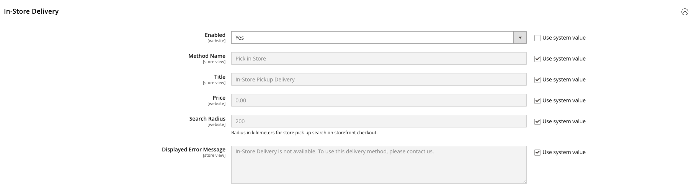

# Versand im Geschäft

Mit der Versandmethode im Geschäft kann der Kunde eine Quelle auswählen, die während des Checkouts als Abholort verwendet werden soll.

{width="700" zoomable="yes"}

Beim Checkout in der Storefront:

1. Der Kunde klickt auf **[!UICONTROL Pick In Store]** oder wählt die _[!UICONTROL In-Store Pickup Delivery]_Versandart aus.
1. Die Registerkarte _[!UICONTROL Pick In Store]_-Checkout wird geöffnet.

Wenn der Kunde eine Adresse hat oder zuvor das Formular für die Versandadresse ausgefüllt hat, bevor er zur Registerkarte _[!UICONTROL Pick In Store]_wechselt:

- Die Quelle, die der Kundenadresse innerhalb des konfigurierten Radius am nächsten ist, wird automatisch als Pick-up-Store vorausgewählt.
- Wenn der Kunde auf **[!UICONTROL Select Other]** klickt, wird das _[!UICONTROL Select Store]_Suchformular geöffnet. Nur Stores innerhalb des konfigurierten Abstands (Radius) zum vorausgewählten Store werden in der Liste angezeigt. Alle Stores in der Liste werden nach der Entfernung zum vorausgewählten Store sortiert.
- Wenn der Kunde eine Postleitzahl oder einen Stadtnamen in das Suchfeld eingibt, werden in der Liste nur Speicher angezeigt, die sich innerhalb der konfigurierten Entfernung (Radius) zum gesuchten Ort befinden. Alle Filialen in der Liste werden nach der Entfernung zum gesuchten Ort sortiert.
- Wenn der Kunde die Postleitzahl oder den Ortsnamen aus dem Suchfeld löscht, werden dem Kunden alle Abholgeschäfte angezeigt, die den Produkten im Warenkorb zugeordnet sind. Alle Filialen in der Liste werden in aufsteigender Reihenfolge der Quellcodes sortiert, ohne dass der Abstand (Radius) beschränkt wird.

Wenn der Kunde keine Adresse hat oder vorher das Formular für die Versandadresse nicht ausgefüllt hat, bevor er zur Registerkarte _[!UICONTROL Pick In Store]_wechselt:

- Auf der Seite wird die Meldung _Wir konnten den Abholort basierend auf den verfügbaren Informationen nicht vorab_.
- Wenn der Kunde auf **[!UICONTROL Select Store]** klickt, wird das _[!UICONTROL Select Store]_Suchformular geöffnet.
- Alle Abholgeschäfte, die den Produkten im Warenkorb zugeordnet sind, werden in aufsteigender Reihenfolge der Quellcodes ohne Distanzbegrenzung (Radius) angezeigt.
- Wenn der Kunde eine Postleitzahl oder einen Stadtnamen in das Suchfeld eingibt, werden in der Liste nur Speicher angezeigt, die sich innerhalb der konfigurierten Entfernung (Radius) zum gesuchten Ort befinden. Alle Filialen in der Liste werden nach der Entfernung zum gesuchten Ort sortiert.

## Vor dem Setup

- Stellen Sie sicher, dass Sie über eine nicht standardmäßige Lager- und Quelle verfügen. Weitere Informationen zum Konfigurieren einer Quelle als Abholspeicherort finden Sie unter [Quelle hinzufügen](../inventory-management/sources-add.md).
- Stellen Sie sicher, dass Sie einen Distance Priority Algorithm konfiguriert haben. Weitere Informationen finden Sie unter [Konfigurieren des Distance Priority Algorithm](../inventory-management/distance-priority-algorithm.md).
- Stellen Sie sicher, [ Sie alle erforderlichen Geocodes für die Offline-Berechnung ](../inventory-management/cli.md#import-geocodes) (heruntergeladen und importiert) haben.
- Stellen Sie sicher, dass Sie die Einstellungen [Standardmäßige Steuerzielberechnung](../configuration-reference/sales/tax.md#default-tax-destination-calculation) konfiguriert haben.

>[!IMPORTANT]
>
>**In der Storefront werden Suchergebnisse nach Entfernung (Radius) gefiltert, um relevante Ergebnisse anzuzeigen:**  
>Wenn der Kunde über eine Lieferadresse verfügt, wird der Basisort zur Berechnung des Abstands (Radius) aus der Lieferadresse übernommen.  
>Wenn der Kunde keine Lieferadresse hat, wird der Basisort zur Berechnung der Entfernung aus den Einstellungen &quot;[ Steuerzielberechnung“ ](../configuration-reference/sales/tax.md#default-tax-destination-calculation). Diese Einstellungen werden pro Shop-Ansicht festgelegt und Sie müssen die Standardeinstellungen für die Berechnung des Steuerziels konfigurieren, um sicherzustellen, dass die Suchfunktion des Pick-up-Shops ordnungsgemäß funktioniert.

## Einrichten des In-Store-Versands

Überprüfen Sie zunächst, ob der In-Store-Versand aktiviert ist.

1. Navigieren Sie in _Admin_-Seitenleiste zu **[!UICONTROL Stores]** > _[!UICONTROL Settings]_>**[!UICONTROL Configuration]**.

1. Erweitern Sie im linken Bereich **[!UICONTROL Sales]** und wählen Sie **[!UICONTROL Delivery Methods]**.

1. Erweitern Sie  den Abschnitt **[!UICONTROL In-Store Delivery]** .

   {width="600" zoomable="yes"}

1. Legen Sie **[!UICONTROL Enabled]** auf `Yes` fest.

   >[!NOTE]
   >
   >Deaktivieren Sie bei Bedarf das Kontrollkästchen **[!UICONTROL Use system value]** , um den Standardwert für ein beliebiges Feld zu ändern.

1. Geben Sie die **[!UICONTROL Method Name]** ein, die die Berechnungsmethode beschreibt, die zur Erstellung einer Versandschätzung verwendet wird.

   Der Methodenname wird neben der berechneten geschätzten Rate im Warenkorb angezeigt.

1. Geben Sie die **[!UICONTROL Title]** ein, die während des Checkouts für _In-Store_ Versand“ angezeigt werden soll.

   Der Standardtitel lautet `In-Store Pickup Delivery`.

1. Geben Sie die Gebühr in das Feld **[!UICONTROL Price]** ein, um Kunden die Abholung im Geschäft in Rechnung zu stellen.

1. Geben Sie die **[!UICONTROL Search Radius]** in Kilometern für die Standortsuche für die Ladenabholung an der Ladenfront-Kasse ein.

1. Geben Sie **[!UICONTROL Displayed Error Message]** die Nachricht ein, die angezeigt wird, wenn der Versand im Geschäft nicht mehr verfügbar ist.

   Die Standardmeldung lautet `In-Store Delivery is not available. To use this delivery method, please contact us.`

1. Klicken Sie auf **[!UICONTROL Save Config]**.
