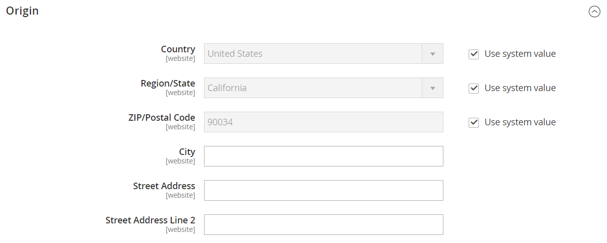

# Konfigurieren von Versandkennzeichnungen

Die folgenden Einstellungen müssen auf Produktebene und in der Konfiguration jedes Trägers vorgenommen werden, der zum Drucken von Etiketten verwendet wird. Zum Drucken von Etiketten verlangen alle Anbieter, dass Sie ein Konto eröffnen. Schließen Sie dann die Konfiguration in Ihrem Geschäft für jeden Provider ab, den Sie verwenden möchten.

## Anforderungen an den Beförderer

| [!UICONTROL Carrier] | Anforderungen |
|-------|--------|
| [USPS](usps.md) | Erfordert ein USPS-Konto. Seit dem 23. Februar 2018 verlangt USPS, dass alle Versandaufkleber das Porto enthalten müssen. |
| [UPS](ups.md) | Erfordert ein UPS-Konto. Versandetiketten sind nur für Sendungen verfügbar, die aus den US-spezifischen Anmeldedaten stammen, die für Geschäfte außerhalb der USA erforderlich sind. |
| [FedEx](fedex.md) | Erfordert ein FedEx-Konto. Bei Geschäften außerhalb der USA werden Versandaufkleber nur für internationale Sendungen unterstützt. FedEx erlaubt keine Inlandslieferungen, die aus Ländern außerhalb der USA stammen |
| [DHL](dhl.md) | Erfordert ein DHL-Konto. Versandkennzeichnungen werden nur für Sendungen unterstützt, die aus den USA stammen. |

{style="table-layout:auto"}

## Schritt 1: Überprüfen Sie das Herstellungsland

Das Herstellungsland ist für alle Produkte, die von USPS und FedEx international versendet werden, erforderlich. Wenn Sie über viele Produkte verfügen, die aktualisiert werden sollten, können [ die Aktualisierungen entweder ](../systems/data-import.md) (importieren) oder das Inventarraster verwenden, um mehrere Datensätze zu aktualisieren.

1. Navigieren Sie in der _Admin_-Seitenleiste zu **[!UICONTROL Catalog]** > **[!UICONTROL Products]**.

1. Aktualisieren Sie den Versand-Label-Datensatz mit einer der folgenden Methoden.

### Methode 1: Aktualisieren eines einzelnen Datensatzes

1. Suchen Sie im Raster das zu aktualisierende Produkt und öffnen Sie es im Bearbeitungsmodus.

1. Aktualisieren Sie **Herstellungsland** nach Bedarf.

   {width="700" zoomable="yes"}

1. Klicken Sie auf **[!UICONTROL Save]**.

### Methode 2: Aktualisieren mehrerer Datensätze

1. Aktivieren Sie im Raster das Kontrollkästchen jedes zu aktualisierenden Produkts.

   Zum Beispiel alle Produkte, die in China hergestellt werden.

1. Legen Sie das **[!UICONTROL Actions]** auf `Update Attributes` fest und klicken Sie auf **[!UICONTROL Submit]**.

1. Suchen Sie im _Attribute aktualisieren_ das Feld **Herstellungsland** und aktivieren Sie das **Ändern**.

1. Wählen Sie das Land.

1. Klicken Sie auf **[!UICONTROL Save]**.

## Schritt 2 Überprüfen der Store-Informationen

1. Navigieren Sie in _Admin_-Seitenleiste zu **[!UICONTROL Stores]** > _[!UICONTROL Settings]_>**[!UICONTROL Configuration]**.

1. Erweitern Sie im linken Bereich **[!UICONTROL Sales]** und wählen Sie **[!UICONTROL Shipping Settings]**.

1. Erweitern Sie  den Abschnitt **[!UICONTROL Origin]** und überprüfen Sie, ob die folgenden Felder vollständig sind:

   - **[!UICONTROL Street Address]** - Die Straßenadresse des Ortes, von dem die Sendungen gesendet werden. Beispiel: der Standort Ihres Unternehmens oder Lagers. Dieses Feld ist für Versandaufkleber erforderlich.
   - **[!UICONTROL Street Address Line 2]** - Alle zusätzlichen Adressinformationen, wie das Stockwerk oder der Eingang. Die Verwendung dieses Felds wird empfohlen.

   {width="600" zoomable="yes"}

1. Wählen Sie _Abschnitt &quot;_&quot; im linken Bedienfeld **[!UICONTROL Delivery Methods]** aus.

1. Erweitern Sie  den Abschnitt **[!UICONTROL USPS]** und überprüfen Sie, ob die folgenden Felder vollständig sind:

   - **[!UICONTROL Secure Gateway URL]** : Das System gibt automatisch die Gateway-URL ein.
   - **[!UICONTROL Password]** - Das Passwort wird von USPS bereitgestellt und ermöglicht Ihnen den Zugriff auf ihr System über Web-Services.
   - **Länge, Breite, Höhe,**: Die Standardabmessungen des Pakets. Damit diese Felder angezeigt werden, setzen Sie **[!UICONTROL Size]** auf `Large`.

1. Erweitern Sie  den Abschnitt **FedEx** und überprüfen Sie, ob die folgenden Felder vollständig sind:

   - Zählernummer
   - Schlüssel
   - Kennwort

   Diese Informationen werden vom Anbieter bereitgestellt und sind erforderlich, um über Web-Services Zugriff auf sein System zu erhalten.

1. Erweitern Sie im linken Bereich **[!UICONTROL General]** und wählen Sie darunter **[!UICONTROL General]**.

1. Erweitern Sie  den Abschnitt **[!UICONTROL Store Information]** und überprüfen Sie, ob die folgenden Felder ausgefüllt sind:

   - **[!UICONTROL Store Name]** - Der Name des Stores oder der Store-Ansicht.
   - **[!UICONTROL Store Contact Telephone]** - Die Telefonnummer des primären Kontakts für die Store- oder Store-Ansicht.
   - **[!UICONTROL Country]** - Das Land, in dem Ihr Geschäft ansässig ist.
   - **[!UICONTROL VAT Number]** - Falls zutreffend, die Umsatzsteuer-Nummer Ihres Geschäfts. (Nicht erforderlich für Geschäfte mit Sitz in den USA)
   - **[!UICONTROL Store Contact Address]** - Die Straßenadresse des primären Kontakts für die Store- oder Store-Ansicht.

1. Wenn Sie mehrere Stores haben und die Kontaktinformationen von der Standardeinstellung abweichen, legen Sie **[!UICONTROL Store View]** für jeden Store fest und überprüfen Sie, ob die Informationen vollständig sind.

   Wenn die Informationen fehlen, wird beim Versuch, die Beschriftungen zu drucken, ein Fehler angezeigt.

   {width="600" zoomable="yes"}

1. Klicken Sie auf **[!UICONTROL Save Config]**.
