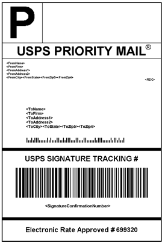

# Versand-Kennzeichnungen

Commerce bietet einen hohen Integrationsgrad mit wichtigen Spediteuren, der Ihnen Zugriff auf Spediteursysteme bietet, um Bestellungen zu verfolgen, Versandkennzeichnungen zu erstellen und vieles mehr. Für reguläre Sendungen und Produkte mit Warenrücksendegenehmigung können Versandkennzeichnungen erstellt werden. Zusätzlich zu den vom Spediteur bereitgestellten Informationen enthält das Etikett auch die Commerce-Bestellnummer, die Nummer der Verpackung und die Gesamtmenge der Packstücke für die Sendung.

{width="300"}

- [Konfigurieren von Versandkennzeichnungen](shipping-label-configure.md)
- [Erstellen von Versandkennzeichnungen und -paketen](shipping-label-create.md)

## Workflow für Versandtitel

Versandaufkleber können zum Zeitpunkt der Sendungserstellung oder zu einem späteren Zeitpunkt erstellt werden. Versandetiketten werden im PDF-Format gespeichert und auf Ihren Computer heruntergeladen.

### Schritt 1: Händler reicht Anfrage für Versandtitel ein

Der Händler/Store-Manager füllt die Informationen aus, die zum Generieren von Kennzeichnungen erforderlich sind, und sendet die Anfrage.

### Schritt 2: Anfrage an Provider gesendet

Commerce kontaktiert den Spediteur und erstellt eine Bestellung im System des Spediteurs. Für jedes Paket, das versendet wird, wird eine separate Bestellung erstellt.

### Schritt 3: Provider sendet Titel und Tracking-Nummer

Der Spediteur sendet das Versandetikett und die Sendungsnummer für die Sendung.

- Eine einzelne Sendung mit mehreren Paketen erhält mehrere Versandaufkleber.

- Wenn Sie dieselben Versandkennzeichnungen mehrmals generieren, bleiben die ursprünglichen Tracking-Nummern erhalten.

- Bei zurückgegebenen Produkten mit RMA-Nummern werden die alten Tracking-Nummern durch neue ersetzt.

### Schritt 4: Händler lädt das Label herunter und druckt es aus

Nachdem das Versandlabel generiert wurde, wird die neue Sendung gespeichert und das Label kann gedruckt werden. Wenn die Versandkennzeichnung aufgrund von Verbindungsproblemen oder anderen Gründen nicht erstellt werden kann, wird die Sendung nicht erstellt. Abhängig von Ihren Browsereinstellungen kann die PDF-Datei geöffnet und gedruckt werden. Jede Beschriftung wird in der PDF auf einer separaten Seite angezeigt.
