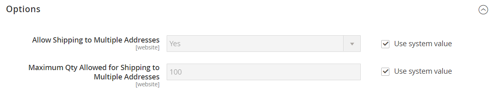

# Versandeinstellungen

Die Versandkonfiguration legt den Ausgangspunkt für alle Sendungen, Ihre Versandrichtlinie und die Handhabung von Sendungen an mehrere Adressen fest.

## Ausgangspunkt

Der Ursprungsort wird verwendet, um die Gebühr für Sendungen aus Ihrem Lager oder Lager zu berechnen, und bestimmt auch den Steuersatz für verkaufte Produkte. Bei der Berechnung [EU](international-tax-guidelines.md#eu-tax-configuration)Steuern) ist sicherzustellen, dass die [Standardzielberechnung](../configuration-reference/sales/tax.md) für jede Shop-Ansicht dem Ausgangspunkt der Versandeinstellungen entspricht.

{width="600" zoomable="yes"}

1. Navigieren Sie in _Admin_-Seitenleiste zu **[!UICONTROL Stores]** > _[!UICONTROL Settings]_>**[!UICONTROL Configuration]**.

1. Erweitern Sie im linken Bereich **[!UICONTROL Sales]** und wählen Sie **[!UICONTROL Shipping Settings]**.

1. Erweitern Sie  den Abschnitt **[!UICONTROL Origin]** und führen Sie Folgendes aus:

   - [!UICONTROL Country]
   - [!UICONTROL Region / State]
   - [!UICONTROL ZIP / Postal Code]
   - [!UICONTROL City]
   - [!UICONTROL Street Address] (und Zeile 2, falls erforderlich)

1. Klicken Sie auf **[!UICONTROL Save Config]**.

## Schifffahrtspolitik

Eine Versandrichtlinie sollte die Geschäftsregeln und Richtlinien Ihres Unternehmens für Sendungen erläutern. Wenn Sie beispielsweise Preisregeln haben, die kostenlosen Versand zum Trigger haben, können Sie die Bedingungen in Ihrer Versandrichtlinie erklären.

{width="700" zoomable="yes"}

Um Ihre Versandrichtlinie während des Checkouts anzuzeigen, füllen Sie die Parameter für die Versandrichtlinie in der Konfiguration aus. Der Text wird angezeigt, wenn Kunden beim Checkout _Siehe unsere Versandrichtlinie_ klicken.

1. Navigieren Sie in _Admin_-Seitenleiste zu **[!UICONTROL Stores]** > _[!UICONTROL Settings]_>**[!UICONTROL Configuration]**.

1. Erweitern Sie im linken Bereich **[!UICONTROL Sales]** und wählen Sie **[!UICONTROL Shipping Settings]**.

1. Erweitern Sie  den Abschnitt **[!UICONTROL Shipping Policy Parameters]** .

1. Legen Sie **[!UICONTROL Apply Custom Shipping Policy]** auf `Yes` fest.

1. Fügen Sie Ihre **[!UICONTROL Shipping Policy]** in das Textfeld ein oder geben Sie sie ein.

   >[!NOTE]
   >
   >Wenn Sie den Text mit einem Textverarbeitungsprogramm erstellen, stellen Sie sicher, dass Sie das Dokument als TXT-Datei speichern, um alle Steuerzeichen aus dem Text zu entfernen. Kopieren Sie dann den Text und fügen Sie ihn in das Textfeld Versandrichtlinie ein.

   {width="600" zoomable="yes"}

1. Klicken Sie auf **[!UICONTROL Save Config]**.

## Mehrere Adressen

Die Versandoptionen für mehrere Adressen ermöglichen es Kunden, eine Bestellung während des Checkouts an mehrere Adressen zu versenden und die maximale Anzahl der Adressen zu bestimmen, an die eine Bestellung versendet werden kann.

1. Navigieren Sie in _Admin_-Seitenleiste zu **[!UICONTROL Stores]** > _[!UICONTROL Settings]_>**[!UICONTROL Configuration]**.

1. Erweitern Sie im linken Bereich **[!UICONTROL Sales]** und wählen Sie **[!UICONTROL Multishipping Settings]**.

1. Erweitern Sie  den Abschnitt **[!UICONTROL Options]** .

   {width="600" zoomable="yes"}

1. Legen Sie **[!UICONTROL Allow Shipping to Multiple Addresses]** auf `Yes` fest.

1. Geben Sie die **[!UICONTROL Maximum Qty Allowed for Shipping to Multiple Addresses]** ein.

1. Klicken Sie auf **[!UICONTROL Save Config]**.

>[!NOTE]
>
> (Adobe Commerce B2B) Bei Bestellungen mit mehreren Versandadressen ist die Zahlungsmethode [Zahlung auf Rechnung](../b2b/enable-basic-features.md#configure-payment-on-account) auch wenn sie aktiviert ist, während des Checkouts nicht verfügbar.
