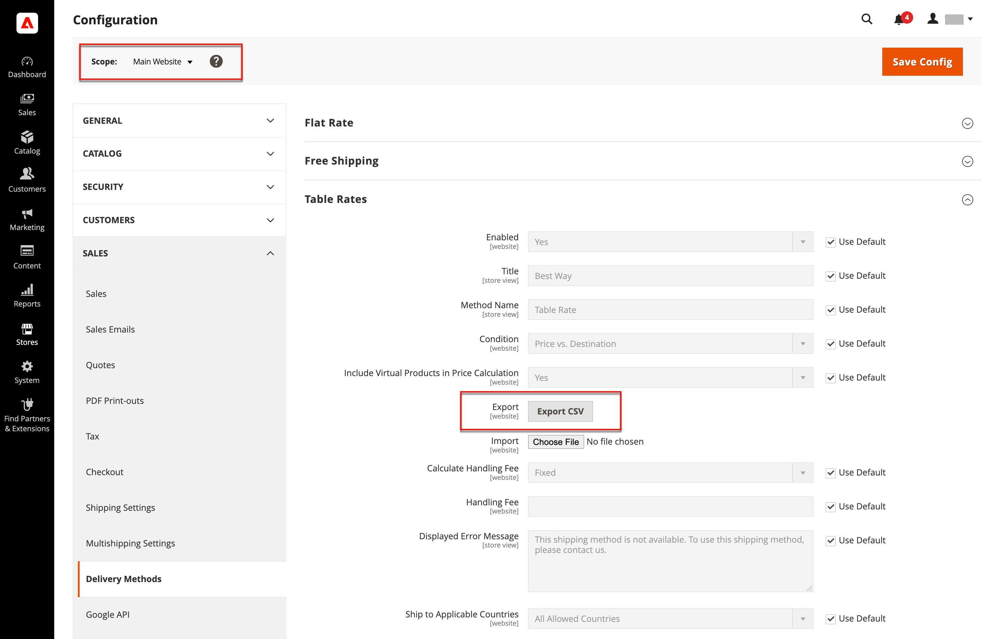

# Tabellenversand

Die Versandmethode _Tabellenrate_ verweist auf eine Tabelle mit Daten, um Versandraten anhand einer Kombination von Bedingungen zu berechnen, darunter:

- Gewichtung v. Ziel
- Preis v. Ziel
- Anzahl der Elemente v. Ziel

Wenn Ihr Lager beispielsweise in Los Angeles liegt, kostet es weniger, nach San Diego zu verschicken als nach Vermont. Sie können den Versand von Tabellen verwenden, um die Einsparungen an Ihre Kunden weiterzugeben.

Die Daten, die zur Berechnung der Tabellenraten verwendet werden, werden in einer Tabelle vorbereitet und in Ihren Speicher importiert. Wenn der Kunde ein Angebot anfordert, werden die Ergebnisse im Abschnitt Versandschätzung des Warenkorbs angezeigt.

>[!NOTE]
>
>Es kann jeweils nur ein Datensatz mit Tabellenraten aktiv sein.

{width="700" zoomable="yes"}

## Schritt 1: Standardeinstellungen festlegen

Der erste Schritt besteht darin, die Standardeinstellungen für Tabellenraten abzuschließen. Sie können diesen Schritt abschließen, ohne den Umfang der Konfiguration zu ändern.

1. Wechseln Sie in der Seitenleiste _Admin_ zu **[!UICONTROL Stores]** > _[!UICONTROL Settings]_>**[!UICONTROL Configuration]**.

1. Wählen Sie im Abschnitt _[!UICONTROL Sales]_des linken Bedienfelds die Option **[!UICONTROL Delivery Methods]**.

1. Erweitern Sie  im Abschnitt **[!UICONTROL Table Rates]** .

   >[!NOTE]
   >
   >Deaktivieren Sie bei Bedarf zunächst das Kontrollkästchen **[!UICONTROL Use system value]** , um die folgenden Einstellungen wie beschrieben zu ändern.

   {width="600" zoomable="yes"}

1. Setzen Sie **[!UICONTROL Enabled]** auf `Yes`.

1. Geben Sie den **[!UICONTROL Title]** ein, der beim Checkout für die Tabellenraten angezeigt werden soll.

   Der Standardtitel ist `Best Way`.

1. Geben Sie den **[!UICONTROL Method Name]** ein, der als Titel neben der berechneten Rate im Warenkorb angezeigt werden soll.

1. Setzen Sie **[!UICONTROL Condition]** auf eine der folgenden Berechnungsmethoden:

   - `Weight v. Destination`
   - `Price v. Destination`
   - `Number of Items v. Destination`

1. Setzen Sie für Bestellungen mit virtuellen Produkten **[!UICONTROL Include Virtual Products in Price Calculation]** auf `Yes` , wenn Sie die virtuellen Produkte in die Berechnung einbeziehen möchten.

   >[!NOTE]
   >
   >Da virtuelle Produkte - wie z. B. Dienste - keine Gewichtung haben, können sie das Ergebnis einer Berechnung nicht ändern, die auf der Bedingung Gewicht v Ziel basiert. Virtual Produkte können jedoch das Ergebnis einer Berechnung ändern, die entweder auf der Bedingung Preis v. Ziel oder Anzahl der Elemente vs. Ziel basiert.

1. Konfigurieren Sie die Optionen für die Bearbeitungsgebühr entsprechend Ihren Anforderungen.

   Die Bearbeitungsgebühr ist optional und erscheint als zusätzliche Gebühr, die zu den Versandkosten hinzukommt. Wenn Sie eine Bearbeitungsgebühr einbeziehen möchten, gehen Sie wie folgt vor:

   - Legen Sie **[!UICONTROL Calculate Handling Fee]** fest:

      - `Fixed`
      - `Percent`

   - Geben Sie den **[!UICONTROL Handling Fee]**-Satz entsprechend der Methode zur Berechnung der Gebühr ein.

     Wenn die Gebühr beispielsweise auf einer festen Gebühr basiert, geben Sie den Betrag als Dezimalzahl ein, z. B. `4.90`. Wenn die Bearbeitungsgebühr jedoch auf einem Prozentsatz der Bestellung basiert, geben Sie den Betrag als Prozentsatz an. Wenn Sie beispielsweise sechs Prozent der Bestellung aufladen, geben Sie den Wert als `.06` ein.

1. Ändern Sie bei Bedarf die **[!UICONTROL Displayed Error Message]**.

   Dieses Textfeld enthält eine Standardnachricht. Sie können jedoch eine andere Nachricht eingeben, die angezeigt werden soll, wenn diese Versandmethode nicht mehr verfügbar ist.

1. Legen Sie **[!UICONTROL Ship to Applicable Countries]** fest:

   - `All Allowed Countries` - Kunden aus allen in Ihrer Store-Konfiguration angegebenen [Ländern](../getting-started/store-details.md#country-options) können diese Bereitstellungsmethode verwenden.
   - `Specific Countries` - Wenn Sie diese Option auswählen, wird die Liste _[!UICONTROL Ship to Specific Countries]_angezeigt. Wählen Sie jedes Land in der Liste aus, in dem diese Versandmethode verwendet werden kann.

1. Setzen Sie **[!UICONTROL Show Method if Not Applicable]** auf `Yes` , wenn Sie die Tabellenzahlen immer anzeigen möchten

1. Geben Sie für &quot;**[!UICONTROL Sort Order]**&quot; eine Zahl ein, um die Reihenfolge zu bestimmen, in der der Tabellenquotenversand angezeigt wird, wenn er beim Checkout mit anderen Versandmethoden aufgeführt wird.

   `0` = first, `1` = second, `2` = third usw.

1. Klicken Sie auf **[!UICONTROL Save Config]**.

## Schritt 2: Tabellensatzdaten vorbereiten

1. Setzen Sie oben links **[!UICONTROL Store View]** auf `Main Website` oder auf eine andere Website, auf die die Konfiguration angewendet wird.

   >[!NOTE]
   >
   >Heben Sie bei Bedarf zunächst das Kontrollkästchen **[!UICONTROL Use system value]** auf, um die folgenden Einstellungen wie beschrieben zu ändern.

1. Ändern Sie die **[!UICONTROL Condition]** nach Bedarf.

1. Klicken Sie auf **[!UICONTROL Export CSV]**.

   {width="700" zoomable="yes"}

1. Speichern Sie die Datei &quot;`tablerates.csv`&quot; auf Ihrem System.

1. Öffnen Sie die Datei in einer Tabellenkalkulationsanwendung.

1. Füllen Sie die Tabelle mit den entsprechenden Werten für die Versandberechnungsbedingung aus.

   - Verwenden Sie ein Sternchen (*) als Platzhalter, der alle in einer Kategorie möglichen Werte darstellt.
   - Die Spalte _[!UICONTROL Country]_muss einen [gültigen dreistelligen Code][1] für jede Zeile enthalten.
   - Sortieren Sie die Daten nach &quot;_[!UICONTROL Region/State]_&quot;, sodass sich die jeweiligen Positionen oben in der Liste und die Platzhalterstandorte unten befinden. Bei Verwendung dieser Methode werden die Regeln zuerst mit den absoluten Werten und später mit den Platzhalterwerten verarbeitet.
   - Postleitzahlbereiche werden nicht unterstützt. Verwenden Sie ein Sternchen (*), um alle Codes innerhalb des Bereichs/Status zuzulassen, oder geben Sie einen einzelnen Code für eine bestimmte Position in der Spalte _[!UICONTROL Zip/Postal Code]_an.
   - Die Werte in der Spalte _[!UICONTROL Weight (and above)]_können maximal vier Dezimalstellen haben (z. B. `2.5075`). Wenn Sie mehr Dezimalstellen in den Daten verwenden, schlägt der Import fehl.

   {width="500"}

1. Speichern Sie die Datei &quot;`tablerates.csv`&quot;.

## 3. Schritt: Tabellensatzdaten importieren

1. Kehren Sie zum Abschnitt **[!UICONTROL Table Rates]** Ihrer Store-Konfiguration zurück.

1. Setzen Sie oben links **[!UICONTROL Store View]** auf die Website, auf der diese Methode verwendet wird.

1. Klicken Sie für **[!UICONTROL Import]** auf **[!UICONTROL Choose File]** und wählen Sie Ihre abgeschlossene `tablerates.csv` -Datei aus, um die Raten zu importieren.

   {width="600" zoomable="yes"}

1. Klicken Sie auf **[!UICONTROL Save Config]**.

## Schritt 4: Überprüfen der Raten

Um sicherzustellen, dass die Daten der Tabellenrate korrekt sind, gehen Sie den Zahlungsprozess mit mehreren unterschiedlichen Adressen durch, um sicherzustellen, dass die Versand- und Bearbeitungsraten korrekt berechnet werden.

### Beispiel 1: Preis und Ziel

In diesem Beispiel wird die Bedingung Preis v. Ziel verwendet, um eine Reihe von drei verschiedenen Versandtarifen zu erstellen, basierend auf der Menge der Auftragsubsumme für die kontinentalen Vereinigten Staaten, Alaska und Hawaii. Das Sternchen (*) ist ein Platzhalter, der alle Werte darstellt.

| LAND | REGION/STAAT | Postleitzahl | BESTELLUNGS-ZWISCHENSUMME (und höher) | VERSANDPREIS |
|--- |--- |--- |--- |--- |
| USA | HI | * | 100 | 10 |
| USA | HI | * | 50 | 15 |
| USA | HI | * | 0 | 20 |
| USA | AK | * | 100 | 10 |
| USA | AK | * | 50 | 15 |
| USA | AK | * | 0 | 20 |
| USA | * | * | 100 | 5 |
| USA | * | * | 50 | 10 |
| USA | * | * | 0 | 15 |

{style="table-layout:auto"}

### Beispiel 2: Gewichtung und Ziel

In diesem Beispiel wird die Bedingung Gewicht v. Ziel verwendet, um basierend auf der Gewichtung der Bestellung unterschiedliche Versandraten zu erstellen.

| LAND | REGION/STAAT | Postleitzahl | GEWICHT (und höher) | VERSANDPREIS |
|--- |--- |--- |--- |--- |
| AUS | NT | * | 9 | 39,95 |
| AUS | NT | * | 0 | 19,95 |
| AUS | VIC | * | 9 | 19,95 |
| AUS | VIC | * | 0 | 5,95 |
| AUS | WA | * | 9 | 39,95 |
| AUS | WA | * | 0 | 19,95 |
| AUS | * | * | 9 | 29,95 |
| AUS | * | * | 0 | 9,95 |

{style="table-layout:auto"}

### Beispiel 3: Beschränkung des freien Seeverkehrs auf die kontinentalen Vereinigten Staaten

1. Erstellen Sie eine `tablerates.csv` -Datei, die alle Statusziele enthält, für die Sie einen kostenlosen Versand bereitstellen möchten.

1. Schließen Sie die Konfiguration der Tabellenrate mit den folgenden Einstellungen ab:

   | Einstellung | Wert |
   |----------|-------|
   | [!UICONTROL Condition] | `Price v. Destination` |
   | [!UICONTROL Method Name] | `Free Shipping` |
   | [!UICONTROL Ship to Applicable Countries] | `Specific Countries` |
   | [!UICONTROL Ship to Specific Countries] | `Select only United States` |
   | [!UICONTROL Show method if not applicable] | `No` |

   {style="table-layout:auto"}

1. Setzen Sie oben links **[!UICONTROL Store View]** auf `Main Website` oder auf eine andere Website, auf die die Konfiguration angewendet wird.

1. Klicken Sie für **[!UICONTROL Import]** auf **[!UICONTROL Choose File]** und wählen Sie Ihre abgeschlossene `tablerates.csv` -Datei aus, um die Raten zu importieren.

[1]: https://en.wikipedia.org/wiki/ISO_3166-1_alpha-3
