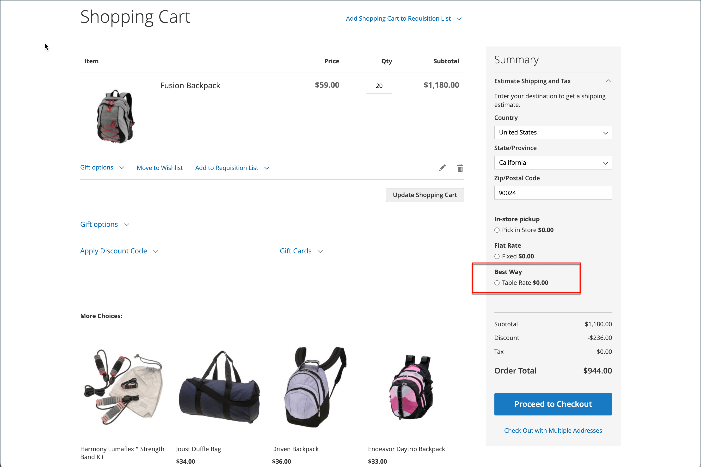

# Versandtabelle

Die Versandmethode _Tabellensatz_ verweist auf eine Datentabelle, um Versandraten basierend auf einer Kombination von Bedingungen zu berechnen, einschließlich:

- Gewichtung vs. Ziel
- Preis v. Bestimmungsort
- Anzahl der Elemente vs. Ziel

Wenn Ihr Lager zum Beispiel in Los Angeles ist, kostet es weniger, nach San Diego zu versenden als nach Vermont. Sie können den Versand mit Tabellensätzen verwenden, um die Einsparungen an Ihre Kunden weiterzugeben.

Die Daten, die zur Berechnung der Tariftabellen verwendet werden, werden in einer Tabelle vorbereitet und in Ihren Shop importiert. Wenn der Kunde ein Angebot anfordert, werden die Ergebnisse im Abschnitt „Versandschätzung“ des Warenkorbs angezeigt.

>[!NOTE]
>
>Es kann immer nur ein Datensatz der Tabellensatzdaten aktiv sein.

{width="700" zoomable="yes"}

## Schritt 1: Standardeinstellungen vervollständigen

Der erste Schritt besteht darin, die Standardeinstellungen für die Tarife abzuschließen. Sie können diesen Schritt abschließen, ohne den Umfang der Konfiguration zu ändern.

1. Navigieren Sie in _Admin_-Seitenleiste zu **[!UICONTROL Stores]** > _[!UICONTROL Settings]_>**[!UICONTROL Configuration]**.

1. Wählen Sie im _[!UICONTROL Sales]_&#x200B;Bereich des linken Bedienfelds **[!UICONTROL Delivery Methods]**&#x200B;aus.

1. Erweitern Sie  den Abschnitt **[!UICONTROL Table Rates]** .

   >[!NOTE]
   >
   >Deaktivieren Sie bei Bedarf zunächst das Kontrollkästchen **[!UICONTROL Use system value]** , um die folgenden Einstellungen wie beschrieben zu ändern.

   {width="600" zoomable="yes"}

1. Legen Sie **[!UICONTROL Enabled]** auf `Yes` fest.

1. Geben Sie die **[!UICONTROL Title]** ein, die während des Checkouts für den Abschnitt „Tabellensätze“ angezeigt werden soll.

   Der Standardtitel lautet `Best Way`.

1. Geben Sie die **[!UICONTROL Method Name]** ein, die im Warenkorb als Titel neben der berechneten Rate angezeigt werden soll.

1. Legen Sie **[!UICONTROL Condition]** auf eine der folgenden Berechnungsmethoden fest:

   - `Weight v. Destination`
   - `Price v. Destination`
   - `Number of Items v. Destination`

1. Legen Sie für Bestellungen, die virtuelle Produkte enthalten, **[!UICONTROL Include Virtual Products in Price Calculation]** auf `Yes` fest, wenn Sie die virtuellen Produkte in die Berechnung einbeziehen möchten.

   >[!NOTE]
   >
   >Da virtuelle Produkte - z. B. Services - keine Gewichtung haben, können sie das Ergebnis einer Berechnung, die auf der Gewichtung vs. Zielbedingung basiert, nicht ändern. Virtuelle Produkte können jedoch das Ergebnis einer Berechnung ändern, die entweder auf der Bedingung „Preis vs. Ziel“ oder „Anzahl der Artikel vs. Ziel“ basiert.

1. Konfigurieren Sie die Bearbeitungsgebührenoptionen entsprechend Ihren Anforderungen.

   Die Bearbeitungsgebühr ist optional und erscheint als zusätzliche Gebühr, die zu den Versandkosten hinzugerechnet wird. Wenn Sie eine Bearbeitungsgebühr einbeziehen möchten, gehen Sie wie folgt vor:

   - **[!UICONTROL Calculate Handling Fee]** festlegen:

      - `Fixed`
      - `Percent`

   - Geben Sie den **[!UICONTROL Handling Fee]** nach der Methode ein, die zur Berechnung der Gebühr verwendet wurde.

     Wenn die Gebühr beispielsweise auf einer festen Gebühr basiert, geben Sie den Betrag als Dezimalzahl ein, z. B. `4.90`. Wenn die Bearbeitungsgebühr jedoch auf einem Prozentsatz der Bestellung basiert, geben Sie den Betrag als Prozentsatz ein. Wenn Sie beispielsweise sechs Prozent der Bestellung berechnen, geben Sie den Wert als `.06` ein.

1. Ändern Sie bei Bedarf die **[!UICONTROL Displayed Error Message]**.

   In diesem Textfeld wird eine Standardnachricht vorgegeben. Sie können jedoch eine andere Nachricht eingeben, die angezeigt werden soll, wenn diese Versandmethode nicht mehr verfügbar ist.

1. **[!UICONTROL Ship to Applicable Countries]** festlegen:

   - `All Allowed Countries` - Kunden aus allen [Ländern](../getting-started/store-details.md#country-options) die in Ihrer Store-Konfiguration angegeben sind, können diese Versandmethode verwenden.
   - `Specific Countries` - Wenn Sie diese Option wählen, wird die _[!UICONTROL Ship to Specific Countries]_&#x200B;angezeigt. Wählen Sie jedes Land in der Liste aus, in dem diese Versandmethode verwendet werden kann.

1. Legen Sie **[!UICONTROL Show Method if Not Applicable]** auf `Yes` fest, wenn Sie die Tabellensätze immer anzeigen möchten

1. Geben Sie **[!UICONTROL Sort Order]** eine Zahl ein, um die Reihenfolge zu bestimmen, in der die Versandtabelle angezeigt wird, wenn sie während des Checkouts mit anderen Versandmethoden aufgelistet wird.

   `0` = First, `1` = Second, `2` = Third usw.

1. Klicken Sie auf **[!UICONTROL Save Config]**.

## Schritt 2: Tabellensatzdaten vorbereiten

1. Setzen Sie **[!UICONTROL Store View]** in der oberen linken Ecke auf `Main Website` oder auf eine andere Website, für die die Konfiguration gilt.

   >[!NOTE]
   >
   >Deaktivieren Sie bei Bedarf zunächst das Kontrollkästchen **[!UICONTROL Use system value]** , um die folgenden Einstellungen wie beschrieben zu ändern.

1. Ändern Sie die **[!UICONTROL Condition]** nach Bedarf.

1. Klicken Sie auf **[!UICONTROL Export CSV]**.

   {width="700" zoomable="yes"}

1. Speichern Sie die `tablerates.csv` auf Ihrem System.

1. Öffnen Sie die Datei in einem Tabellenkalkulationsprogramm.

1. Füllen Sie die Tabelle mit den entsprechenden Werten für die Versandberechnungsbedingung aus.

   - Verwenden Sie ein Sternchen (*) als Platzhalter für alle möglichen Werte in einer beliebigen Kategorie.
   - Die Spalte _[!UICONTROL Country]_&#x200B;muss für jede Zeile [gültigen &#x200B;](https://en.wikipedia.org/wiki/ISO_3166-1_alpha-3)-Code) enthalten.
   - Sortieren Sie die Daten nach _[!UICONTROL Region/State]_, sodass die spezifischen Speicherorte oben in der Liste und die Platzhalterspeicherorte unten angezeigt werden. Mit dieser Methode werden die Regeln zuerst mit den absoluten Werten und später mit den Platzhalterwerten verarbeitet.
   - Postleitzahlbereiche werden nicht unterstützt. Verwenden Sie ein Sternchen (*), um alle Codes innerhalb der Region/des Bundeslandes zuzulassen, oder geben Sie einen einzelnen Code für eine bestimmte Position in der Spalte &quot;_[!UICONTROL Zip/Postal Code]_&quot; an.
   - Werte in der Spalte _[!UICONTROL Weight (and above)]_&#x200B;können maximal vier Dezimalstellen aufweisen (z. B. `2.5075`). Die Verwendung von mehr Dezimalstellen in den Daten führt dazu, dass der Import fehlschlägt.

   {width="500"}

1. Speichern Sie die `tablerates.csv`.

## Schritt 3: Importieren der Tabellensatzdaten

1. Kehren Sie zum Abschnitt **[!UICONTROL Table Rates]** Ihrer Store-Konfiguration zurück.

1. Setzen Sie in der oberen linken Ecke **[!UICONTROL Store View]** auf die Website, auf der diese Methode verwendet wird.

1. Klicken Sie **[!UICONTROL Import]** auf **[!UICONTROL Choose File]** und wählen Sie die fertig gestellte `tablerates.csv` aus, um die Tarife zu importieren.

   {width="600" zoomable="yes"}

1. Klicken Sie auf **[!UICONTROL Save Config]**.

## Schritt 4: Tarife überprüfen

Um sicherzustellen, dass die Tabellensatzdaten korrekt sind, durchlaufen Sie den Zahlungsprozess mit mehreren verschiedenen Adressen, um sicherzustellen, dass die Versand- und Bearbeitungsraten korrekt berechnet werden.

### Beispiel 1: Preis und Zielort

In diesem Beispiel wird die Bedingung Preis vs. Ziel verwendet, um einen Satz von drei verschiedenen Versandraten basierend auf dem Betrag der Zwischensumme der Bestellung für den kontinentalen US-amerikanischen Kontinent, Alaska und Hawaii zu erstellen. Das Sternchen (*) ist ein Platzhalter für alle Werte.

| LAND | REGION/BUNDESLAND | POSTLEITZAHL | ZWISCHENSUMME BESTELLUNG (und höher) | VERSANDPREIS |
|--- |--- |--- |--- |--- |
| USA | HALLO | * | 100 | 10 |
| USA | HALLO | * | 50 | 15 |
| USA | HALLO | * | 0 | 20 |
| USA | AK | * | 100 | 10 |
| USA | AK | * | 50 | 15 |
| USA | AK | * | 0 | 20 |
| USA | * | * | 100 | 5 |
| USA | * | * | 50 | 10 |
| USA | * | * | 0 | 15 |

{style="table-layout:auto"}

### Beispiel 2: Gewicht und Ziel

In diesem Beispiel wird die Bedingung „Gewichtung vs. Ziel“ verwendet, um verschiedene Versandraten basierend auf der Gewichtung der Bestellung zu erstellen.

| LAND | REGION/BUNDESLAND | POSTLEITZAHL | GEWICHT (und darüber) | VERSANDPREIS |
|--- |--- |--- |--- |--- |
| AUS | NT | * | 9 | 39,95 |
| AUS | NT | * | 0 | 19,95 |
| AUS | VIC | * | 9 | 19,95 |
| AUS | VIC | * | 0 | 5,95 |
| AUS | WA | * | 9 | 39,95 |
| AUS | WA | * | 0 | 19,95 |
| AUS | * | * | 9 | 29,95 |
| AUS | * | * | 0 | 9,95 |

{style="table-layout:auto"}

### Beispiel 3: Kostenlosen Versand auf den amerikanischen Kontinent beschränken

1. Erstellen Sie eine `tablerates.csv`-Datei, die alle Bundesstaat-Ziele enthält, für die Sie einen kostenlosen Versand bereitstellen möchten.

1. Schließen Sie die Konfiguration des Abrechnungssatzes mit den folgenden Einstellungen ab:

   | Einstellung | Wert |
   |----------|-------|
   | [!UICONTROL Condition] | `Price v. Destination` |
   | [!UICONTROL Method Name] | `Free Shipping` |
   | [!UICONTROL Ship to Applicable Countries] | `Specific Countries` |
   | [!UICONTROL Ship to Specific Countries] | `Select only United States` |
   | [!UICONTROL Show method if not applicable] | `No` |

   {style="table-layout:auto"}

1. Setzen Sie **[!UICONTROL Store View]** in der oberen linken Ecke auf `Main Website` oder auf eine andere Website, für die die Konfiguration gilt.

1. Klicken Sie **[!UICONTROL Import]** auf **[!UICONTROL Choose File]** und wählen Sie die fertig gestellte `tablerates.csv` aus, um die Tarife zu importieren.
