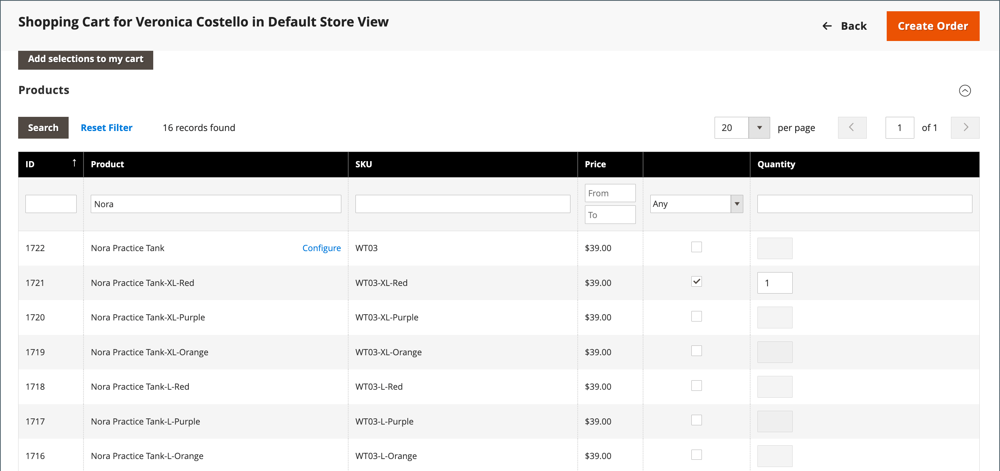

# Verwalten eines Warenkorbs

{{ee-feature}}

Um eine unterstützte Einkaufssession zu starten, muss der Kunde in seinem Konto in der Storefront angemeldet sein, um die Informationen verfügbar zu machen. Wenn der Kunde kein Konto hat, können Sie [Einen erstellen](../customers/account-create.md).

{width="600" zoomable="yes"}

## Aktionssteuerung

| Option | Beschreibung |
|--- |--- |
| [!UICONTROL Remove] | Entfernt Artikel aus dem aktuellen Warenkorb |
| [!UICONTROL Move to Wish List] | Verschiebt Artikel in die ausgewählte Kunden-Wunschliste |

{style="table-layout:auto"}

## Steuertasten

| Schaltfläche | Beschreibung |
|--- |--- |
| [!UICONTROL Clear my shopping cart] | Löscht den aktuellen Warenkorb von allen Produkten. |
| [!UICONTROL Update Items and Quantities|]Geben Sie die gewünschte Menge in das Feld **[!UICONTROL Qty]** die Anzahl der Artikel im Warenkorb eingeben und aktualisieren. |
| [!UICONTROL Add selections to my cart] | Fügt Produkte aus allen Bereichen zum Warenkorb hinzu. |

{style="table-layout:auto"}

## Überprüfen, ob der Kunde angemeldet ist

1. Auf der _Admin_ Seitenleiste, zu gehen **[!UICONTROL Customers]** > **[!UICONTROL Now Online]**.

   Alle Besucher des Stores und angemeldete Kunden werden in der Liste angezeigt.

   {width="700" zoomable="yes"}

## Angebotsunterstützter Einkauf

1. Auf der _Admin_ Seitenleiste, zu gehen **[!UICONTROL Customers]** > **[!UICONTROL All Customers]**.

1. Öffnen Sie in der Liste den Kundendatensatz im Bearbeitungsmodus.

   >[!TIP]
   >
   >Um den Kundendatensatz schnell zu finden, verwenden Sie die [Filter](../getting-started/admin-grid-controls.md) Kontrolle.

   Im Kundenprofil unter _[!UICONTROL Personal Information]_, die_[!UICONTROL Last Logged In]_ Datum und Uhrzeit zeigen an, dass der Kunde online ist.

   {width="600" zoomable="yes"}

1. Um in den unterstützten Einkaufsmodus zu wechseln, klicken Sie auf **[!UICONTROL Manage Shopping Cart]** in der oberen Schaltflächenleiste.

   {width="600" zoomable="yes"}

## Produkte nach Attribut zum Warenkorb hinzufügen

1. Expand  Die **[!UICONTROL Products]** -Abschnitt.

1. Suchen Sie mithilfe eines der Filter oben in jeder Spalte nach einem Produkt.

1. Klick **[!UICONTROL Search]**.

1. Verwenden Sie je nach Produkttyp einen der folgenden Schritte:

### Einfaches Produkt hinzufügen

1. Klicken Sie auf das Produkt, das Sie bestellen möchten.

   Diese Aktion wählt den Datensatz aus und legt fest **[!UICONTROL Quantity]** auf den Standardwert von `1`.

1. Aktualisieren Sie bei Bedarf die bestellte Menge.

1. Klicken Sie links über dem Raster auf **[!UICONTROL Add selections to my cart]**.

   {width="600" zoomable="yes"}

   Der Zeileneintrag wird dem Warenkorb oben auf der Seite hinzugefügt.

   {width="600" zoomable="yes"}

### Produkt mit Konfiguration hinzufügen

Es gibt drei Arten von Produkten, die konfiguriert werden müssen, bevor sie zum Warenkorb hinzugefügt werden: `Bundle Product`, `Configurable Product`, und `Grouped Product`.

1. Klicken Sie im Raster auf **[!UICONTROL Configure]** neben dem Produktnamen.

   {width="600" zoomable="yes"}

1. In der _Zugehörige Produkte_ Wählen Sie jede Produktoption aus, um den zu bestellenden Artikel zu beschreiben, und geben Sie Folgendes ein **[!UICONTROL Quantity]** und klicken Sie auf **[!UICONTROL OK]**.

   Das Produkt wird mit einem Häkchen markiert und die bestellte Menge wird im Raster angezeigt.

1. Um das Produkt zum Warenkorb hinzuzufügen, klicken Sie auf **[!UICONTROL Add selections to my cart]**.

   {width="600" zoomable="yes"}

1. Aktualisieren Sie bei Bedarf die Produktoptionen im Warenkorb:

   - Klick **[!UICONTROL Configure]**.

   - Aktualisieren Sie die Optionen und klicken Sie dann auf **[!UICONTROL OK]**.

## Produkt nach SKU hinzufügen

1. Expand  Die **[!UICONTROL Add to Shopping Cart by SKU]** -Abschnitt.

1. Produkte einzeln hinzufügen nach **[!UICONTROL SKU]** oder fügen Sie Produkte hinzu, indem Sie eine CSV-Datei hochladen.

### Elemente einzeln nach SKU hinzufügen

1. Geben Sie die **[!UICONTROL SKU]** und **[!UICONTROL Qty]** des zu bestellenden Artikels.

1. Um ein anderes Produkt zu bestellen, klicken Sie auf **[!UICONTROL Add another]**.

   {width="600" zoomable="yes"}

1. Klick **[!UICONTROL Add selections to my cart]**.

1. Wenn das Element ein konfigurierbares Produkt ist, wählen Sie die Produktoptionen aus, wenn Sie dazu aufgefordert werden, und klicken Sie dann auf **[!UICONTROL Add to Shopping Cart]**.

### Hinzufügen von Produkten durch Hochladen einer CSV-Datei

1. Vorbereiten eines [CSV-Datei](../systems/data-csv.md) mit den Artikeln, die dem Warenkorb hinzugefügt werden sollen.

   Die Datei darf nur zwei Spalten enthalten: `sku` und `qty` in der Kopfzeile.

1. Laden Sie die vorbereitete Datei hoch:

   - Klick **[!UICONTROL Choose File]**.

   - Wählen Sie die Datei aus, die aus Ihrem Verzeichnis hochgeladen werden soll.

## Übertragen eines Artikels

Sie können Artikel aus der Wunschliste eines Kunden in den Warenkorb legen und kürzlich angesehene, verglichene oder bestellte Artikel anzeigen. Die Anzahl der Elemente in den einzelnen Abschnitten wird in Klammern hinter der Abschnittsüberschrift angezeigt.

1. Expand  einen der folgenden Abschnitte:

   - [!UICONTROL Wish List]
   - [!UICONTROL Products in the Comparison List]
   - [!UICONTROL Recently Compared Products]
   - [!UICONTROL Recently Viewed Products]
   - [!UICONTROL Last Ordered Items]

1. Wählen Sie im Raster jedes zu bestellende Produkt aus und geben Sie die **[!UICONTROL Quantity]**.

1. Um die Optionen für ein konfigurierbares Produkt einzugeben, klicken Sie auf **[!UICONTROL Configure]** und legen Sie die Produktoptionen nach Bedarf fest.

1. Klick **[!UICONTROL Add selections to my cart]**.

1. Wenden Sie einen oder mehrere Couponcodes an, falls verfügbar:

   - für **[!UICONTROL Apply Coupon Code]**, geben Sie einen gültigen Gutscheincode ein.

   - Klicken Sie auf die Schaltfläche _Übernehmen_ (  ) Pfeil.

1. Passen Sie die bestellte Menge nach Bedarf an:

   - In der **[!UICONTROL Qty]** Spalte des anzupassenden Produkts. Geben Sie den korrekten Betrag ein.

   - Klick **[!UICONTROL Update Items and Quantities]**.

## Bestellung erstellen

1. Klick **[!UICONTROL Create Order]**.

   Die _[!UICONTROL Create New Order]_Die Seite zeigt die Artikel im Warenkorb an, gefolgt von den Versand- und Zahlungsinformationen.

1. Füllen Sie die Versand- und Zahlungsinformationen aus.

1. Klick **[!UICONTROL Submit Order]**.

Weitere Informationen finden Sie unter [Bestellung erstellen](customer-account-create-order.md).
