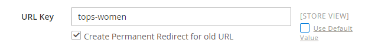

# Store-Lokalisierung

Der Großteil des Textes, der auf Seiten in Ihrem Store hartcodiert zu sein scheint, kann sofort in eine andere Sprache geändert werden, indem das Gebietsschema der Ansicht geändert wird. Wenn Sie das Gebietsschema ändern, wird der Text nicht Wort für Wort übersetzt, sondern es wird einfach auf eine andere Übersetzungstabelle verwiesen, die den Schnittstellentext bereitstellt, der im gesamten Store verwendet wird. Der Text, der geändert werden kann, umfasst Navigationstitel, Beschriftungen, Schaltflächen und Links wie _Mein Warenkorb_ und _Mein Konto_. Sie können auch das Tool [Inline-Übersetzung](../configuration-reference/advanced/developer.md) verwenden, um Text in der Benutzeroberfläche zu bereinigen.

Sprachpakete finden Sie unter [Übersetzungen und Lokalisierung](https://marketplace.magento.com/extensions/content-customizations/translations-localization.html){:target="_blank"} auf Commerce Marketplace. Es werden kontinuierlich neue Erweiterungen zu Marketplace hinzugefügt. Schauen Sie daher öfter mal vorbei.

## Schritt 1: Installieren eines Sprachpakets

Befolgen Sie die Standardanweisungen für die Installation der Language Pack-Erweiterung. Detaillierte Informationen zum Installieren einer Erweiterung finden Sie unter [Allgemeine CLI](https://experienceleague.adobe.com/docs/commerce-operations/installation-guide/tutorials/extensions.html?lang=de)Installation im _Erweiterungshandbuch_.

## Schritt 2: Erstellen Sie eine Store-Ansicht für die Sprache

1. Navigieren Sie in _Admin_-Seitenleiste zu **[!UICONTROL Stores]** > _[!UICONTROL Settings]_>**[!UICONTROL All Stores]**.

1. Klicken Sie auf **[!UICONTROL Create Store View]**.

1. Optionen für die neue Store-Ansicht festlegen:

   - **[!UICONTROL Store]** - Wählen Sie den Store aus, der der Ansicht übergeordnet ist.

   - **[!UICONTROL Name]** - Geben Sie einen Namen für die Shop-Ansicht ein. Beispiel: Portugiesisch.

     In der Kopfzeile des Stores wird der Name in der _Sprachauswahl“_.

   - **[!UICONTROL Code]** — Geben Sie einen Code in Kleinbuchstaben ein, um die Ansicht zu identifizieren. Beispiel: `portuguese`.

   - **[!UICONTROL Status]** - Zum Aktivieren der Ansicht `Enabled` festlegen.

   - **[!UICONTROL Sort Order]** - (Optional) Geben Sie eine Zahl ein, um die Reihenfolge zu bestimmen, in der diese Ansicht mit anderen Ansichten aufgeführt wird.

1. Klicken Sie abschließend auf **[!UICONTROL Save Store View]**.

## Schritt 3: Ändern des Gebietsschemas der Store-Ansicht

1. Navigieren Sie in _Admin_-Seitenleiste zu **[!UICONTROL Stores]** > _[!UICONTROL Settings]_>**[!UICONTROL Configuration]**.

1. Wählen Sie in der Dropdown-Liste **[!UICONTROL Scope]** die zu konfigurierende Store-Ansicht aus und klicken Sie auf **[!UICONTROL OK]**, wenn Sie dazu aufgefordert werden.

1. Erweitern Sie auf der Seite *[!UICONTROL General]* den  Abschnitt **[!UICONTROL Locale Options]** .

1. Deaktivieren Sie das Kontrollkästchen **[!UICONTROL Use Website]** und legen Sie **[!UICONTROL Locale]** auf die Sprache fest, die Sie der Ansicht zuweisen möchten.

   Wenn mehrere Varianten der Sprache verfügbar sind, wählen Sie die für die jeweilige Region oder den Dialekt.

1. Klicken Sie abschließend auf **[!UICONTROL Save Config]**.

   Nachdem Sie die Sprache des Gebietsschemas geändert haben, müssen die verbleibenden von Ihnen erstellten Inhalte, einschließlich Produktnamen und Beschreibungen, Kategorien, [CMS](../content-design/page-translate.md)-Seiten und -Blöcke, für jede Shop-Ansicht separat übersetzt werden.

## Lokalisieren von Produkten

Wenn Ihr Store mehrere Ansichten in verschiedenen Sprachen hat, sind in jeder Store-Ansicht dieselben Produkte verfügbar. Sie können dieselben grundlegenden Produktinformationen wie SKU, Preis und Bestand unabhängig von der Sprache verwenden. Übersetzen Sie dann nur den Produktnamen, die Beschreibungsfelder und die Metadaten nach Bedarf für jede Sprache.

### Schritt 1: Produktfelder übersetzen

1. Navigieren Sie in der _Admin_-Seitenleiste zu **[!UICONTROL Catalog]** > **[!UICONTROL Products]**.

1. Suchen Sie im Raster das zu übersetzende Produkt und öffnen Sie es im Bearbeitungsmodus.

1. Setzen Sie in der oberen linken Ecke **[!UICONTROL Store View]** auf die Ansicht für die Übersetzung und klicken Sie auf **[!UICONTROL OK]**, wenn Sie zur Bestätigung aufgefordert werden.

1. Gehen Sie für jedes Feld, das bearbeitet werden soll, wie folgt vor:

   - Deaktivieren Sie das Kontrollkästchen **[!UICONTROL Use Default Value]** rechts neben dem Feld.

   - Fügen Sie den übersetzten Text in das Feld ein oder geben Sie ihn ein.

   Achten Sie darauf, alle Textfelder zu übersetzen, einschließlich [Bild](../catalog/catalog-images-video.md)-Beschriftungen und Alternativtext, [Felder für die Suchmaschinenoptimierung](../catalog/product-search-engine-optimization.md) und alle [benutzerdefinierten Optionen](../catalog/settings-advanced-custom-options.md)-Informationen.

1. Klicken Sie abschließend auf **[!UICONTROL Save]**.

### Schritt 2: Übersetzen von Feldbezeichnungen

1. Navigieren Sie in _Admin_-Seitenleiste zu **[!UICONTROL Stores]** > _[!UICONTROL Attributes]_>**[!UICONTROL Product]**.

1. Suchen Sie in der Liste das zu übersetzende Attribut und öffnen Sie es im Bearbeitungsmodus.

1. Wählen Sie im linken Bedienfeld **[!UICONTROL Manage Labels]** aus.

1. Geben Sie im Abschnitt _[!UICONTROL Manage Titles]_&#x200B;für jede Shop-Ansicht einen übersetzten Titel ein.

   {width="600" zoomable="yes"}

1. Klicken Sie abschließend auf **[!UICONTROL Save Attribute]**.

### Schritt 3: Alle Kategorien übersetzen

1. Navigieren Sie in _Admin_-Seitenleiste zu **[!UICONTROL Catalog]** > **Kategorien**.

1. Legen Sie in der oberen linken Ecke **[!UICONTROL Store View]** auf die Ansicht für die Übersetzung fest und klicken Sie auf **[!UICONTROL OK]**, wenn Sie zur Bestätigung aufgefordert werden.

1. Suchen Sie in der Baumstruktur die zu übersetzende Kategorie und öffnen Sie sie im Bearbeitungsmodus.

1. Für _grundlegende Informationen_ übersetzen Sie **[!UICONTROL Category Name]**.

1. Erweitern Sie  den Abschnitt _[!UICONTROL Content]_&#x200B;und übersetzen Sie **[!UICONTROL Description]**.

1. Erweitern Sie  den Abschnitt **[!UICONTROL Search Engine Optimization Settings]** und übersetzen Sie die folgenden Felder:

   - **[!UICONTROL Meta Title]**
   - **[!UICONTROL Meta Keywords]**
   - **[!UICONTROL Meta Description]**

1. Gehen Sie im Abschnitt _[!UICONTROL Search Engine Optimization Settings]_&#x200B;wie folgt vor, um die **[!UICONTROL URL Key]**&#x200B;zu übersetzen:

   - Deaktivieren Sie das **[!UICONTROL Use Default Value]** Kontrollkästchen rechts neben dem Feld.

   - Geben Sie den übersetzten Text ein.

   - Stellen Sie sicher, dass das Kontrollkästchen **[!UICONTROL Create Permanent Redirect for old URL]** aktiviert ist.

   

1. Klicken Sie abschließend auf **[!UICONTROL Save Category]**.

1. Wiederholen Sie den Vorgang für alle im Store verwendeten Kategorien.

### Schritt 4: Optionen für Produktattribute und -attribute übersetzen

1. Navigieren Sie in _Admin_-Seitenleiste zu **[!UICONTROL Stores]** > _[!UICONTROL Attributes]_>**[!UICONTROL Product]**.

1. Wählen Sie das zu übersetzende Attribut aus.

1. Wählen Sie links **[!UICONTROL Manage Labels]** und legen Sie die **[!UICONTROL Managed Titles]** Optionen fest, um die Attributtitelübersetzungen zu definieren.

1. Wählen Sie links **[!UICONTROL Properties]** aus und geben Sie die übersetzten Attributoptionen in den Abschnitt **[!UICONTROL Manage Options]** ein.

   {width="600" zoomable="yes"}

1. Klicken Sie abschließend auf **[!UICONTROL Save Attribute]**.
