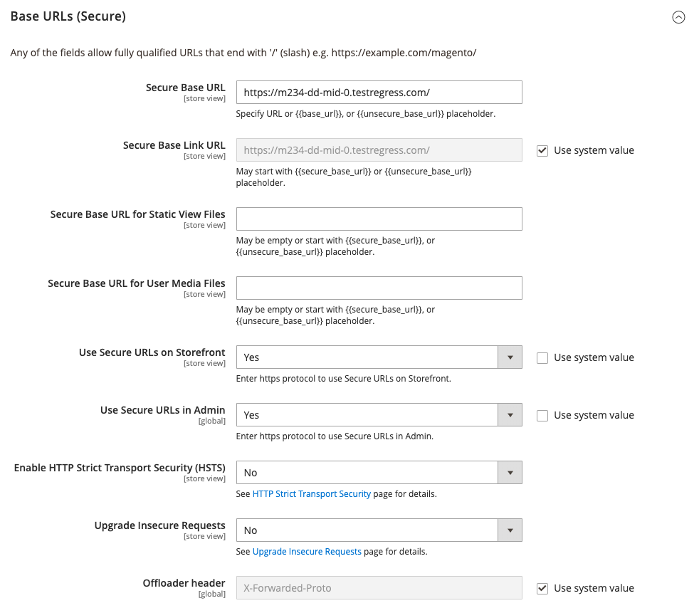

# URLs speichern

Jede Website in einer Adobe Commerce- oder Magento Open Source-Installation verfügt über eine Basis-URL, die der Storefront zugewiesen ist, und eine weitere URL, die dem Administrator zugewiesen ist. Adobe verwendet Variablen, um interne Links in Bezug auf die Basis-URL zu definieren. Dies ermöglicht es, einen gesamten Store von einem Speicherort an einen anderen zu verschieben, ohne die Links zu aktualisieren. Standard-Basis-URLs beginnen mit `http` und sichere Basis-URLs beginnen mit `https`.

- **Basis-URL** — `http://www.yourdomain.com/magento/`
- **Sichere Basis-URL** — `https://www.yourdomain.com/magento/`
- **URL mit IP-Adresse** — `http://###.###.###.###/magento/` oder `https://###.###.###.###/magento/`

>[!IMPORTANT]
>
>Ändern Sie die Admin-URL nicht von der standardmäßigen Basis-URL-Konfiguration. Informationen zum Ändern der Admin-URL oder des Pfads finden Sie unter [Verwenden einer benutzerdefinierten Admin-URL](#use-a-custom-admin-url).

## Sicheres Protokoll verwenden

Die Basis-URLs für Ihren Store wurden ursprünglich während Ihrer Adobe Commerce-Installation eingerichtet. Wenn zu diesem Zeitpunkt ein Sicherheitszertifikat verfügbar war, konnten Sie für `HTTPS` URLs angeben, die für den Store, Admin oder beides verwendet werden sollen. Wenn Ihre Adobe Commerce-Installation mehrere Stores umfasst oder Sie planen, später weitere Stores hinzuzufügen, können Sie den Store-Code in die URL aufnehmen. Alle Adobe-Ressourcen und -Vorgänge können mit einem sicheren Protokoll verwendet werden.

Wenn zum Zeitpunkt der Installation kein Sicherheitszertifikat für die Domain verfügbar war, aktualisieren Sie die Konfiguration, bevor Sie den Store starten. Nachdem ein Sicherheitszertifikat für Ihre Domain eingerichtet wurde, können Sie eine oder beide Basis-URLs so konfigurieren, dass sie mit dem SSL-Protokoll (Encrypted Secure Sockets Layer) und [Transport Layer Security][1]-Protokoll (TLS) funktionieren.

>[!IMPORTANT]
>
>Adobe empfiehlt dringend, alle Seiten einer Produktions-Site, einschließlich Inhalts- und Produktseiten, unter Verwendung eines sicheren Protokolls zu übertragen.

Adobe Commerce und Magento Open Source können so konfiguriert werden, dass standardmäßig alle Seiten über `HTTPS` bereitgestellt werden. Wenn Ihr Store mit einem Standardprotokoll ausgeführt wird, können Sie die Sicherheit verbessern, indem Sie [HTTP Strict Transport Security][2] (HSTS) aktivieren und alle unsicheren Seitenanfragen aktualisieren. HSTS ist ein Opt-in-Protokoll, das Browser daran hindert, standardmäßige `HTTP`-Seiten zu rendern, die mit einem unsicheren Protokoll für die angegebene Domain übertragen werden. Da Suchmaschinen möglicherweise bereits jede Seite Ihres Stores mit standardmäßigen `HTTP`-URLs indiziert haben, können Sie Commerce so konfigurieren, dass unsichere Seitenanfragen automatisch auf `HTTPS` aktualisiert werden, sodass Sie keinen Traffic verlieren. Wenn Commerce so konfiguriert ist, dass sichere URLs sowohl für die Storefront als auch für Admin verwendet werden, werden zwei zusätzliche Felder angezeigt, in denen Sie `HSTS` aktivieren können.

## Konfigurieren der Basis-URL

1. Navigieren Sie in _Admin_-Seitenleiste zu **[!UICONTROL Stores]** > _[!UICONTROL Settings]_>**[!UICONTROL Configuration]**.

1. Wählen _im_ Bereich unter „Allgemein“ die Option &quot;**[!UICONTROL Web]**&quot;.

1. Erweitern Sie  den Abschnitt **[!UICONTROL Base URL]** .

   - **[!UICONTROL Base URL]** - Geben Sie die vollständig qualifizierte Basis-URL für Ihren Store ein. Stellen Sie sicher, dass Sie die URL mit einem Schrägstrich beenden, damit sie mit zusätzlichen URL-Schlüsseln aus Ihrem Store erweitert werden kann. Beispiel: `http://yourdomain.com/`

     >[!NOTE]
     >
     >Ändern Sie den Platzhalter im Feld _[!UICONTROL Base Link URL]_&#x200B;nicht. Dies ist ein Platzhalter, der zum Erstellen relativer Links zur Basis-URL verwendet wird.

   - **[!UICONTROL Base URL for Static View Files]** - (Optional) Geben Sie einen alternativen Speicherort für die Basis-URL für statische Ansichtsdateien an, indem Sie den Pfad eingeben, der mit dem folgenden Platzhalter beginnt:

     \{\{unsecure_base_url}}

   - **[!UICONTROL Base URL for User Media Files]** - (Optional) Geben Sie einen alternativen Speicherort für die Basis-URL für Benutzer-Mediendateien an, indem Sie den Pfad mit dem folgenden Platzhalter eingeben:

     \{\{unsecure_base_url}}

     Für eine typische Installation müssen die Pfade für die statischen Ansichtsdateien oder Mediendateien nicht aktualisiert werden, da sie relativ zur Basis-URL sind.

   {width="600" zoomable="yes"}

   >[!NOTE]
   >
   >In doppelte Klammern eingeschlossene Platzhalter sind Markup-Tags für Variablen.

1. Klicken Sie abschließend auf **[!UICONTROL Save Config]**.

## Konfigurieren der sicheren Basis-URL

Wenn Ihre Domain über ein gültiges Sicherheitszertifikat verfügt, können Sie die URLs sowohl der Storefront als auch von Admin konfigurieren, um Daten über einen sicheren (HTTPS-)Kanal zu übertragen. Ohne ein gültiges Sicherheitszertifikat kann Ihr Store nicht mit einem sicheren Protokoll (SSL/TLS) arbeiten.

1. Erweitern Sie  den Abschnitt _[!UICONTROL Base URLs (Secure])_ und führen Sie folgende Schritte aus:

   {width="600" zoomable="yes"}

   - **[!UICONTROL Secure Base URL]** - Geben Sie die vollständige sichere Basis-URL ein, gefolgt von einem Schrägstrich. Beispiel: `https://yourdomain.com/`

   - **[!UICONTROL Secure Base Link URL]** - Ändern Sie den Platzhalter im Feld für sichere Basis-Link-URL nicht. Er wird verwendet, um relative Links zur sicheren Basis-URL zu erstellen.

   - **[!UICONTROL Secure Base URL for Static View Files]** - (Optional) Geben Sie einen alternativen Speicherort für die sichere Basis-URL für statische Ansichtsdateien an, indem Sie den Pfad eingeben, der mit dem folgenden Platzhalter beginnt:

     \{\{secure_base_url}}

   - **[!UICONTROL Secure Base URL for User Media Files]** - (Optional) Geben Sie einen alternativen Speicherort für die sichere Basis-URL für Benutzer-Mediendateien an, indem Sie den Pfad mit dem folgenden Platzhalter eingeben:

     \{\{secure_base_url}}

1. Um die Sicherheit zu erhöhen, setzen Sie die beiden folgenden Optionen auf `Yes`.

   - **[!UICONTROL Use Secure URLs on Storefront]**
   - **[!UICONTROL Use Secure URLs in Admin]**

1. Gehen Sie _[!UICONTROL Enhanced Security Settings]_&#x200B;wie folgt vor:

   - **[!UICONTROL Enable HTTP Strict Transport Security (HSTS)]** - Wenn Ihr Store nur sichere HTTPS-Seitenanfragen anzeigen soll, setzen Sie auf `Yes`.

   - **[!UICONTROL Upgrade Insecure Requests]** - Um alle Anfragen für standardmäßige ungesicherte HTTP-Seiten auf sicheres HTTPS zu aktualisieren, setzen Sie auf `Yes`.

1. Legen Sie die **[!UICONTROL Offloader Header]** für Ihren Server fest.

   Bei den meisten Commerce-Installationen wird das Protokoll anhand der `X-Forward-Proto` entweder als `HTTP` oder `HTTPS` identifiziert. Wenn Ihre Server-Konfiguration einen anderen Offloader_Header verwendet, geben Sie ihn hier ein.

1. Klicken Sie abschließend auf **[!UICONTROL Save Config]**.

## Speichern des Codes in URLs

>[!NOTE]
>
>Wenn die Option _Store-Code zu URLs hinzufügen_ auf `Yes` festgelegt ist, müssen Sie Store-Codes in Ihre Browser-URLs einfügen. Diese Einstellung stellt sicher, dass URL-Neuschreibungen korrekt zugeordnet werden und alle Seiten erfolgreich geöffnet werden, ohne dass _Fehler „404 Seite nicht gefunden“_.

1. Navigieren Sie in _Admin_-Seitenleiste zu **[!UICONTROL Stores]** > _[!UICONTROL Settings]_>**[!UICONTROL Configuration]**.

1. Wählen Sie unter _[!UICONTROL General]_&#x200B;im linken Bedienfeld **[!UICONTROL Web]**&#x200B;aus.

1. Erweitern Sie  den Abschnitt **[!UICONTROL URL Options]** .

1. **[!UICONTROL Add Store Code]** auf Ihre Voreinstellung festlegen:

   - **[!UICONTROL URL with Store Code]**: `http://www.yourdomain.com/magento/[store-code]/index.php/url-identifier`
   - **[!UICONTROL URL without Store Code]**: `http://www.yourdomain.com/magento/index.php/url-identifier`

   {width="600" zoomable="yes"}

1. Klicken Sie abschließend auf **[!UICONTROL Save Config]**.

1. Klicken Sie auf den Link **[!UICONTROL Cache Management]** in der Nachricht oben im Arbeitsbereich. Folgen Sie dann den Anweisungen, um den Cache zu aktualisieren.

   

## Fehlerbehebung bei URLs

Wenn nach den Konfigurationsanweisungen einige Seiten weiterhin mit der unsicheren URL (`http://`) bereitgestellt werden, gehen Sie wie folgt vor:

- Ändern Sie die (unsichere) Basis-URL in die sichere HTTPS-URL.
- Bearbeiten Sie auf dem Server die `.htaccess` (oder den Lastenausgleich), sodass die unsichere URL zur sicheren URL umgeleitet wird.

## Benutzerdefinierte Admin-URL verwenden

Als [Best Practice für die Sicherheit](https://experienceleague.adobe.com/docs/commerce-operations/implementation-playbook/best-practices/launch/security-best-practices.html?lang=de) empfiehlt Adobe die Verwendung einer eindeutigen Admin-URL anstelle des Standardbegriffs _admin_ oder eines allgemeinen Begriffs wie _Backend_. Obwohl Ihre Site dadurch nicht direkt vor einem bestimmten schlechten Akteur geschützt wird, kann dies die Offenlegung gegenüber Skripten reduzieren, die versuchen, nicht autorisierten Zugriff zu erhalten.

>[!NOTE]
>
>Erkundigen Sie sich bei Ihrem Hosting-Anbieter, bevor Sie eine benutzerdefinierte Admin-URL implementieren. Einige Hosting-Anbieter benötigen eine Standard-URL, um die Firewall-Schutzregeln zu erfüllen.

In einer typischen Installation folgen die Admin-URL und der Pfad sofort der Basis-URL. Der Admin-Pfad ist ein Verzeichnis unter dem Stamm.

- **Standard-Basis-URL**: `http://yourdomain.com/magento/`
- **Standard-Administratorpfad**: `admin`
- **Standard-Admin-URL und -Pfad**: `http://yourdomain.com/magento/admin`

Obwohl es möglich ist, die Admin-URL und den Pfad zu einem anderen Speicherort zu ändern, wird bei jedem Fehler der Zugriff auf den Admin entfernt und der Fehler muss vom Server behoben werden.

>[!NOTE]
>
>Versuchen Sie vorsichtshalber nicht, die Admin-URL selbst zu ändern, es sei denn, Sie wissen, wie Sie Konfigurationsdateien auf dem Server bearbeiten. Ändern Sie für Adobe Commerce-Projekte, die in der Cloud-Infrastruktur bereitgestellt werden, die Admin-URL, indem Sie die [Anweisungen](https://experienceleague.adobe.com/docs/commerce-cloud-service/user-guide/configure/env/stage/variables-admin.html?lang=de#admin-url) im Handbuch *Adobe Commerce on Cloud Infrastructure* befolgen.

### Methode 1: Wechsel vom Administrator

1. Navigieren Sie in _Admin_-Seitenleiste zu **[!UICONTROL Stores]** > _[!UICONTROL Settings]_>**[!UICONTROL Configuration]**.

1. Erweitern Sie im linken Bereich **[!UICONTROL Advanced]** und wählen Sie **[!UICONTROL Admin]**.

1. Erweitern Sie  den Abschnitt **[!UICONTROL Admin Base URL]** .

1. Legen Sie die Konfigurationsoptionen für die benutzerdefinierte URL fest:

   {width="600" zoomable="yes"}

   Deaktivieren Sie bei Bedarf das Kontrollkästchen **[!UICONTROL Use system value]** , um die Einstellung zu ändern.

   - Legen Sie **[!UICONTROL Use Custom Admin URL]** auf `Yes` fest.

   - **[!UICONTROL Custom Admin URL]** eingeben: `http://yourdomain.com/magento/`

     >[!NOTE]
     >
     >Die Admin-URL muss sich in derselben Commerce-Installation befinden und denselben Dokumentstamm wie die Storefront haben.

   - Legen Sie **[!UICONTROL Custom Admin Path]** auf `Yes` fest.

   - Geben Sie **[!UICONTROL Custom Admin Path]** den Pfad ein, der als benutzerdefinierter Admin-Ordnername verwendet werden soll.

     Beispiel: `sample_custom_admin`

1. Klicken Sie abschließend auf **[!UICONTROL Save Config]**.

1. Nachdem die Änderungen gespeichert wurden, melden Sie sich von der Administratorin bzw. dem Administrator ab und melden Sie sich mit der neuen Admin-URL und dem neuen Pfad erneut an.

### Methode 2: Ändern Sie den Administratorpfad über die Server-Befehlszeile

1. Öffnen Sie die `app/etc/env.php` in einem Texteditor und ändern Sie den Wert des `frontName` des `backend`. Speichern Sie dann die Datei.

   Achten Sie darauf, nur Kleinbuchstaben zu verwenden.

   >[!NOTE]
   >
   >   Auf diese Weise können Sie den Admin-Pfad, aber nicht die Admin-URL ändern.

   >[!TIP]
   >
   >Für Adobe Commerce in der Cloud-Infrastruktur können Sie einen benutzerdefinierten Administratorpfad mithilfe der Variablen `ADMIN_URL` in der Cloud-Benutzeroberfläche einrichten. Siehe [Thema Admin-Variablen](https://experienceleague.adobe.com/docs/commerce-cloud-service/user-guide/configure/env/stage/variables-admin.html?lang=de) im Handbuch zu _Commerce in Cloud-Infrastrukturen_.

   - **Standard-Administratorpfad**

     ```php?start_inline=1
     'backend' => [
      'frontName' => 'admin'
     ],
     ```

   - **Neuer Admin-Pfad**

     ```php?start_inline=1
     'backend' => [
         'frontName' => 'backend'
     ],
     ```

1. Verwenden Sie eine der folgenden Methoden, um den Cache zu löschen:

   - Navigieren Sie in _Admin_-Seitenleiste zu **[!UICONTROL System]** > _[!UICONTROL Tools]_>**[!UICONTROL Cache Management]**. Klicken Sie dann auf **[!UICONTROL Flush Magento Cache]**.
   - Führen Sie auf dem Server Folgendes aus:

     ```bash
     php bin/magento cache:flush
     ```

   >[!NOTE]
   >
   >Die mit der Methode 1 vorgenommenen Änderungen haben Vorrang vor den Änderungen, die in der `app/etc/env.php`-Datei vorgenommen wurden.

### Methode 3: Ändern des Admin-Pfads mithilfe der Commerce-CLI

Sie können den Befehl CLI `setup:config:set` verwenden, um den Administratorpfad zu ändern. Im folgenden Beispiel wird die Option `--backend-frontname` verwendet, um den Pfad vom Commerce-Stamm in einen neuen Admin-Pfad zu ändern:

```bash
bin/magento setup:config:set --backend-frontname="backend_front_name"
```

Dieser Befehl aktualisiert die Konfigurationsoption `backend` > `frontName` in der `app/etc/env.php`.

## Standard-Admin-URL und Admin-Pfad wiederherstellen

Falls Sie eine ungültige Admin-URL oder einen Admin-Pfad festgelegt haben und den Zugriff auf das Backend verloren haben, gibt es eine Möglichkeit, dies über die Befehlszeile zu beheben.

1. Um zur standardmäßigen Admin-URL zurückzukehren, führen Sie diesen Befehl aus:

   ```bash
   php bin/magento config:set admin/url/use_custom 0
   ```

1. Um zum standardmäßigen Administratorpfad zurückzukehren (der im `app/etc/env.php` wie in Methode 2 beschrieben festgelegt ist), führen Sie diesen Befehl aus:

   ```bash
   php bin/magento config:set admin/url/use_custom_path 0
   ```

1. Verwenden Sie eine der folgenden Methoden, um den Cache zu löschen:

   - Navigieren Sie in _Admin_-Seitenleiste zu **[!UICONTROL System]** > _[!UICONTROL Tools]_>**[!UICONTROL Cache Management]**. Klicken Sie dann auf **[!UICONTROL Flush Magento Cache]**.
   - Führen Sie auf dem Server Folgendes aus:

     ```bash
     php bin/magento cache:flush
     ```


[1]: https://en.wikipedia.org/wiki/Transport_Layer_Security
[2]: https://en.wikipedia.org/wiki/HTTP_Strict_Transport_Security
