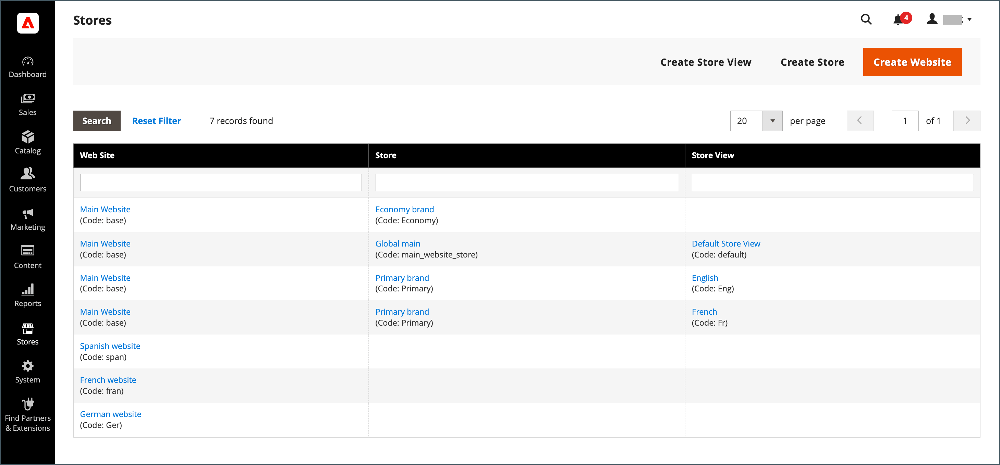
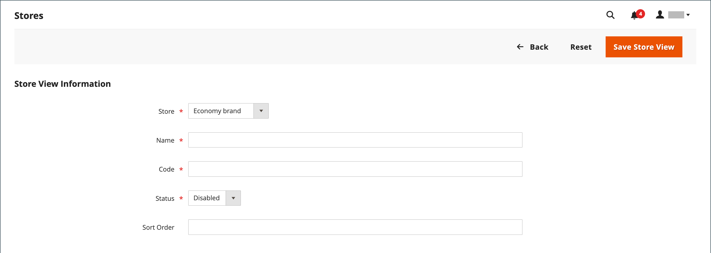
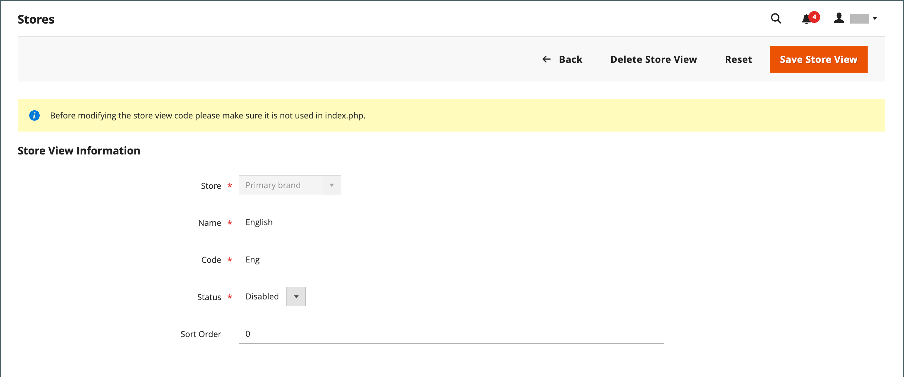

# Ansichten speichern

Store-Ansichten werden normalerweise verwendet, um den Store in verschiedenen Gebietsschemata verfügbar zu machen. Käufer können die Sprachauswahl in der Kopfzeile des Stores verwenden, um die Store-Ansicht zu ändern.

{width="550"}

## Shop-Ansicht hinzufügen

1. Navigieren Sie in _Admin_-Seitenleiste zu **[!UICONTROL Stores]** > _[!UICONTROL Settings]_>**[!UICONTROL All Stores]**.

   {width="700" zoomable="yes"}

1. Klicken Sie auf **[!UICONTROL Create Store View]**.

   {width="600" zoomable="yes"}

1. **[!UICONTROL Store]** auf den übergeordneten Speicher dieser Ansicht festlegen.

1. Geben Sie einen **[!UICONTROL Name]** für diese Store-Ansicht ein.

   Der Name wird in der Sprachauswahl in der Store-Kopfzeile angezeigt. Beispiel: `Spanish`.

1. Geben Sie **[!UICONTROL Code]** den Code ein, der die Ansicht identifiziert (in Kleinbuchstaben).

   Beispiel: `spanish`.

1. Um die Ansicht zu aktivieren, setzen Sie **[!UICONTROL Status]** auf `Enabled`.

1. (Optional) Geben Sie eine **[!UICONTROL Sort Order]** ein, um die Reihenfolge zu bestimmen, in der diese Ansicht in anderen Ansichten aufgeführt wird.

1. Klicken Sie auf **[!UICONTROL Save Store View]**.

## Shop-Ansicht bearbeiten

Da der Ansichtsname in der Sprachauswahl angezeigt wird, empfiehlt es sich, den Namen der Standardansicht zu ändern, damit diese anschaulicher wird. Das Feld _Name_ ist einfach eine Bezeichnung und kann einfach geändert werden.

Wenn Ihre Adobe Commerce- oder Magento Open Source-Installation über eine Multi-Site- oder Multi-Store-Einrichtung verfügt, ändern Sie das Feld „Store-Code“ nicht, ohne sicherzustellen, dass der Wert in der `index.php`-Datei nicht referenziert wird. Wenn Sie keinen Zugriff auf den Server haben, um die Datei zu untersuchen, bitten Sie einen Entwickler um Hilfe.

| Feld | Ausgangswert | Aktualisierter Wert |
| ----- | -------------- | ------------- |
| [!UICONTROL Name] | `Default Store View` | `English` |
| [!UICONTROL Code] | `default` | `english` |

{style="table-layout:auto"}

1. Navigieren Sie in _Admin_-Seitenleiste zu **[!UICONTROL Stores]** > _[!UICONTROL Settings]_>**[!UICONTROL All Stores]**.

1. Klicken Sie in der Spalte _[!UICONTROL Store View]_&#x200B;des Rasters auf den Namen der Ansicht, die Sie bearbeiten möchten.

   Beim Bearbeiten der Standardansicht sind die Felder _[!UICONTROL Store]_&#x200B;und&#x200B;_[!UICONTROL Status]_ nicht verfügbar.

   {width="600" zoomable="yes"}

1. Aktualisieren Sie die folgenden Felder nach Bedarf:

   - **[!UICONTROL Store]** (nur nicht standardmäßige Ansichten)
   - **[!UICONTROL Name]**
   - **[!UICONTROL Code]** (nur wenn nicht in `index.php` verwendet)
   - **[!UICONTROL Status]** (nur nicht standardmäßige Ansichten)
   - **[!UICONTROL Sort Order]**

1. Klicken Sie auf **[!UICONTROL Save Store View]**.
