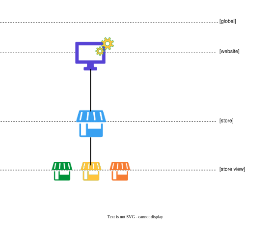
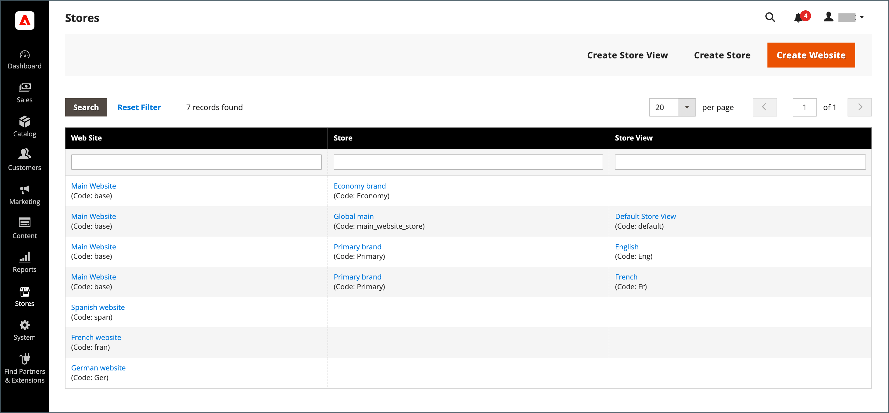
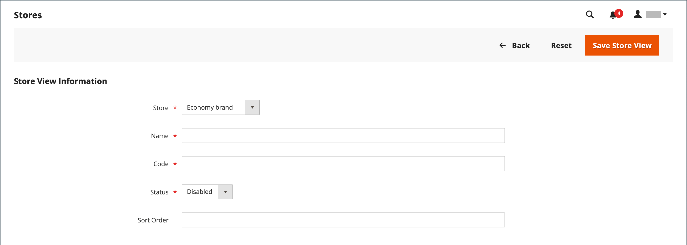

# Ansichten speichern

Store-Ansichten werden normalerweise verwendet, um den Store in verschiedenen Gebietsschemata verfügbar zu machen. Käufer können die Sprachauswahl in der Kopfzeile des Stores verwenden, um die Store-Ansicht zu ändern.

{width="550"}

## Synchronisierungsstatus [!DNL Adobe Commerce Optimizer] {#optimizer-sync-status}

Wenn der [!DNL Adobe Commerce Optimizer Connector] für eine Website- oder Store-Ansicht installiert und aktiviert ist, zeigt das [!UICONTROL All Stores] eine Synchronisierungsstatusanzeige an. Wenn die [!DNL Adobe Commerce Optimizer Connector for B2B] installiert ist, werden die Daten auch für verfügbare freigegebene B2B-Kataloge synchronisiert. Siehe [Verwalten von Katalogansichten](../b2b/catalog-views-manage.md).

| Spalte | Indikator | Beschreibung |
| ----- | ----- | ----- |
| [!UICONTROL Web Site] | [!UICONTROL Price sync enabled for Commerce Optimizer] | Die Preise und Preisbücher dieser Website sind mit [!DNL Adobe Commerce Optimizer] synchronisiert. |
| [!UICONTROL Store View] | [!UICONTROL Product sync enabled for Commerce Optimizer] | Die Produkte und Attribute dieser Store-Ansicht werden mit [!DNL Adobe Commerce Optimizer] synchronisiert. |

{width="700" zoomable="yes"}

Um die Synchronisierung zu aktivieren oder zu deaktivieren, bearbeiten Sie die **[!UICONTROL Adobe Commerce Optimizer exporter settings]**, wenn Sie [eine Website erstellen](stores.md#step-1-create-a-website) oder [eine Store-](#add-a-store-view) hinzufügen) oder eine vorhandene Website- oder Store-Ansicht aktualisieren.

## Shop-Ansicht hinzufügen

1. Navigieren Sie in _Admin_-Seitenleiste zu **[!UICONTROL Stores]** > _[!UICONTROL Settings]_>**[!UICONTROL All Stores]**.

   {width="700" zoomable="yes"}

1. Klicken Sie auf **[!UICONTROL Create Store View]**.

   {width="600" zoomable="yes"}

1. **[!UICONTROL Store]** auf den übergeordneten Speicher dieser Ansicht festlegen.

1. Geben Sie einen **[!UICONTROL Name]** für diese Store-Ansicht ein.

   Der Name wird in der Sprachauswahl in der Store-Kopfzeile angezeigt. Beispiel: `Spanish`.

1. Geben Sie **[!UICONTROL Code]** den Code ein, der die Ansicht identifiziert (in Kleinbuchstaben).

   Beispiel: `spanish`.

1. Um die Ansicht zu aktivieren, setzen Sie **[!UICONTROL Status]** auf `Enabled`.

1. (Optional) Geben Sie eine **[!UICONTROL Sort Order]** ein, um die Reihenfolge zu bestimmen, in der diese Ansicht in anderen Ansichten aufgeführt wird.

1. (Optional) Wenn die [!DNL Adobe Commerce Optimizer Connector] installiert ist, wählen Sie **[!UICONTROL Sync products and attributes]** im Abschnitt **[!UICONTROL Adobe Commerce Optimizer exporter settings]** aus, um die Produkte und Attribute dieser Store-Ansicht mit [!DNL Adobe Commerce Optimizer] zu synchronisieren. Wenn die [!DNL Adobe Commerce Optimizer Connector for B2B] ebenfalls installiert ist, synchronisiert diese Einstellung auch freigegebene B2B-Katalogdaten mit [!DNL Adobe Commerce Optimizer]. Siehe [Verwalten von Katalogansichten](../b2b/catalog-views-manage.md).

   {width="600" zoomable="yes"}

   Wenn Sie diese Einstellung nach den ersten Synchronisierungs-Triggern ändern, wird eine vollständige Neuindizierung durchgeführt. Siehe [Anpassen der Exportkonfiguration für Commerce](https://experienceleague.adobe.com/en/docs/commerce/aco-optimizer-connector/get-started#customize-the-commerce-scopes-export-configuration) im *Adobe Commerce Optimizer Connector-Handbuch*.

1. Klicken Sie auf **[!UICONTROL Save Store View]**.

## Shop-Ansicht bearbeiten

Da der Ansichtsname in der Sprachauswahl angezeigt wird, empfiehlt es sich, den Namen der Standardansicht zu ändern, damit diese anschaulicher wird. Das Feld _Name_ ist einfach eine Bezeichnung und kann einfach geändert werden.

Wenn Ihre Adobe Commerce- oder Magento Open Source-Installation über eine Multi-Site- oder Multi-Store-Einrichtung verfügt, ändern Sie das Feld „Store-Code“ nicht, ohne sicherzustellen, dass der Wert in der `index.php`-Datei nicht referenziert wird. Wenn Sie keinen Zugriff auf den Server haben, um die Datei zu untersuchen, bitten Sie einen Entwickler um Hilfe.

| Feld | Ausgangswert | Aktualisierter Wert |
| ----- | -------------- | ------------- |
| [!UICONTROL Name] | `Default Store View` | `English` |
| [!UICONTROL Code] | `default` | `english` |

{style="table-layout:auto"}

1. Navigieren Sie in _Admin_-Seitenleiste zu **[!UICONTROL Stores]** > _[!UICONTROL Settings]_>**[!UICONTROL All Stores]**.

1. Klicken Sie in der Spalte _[!UICONTROL Store View]_des Rasters auf den Namen der Ansicht, die Sie bearbeiten möchten.

   Beim Bearbeiten der Standardansicht sind die Felder _[!UICONTROL Store]_und_[!UICONTROL Status]_ nicht verfügbar.

   {width="600" zoomable="yes"}

1. Aktualisieren Sie die folgenden Felder nach Bedarf:

   - **[!UICONTROL Store]** (nur nicht standardmäßige Ansichten)
   - **[!UICONTROL Name]**
   - **[!UICONTROL Code]** (nur wenn nicht in `index.php` verwendet)
   - **[!UICONTROL Status]** (nur nicht standardmäßige Ansichten)
   - **[!UICONTROL Sort Order]**
   - **[!UICONTROL Sync products and attributes]** (nur bei installierter [!DNL Adobe Commerce Optimizer Connector])

   {width="600" zoomable="yes"}

1. Klicken Sie auf **[!UICONTROL Save Store View]**.
