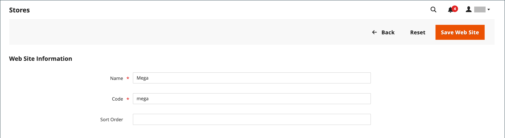

# Store- und Site-Struktur

Wenn Adobe Commerce oder Magento Open Source installiert ist, wird eine Hierarchie erstellt, die eine Haupt-Website, einen Store und eine Store-Ansicht enthält. Sie können bei Bedarf zusätzliche Websites, Stores und Store-Ansichten erstellen. Beispielsweise könnten Sie zusätzlich zu Ihrer Haupt-Website weitere Websites mit einer anderen Domain haben. Innerhalb jeder Website können Sie mehrere Stores haben und innerhalb jedes Stores separate Store-Ansichten. Viele Installationen haben eine Website und einen Store, aber mit mehreren Store-Ansichten, um verschiedene Sprachen zu unterstützen.

Bevor Sie beginnen, planen Sie die Hierarchie Ihres Store-Katalogs im Voraus, da sie in der gesamten Konfiguration referenziert wird. Jeder Store kann über eine separate [Stammkategorie](../catalog/category-root.md) verfügen, die es ermöglicht, für jeden Store einen völlig anderen Satz von Hauptmenüoptionen zu verwenden.

{width="550"}

## Hinzufügen von Stores

Eine einzige Installation von Adobe Commerce oder Magento Open Source kann mehrere Stores mit einem gemeinsamen Administrator haben. Geschäfte, die sich unter derselben Website befinden, haben dieselbe IP-Adresse und Domain, verwenden dasselbe Sicherheitszertifikat und verwenden einen einzigen Checkout-Prozess.

Es ist wichtig zu verstehen, dass die Stores denselben Code verwenden und einen Administrator freigeben. Jeder Store kann einen separaten Katalog haben oder die Stores können einen Katalog gemeinsam nutzen. Jeder Store kann über eine separate [Stammkategorie](../catalog/category-root.md) verfügen, die es ermöglicht, für jeden Store ein anderes Hauptmenü zu haben. Stores können auch unterschiedliche Branding-, Präsentations- und Inhalts-IDs haben. Nehmen Sie sich etwas Zeit, um Ihre Store-Hierarchie mit Blick auf das zukünftige Wachstum zu planen, bevor Sie beginnen, da sie während der gesamten Konfiguration verwendet wird.

{width="550"}

Im Folgenden finden Sie einige Beispiele dafür, wie URLs für mehrere Stores konfiguriert werden können:

| URL | Beschreibung |
| --- | ----------- |
| `yourdomain.com/store1` `yourdomain.com/store2` | Jeder Store hat einen anderen Pfad, nutzt jedoch eine gemeinsame Domain. |
| `store1.yourdomain.com` `store2.yourdomain.com` | Jeder Store hat eine andere Subdomain als die primäre Domain. |

Multi-Store-Installationen von Adobe Commerce müssen vom Administrator und auch über die Befehlszeile des Servers konfiguriert werden. Das Adobe Commerce [Konfigurationshandbuch](https://experienceleague.adobe.com/docs/commerce-operations/configuration-guide/multi-sites/ms-overview.html?lang=de) enthält detaillierte Anweisungen zum Konfigurieren der Serverumgebung.

### Schritt 1: Store-Domain auswählen

Der erste Schritt besteht darin, zu wählen, wie Sie den Store positionieren möchten. Sollten die Stores eine Domain gemeinsam nutzen, jeder eine Subdomain haben oder deutlich unterschiedliche Domains haben? Führen Sie für jeden Store einen der folgenden Schritte aus:

- Um den Store eine Ebene unterhalb der primären Domain zu platzieren, müssen Sie nichts tun.
- Richten Sie eine Subdomain Ihrer primären Domain ein.
- Richten Sie eine andere primäre Domain ein.

### Schritt 2: Store erstellen

1. Navigieren Sie in _Admin_-Seitenleiste zu **[!UICONTROL Stores]** > _[!UICONTROL Settings]_>**[!UICONTROL All Stores]**.

1. Klicken Sie auf **[!UICONTROL Create Store]** und legen Sie die Optionen für den neuen Store fest:

   - **[!UICONTROL Web Site]** - Wählen Sie eine Website aus, die dem neuen Store übergeordnet sein soll. Wenn die Installation nur über eine Website verfügt, akzeptieren Sie die Standardeinstellung (`Main Website`).

   - **[!UICONTROL Name]** - Geben Sie einen Namen für den neuen Store ein. Der Name dient nur als interne Referenz.

   - **[!UICONTROL Code]** - Geben Sie einen Code in Kleinbuchstaben ein, um den Store zu identifizieren. Beispiel: `mainstore`.

   - **[!UICONTROL Root Category]** - Auf die [Stammkategorie](../catalog/category-root.md) eingestellt, die die Kategoriestruktur für das Hauptmenü des neuen Stores definiert. Wenn Sie bereits eine bestimmte Stammkategorie für den Store erstellt haben, wählen Sie diese aus. Wählen Sie andernfalls `Default Category` aus. Sie können später zurückkehren und die Einstellung aktualisieren.

   {width="600" zoomable="yes"}

1. Klicken Sie auf **[!UICONTROL Save Store]**.

### Schritt 3: Erstellen einer standardmäßigen Store-Ansicht

1. Klicken Sie auf **[!UICONTROL Create Store View]** und legen Sie die Optionen für die Store-Ansicht fest:

   - **[!UICONTROL Store]** - Auf den von Ihnen erstellten neuen Store festlegen.

   - **[!UICONTROL Name]** - Geben Sie einen Namen für die Ansicht ein. Beispiel: `English`.

   - **[!UICONTROL Code]** — Geben Sie einen Code für die Ansicht in Kleinbuchstaben ein.

   - **[!UICONTROL Status]** — Auf `Enabled` gesetzt.

   - **[!UICONTROL Sort Order]** - Geben Sie eine Zahl ein, um die Position des Stores zu bestimmen, wenn sie mit anderen Stores aufgelistet wird.

1. Klicken Sie auf **[!UICONTROL Save Store View]**.

   Wenn Sie Ihren Store im Bearbeitungsmodus öffnen, können Sie sehen, dass er jetzt eine Standardansicht hat.

   {width="600" zoomable="yes"}

### Schritt 4: Store-URL konfigurieren

1. Klicken Sie in _Seitenleiste_ Admin“ auf **[!UICONTROL Stores]** > _[!UICONTROL Settings]_>**[!UICONTROL Configuration]**.

1. Wählen Sie unter _[!UICONTROL General]_&#x200B;im linken Bedienfeld auf der linken Seite **[!UICONTROL Web]**&#x200B;aus.

1. Setzen Sie in der oberen linken Ecke **[!UICONTROL Store View]** auf die Ansicht, die Sie für den neuen Store erstellt haben.

1. Wenn Sie zum Bestätigen des Wechsels [Umfang](../getting-started/websites-stores-views.md#scope-settings) aufgefordert werden, klicken Sie auf **[!UICONTROL OK]**.

   {width="600" zoomable="yes"}

1. Erweitern Sie  den Abschnitt **[!UICONTROL Base URLs]** und geben Sie die Basis-URL für den Store ein.

   Deaktivieren Sie bei Bedarf das Kontrollkästchen **[!UICONTROL Use system value]** , um die Einstellung zu ändern.

   {width="600" zoomable="yes"}

1. Erweitern Sie  den Abschnitt **[!UICONTROL Secure Base URLs]** und wiederholen Sie den vorherigen Schritt, wenn Sie den Store konfigurieren möchten [sichere URL](store-urls.md).

1. Klicken Sie auf **[!UICONTROL Save Config]**.

### Schritt 5: Server konfigurieren

Informationen zum Konfigurieren Ihres Servers für die Unterstützung mehrerer Websites finden Sie unter [Mehrere Websites oder &#x200B;](https://experienceleague.adobe.com/docs/commerce-operations/configuration-guide/multi-sites/ms-overview.html?lang=de)) im _Konfigurationshandbuch_.

Hilfe bei der Konfiguration Ihres Webservers finden Sie in den folgenden Ressourcen:

- [Einrichten mehrerer Websites mit NGNX](https://experienceleague.adobe.com/docs/commerce-operations/configuration-guide/multi-sites/ms-nginx.html?lang=de)
- [Einrichten mehrerer Websites mit Apache](https://experienceleague.adobe.com/docs/commerce-operations/configuration-guide/multi-sites/ms-apache.html?lang=de)

Informationen zu Adobe Commerce in Cloud-Infrastrukturen finden Sie unter [Einrichten mehrerer Websites oder Stores](https://experienceleague.adobe.com/docs/commerce-cloud-service/user-guide/configure-store/multiple-sites.html?lang=de).

## Hinzufügen von Websites

Mehrere Websites können über eine einzige Adobe Commerce- oder Magento Open Source-Installation mit derselben Domain oder verschiedenen Domains eingerichtet werden. Standardmäßig haben Stores, die sich unter derselben Website befinden, dieselbe IP-Adresse und Domain, verwenden dasselbe Sicherheitszertifikat und nutzen einen einzigen Checkout-Prozess. Wenn Sie möchten, dass jeder Store einen dedizierten Checkout-Prozess unter seiner eigenen Domain hat, muss jeder Store eine eigene IP-Adresse und ein separates Sicherheitszertifikat haben.

Installationen von Adobe Commerce oder Magento Open Source für mehrere Standorte müssen vom Administrator und auch über die Befehlszeile des Servers konfiguriert werden. Das Commerce [Konfigurationshandbuch](https://experienceleague.adobe.com/docs/commerce-operations/configuration-guide/multi-sites/ms-overview.html?lang=de) enthält detaillierte Anweisungen zum Konfigurieren der Serverumgebung.

{width="550"}

### Schritt 1: Erstellen einer Website

1. Navigieren Sie in _Admin_-Seitenleiste zu **[!UICONTROL Stores]** > _[!UICONTROL Settings]_>**[!UICONTROL All Stores]**.

1. Klicken Sie oben rechts auf **[!UICONTROL Create Website]**.

1. Legen Sie die **[!UICONTROL Web Site Information]** fest:

   {width="600" zoomable="yes"}

   - **[!UICONTROL Name]** — Geben Sie die Domain der neuen Website ein. Beispiel: `domain.com`.

   - **[!UICONTROL Code]** - Geben Sie einen Code ein, der auf dem Server verwendet wird, um auf die Domain zu verweisen.

     Der Code muss mit einem Kleinbuchstaben (a-z) beginnen und kann eine beliebige Kombination von Buchstaben (a-z), Zahlen (0-9) und den Unterstrich (_) enthalten.

   - **[!UICONTROL Sort Order]** - _(Optional)_ Geben Sie eine Zahl ein, um die Reihenfolge zu bestimmen, in der diese Website mit anderen Websites aufgeführt wird. Damit diese Site oben in der Liste angezeigt wird, geben Sie eine Null ein (`0`).

1. Klicken Sie auf **[!UICONTROL Save Web Site]**.

1. Richten Sie jeden [Store](#add-stores) und jede [Store-Ansicht](store-views.md) ein, die für die neue Website benötigt werden.

   Anschließend können Sie die Website im Bearbeitungsmodus öffnen, um den Standardspeicher festzulegen.

### Schritt 2: Store-URL konfigurieren

Befolgen Sie die Anweisungen, um [Store](store-urls.md)URLs zu konfigurieren.

### Schritt 3: Server konfigurieren

Informationen zum Konfigurieren Ihres Servers für die Unterstützung mehrerer Websites finden Sie unter [Mehrere Websites oder &#x200B;](https://experienceleague.adobe.com/docs/commerce-operations/configuration-guide/multi-sites/ms-overview.html?lang=de)) im _Konfigurationshandbuch_.

Hilfe bei der Konfiguration des Webservers finden Sie in den folgenden Tutorials:

- [Einrichten mehrerer Websites mit NGNX](https://experienceleague.adobe.com/docs/commerce-operations/configuration-guide/multi-sites/ms-nginx.html?lang=de)
- [Einrichten mehrerer Websites mit Apache](https://experienceleague.adobe.com/docs/commerce-operations/configuration-guide/multi-sites/ms-apache.html?lang=de)

Informationen zu Adobe Commerce in Cloud-Infrastrukturen finden Sie unter [Einrichten mehrerer Websites oder Stores](https://experienceleague.adobe.com/docs/commerce-cloud-service/user-guide/configure-store/multiple-sites.html?lang=de).
