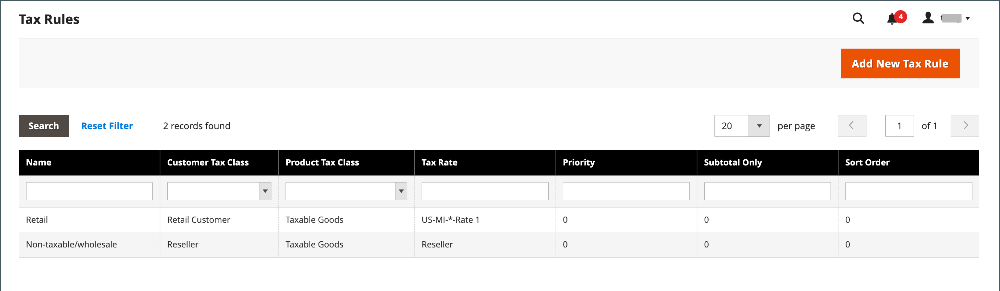
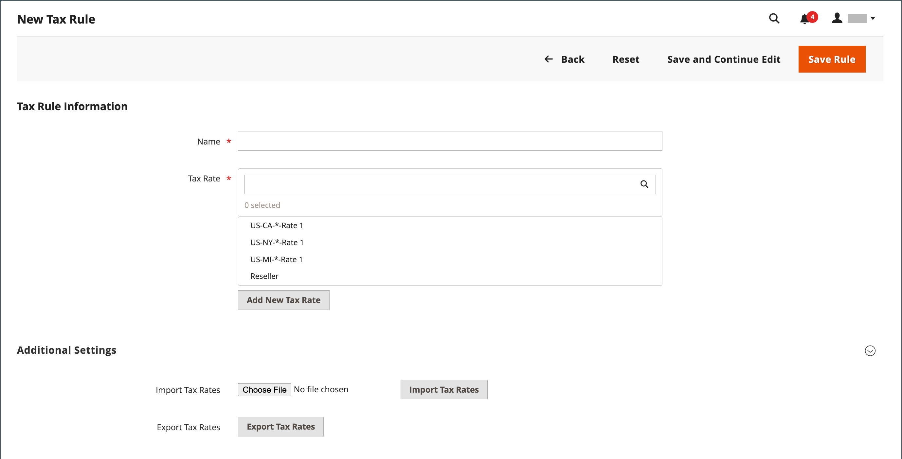

# Steuervorschriften

Die Steuerregeln beinhalten eine Kombination aus Produktklasse, Kundenklasse und Steuersatz. Jeder Kunde wird einer Kundenklasse zugewiesen und jedem Produkt wird eine Produktklasse zugewiesen. Commerce analysiert den Warenkorb jedes Kunden und berechnet die entsprechende Steuer entsprechend den Kunden- und Produktklassen sowie der Region. Die Region basiert auf der Lieferadresse des Kunden, der Rechnungsadresse oder dem Versandursprung.

>[!NOTE]
>
>Wenn zahlreiche Steuersätze definiert werden müssen, können Sie den Prozess durch Importieren vereinfachen.

{width="600" zoomable="yes"}

## Schritt 1: Ausfüllen der Informationen zur Steuerregel

1. Wechseln Sie in der Seitenleiste _Admin_ zu **[!UICONTROL Stores]** > _[!UICONTROL Taxes]_>**[!UICONTROL Tax Rules]**.

1. Klicken Sie in der oberen rechten Ecke auf **[!UICONTROL Add New Tax Rule]**.

1. Geben Sie unter _Informationen zu Steuerregeln_ eine **[!UICONTROL Name]** für die neue Regel ein.

   {width="600" zoomable="yes"}

1. Wählen Sie die **[!UICONTROL Tax Rate]** aus, die für die Regel gilt.

   Gehen Sie wie folgt vor, um einen bestehenden Steuersatz zu bearbeiten:

   - Bewegen Sie den Mauszeiger über den Steuersatz und klicken Sie auf das Symbol _Bearbeiten_  .

   - Aktualisieren Sie das Formular nach Bedarf und klicken Sie auf **[!UICONTROL Save]**.

1. Verwenden Sie eine der folgenden Methoden, um Steuersätze einzuführen:

### Methode 1: Steuern manuell eingeben

1. Klicken Sie auf **[!UICONTROL Add New Tax Rate]**.

1. Füllen Sie das Formular nach Bedarf aus (siehe [Steuerzonen und -sätze](tax-zones-rates.md)).

1. Klicken Sie nach Abschluss des Vorgangs auf **[!UICONTROL Save]**.

   {width="600" zoomable="yes"}

### Methode 2: Einfuhrsteuersätze

1. Scrollen Sie nach unten zum Abschnitt am unteren Rand der Seite.

1. Gehen Sie wie folgt vor, um Steuersätze zu importieren:

   - Klicken Sie auf **[!UICONTROL Choose File]** und navigieren Sie zur CSV-Datei mit den zu importierenden Steuersätzen.

   - Klicken Sie auf **[!UICONTROL Import Tax Rates]**.

1. Um Steuersätze zu exportieren, klicken Sie auf **[!UICONTROL Export Tax Rates]** (siehe [Einfuhr-/Ausfuhrsteuersätze](../systems/data-transfer-tax-rates.md)).

{width="600" zoomable="yes"}

## Schritt 2: Zusätzliche Einstellungen durchführen

1. Um den Abschnitt zu öffnen, klicken Sie auf **[!UICONTROL Additional Settings]**.

   {width="600" zoomable="yes"}

1. Wählen Sie die **[!UICONTROL Customer Tax Class]** aus, für die die Regel gilt.

   - Um eine Kundensteuerklasse zu bearbeiten, klicken Sie auf das Symbol _Bearbeiten_  , aktualisieren Sie das Formular nach Bedarf und klicken Sie auf **[!UICONTROL Save]**.

   - Um eine Steuerklasse zu erstellen, klicken Sie auf **[!UICONTROL Add New Tax Class]**, füllen Sie das Formular nach Bedarf aus und klicken Sie auf **[!UICONTROL Save]**.

1. Wählen Sie die **[!UICONTROL Product Tax Class]** aus, für die die Regel gilt.

   - Um eine Produktsteuerklasse zu bearbeiten, klicken Sie auf das Symbol _Bearbeiten_  , aktualisieren Sie das Formular nach Bedarf und klicken Sie auf **[!UICONTROL Save]**.

   - Um eine Steuerklasse zu erstellen, klicken Sie auf **[!UICONTROL Add New Tax Class]**, füllen Sie das Formular nach Bedarf aus und klicken Sie auf **[!UICONTROL Save]**.

1. Wenn mehrere Steuern erhoben werden, geben Sie eine Zahl ein, um die Priorität dieser Steuer für **[!UICONTROL Priority]** anzugeben.

   Wenn zwei Steuervorschriften mit derselben Priorität gelten, werden die Steuern hinzugefügt. Wenn zwei Steuern mit unterschiedlichen Prioritätseinstellungen zutreffen, werden die Steuern addiert.

1. Wenn Steuern auf der Bestellteilsumme basieren sollen, aktivieren Sie das Kontrollkästchen **[!UICONTROL Calculate off Subtotal Only]** .

1. Geben Sie für **[!UICONTROL Sort Order]** eine Zahl ein, um die Reihenfolge dieser Steuerregel anzugeben, wenn diese mit anderen aufgelistet wird.

1. Klicken Sie nach Abschluss des Vorgangs auf **[!UICONTROL Save Rule]**.

## Demo zu Währungs- und Steuerregeln

In diesem Video erfahren Sie mehr über die Verwaltung von Währungs- und Steuerregeln:

>[!VIDEO](https://video.tv.adobe.com/v/343657/?quality=12)
