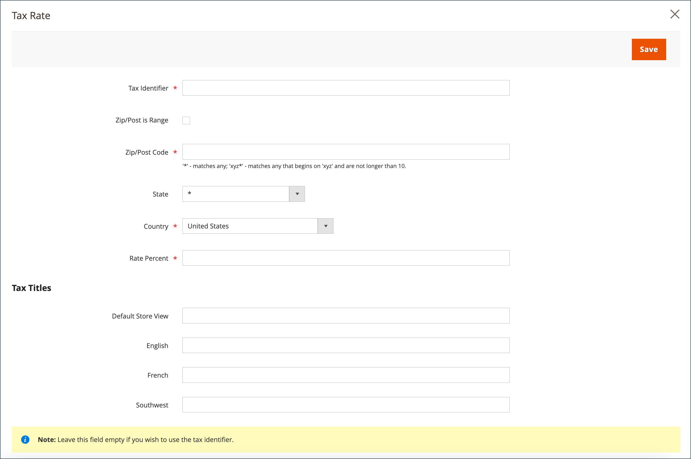

# Steuervorschriften

Steuerregeln enthalten eine Kombination aus Produktklasse, Kundenklasse und Steuersatz. Jeder Kunde wird einer Kundenklasse und jedes Produkt einer Produktklasse zugewiesen. Commerce analysiert den Warenkorb jedes Kunden und berechnet die entsprechende Steuer entsprechend den Kunden- und Produktklassen und der Region. Die Region basiert auf der Lieferadresse des Kunden, der Rechnungsadresse oder der Versandquelle.

>[!NOTE]
>
>Wenn zahlreiche Steuersätze definiert werden müssen, können Sie den Prozess vereinfachen, indem Sie sie importieren.

{width="600" zoomable="yes"}

## Schritt 1: Vervollständigen Sie die Informationen zur Steuerregel

1. Navigieren Sie in _Admin_-Seitenleiste zu **[!UICONTROL Stores]** > _[!UICONTROL Taxes]_>**[!UICONTROL Tax Rules]**.

1. Klicken Sie oben rechts auf **[!UICONTROL Add New Tax Rule]**.

1. Geben _unter „Steuerregelinformationen_ einen **[!UICONTROL Name]** für die neue Regel ein.

   {width="600" zoomable="yes"}

1. Wählen Sie die **[!UICONTROL Tax Rate]** aus, die für die Regel gilt.

   Gehen Sie wie folgt vor, um einen vorhandenen Steuersatz zu bearbeiten:

   - Bewegen Sie den Mauszeiger über den Steuersatz und klicken Sie auf das Symbol _Bearbeiten_ .

   - Aktualisieren Sie das Formular nach Bedarf und klicken Sie auf **[!UICONTROL Save]**.

1. Verwenden Sie eine der folgenden Methoden, um Steuersätze einzugeben:

### Methode 1: Steuersätze manuell eingeben

1. Klicken Sie auf **[!UICONTROL Add New Tax Rate]**.

1. Füllen Sie das Formular nach Bedarf aus (siehe [Steuerzonen und Steuersätze](tax-zones-rates.md)).

1. Klicken Sie abschließend auf **[!UICONTROL Save]**.

   {width="600" zoomable="yes"}

### Methode 2: Einfuhrsteuersätze

1. Scrollen Sie nach unten zum Abschnitt unten auf der Seite.

1. Gehen Sie wie folgt vor, um Steuersätze zu importieren:

   - Klicken Sie auf **[!UICONTROL Choose File]** und navigieren Sie zur CSV-Datei mit den zu importierenden Steuersätzen.

   - Klicken Sie auf **[!UICONTROL Import Tax Rates]**.

1. Um Steuersätze zu exportieren, klicken Sie auf **[!UICONTROL Export Tax Rates]** (siehe [Import-/Exportsteuersätze](../systems/data-transfer-tax-rates.md)).

{width="600" zoomable="yes"}

## Schritt 2: Ergänzende Einstellungen vornehmen

1. Um den Abschnitt zu öffnen, klicken Sie auf **[!UICONTROL Additional Settings]**.

   {width="600" zoomable="yes"}

1. Wählen Sie die **[!UICONTROL Customer Tax Class]** aus, für die die Regel gilt.

   - Um eine Steuerklasse eines Kunden zu bearbeiten, klicken Sie auf das Symbol _Bearbeiten_ , aktualisieren Sie das Formular nach Bedarf und klicken Sie auf **[!UICONTROL Save]**.

   - Um eine Steuerklasse zu erstellen, klicken Sie auf **[!UICONTROL Add New Tax Class]**, füllen Sie das Formular nach Bedarf aus und klicken Sie auf **[!UICONTROL Save]**.

1. Wählen Sie die **[!UICONTROL Product Tax Class]** aus, für die die Regel gilt.

   - Um eine Produktsteuerklasse zu bearbeiten, klicken Sie auf das Symbol _Bearbeiten_ , aktualisieren Sie das Formular nach Bedarf und klicken Sie auf **[!UICONTROL Save]**.

   - Um eine Steuerklasse zu erstellen, klicken Sie auf **[!UICONTROL Add New Tax Class]**, füllen Sie das Formular nach Bedarf aus und klicken Sie auf **[!UICONTROL Save]**.

1. Wenn mehr als eine Steuer gilt, geben Sie eine Zahl ein, um die Priorität dieser Steuer für **[!UICONTROL Priority]** anzugeben.

   Wenn zwei Steuerregeln mit derselben Priorität gelten, werden die Steuern hinzugefügt. Wenn zwei Steuern mit unterschiedlichen Prioritätseinstellungen gelten, werden die Steuern zusammengerechnet.

1. Wenn die Steuern auf der Zwischensumme der Bestellung basieren sollen, aktivieren Sie das Kontrollkästchen **[!UICONTROL Calculate off Subtotal Only]** .

1. Geben Sie **[!UICONTROL Sort Order]** eine Zahl ein, um die Reihenfolge dieser Steuerregel anzugeben, wenn sie mit anderen aufgelistet wird.

1. Klicken Sie abschließend auf **[!UICONTROL Save Rule]**.

## Demo zu Währungs- und Steuerregeln

In diesem Video erfahren Sie mehr über die Verwaltung von Währungs- und Steuerregeln:

>[!VIDEO](https://video.tv.adobe.com/v/343657/?quality=12&learn=on)
