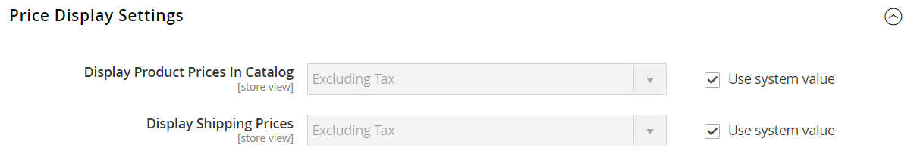

# Einstellungen für die Steuerkonfiguration

Die folgenden Anweisungen führen Sie durch die allgemeine Steuerkonfiguration für Ihre Commerce-Instanz. Bevor Sie Ihre Steuern einrichten, stellen Sie sicher, dass Sie mit den Steueranforderungen Ihres [Gebietsschemas“ vertraut ](store-localize.md#step-3-change-the-locale-of-the-store-view). Führen Sie dann die Steuerkonfiguration entsprechend Ihren Anforderungen aus.

Admin [permissions](../systems/permissions.md) kann so eingestellt werden, dass der [ (Zugriff](../systems/permissions-user-roles.md) auf Steuerressourcen eingeschränkt wird, je nach dem _des Unternehmens_. Um eine Administratorrolle mit Zugriff auf Steuereinstellungen zu erstellen, wählen Sie sowohl die Ressourcen „Umsatz/Steuer“ als auch „System/Steuer“ aus. Wenn Sie eine Website für eine Region einrichten, die sich von Ihrem standardmäßigen Versandort unterscheidet, müssen Sie auch den Zugriff auf das System/die Versandressourcen für die Rolle zulassen. Die Versandeinstellungen bestimmen den Store-Steuersatz, der für Katalogpreise verwendet wird.

## Konfigurieren der allgemeinen Steuereinstellungen

1. Navigieren Sie in _Admin_-Seitenleiste zu **[!UICONTROL Stores]** > _[!UICONTROL Settings]_>**[!UICONTROL Configuration]**.

1. Legen Sie für eine Multi-Site-Konfiguration **[!UICONTROL Store View]** auf die Website und den Store fest, der das Ziel der Konfiguration ist.

1. Erweitern Sie im linken Bereich **[!UICONTROL Sales]** und wählen Sie **[!UICONTROL Tax]**.

1. Füllen Sie die folgenden Konfigurationseinstellungen aus.

   Deaktivieren Sie bei Bedarf das Kontrollkästchen **[!UICONTROL Use system value]** für alle Einstellungen, die abgeblendet sind.

### [!UICONTROL Tax Classes]

1. Erweitern Sie  den Abschnitt **[!UICONTROL Tax Classes]** .

   {width="600" zoomable="yes"}

   - **Steuerklasse für Versand** - Auf die entsprechende Klasse festlegen. Die Standardklassen sind: `None` und `Taxable Goods`
   - **Steuerklasse für Geschenkoptionen** -  (nur Adobe Commerce) Auf die entsprechende Klasse eingestellt. Die Standardklassen sind: `None` und `Taxable Goods`
   - **Standard-Steuerklasse für Produkt** - Auf die entsprechende Klasse festlegen. Die Standardklassen sind: `None` und `Taxable Goods`
   - **Standard-Steuerklasse für Kunde** - Auf die entsprechende Klasse festlegen. Die Standardklasse ist: `Retail Customer` und `Wholesale Customer`

1. Klicken Sie abschließend auf **[!UICONTROL Save Config]**.

### [!UICONTROL Calculation Settings]

1. Erweitern Sie den Abschnitt **[!UICONTROL Calculation Settings]** .

   {width="600" zoomable="yes"}

1. Legen Sie **[!UICONTROL Tax Calculation Method Based On]** auf eine der folgenden Einstellungen fest:

   - `Unit Price` - Der Preis jedes Produkts
   - `Row Total` - die Summe des Zeileneintrags in der Bestellung abzüglich der Rabatte
   - `Total` - die Bestellsumme

1. Legen Sie **[!UICONTROL Tax Calculation Based On]** auf eine der folgenden Einstellungen fest:

   - `Shipping Address` - Die Adresse, an die die Bestellung versendet werden soll
   - `Billing Address` - Die Rechnungsadresse des Kunden oder der Firma
   - `Shipping Origin` - Die Adresse, die als [Point of Origin](shipping-settings.md#point-of-origin) für Ihren Store angegeben ist.

1. **[!UICONTROL Catalog Prices]** auf `Excluding Tax` oder `Including Tax` festlegen.

1. **[!UICONTROL Shipping Prices]** auf `Excluding Tax` oder `Including Tax` festlegen.

1. Legen Sie **[!UICONTROL Apply Customer Tax]** auf einen der folgenden Werte fest, um zu bestimmen, ob auf den ursprünglichen oder den reduzierten Preis Steuern erhoben werden: `After Discount` oder `Before Discount`

1. Legen Sie **[!UICONTROL Apply Discount on Prices]** auf einen der folgenden Werte fest, um zu bestimmen, ob Rabatte Steuern enthalten oder nicht: `Excluding Tax` oder `Including Tax`

1. **[!UICONTROL Apply Tax On]** auf `Custom price if available` oder `Original price only` festlegen.

1. Legen Sie **[!UICONTROL Enable Cross-Border Trade]** auf eine der folgenden Einstellungen fest:

   - `Yes` - Verwenden Sie eine konsistente Preisgestaltung für verschiedene Steuersätze. Wenn der Katalogpreis Steuern enthält, wählen Sie diese Einstellung, um den Preis unabhängig vom Steuersatz des Kunden festzulegen.
   - `No` - Ändern Sie den Preis nach Steuersatz.

   >[!IMPORTANT]
   >
   >Ist [grenzüberschreitender Handel](#cross-border-price-consistency) aktiviert, ändert sich die Gewinnspanne nach Steuersatz. Der Gewinn wird durch die Formel (`Revenue - CustomerVAT - CostOfGoodsSold`) bestimmt. Um den grenzüberschreitenden Handel zu ermöglichen, müssen die Preise so festgelegt werden, dass sie die Steuern beinhalten.

### [!UICONTROL Default Tax Destination Calculation]

1. Erweitern Sie  den Abschnitt **[!UICONTROL Default Tax Destination Calculation]** .

   {width="600" zoomable="yes"}

1. Geben Sie die **[!UICONTROL Default Country]** für Steuerberechnungen an.

1. Geben Sie gegebenenfalls die **[!UICONTROL Default State]** für die Steuerberechnungen an.

1. Geben Sie gegebenenfalls die **[!UICONTROL Default Post Code]** für die Steuerberechnungen an.

1. Klicken Sie abschließend auf **[!UICONTROL Save Config]**.

### [!UICONTROL Price Display Settings]

>[!IMPORTANT]
>
>Einige Kombinationen von Einstellungen im Zusammenhang mit einer Preisanzeige, die sowohl Steuern enthalten als auch nicht enthalten, können für den Kunden verwirrend sein. Um das Auslösen einer Warnmeldung zu vermeiden, lesen Sie [Empfohlene Einstellungen](taxes.md#warning-messages).

1. Erweitern Sie  den Abschnitt **[!UICONTROL Price Display Settings]** .

   {width="600" zoomable="yes"}

1. Legen Sie **[!UICONTROL Display Product Prices in Catalog]** auf eine der folgenden Einstellungen fest:

   - `Excluding Tax` - Katalogpreise, die in der Storefront angezeigt werden, enthalten keine Steuern.
   - `Including Tax` - Katalogpreise in der Storefront beinhalten nur dann Steuern, wenn eine Steuerregel mit der Steuerherkunft übereinstimmt oder wenn die Adresse des Kunden mit der Steuerregel übereinstimmt. Dies kann passieren, nachdem ein Kunde ein Konto erstellt, sich angemeldet oder das Tool „Steuer- und Versandvoranschlag“ im Warenkorb verwendet hat.
   - `Including and Excluding Tax` - Katalogpreise, die in der Storefront angezeigt werden, werden sowohl mit als auch ohne Steuer angezeigt.

1. **[!UICONTROL Display Shipping Prices]** auf `Excluding Tax`, `Including Tax` oder `Including and Excluding Tax` festlegen.

1. Klicken Sie abschließend auf **[!UICONTROL Save Config]**.

### [!UICONTROL Shopping Cart Display Settings]

1. Erweitern Sie  den Abschnitt **[!UICONTROL Shopping Cart Display Settings]** .

   {width="600" zoomable="yes"}

1. Wählen Sie für jede der folgenden Einstellungen aus, wie Steuern und Preise im Warenkorb je nach den Anforderungen Ihres Geschäfts und Gebietsschemas angezeigt werden sollen:

   - **[!UICONTROL Display Prices]** auf `Excluding Tax`, `Including Tax` oder `Including and Excluding Tax` festlegen.

   - **[!UICONTROL Display Subtotal]** auf `Excluding Tax`, `Including Tax` oder `Including and Excluding Tax` festlegen.

   - **[!UICONTROL Display Shipping Amount]** auf `Excluding Tax`, `Including Tax` oder `Including and Excluding Tax` festlegen.

   -  (nur Adobe Commerce) **[!UICONTROL Display Gift Wrapping Prices]** auf `Excluding Tax`, `Including Tax` oder `Including and Excluding Tax` festlegen.

   -  (nur Adobe Commerce) **[!UICONTROL Display Printed Card Prices]** auf `Excluding Tax`, `Including Tax` oder `Including and Excluding Tax` festlegen.

1. Stellen Sie die folgenden Anzeigeoptionen je nach Bedarf auf `Yes` oder `No` ein:

   - **[!UICONTROL Include Tax in Order Total]**
   - **[!UICONTROL Display Full Tax Summary]**
   - **[!UICONTROL Display Zero Tax Subtotal]**

1. Klicken Sie abschließend auf **[!UICONTROL Save Config]**.

### [!UICONTROL Orders, Invoices, Credit Memos Display Settings]

1. Erweitern Sie  den Abschnitt **[!UICONTROL Orders, Invoices, Credit Memos Display Settings]** .

   {width="600" zoomable="yes"}

1. Geben Sie an, wie Preise und Steuern in Bestellungen, Rechnungen und Gutschriften angezeigt werden:

   - **[!UICONTROL Display Prices]** auf `Excluding Tax`, `Including Tax` oder `Including and Excluding Tax` festlegen.

   - **[!UICONTROL Display Subtotal]** auf `Excluding Tax`, `Including Tax` oder `Including and Excluding Tax` festlegen.

   - **[!UICONTROL Display Shipping Amount]** auf `Excluding Tax`, `Including Tax` oder `Including and Excluding Tax` festlegen.

   -  (nur Adobe Commerce) **[!UICONTROL Display Gift Wrapping Prices]** auf `Excluding Tax`, `Including Tax` oder `Including and Excluding Tax` festlegen.

   -  (nur Adobe Commerce) **[!UICONTROL Display Printed Card Prices]** auf `Excluding Tax`, `Including Tax` oder `Including and Excluding Tax` festlegen.

1. Stellen Sie die folgenden Anzeigeoptionen je nach Bedarf auf `Yes` oder `No` ein:

   - **[!UICONTROL Include Tax in Order Total]**
   - **[!UICONTROL Display Full Tax Summary]**
   - **[!UICONTROL Display Zero Tax Subtotal]**

1. Klicken Sie abschließend auf **[!UICONTROL Save Config]**.

### [!UICONTROL Fixed Product Taxes]

1. Erweitern Sie  den Abschnitt **[!UICONTROL Fixed Product Taxes]** .

   {width="600" zoomable="yes"}

1. Legen Sie **[!UICONTROL Enable FPT]** je nach Ihren Anforderungen entweder auf `Yes` oder auf `No` fest.

1. Wenn FPT aktiviert ist, geben Sie die FPT-Anzeigeoptionen an:

   - **[!UICONTROL Display Prices in Product Lists]**
   - **[!UICONTROL Display Price On Product view Page]**
   - **[!UICONTROL Display Prices in Sales Modules]**
   - **[!UICONTROL Display Prices in Emails]**

   - `Including FPT Only` - Die angezeigten Preise beinhalten die fixen Produktsteuern. Der fpt-Betrag wird nicht separat angezeigt.
   - `Including FPT and FPT description` - Die angezeigten Preise beinhalten die fixen Produktsteuern. Der fpt-Betrag wird separat angezeigt.
   - `Excluding FPT. Including FPT description and final price` - Die angezeigten Preise beinhalten keine fixen Produktsteuern. Der fpt-Betrag wird separat angezeigt.
   - `Excluding FPT` - Die angezeigten Preise beinhalten keine fixen Produktsteuern. Der fpt-Betrag wird nicht separat angezeigt.

1. Stellen Sie **[!UICONTROL Apply Discounts to FPT]** je nach Ihren Anforderungen auf `Yes` oder `No` ein.

1. Legen Sie **[!UICONTROL FPT Tax Configuration]** fest, um zu bestimmen, wie der FTP berechnet wird.

   - `Not Taxed` - Wählen Sie diese Option, wenn Ihr Steuergebiet FPT nicht besteuert. (Beispiel: Kalifornien.)
   - `Taxed` - Wählen Sie diese Option aus, wenn Ihr Steuergebiet FPT besteuert. (Beispiel: Kanada.)
   - `Loaded and Displayed with Tax` - Klicken Sie auf diese Option, wenn FPT vor Anwendung der Steuer zur Bestellsumme hinzugefügt wird. (Zum Beispiel EU-Länder.)

1. Stellen Sie **[!UICONTROL Include FPT in Subtotal]** je nach Ihren Anforderungen auf `Yes` oder `No` ein.

1. Klicken Sie abschließend auf **[!UICONTROL Save Config]**.

## Grenzüberschreitende Preiskonsistenz

Der grenzüberschreitende Handel (auch als Preiskonsistenz bezeichnet) unterstützt die Europäische Union (EU) und andere Händler, die für Kunden, deren Steuersätze sich vom Steuersatz für Geschäfte unterscheiden, einheitliche Preise beibehalten möchten.

Händler, die in verschiedenen Regionen und Regionen tätig sind, können einen einzigen Preis anzeigen, indem sie die Steuer in den Preis des Produkts einbeziehen. Die Preise sind sauber und unklar, ungeachtet der Steuerstrukturen und -sätze, die von Land zu Land variieren. Für diese Einstellungen muss eine Steuerberechnungserweiterung über den [Marketplace“ installiert ](../getting-started/commerce-marketplace.md), z. B. _Vertex Cloud_.

>[!NOTE]
>
>Wenn der grenzüberschreitende Handel aktiviert ist, ändert sich Ihre Gewinnspanne nach Steuersatz. Der Gewinn wird nach folgender Formel bestimmt: 
>`Revenue - CustomerVAT - CostOfGoodsSold`

**_Für eine grenzübergreifende Preiskonsistenz:_**

1. Navigieren Sie in _Admin_-Seitenleiste zu **[!UICONTROL Stores]** > _[!UICONTROL Settings]_>**[!UICONTROL Configuration]**.

1. Legen Sie für eine Multi-Site-Konfiguration **[!UICONTROL Store View]** auf die Website und den Store fest, der das Ziel der Konfiguration ist.

1. Erweitern Sie im linken Bereich **[!UICONTROL Sales]** und wählen Sie **[!UICONTROL Tax]**.

1. Erweitern Sie  den Abschnitt **[!UICONTROL Calculation Settings]** .

1. Legen Sie **[!UICONTROL Catalog Prices]** auf `Including Tax` fest.

1. Setzen Sie **[!UICONTROL Enable Cross Border Trade]** auf `Yes`, um eine grenzübergreifende Preiskonsistenz zu ermöglichen.

   {width="600" zoomable="yes"}

1. Klicken Sie abschließend auf **[!UICONTROL Save Config]**.
