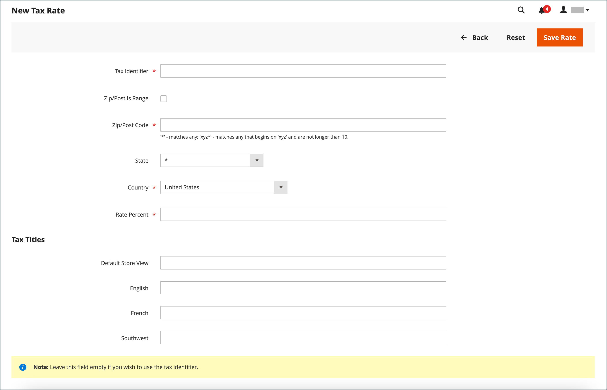

# Steuergebiete und Steuersätze

Die Steuersätze gelten im Allgemeinen für Umsätze, die innerhalb eines bestimmten geografischen Gebiets stattfinden. Verwenden Sie die _Steuergebiete und Steuersätze_ -Tool, um den Steuersatz für jedes geografische Gebiet anzugeben, aus dem Sie Steuern erheben und begrenzen. Da jede Steuerzone und jeder Steuersatz über eine eindeutige Kennung verfügt, können Sie für ein bestimmtes geografisches Gebiet mehrere Steuersätze haben (z. B. Orte, die keine Lebensmittel oder Medikamente besteuern, aber andere Elemente besteuern).

Die Speichersteuer wird auf der Grundlage der Adresse des Stores berechnet. Die tatsächliche Kundensteuer für eine Bestellung wird berechnet, nachdem der Kunde die Bestellinformationen abgeschlossen hat. Commerce berechnet dann die Steuer entsprechend der Steuerkonfiguration des Stores.

{width="600" zoomable="yes"}

## Neuen Steuersatz definieren

1. Im _Admin_ Seitenleiste, navigieren Sie zu **[!UICONTROL Stores]** > _[!UICONTROL Taxes]_>**[!UICONTROL Tax Zones and Rates]**.

1. Klicken Sie oben rechts auf **[!UICONTROL Add New Tax Rate]**.

   {width="600" zoomable="yes"}

1. Geben Sie einen **[!UICONTROL Tax Identifier]**.

1. Um den Steuersatz auf eine einzelne Postleitzahl anzuwenden, geben Sie den Code für **[!UICONTROL Zip/Post Code]**.

   Der Sternchen-Platzhalter (`*`) kann verwendet werden, um bis zu zehn Zeichen im Code abzugleichen. Beispiel: `90*` stellt alle Postleitzahlen von 90000 bis 90999 dar.

1. Gehen Sie wie folgt vor, um den Steuersatz auf eine Reihe von Postleitzahlen anzuwenden:

   - Wählen Sie die **[!UICONTROL Zip/Post is Range]** und legen Sie den Bereich fest, indem Sie die erste und letzte Postleitzahl für **[!UICONTROL Range From]** und **[!UICONTROL Range To]**.

     {width="600" zoomable="yes"}

   - Wählen Sie die **[!UICONTROL State]** wenn der Steuersatz gilt.

   - Wählen Sie die **[!UICONTROL Country]** wenn der Steuersatz gilt.

   - Geben Sie die **[!UICONTROL Rate Percent]** die für die Berechnung des Steuersatzes verwendet wird.

1. Wenn mehrere Stores vorhanden sind, können Sie **[!UICONTROL Tax Titles]** für jede Store-Ansicht.

   >[!NOTE]
   >
   >Lassen Sie dieses Feld leer, wenn Sie die Steuerkennung verwenden möchten.

1. Wenn Sie fertig sind, klicken Sie auf **[!UICONTROL Save Rate]**.

## Vorhandenen Steuersatz bearbeiten

1. Im _Admin_ Seitenleiste, navigieren Sie zu **[!UICONTROL Stores]** > _[!UICONTROL Taxes]_>**[!UICONTROL Tax Zones and Rates]**.

1. Suchen Sie den Steuersatz im _[!UICONTROL Tax Zones and Rates]_und öffnen Sie den Datensatz im Bearbeitungsmodus.

   Wenn die Liste viele Raten enthält, verwenden Sie die [Filtersteuerelemente](../getting-started/admin-grid-controls.md) um die benötigte Rate zu finden.

1. Nehmen Sie die erforderlichen Änderungen an der **[!UICONTROL Tax Rate Information]**.

1. Aktualisieren Sie die **[!UICONTROL Tax Titles]** nach Bedarf.

1. Wenn Sie fertig sind, klicken Sie auf **[!UICONTROL Save Rate]**.

## Steuersatz löschen

1. Im _Admin_ Seitenleiste, navigieren Sie zu **[!UICONTROL Stores]** > _[!UICONTROL Taxes]_>**[!UICONTROL Tax Zones and Rates]**.

1. Suchen Sie den zu löschenden Steuersatz und öffnen Sie ihn im Bearbeitungsmodus.

1. Klicken Sie in der Menüleiste auf **[!UICONTROL Delete Rate]**.

1. Klicken Sie zur Bestätigung der Aktion auf **[!UICONTROL OK]**.
