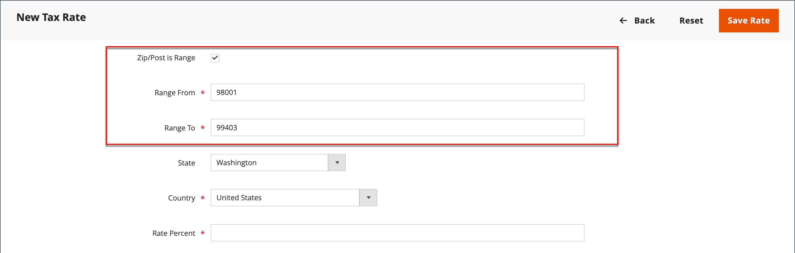

# Steuergebiete und Steuersätze

Die Steuersätze gelten im Allgemeinen für Transaktionen, die innerhalb eines bestimmten geografischen Gebiets stattfinden. Verwenden Sie das _Steuerzonen und Steuersätze_, um den Steuersatz für jedes geografische Gebiet anzugeben, aus dem Sie Steuern einziehen und abführen. Da jede Steuerzone und jeder Steuersatz über eine eindeutige Kennung verfügt, können Sie für ein bestimmtes geografisches Gebiet mehrere Steuersätze haben (z. B. Orte, an denen keine Lebensmittel oder Medikamente besteuert werden, aber andere Gegenstände besteuert werden).

Die Gewerbesteuer wird anhand der Adresse des Geschäfts berechnet. Die tatsächliche Kundensteuer für eine Bestellung wird berechnet, nachdem der Kunde die Bestellinformationen ausgefüllt hat. Commerce berechnet dann die Steuer entsprechend der Steuerkonfiguration des Stores.

{width="600" zoomable="yes"}

## Definieren eines neuen Steuersatzes

1. Navigieren Sie in _Admin_-Seitenleiste zu **[!UICONTROL Stores]** > _[!UICONTROL Taxes]_>**[!UICONTROL Tax Zones and Rates]**.

1. Klicken Sie oben rechts auf **[!UICONTROL Add New Tax Rate]**.

   {width="600" zoomable="yes"}

1. Geben Sie einen **[!UICONTROL Tax Identifier]** ein.

1. Um den Steuersatz auf eine einzelne Postleitzahl anzuwenden, geben Sie die **[!UICONTROL Zip/Post Code]** ein.

   Mit dem Sternchen-Platzhalter (`*`) können bis zu zehn Zeichen im Code übereinstimmen. Beispielsweise stellt `90*` alle Postleitzahlen von 90000 bis 90999 dar.

1. Gehen Sie wie folgt vor, um den Steuersatz auf einen Bereich von Postleitzahlen anzuwenden:

   - Aktivieren Sie das Kontrollkästchen **[!UICONTROL Zip/Post is Range]** und definieren Sie den Bereich, indem Sie die erste und letzte Postleitzahl für **[!UICONTROL Range From]** und **[!UICONTROL Range To]** eingeben.

     {width="600" zoomable="yes"}

   - Wählen Sie die **[!UICONTROL State]** aus, für die der Steuersatz gilt.

   - Wählen Sie die **[!UICONTROL Country]** aus, für die der Steuersatz gilt.

   - Geben Sie die **[!UICONTROL Rate Percent]** ein, die für die Berechnung des Steuersatzes verwendet wird.

1. Wenn Sie mehrere Stores haben, können Sie für jede Store-Ansicht **[!UICONTROL Tax Titles]** festlegen.

   >[!NOTE]
   >
   >Lassen Sie dieses Feld leer, wenn Sie die Steuerkennung verwenden möchten.

1. Klicken Sie abschließend auf **[!UICONTROL Save Rate]**.

## Vorhandenen Steuersatz bearbeiten

1. Navigieren Sie in _Admin_-Seitenleiste zu **[!UICONTROL Stores]** > _[!UICONTROL Taxes]_>**[!UICONTROL Tax Zones and Rates]**.

1. Suchen Sie den Steuersatz im _[!UICONTROL Tax Zones and Rates]_und öffnen Sie den Datensatz im Bearbeitungsmodus.

   Wenn die Liste viele Tarife enthält, können Sie über die [Filterfeldern](../getting-started/admin-grid-controls.md) nach der benötigten Tarifierung suchen.

1. Nehmen Sie die erforderlichen Änderungen am **[!UICONTROL Tax Rate Information]** vor.

1. Aktualisieren Sie die **[!UICONTROL Tax Titles]** nach Bedarf.

1. Klicken Sie abschließend auf **[!UICONTROL Save Rate]**.

## Steuersatz löschen

1. Navigieren Sie in _Admin_-Seitenleiste zu **[!UICONTROL Stores]** > _[!UICONTROL Taxes]_>**[!UICONTROL Tax Zones and Rates]**.

1. Suchen Sie den zu löschenden Steuersatz und öffnen Sie ihn im Bearbeitungsmodus.

1. Klicken Sie in der Menüleiste auf **[!UICONTROL Delete Rate]**.

1. Um die Aktion zu bestätigen, klicken Sie auf **[!UICONTROL OK]**.
