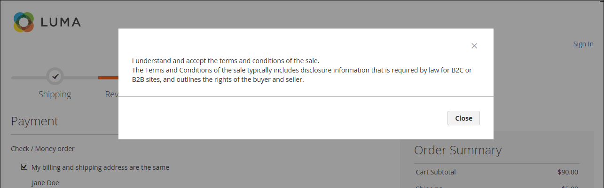

# Bedingungen für den Checkout

Wenn die manuelle Funktion _Geschäftsbedingungen_ aktiviert ist, müssen Kunden den Verkaufsbedingungen zustimmen, bevor der Kauf abgeschlossen ist. Die Verkaufsbedingungen enthalten in der Regel Offenlegungsinformationen, die für B2C- oder B2B-Sites gesetzlich vorgeschrieben sind, und enthalten die Rechte des Käufers und Verkäufers. Die Meldung &quot;Allgemeine Geschäftsbedingungen&quot;wird nach den Zahlungsinformationen direkt vor der Schaltfläche _Bestellung aufgeben_ angezeigt.

{width="700" zoomable="yes"}

## Schritt 1: Nutzungsbedingungen für das Auschecken aktivieren

1. Wechseln Sie in der Seitenleiste _Admin_ zu **[!UICONTROL Stores]** > _[!UICONTROL Settings]_>**[!UICONTROL Configuration]**.

1. Erweitern Sie im linken Bereich den Wert **[!UICONTROL Sales]** und wählen Sie **[!UICONTROL Checkout]** aus.

1. Erweitern Sie  im Abschnitt **[!UICONTROL Checkout Options]** .

   {width="600" zoomable="yes"}

1. Stellen Sie sicher, dass **[!UICONTROL Enable Onepage Checkout]** auf `Yes` gesetzt ist.

1. Setzen Sie **[!UICONTROL Enable Terms and Conditions]** auf `Yes`.

1. Klicken Sie auf **[!UICONTROL Save Config]**.

## Schritt 2: Hinzufügen eigener Informationen zu den Geschäftsbedingungen

1. Wechseln Sie in der Seitenleiste _Admin_ zu **[!UICONTROL Stores]** > _[!UICONTROL Settings]_>**[!UICONTROL Terms and Conditions]**.

   {width="600" zoomable="yes"}

1. Klicken Sie in der oberen rechten Ecke auf **[!UICONTROL Add New Condition]**.

1. Geben Sie den Wert **[!UICONTROL Condition Name]** als internen Verweis ein.

   {width="600" zoomable="yes"}

1. Setzen Sie **[!UICONTROL Status]** auf `Enabled`.

1. Setzen Sie **[!UICONTROL Applied]** auf einen der folgenden Werte:

   - `Automatically` - Bedingungen werden beim Checkout automatisch akzeptiert.
   - `Manually` - Kunden müssen die Bedingungen für die Bestellung manuell akzeptieren.

1. Setzen Sie **[!UICONTROL Show Content as]** auf einen der folgenden Werte:

   - `Text` - Zeigt den Inhalt der Geschäftsbedingungen als unformatierten Text an.
   - `HTML` - Zeigt den Inhalt als HTML an, der formatiert werden kann.

1. Wählen Sie die einzelnen **[!UICONTROL Store View]** aus, in denen diese Geschäftsbedingungen verwendet werden sollen.

1. Scrollen Sie nach unten und füllen Sie die angezeigten Informationen aus:

   - Geben Sie den **[!UICONTROL Checkbox Text]** ein, der als Text für den Link &quot;Geschäftsbedingungen&quot;verwendet werden soll. Beispiel: `I understand and accept the terms and conditions of the sale`.

   - Geben Sie in das Feld **[!UICONTROL Content]** den vollständigen Text der Verkaufsbedingungen ein.

1. (Optional) Geben Sie den Wert &quot;**[!UICONTROL Content Height (css)]**&quot;in Pixel ein, um die Höhe des Textfelds zu bestimmen, in dem die Bestimmungen und Bedingungen-Anweisung beim Checkout angezeigt wird.

   Um beispielsweise das Textfeld auf einer 96-dpi-Anzeige 1 Zoll hoch zu machen, geben Sie &quot;`96`&quot;ein. Eine Bildlaufleiste wird angezeigt, wenn der Inhalt über die Höhe des Felds hinausgeht.

1. Klicken Sie auf **[!UICONTROL Save Condition]**.
