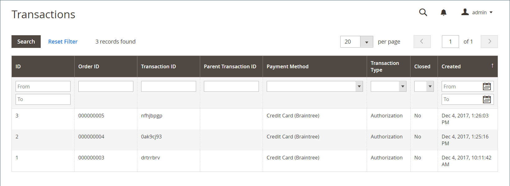

# Transaktionen

Die _Transaktionen_ Seite listet alle Zahlungsaktivitäten auf, die zwischen Ihrem Geschäft und einem Zahlungssystem stattgefunden haben, und bietet Zugriff auf detailliertere Informationen.

## Buchungen anzeigen

Navigieren Sie in _Admin_-Seitenleiste zu **[!UICONTROL Sales]** > _[!UICONTROL Operations]_>**[!UICONTROL Transactions]**.

{width="600" zoomable="yes"}

| Spalte | Beschreibung |
|--- |--- |
| [!UICONTROL ID] | Eine eindeutige numerische Kennung, die jeder Transaktion zugewiesen ist. |
| [!UICONTROL Order ID] | Eine eindeutige Kennung, die zugewiesen wird, wenn ein Kunde eine Bestellung aufgibt. |
| [!UICONTROL Transaction ID] | Eine eindeutige numerische Kennung, die zugewiesen wird, wenn eine Transaktion stattfindet, nachdem ein Kunde eine Bestellung aufgegeben hat. |
| [!UICONTROL Parent Transaction ID] | Die ID-Nummer der übergeordneten Transaktion. |
| [!UICONTROL Payment Method] | Die mit einer Transaktion verknüpfte Zahlungsmethode. |
| [!UICONTROL Transaction Type] | Art der Transaktion, die Bestellung, Autorisierung, Erfassung, Annullierung oder Rückerstattung sein kann. |
| [!UICONTROL Closed] | Ob eine Transaktion abgeschlossen ist oder nicht. |
| [!UICONTROL Created] | Uhrzeit und Datum, an dem die Transaktion erstellt wurde. |

{style="table-layout:auto"}

## Transaktionsdetails anzeigen

Klicken Sie auf den Eintrag, den Sie anzeigen möchten.

Auf der Seite „Transaktionsdetails“ können Sie das Transaktionsdetail und das Raster für untergeordnete Transaktionen sehen.

### Transaktionsdaten

Dieser Abschnitt enthält Informationen zur Transaktion und enthält einen Link zur Auftragsseite in der Spalte **Auftrags-ID**.

| Spalte | Beschreibung |
|--- |--- |
| [!UICONTROL Transaction ID] | Die Transaktions-ID. |
| [!UICONTROL Parent Transaction ID] | Eine entsprechende ID-Nummer der übergeordneten Transaktion, falls zutreffend. |
| [!UICONTROL Transaction Type] | Art der Transaktion, die Bestellung, Autorisierung, Erfassung, Annullierung oder Rückerstattung sein kann. |
| [!UICONTROL Is Closed] | Ob eine Transaktion abgeschlossen ist oder nicht. |
| [!UICONTROL Created At] | Uhrzeit und Datum, an dem die Transaktion erstellt wurde. |

{style="table-layout:auto"}

### Untergeordnete Transaktionen

Untergeordnete Transaktionen werden im Raster angezeigt, nachdem Rechnungen für [Bestellungen](orders.md) erstellt wurden. Mit diesem Format können Sie den Transaktionsverlauf verfolgen, indem Sie einer Transaktionshierarchie folgen.

### [!UICONTROL Transaction Details]

Dieser Abschnitt enthält die zusätzlichen Informationen für eine bestimmte Transaktion. Die Informationen werden in Form von Schlüsseln und Werten angezeigt. Die verfügbaren Schlüssel sind:

- authAmount
- Authentifizierungs-Code
- eVSResponse
- billTo
- cardCodeResponse
- Kunde
- customerIP
- lineItems
- marketType
- Reihenfolge
- Zahlung
- Produkt
- wiederkehrende Abrechnung
- responseCode
- responseReasonCode
- responseReasonDescription
- SettleAmount
- Lösung
- submitTimeLocal
- submitTimeUTC
- steuerfrei
- transactionStatus

>[!NOTE]
>
>Wenn die Transaktionsdetails nicht verfügbar oder veraltet sind, klicken Sie in der Symbolleiste auf **[!UICONTROL Fetch]** , um sie zu aktualisieren.
